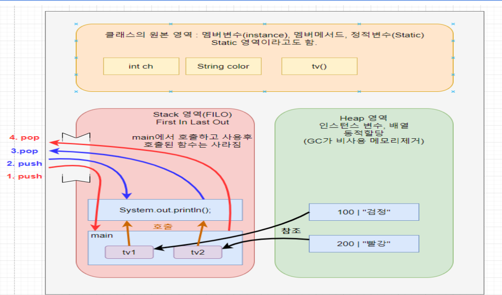

**본 정리 내용은 멀티캠퍼스에서 학습한 내용을 담았다.**
<details>
<summary>키워드로 찾아가기</summary>

[CPU, RAM, HDD(SSD)/USB](#cpu-ram-hddssdusb)   
[HTML](#html)
[CSS](#css)  
[JS](#js)  
[jQuery](#jquery)   
[JAVA](#java)   
[HTTP](#http)  
[HTTPS](#https)  
[URL](#url)  
[URI](#uri)    
[WAS](#was)  
[Bootstrap](#bootstrap)  
[SERVLET](#servlet)  
[JSP](#JSP)  
[SNIPPET](#snippet)  
[DOM TREE](#dom-tree)   
[OOP](#oop)  
[Cookie](#cookie)<br>
[Session](#session)<br>
[클라우드 컴퓨팅](#클라우드-컴퓨팅)<br>
[Compile](#compile)<br>
[Run](#run)<br>
[Interpreter Language](#interpreter-language)<br>
[AJAX](#ajax)<br>
[JSON](#json)<br>
[XML](#xml)<br>
[CDN](#cdn)<br>
[Proxy server](#proxy-server)<br>
[CORS policy](#cors-policy)<br>
[구현 스펙](#구현-스펙)<br>
[API](#api)<br>
[STS 단축키](#sts-단축키)<br>
[IDE](#ide)<br>
[GUI](#gui)<br>
[라이브러리와 프레임워크](#라이브러리와-프레임워크)<br>
[Overloading / Overriding](#overloading--overriding)<br>
[Regular Expression](#regular-expression)<br>
[UML](#uml)<br>
[Thread](#thread)<br>


[기타 꿀팁 저일](#기타-웹-백엔드-cs-지식-정리)


[](#)

</details>

<hr>

# 용어 정리

## 
* ****<br>
<u></u>
<br>  
1. 

## CPU, RAM, HDD(SSD)/USB
* **Central Processing Unit** == <u>중앙 처리 장치, 모든 명령어를 해석하고 실행한다.</u><br>
**Random Access Memory** == <u>컴퓨터의 주 기억장치, 데이터를 일시적으로 저장하는 고속 메모리</u><br>
**Hard Disk Drive, Sokid State Drive, Universal Serial Bus** == <u>대용량의 데이터를 영구적으로 저장하는 장치</u><br>
<u></u>
<br>  
1. CPU는 프로그램의 모든 처리를 담당한다.
2. RAM은 프로그램 실행 도중 일시적으로 저장할 필요가 있는 데이터의 저장을 담당한다. 
3. HDD등은 프로그램 종료 후 영구적으로 저장되는 데이터의 저장을 담당한다.  
4. SSD와 USB는 HDD와 같은 역할을 담당한다.   
SSD는 HDD에 비해 비싸고 빠르며, 드라이브 내부에 움직이는 장치가 없다는 점에서 다르다.  
USB 플래시 드라이브는 데이터를 휴대할 수 있다.

5. 위 사진은 JAVA 프로그램이 실행될 때 RAM의 T자형 메모리 구조이다.  
실행 클래스(main메서드 포함)에서 프로그램이 처음 실행되면 원본영역(method, static 영역)에 class를 가져온다.  
변수의 위치는 다음과 같다.   
static 변수 ==> 원본 영역    
참조형 변수(주소) ==> stack 영역   
인스턴스 변수 ==> heap 영역  
static 변수를 불러온 클래스에 1개만 원본 영역에 존재하며, 나머지 변수는 객체가 생성될 때마다 생긴다.    
원본 영역이 차지하는 메모리는 프로그램이 종료될 때까지 사라지지 않으며, 인스턴스 변수의 경우 해당 변수를 참조하는 메서드나 변수가 존재하는 한 유지된다. 참조하는 모든 변수가 범위를 벗어나거나 null이 되면 사라지게 된다.  

6. 스택 영역에 main 메서드부터 시작해 스택 인터페이스의 작동과 같이 push & pop의 형식(FILO-First In Last Out)으로 메서드가 실행 및 삭제가 이루어지며,  
프로그램이 순서대로 구동되면서 메서드가 실행되고, 마지막으로 실행된 메서드부터 종료되면서 main메서드까지 종료된다.


## HTML
* **Hyper Text Markup Language**   
<u>Text(문자)와 Markup(<>) 문법을 통해 웹 페이지의 내용을 구조화하는 언어</u>    
<br>
1. Hyper - 초월하는(다른 페이지 이동) / Text - 문자로 / Markup - <>안에 넣는 문법 / Language - 언어  
2. 웹 페이지에 보이는 뼈대의 역할을 담당한다. 현재 주로 사용되는 버전은 HTML5  
3. 웹 브라우저는 HTML, CSS, JS만 읽을 수 있기 때문에 반드시 이 언어들로만 웹 페이지를 만들어야 한다.  
4. <>태그와 문자로 다른 페이지와 연결할 수 있다.  
5. <>속 태그는 대소문자 구분을 하지 않는다. 하지만 <>태그에 속성을 작성한다면 소문자로 작성해야 인식할 수 있다.  
html의 어떤 태그들은 그 태그만 가지는 속성들이 따로 있다. (form의 action, method 등)   
style, script같은 공통으로 가지는 속성들도 있다.
6. HTML5로 웹페이지를 만들면 굳이 애플리케이션용 페이지를 따로 만들지 않아도 일반 애플리케이션 수준으로 충분히 작동하는 것을 볼 수 있다.
7. HTML5을 이용해 개발하기 위해 Visual Studio Code를 설치하는 것이 도움이 된다.

### HTML <>태그 
1. ```<a href = "http://naver.com">네이버 링크</a>```  
a ==> anchor / href ==> hyper reference, html에서 링크를 만드는 방법  
2. ```<ul>``` ,unordered list  
무의미한 순서 목록(숫자 등 순서 x)
3. ```<ol>```, ordered list
의미 있는 순서 목록(순서 표시 o)
4. ```<li>```
ul과 ol의 목록 ==> ```<ul><li>목록내용</li></ui>```
5. ``````, image  
이미지를 표시할 때 사용, src로 이미지 링크, alt로 이미지가 없을 경우 default 글자 표시 등
6. ```<table>```
테이블, 구획으로 나누어진 표를 만들 때 사용
7. ```<tr>```, table row
테이블로 만든 표의 왼쪽부터 오른쪽으로 이어지는 한 행을 의미
8. ```<td>```, table definition
테이블 한 칸
9. ```<th>```, table header
반드시 tr안에 작성, 테이블 내부에 제목의 지정하기 위한 태그로, td위치에 대신 사용한다.
10. ```<td row, colspan:3>```
th나 td의 칸을 확장하여 넓힌다는 의미. row - 세로 / col - 가로, column  
row나 col대로 테이블을 만들었는데 다른 행이나 열에 칸이 부족해서 확장하지 못하는 경우 부족한 칸을 임의로 만들어서 확장한다. 만약 1번칸이 확장되어 있다면, 다음 row의 첫번쨰 td는 2번쨰 칸부터 작성되게 된다.  
11. ```<iframe>``` 
웹 페이지에 다른 웹사이트의 콘텐츠를 담기 위해 사용된다. 유튜브 동영상, 구글 지도, 각종 앱, 광고 배너 등 삽입 가능.  
유튜브의 경우 원하는 동영상 ==> 공유 ==> 퍼가기로 iframe 태그를 포함하는 html태그 한줄 생성 가능
12. ```<form>```
form 태그로 만든 구역 안에 input, select, fieldset 태그를 이용하는 다양한 입력폼을 만들 수 있다.   
==> text, radio, checkbox, submit, option, legend등  
입력폼에 입력하는 정보는 form의 속성 중 action으로 url을 지정하고, method속성으로 get과 post중 선택하는 방식으로 데이터 전송을 할 수 있다. 
13. ```<input 속성(value, placholder)>```
input에서 지정한 입력폼의 초기 상태를 설정할 수 있다. submit는 기본값이 "제출"이지만, input의 value 속성을 이용해 "완료" 등으로 바꿀 수 있다.    
placeholder는 value와 같은 위치에 흐릿한 글씨로 입력폼 설명용으로 사용 가능하다.  
14. ```<audio>```  
src, autoplay, loop, controls(음악 재생도구) 등의 속성을 이용하는 태그
15. ```<video>```  
src, autoplay, loop, conrols, width, height 등의 속성을 이용하는 태그   
audio, video모두 control을 기본으로 설정하면 html5의 기본 재생도구가 나오는 듯 하다.   
기본적으로 로컬이나 웹서버, 데이터베이스 등에 저장된 데이터를 src로 url을 지정해서 사용할 수 있다.  
16. ```<div>```
html에서 공간을 구분하기 위한 가장 기본적인 태그


### HTML문법에서 CSS, JS를 적용하는 3가지 방법  
1. External 방식  
별도의 css, js파일 생성 ==> html의 head부분에 link, scirpt 태그로 경로를 지정해서 적용하는 방식  
2. Internal 방식  
html의 head 부분에 style, script 태그로 css와 js의 내용을 작성해서 적용하는 방식  
3. Inline 방식  
html의 <>태그 중 css나 js를 적용하고 싶은 태그의 속성을 style, script 로 지정해서 적용하는 방식   
<br>
다른 방식으로 작성된 css와 js가 한 태그를 동시에 지정하고 있는 경우 태그를 가장 가까이에서 지정하고 있는 css나 js부터 우선 적용된다. (inline > internal > external)


## CSS
* **Cascading Style Sheet**  
<u>계단식으로 적용되는 스타일 시트로,   
html이라는 언어가 웹페이지에 표시될 떄 어떤 특성과 모양을 가지고 될 지 결정하는 역할을 한다. </u>  
<br>
1. 현재 주 사용 버전은 CSS3로, 애니메이션도 적용할 수 있게 되었다.  
2. 이미지를 사용해도 CSS와 같은 효과를 낼 수 있다. 하지만 이미지나 동영상을 사용하게 되면 파일의 크기 때문에 웹 페이지를 불러올 때마다 웹서버에 부담이 가해지게 된다.   
CSS를 쓰면 이미지보다도 다양하게 html을 다룰 수 있고 서버에 부담을 주지 않으며 쓸수 있다.  
3. externanl 방식을 쓰먄 css와 js 모두 파일로 따로 저장해서 쓸 수 있다. 데이터와 스타일을 분리함으로써 유지보수성을 높였다고 할 수 있다.

### CSS 속성(property)
1. padding : html의 content를 감싸는 안쪽 테두리 설정, 동서남북 px로 설정한다. 
2. border : 중간 테두리 설정
3. margin : 바깥쪽 테두리 설정
4. static ==> 문서의 흐름에 따라 배치(default 값)  
5. absolute ==> 웹페이지의 고정된 위치에 지정하는 속성. top: 0px, left: 0px 의 형태를 취한다. 이 떄 다른 요소에 영향을 미치지 않고 지정된 위치에 고정되게 된다.  
6. fixed ==> absolute와 같은 방식으로 content를 고정하되, 클라이언트가 웹페이지를 보는 화면에 고정시킨다. 스크롤을 내려도 content가 따라오는 방식이다.  


### CSS 선택자  
html 문서 내부의 특정 요소를 선택할 수 있는 선텍자  
1. 기본 선택자  
태그 ==> 태그 이름, id ==> #id이름, class ==> .class이름
a {} ==> a 태그 선택  
#ttt {} ==> id ttt 선택   
.ttt {} ==> class ttt 선택  
2. 가상 선택자  
특정 상황을 가정하여 선택한다. 마우스를 올려 둔 상태, 체크된 상태의 input 태그 등  
a:hover {} ==> a태그의 내용에 마우스를 올려 놓은 상태를 선택  
a:nth-child(2n) ==> 짝수 번째의 상태를 가지는 a태그를 선택
a:nth-child(2n+1) ==> 홀수 번째의 상태를 가지는 a태그를 선택
3. 속성 선택자   
특정한 값과 일치하거나, 포함하거나, 시작하거나 끝나는 태그를 선택한다.  
선택자[속성 = 값] ==> 일치  
선택자[속성 ^= 값] ==> 시작  
선택자[속성 $=값] ==> 끝  
선택자[속성 *= 값] ==> 포험
4. 자손 선택자  
#d1 > p {}  
==> id가 d1인 태그의 바로 아래 p 태그만 선택  
#d1 p {}  
==> id가 d1인 태그 아래에 존재하는 모든 p 태그 선택 


## JS
* **JavaScript**  
<u>HTML의 구조를 CSS의 특성대로 구성한 페이지의 데이터 전달이나 각종 기능을 맡는다.</u>    
<br>
1. JAVA와 흡사한 부분이 많고 JAVA에 비해 더 나중에 만들어진 언어이다. 그래서 욕을 좀 먹었다고 들었다.  
2. JAVA에 비해 허술한 부분이 있지만, jQuery와 es6등의 문법으로 많이 발전했다.  
3. 또한 크롬 브라우저에서 가장 빠른 속도를 가진 언어이자, 가장 오래 쓰인 언어이기 때문에 점유율도 높다. 웹 개발에서 4. 빼놓고 말할 수 없는 언어인 것이다.  
5. JS를 위한 framework는 reac, vue, angular, bootstrap 등이 있다.
6. Interpreter Language(인터프리터 언어)에 해당한다.
7. 위에서 아래로 순서대로 실행된다. 
8. 주석은 //을 사용한다.
9. ajax를 이용한 비동기 통신이 가능하다.
10. 동적 타입 결정(동적 타이핑)  

12. 브라우저 등에서 prompt나 sc.next 등으로 받는 입력은 전부 '문자'로 취급된다.   
'1234' 이렇게 입력해도 숫자 1234가 아니라 문자 '1234'가 입력된 것으로 판단하기 때문에, 만약 입력값을 숫자로써 다루기위해선 입력받은 이후 숫자로 변환하는 과정이 필요하다.   
다만 js의 경우 대부분 알아서 형변환이 되기 때문에 숫자로 변환하는 과정이 필요없는 경우가 많다.  
13. js에서 코드에 ""가 들어가는 문제 때문에 string과 변수(variable) 할당의 문제가 발생하면 ``으로 감싸면 해결된다.
14. 기존 html에 없는 태그를 사용자의 상호작용이나 필요에 의해 만들어내는 것을 동적 태그 쌩성 이라고 한다.    
js는 jquery를 통해 간편한 동적 태그 생성을 할 수 있다. 

### JS가 프론트엔드 3총사에 들어가지만(HTML, CSS, JS) 백엔드 개발자에게도 중요한 이유  
1. JS는 브라우저의 기능을 담당한다.  
2. 그래서 웹서버에 데이터를 보내거나 받아오기(로그인, 게시글 불러오기 등)는 JS가 담당하게 된다.  
3. 이떄 백엔드(db등)의 정보나 웹서버의 연결을 JSTL(JavaServer Pages Standard Tag Library ==> 태그로 js쓰기), AJAX(Asychronous JavaScript And XML)등을 이용하여 웹서버의 부하를 줄일수도 있다.  
4. REST (Representational State Transfer)라는 웹 서비스 디자인 아키텍처 스타일로, 웹서버측(WAS)에서 RESTful API는 HTTP 프로토콜을 이용해서 네트워크상에서 리소스를 CRUD(Create, Reda, Update, Delete)방식으로 조작한다.  
5. 이때 RESTful API는 JSON을 데이터 교환 형식으로 많이 이용한다. JSON을 RESTful API와 함께 잘 사용하면 WAS에서 효율적인 데이터 교환과 리소스 관리를 가능하게 만들어준다.  

### JavaScript의 주요 객체(object)
1. window : 브라우저 전체에 영향, 기본값  
alert(), prompt(), confirm() 등  
window 객체는 기본적으로 상속되어 있기때문에 생략하고 사용할 수 있다.
2. history : 사이트의 기록
3. location : 클라이언트가 요청한 주소  
if문 등에서 .href와 함께 사용하면 조건이 만족되었을 때 바로 이동하게 설정할 수 있다.
4. document : body 태그 안의 내용  
write() ==> 덮어씌워짐,getElementById().value ==> id의 값을 가져옴

### JvaScript의 주요 메서드
1. ```.slice(x, y) / .substr(substring)(x, y)```  
문자열의 x번째 요소부터 y번째 요소 바로 전까지의 요소를 반환  
substr 메서드는 MDN 웹 문서에 따르면 더 이상 사용하지 않는 것을 권장한다.  
slice는 x값이 y보다 클 때 빈 문자열을 반환하는 반면, substr은 x와 y값을 바꿔서 문자열을 반환한다. 프로그래밍의 일관성을 유지하고 오류를 줄이기 위해 slice를 사용하는 것이 권장된다.
2. 

### 데이터 
<u>RAM에 저장되고, 저장공간(변수)에 생긴 이름(변수명)</u>  
char name; ==> char로 변수 선언, RAM에 변수(공간) 생성  
name = "김" ==> 생성된 변수(공간)에 1글자짜리 데이터를 집어넣음  
1. 기본데이터  
정수 -  / 실수 / 문자 / 논리
2. 기타데이터
object(객체), String(문자열)

### 변수 선언
변수 선언은 아무것이나 남용하는 것보다 쓰임새에 맞게 쓰는 것이 좋다.   
코드가 길어질 수록 let으로 하는 편이 더 안정성 있는 편이다.  
기존 var로 쓰인 변수는 어쩔 수 없지만 새로 쓸 일이 있을 때는 let을 사용할 수 있으면 좋다.
1. var  
재선언 O, 재할당 O
2. let  
재선언 X, 재할당 O
3. const(상수)  
재선언 X, 재할당 X

### 연산자
<u>데이터를 비교하기 위한 문법, cpu가 ram에 저장된 데이터를 꺼내서 처리하기 위함</u>  
1. 기본데이터 연산자
산술 : +, -, *, /, %, ++, --, =, +=, -=, *=, /=, %=  
비교 : ==, !=, ===, <, >, <=, >=  
대입    
연결    
논리 : &&(and), ||(or), !(not)  

### 제어문 
<u>가장 중요한 것은</u>  
**입력 ==> 처리 ==> 출력**    
<u>순서를 이해하고 있는 것</u>    
대부분의 경우 이 3과정이 각각 어떻게 이루어지는 이해하고 있는 것이 중요하다.  
이 과정은 웹페이지의 요청 ==> 웹서버의 처리 ==> 웹서버의 응답 과정과 일맥상통하는 부분이 있다.
1. 순차문
2. 조건문
3. 반복문

### JavaScript의 함수
1. 함수가 어떤 기능만 담당한다면 return이 붙지 않는다.   
만약 함수로 어떤 값을 얻어내야한다면 return을 붙여야 한다.
2. 버튼 하나당 함수 하나


### JSP 파일의 Path 기준 경로 설정
웹페이지를 열기위해 웹 애플리케이션이 WAR 파일로 패키징되고 웹서버에 배포된다.  
이때 웹서버는 웹 애플리케이션마다 각각의 고유한 컨텍스트 경로를 배정한다.  
예를 들어, 웹 애플리케이션이 다음과 같은 URL에 배치되었다고 가정한다.
<li>웹 애플리케이션 이름: myapp</li>
<li>웹 애플리케이션 컨텍스트 경로: /myapp</li>
<li>이 경우, 웹 애플리케이션은 다음과 같은 URL에서 접근할 수 있다. ==> http://localhost:8080/myapp/</li><br>
이 URL에서 /myapp/가 웹 애플리케이션의 컨텍스트 경로이다.<br>
이 경로는 웹 서버가 요청을 해당 웹 애플리케이션으로 라우팅하는 데 사용된다.<br>
jsp에서 이 컨텍스트 경로를 쉽게 사용하기위해 아래의 JSTL을 이용할 수 있다. CDN과 변수를 이용한다.

1. ```<%@ taglib prefix="c" uri="http://java.sun.com/jsp/jstl/core"%>```   
JSTL 코어 태그를 사용하기 위함(c타입 반복문 등)
2. ```<c:set var="path" value="${pageContext.request.contextPath}"/>```  
Path 기준경로 설정 방법이다. JSTL 코어 태그를 사용할 수 있어야 설정할 수 있는 방식이다.  


## JAVA
* <u>한국에서 가장 많이 쓰이는 프로그래밍 언어</u>
<br>  
1. 제임스 아서 고슬링
2. 처음에는 진행하던 프로젝트 이름을 따서 그린 ==> 자바로 변경, 프로젝트 이름을 생각하던 중 책상의 자바산 커피가 눈에 들어와서 자바로 변경
3. 자바의 사용처  
pc애플리케이션, web 애플리케이션, 안드로이드 애플리케이션, 빅 데이터, 게임(마인크래프트), 과학, 소형기기 등
4. JS와 유사점이 많다. 연산자, 데이터 타입, 기본 문법 등
5. JAVA는 다른 언어에 비해 문법을 지키는 것에 비교적 엄격한 문법이다. (; 사용 , 데이터 타입 선언 등)
6. JAVA 프로그래밍에서 클래스 이름과 camelCase의 경우만 대문자로 표기한다. 나머지는 소문자로 시작
7. JAVA를 포함한 프로그래밍을 할 때 항상 psuedo 코드를 작성하는 습관을 들여야 한다.
8. JAVA 프로그램은 실행하기 위해 'main' 메서드를 포함해야 하는데, 이것을 포함하는 클래스를 '실행 클래스'라고 부른다.
11. 지역변수는 클래스 메서드 같은 {}안에 변수를 설정했을 때를 말한다. 지역변수는 쓰레기값 방지를 위한 초기화 
지역변수는 {}-(블록)안에만 영향을 미친다.    
반대 개념으로 전역변수가 있는데, 전역변수는 클래스 밖 필드에서 선언되어 클래스 전체 영역에서 사용된다.    
또한 전역변수는 지역변수와 다르게 자동 초기화가 되기 때문에, 쓰레기값 문제를 걱정할 필요가 없다.  


### JAVA의 장점
1. JAVA의 플랫폼 독립성 - 자바는 플랫폼을 가리지 않는 호환성을 지닌다.
이는 다양한 운영 체제나 하드웨어 플랫폼에서 실행될 수 있는 능력을 말한다.  
JAVA프로그램이 .class파일로 변환되고 JVM에서 실행되는 일련의 과정이 JAVA의 플랫폼 독립성을 만들어 내었다.
2. 컴파일 언어로서 구문 오류에 강점을 지닌다. 
3. OOP언어로서 보다 간편하고 많은 기능을 가진 개발을 진행할 수 있다.  
4. 엄격한 문법을 가지기 때문에 프로그램의 오류 발생 가능성이 비교적 낮다.


### JAVA 프로그램의 실행 과정
1. JAVA로 소스 코드를 작성한다. 소스코드는 .java 확장자를 가진다.
2. JAVA의 컴파일러인 'javac'를 가지고 소스코드를 컴파일한다.  
소스코드에 구문 오류가 없다면 컴파일이 이루어지고, 컴파일 된 파일은 .class 확장자를 가진다.  
바이트코드는 기계어와 달리 JVM에서 실행 가능한 언어이다.  
3. window, linux, mac 등 다양한 환경에 설치된 JVM은 .class의 바이트코드를 해당 플랫폼에 맞는 기계어로 변환하여 실행한다. 
4. 실행 결과를 출력한다.

### 기본 데이터 타입(Primitive type, 원시형)
JAVA는 JS와 달리 변수 선언 시 데이터 타입도 함께 선언해야 한다.  
**String은 '문자열'로 기본 데이터 타입에 해당하지 않는다.**    
<br>
기본형 데이터가 들어있는 변수는 복사할 때 변수의 값을 복사한다. 참조형의 경우 변수의 주소를 복사한다.  
마찬가지로 기본형 데이터 변수의 비교는(==) 값을 비교하지만 참조형 변수는 주소를 비교한다.  
각 데이터 타입은 byte 단위로 RAM의 메모리를 사용한다.   
1. 정수 : byte-1(+-128),  
short-2(+-32768, 3만),  
**int**-4(+-21억),  
long-8(+-9백경, L붙이기) ==> L을 붙이지 않으면 long으로 선언했음에도 int 취급을 하게 됨
2. 실수 : float-4(7자리, f붙이기) ==> f를 붙이지 않으면 애초에 인식 x,  
**double**-8(15자리\)
3. 문자 : char-2(''작은따옴표, String과 구분 위함),   
String-각단어 2바이트, 객체 헤더와 메타데이터에 따라 추가로 메모리 사용  
4. 논리 : boolean-1  +
  
참조형은 당연히 데이터 크기가 아닌 데이터를 가리키는 주소의 크기가 4byte

### 참조형 데이터 타입(Reference type)
기본형을 제외한 나머지 데이터 타입  
1. String : 기본형 데이터처럼 보이지만 참조형 데이터 타입. char는 '', String은 "" 사용  

2. 참조형 데이터의 비교는 값 대신 주소의 비교를 실시한다. 이는 변수의 복사에도 해당한다.   
변수의 복사가 일어날 때 기본형데이터 변수는 변수의 값을 복사하는 반면 참조형 변수는 얕은 복사와 깊은 복사로 나뉜다.   

3. 얕은 복사 - 주소를 복사한다. 주로 변수를 변수에 할당하는 경우.   

4. 깊은 복사 - 주소가 가리키는 값을 복사한다. 특정 메서드를 이용해 복사하는 경우(.clone())

5. 그럼 원본의 주소를 바꾸게 되면 어떻게 될까?  
얕은 복사 - 변수가 달라도 주소가 같은 한 결국 같은 값을 가리키기 때문에 변수의 값이 따라 변하게 됨    
깊은 복사 - 변수가 가리키는 주소가 다르기 때문에 복사한 변수의 값은 변하지 않음.  

6. 참조형 데이터 변수의 비교는(==) 변수의 주소를 비교하게 된다.  
String처럼 기본데이터 타입과 함께 자주 쓰는 참조형 변수의 비교는 특정 메서드를 통한다. (.equals(비교값))  

### 데이터 타입의 형변환(casting)
casting ==> 던져졌다는 의미로, 값을 다른 데이터 타입으로 변환 하는 것  
1. 자동 형변환(묵시적 형변환), 업캐스팅 ==> 작은 데이터 타입의 변수가 큰 데이터 타입에 들어갈 때 사용 (promotion)      
강제 형변환(명시적 형변환), 다운캐스팅 ==> 큰 데이터 타입이 작은 데이터 타입에 들어갈 때 사용     

2. Car가 부모클래스이고 Truck이 자식 클래스인 경우 업캐스팅과 다운캐스팅의 예     
업캐스팅 ==> ```Car = Truck;``` 이렇게 변수에 할당하는 방식으로 형변환이 가능, 자동으로 형변환 됨  
다운 캐스팅 ==> ```Truck = (Truck)Car;``` ()를 통한 더 작은(하위) 공간(클래스) 강제 형변환 가능, 개념적인 판단  
기본데이터 타입 변수와 참조형 데이터 타입 변수 모두 같은 방식으로 사용    
**기본형의 다운캐스팅이 오히려 공간이 적어짐에 비해 참조형의 다운캐스팅은 상속을 받은 하위 클래스에 들어감으로써 오히려 참조할 수 있는 메서드와 변수가 많아질 수 있음.**

3. 기본형 데이터 타입과 참조형 데이터 타입   
기본 데이터 타입 ==> int나 double 처럼 값의 범위도 지켜야 함, 데이터 타입이 차지하는 크기로 형변환 결정  
참조형 데이터 타입 ==> 반드시 상속 관계의 객체들만 형변환 가능, 크기는 상속 관계로 구분  


### 조건문, 반복문
1. if else를 이용한 조건문 - 일반적으로 많이 사용  
2. Switch를 이용한 조건문 - 많은 조건 중 특정 조건을 만족하는 경우 사용  
break 만나면 탈출, default로 기본값 설정 가능
3. While을 이용한 조건문 - 매개변수 값이 true일 때 반복, 어떤 값을 유도하거나 도출할 때   
continue 만나면 즉시 반복문 다시 시작
4. break의 매커니즘 - break를 포함하는 가장 가까운 괄호를 벗어남.
5. System.exit(0); - 프로그램을 아예 종료시키는 것. break와 구분하기

### for문  
Switch처럼 break 존재, 추가로 만나면 다시 반복문을 반복하는 continue 존재  
1. c타입 for문(읽기,쓰기)  
```for (int i = 0; i < arr.length; i++) {}``` 의 형태를 가지는 for문으로, c언어에서 유래한 방식이기에 c타입 for문이라고 부른다고 알고 있다. 변수의 값을 수정 가능하다.  
2. for each문(읽기 전용)  
```for (String string : arr) {{}```   
배열을 한 차례 순회하면서 왼쪽 항의 변수에 오른쪽 배열의 요소를 순서대로 할당하하는 for문    
배열의 요소의 값을 읽어와서 새로운 변수에 할당해 처리하는 방식이기 떄문에 읽기 전용이다.  


### 연산자
<u>데이터를 비교하기 위한 문법, cpu가 ram에 저장된 데이터를 꺼내서 처리하기 위함</u><br>  
기본데이터 연산자  
산술 : +, -, *, /, %, ++, --, =, +=, -=, *=, /=, %=  
비교 : ==, !=, ===, <, >, <=, >=  
대입    
연결    
논리 : &&(and), ||(or), !(not)  
1. String ==> 기본 데이터는 아닌데 기본데이터처럼 연산에 사용할 수 있음.
2. 하나라도 실수이면 결과는 무조건 실수
3. ```+``` 가 결합 연산일 때 하나라도 문자열이면, 결과는 무조건 문자열
4. 기본연산자의 경우 (기본데이터타입)x 의 형태로 일시적으로 강제 형변환이 가능하다.
5. 비교연산자는 값을 비교할 때는 기본형만 가능
6. &&의 경우 왼쪽 항이 false인 경우 계산 불필요,  
||의 경우 왼쪽 항이 true인 경우 계산 불필요
7. String을 비롯한 참조형 데이터의 비교는 데이터 값의 비교가 아니라 주소의 비교를 실시한다.

### JAVA의 변수와 RAM
1. JAVA는 변수 선언을 할 때 RAM에 변수의 저장공간이 만들어진다. 저장공간의 크기는 데이터 타입에 따라 다르다.
2. JAVA의 변수 선언 시 "쓰레기 값"이 들어있다. 이 쓰레기 값은 예상치 못한 결과를 초래할 수 있기 떄문에 JAVA 프로그래밍에선 변수 선언시 반드시 초기화를 해주는 습관을 들여야 한다.
3. JAVA는 타입 추론 언어들과는 다르게 변수 선언 시 데이터 타입을 지정해주어야 한다. 
4. 변수 선언 이후 일반적인 방법으로는 데이터 타입의 변환이 불가능하다.  
JAVA의 변수 재할당은 같은 데이터 타입으로만 가능하다.


### 주요 라이브러리
1. java.util - 주요 유틸리티 모음 / Random, Date(안씀 이제 java.time) 등
2. java.sql - jdbc관련 / PrepareStatement, Connection
3. java.io - 입출력 관련 / File, FileWriter, OutputStream
4. java.net - 네트워크 관련 / InetAddress(ip), Socket

### JAVA 기본 문법
모든 문법은 CPU가 RAM의 데이터를 어떻게 꺼내서 어떻게 사용하는지에 대한 방법을 만들어 놓은 것   
클레스의 내부 함수인 메서드는 파괴함수와 비파괴함수로 나뉜다.   
비파괴함수는 객체의 상태를 바꾸지 않고 파괴 함수는 객체의 상태를 바꾸게 된다.  
1. ```Integer``` ==> 정수 값을 다루기 위한 클래스  
.parseInt - 문자열을 정수로 바꾸기 위한 메서드  

2. ```Double``` ==> 실수 값을 다루기 위한 클래스  
.parseDouble - 문자열을 실수로 바꾸기 위한 메서드

3. ```(기본데이터 타입)변수``` ==> 기본데이터 타입을 가진 변수에 한해 일시적인 강제 형변환  

4. ```System.out``` ==> 시스템에서 정한 기본 출력장치 (보통 모니터)  
System.out.print - 콘솔에 자바 프로그램의 출력 결과를 표시하게 됨

5. ```System.in``` ==> 시스템에서 정한 기본 입력장치 (보통 키보드)    
System.out의 출력이 콘솔에 이루어지는 것처럼 System.in의 입력도 콘솔에서 이루어 짐

6. ```Scanner sc = new Scanner(System.in)``` ==> Scanner 클래스의 입력장치를 System.in으로 정하는 것   
java.util.Scanner  
Scanner 클래스는 반드시 입력장치를 넣어주어야 함. 실무x, 코딩테스트o  
Scaneer 클래스로 만든 인스턴스 sc의 메서드, .nextInt();를 활용하면 입력값을 int값으로 받을 수 있다.  
.next(); - sc의 메서드로 입력값을 String으로 받기, 공백으로 구분되는 단어에 주로 사용  
.nextline(); - next()와 같지만, 여러 단어나 문장으로 구성된 입력에 주로 사용  
.nextInt(); - 입력값을 int로 받기  
.nextDouble(); - 입력값을 double로 받기   
.close(); - scanner는 사용하면 열린상태가 된다. scanner를 닫아주는 메서드  
Scanner의 입력장치가 결정되고, 입력값이 들어올 때 버퍼는 입력 스트림을(System.in의 키보드 입력) 읽어 들여 데이터를 임시 저장하는 곳이다. 사용자가 '엔터'를 누를때까지의 데이터가 버퍼에 임시 저장된다.    
Scanner의 메서드는 이 임시 저장된 데이터를 읽어 들인다. 이 메서드들은 데이터를 읽어 들일 때 공백(스페이스, 줄바꿈-"\n" 등)을 구분자로 두어서 데이터를 구분한다. nextline()을 제외한 메서드들은 데이터를 읽어들일 때 이 구분자를 처리하지 않고 버퍼에 남겨두게 된다.   
.nextline()메서드는 엔터키를 누르는 순간, 즉 "\n"을 만날때까지의 데이터를 읽기 때문에, 다른 메서드들을 사용할 때 엔터를 통해 데이터 입력을 구분했다면 이후 nextline()을 사용하게 되었을 때 버퍼에 남아있는 "\n"을 만나게 되면서 데이터를 입력할 새도 없이 즉시 종료된다.    
만약 다른 메서드들을 사용한 이후 nextline()메서드를 사용해야 할 상황이 발생한다면 nextline()메서드를 미리 하나 입력해서 버퍼에 남겨진 "\n"을 지우고 데이터를 입력할 수 있다.  

7. ```Math``` ==> 정수나 실수 계산에 관련된 여러 메소드를 제공하는 자바 기본라이브러리 클래스  
.pow(x, y) - x를 y제곱한 값을 반환하는 메서드    
.round(x) - 실수 x를 반올림 한 정수를 반환하는 메서드  
.floor(x) - 실수 x를 내림 한 정수를 반환하는 메서드  
.ceil(x) - 실수 x를 올림 한 정수를 반환하는 메서드  

8. ```java.time.LocalDate``` ==> JAVA 8 버전 이후 시간을 가져오는 클래스  
```LocalDate today = LocalDate.now();``` - 현재 날짜를 가져오는 메서드  
```LocalDate someday = LocalDate.of(year, month, dayofmonth);``` - 특정 날짜를 지정해서 LocalDate 생성  
다른 클래스들 처럼 인스턴스를 만들기 위해선 LocalDate라는 형태의 참조형 변수로 선언해야 함  
```today.plusDays(int); / today.minusDays(int);``` - 날짜 계산을 위한 메서드  
```today.getYear(), .getMonth(), .getDay()``` - 날짜를 분리해서 얻기 위한 메서드  
이 getYear시리즈의 경우 LocalDate가 아닌 int를 통해 기본 데이터 타입 변수 선언을 해서 얻을 수 있다.  
```today.getDayOfWeek();``` - 지정 날짜가 무슨 요일인지 구하는 메서드, DayOfWeek 으로 변수 선언을 해야 함  
```today.getDayOfWeek().getValue();``` - 요일을 값으로 가져오는 메서드. 월요일부터 일요일까지 1~7  
```today.getDayOfYear();``` - 지정 날짜가 1년중 몇번째 날인지 구하는 메서드

9. ```java.time.LocalTime``` ==> 시간을 가져오는 클래스  
```LocalDate time = LocalDate.now();``` - 현재 시, 분, 초 전부 가져오는 메서드  
```LocalDate hour = LocalDate.now().getHour();``` - 현재 시간을 가져오는 메서드, 분, 초 전부 같은 형식  
Thread와 함께 사용하여 동시에 여러 스레드를 진행시키거나, 1초에 한번 프로그램이 진행되도록 설정할 수 있다.   
Thread를 이용할 때 보통 1초를 1000 이라는 숫자로 표현한다. 

10. ```java.util.Random``` ==> 랜덤한 정수, 실수, 숫자, 논리 값을 발생시킬 수 있다.  
```Random r = new Random()``` - 매개변수를 통해 시드값을 부여할 수 있다.   
```r.nextInt()``` - 매개변수를 통해 랜덤값의 범위를 조절할 수 있다.  

11. ```Character.toString(char변수)``` ==> char 변수를 String으로 변환하는 메서드  
```String변수.toCharArray()``` ==> String 변수를 char[] 배열로 변환하는 메서드  
String은 기본 데이터 타입이 아니기 때문에 이런 방식의 형변환을 사용한다.  
String은 char[] 배열을 내부적으로 가지고 문자열을 만들기 때문에 char[] 배열을 이용함. 
s1.concat(s2); ==> s1 + s2;와 같은 문자열 결합 메서드  
s1.charAt(1); // 1글자 추출  
s1.endsWith("야"); // 특정 글자로 끝나는지 확인  
s1.substring(3); // index 2 이후 전부 출력  
s1.substring(3, 8); // index 3~7 출력  
s1.contains(s2); // 문자열 포함 확인  
s1.lastIndexOf("프"); // 특정 글자의 위치(겹치면 마지막)  
s1.toUpperCase(); // 대문자로  
s1.toLowerCase(); // 소문자로  
s1.length(); // 글자수 체크  
s1.replace("나", "너"); // 왼쪽항을 오른쪽항으로 교체  
s1.indexOf("나"); // 특정 글자의 인덱스를 찾아주는 메서드  
s1.split(""); // 문자열을 특정 단어 기준으로 해서 배열로 분리하는 방법   
s1.trim(); // String의 앞 뒤 공백을 자르는 메서드   
s1.equals(비교값); // String의 값을 비교하기 위한 메서드  

12. **접근 제어자**   
```public``` ==> 아무 패키지에서나 접근 가능    
부모 클래스에서 public을 봤을 때 인지부조화가 왔는데, 그 이유는 main 클래스의 main의 변수가 지역변수임을 잠깐 잊고 있었기 때문. 상속받은 클래스에서 메소드를 만들기 전까지 선언한 변수는 모두 전역변수임을 잊고 있었다.  
```protected``` ==> 같은 패키지 내의 클래스, 혹은 상속 관계의 클래스만 접근 가능     
```private``` ==> 선언된 클래스 내에서만 접근 가능   
```표시 x``` ==> 같은 패키지 내에서만 접근 가능  


13. **기타 제어자**  
```static``` ==> 객체 생성과 관계 없이 static 변수를 불러온 클래스에 1개만 가지면서 클래스의 여러 객체가 동시에 공유할 수 있음을 뜻하는 제약조건    
변수건 메서드건 객체 생성 없이 호출 가능. 호출 범위는 접근 제어자에 따른다.  
속도가 빨라지고 공유(반복적인 사용)에 효율적이다.   
다만 객체 지향에서 멀어지고, 메모리 사용이 커질 수 있다. 메서드가 종료되어도 사라지지 않기 때문
```final``` ==> 해당 변수나 메서드가 재정의(오버라이딩 등) 할 수 없음을 뜻함  
```synchronized``` ==> 한번에 하나의 스레드만 접근할 수 있음    
```abstract``` ==> 메서드, 혹은 클래스에 붙이는 제어자로, 서브 클래스에서 반드시 구현해야 함을 뜻함  
```native:``` ==> 해당 메서드가 JAVA가 아닌 c나 C++등 다른 언어로 이루어져 있음을 뜻함.  

14. **반환 타입**   
```void``` ==> 반환값이 없음을 의미한다(주로 함수 등)

15. ```java.util.Timer``` ==> 시간을 계산하는 클래스  
```Timer.chedule(Timertask, 시간초설정)``` ==> 시간이 지난 후 Timertask 수행   
```java.util.TimerTask``` ==> 이 클래스를 상속받은 클래스에서 TimerTask를 설정해서 Timer와 함께 사용

16. ```Thread``` ==> lang을 상속받는 클래스로, 스레드에 상속으로 사용가능, 스레드를 만들어주는 클래스   
반드시 ```run()``` 메서드를 오버라이드 해서 레드 내용을 담아야 스레드 실행 가능.    
main 메서드에서는 run() 대신 start() 메서드를 사용해야 run 메서드의 내용이 실행 됨.

### JAVA 배열 문법
배열을 사용하는 이유? ==> 많은 양의 데이터를 처리하기 위함.  
배열도 기본데이터 타입이 아닌 참조형 변수로, 배열을 가지는 변수에는 배열의 위치가 있는 '주소'가 저장됨.  
이 주소를 참조하여 접근할 수 있고, 데이터를 처리하게 됨.   
배열엔 참조형이든 기본형이든 같은 데이터 타입만 집어넣을 수 있고, 다양한 데이터 타입을 집어넣으려면 컬렉션을 사용해야 함.

1. 기본데이터 배열 선언 방법  
정수 - ```int[] arr1 = {1, 2, 3, 4};```   
이 상태애서 arr1을 출력하면? - 참조형 변수기 때문에 당연 주소값만 출력됨.    
2차원 배열의 선언 방법  
```int[][] arr2 = { {1, 2, 3, 4}, {5, 6, 7, 8}, {9, 10, 11, 12}};```  
2. 배열은 기본적으로 같은 데이터 타입의 값만 집어넣을 수 있다. 다양한 데이터 타입을 집어넣으려면 나중에 후술할 컬렉션과 제너릭을 이용해야 한다. 컬렉션은 배열에 없는 다양한 클래스들을 사용할 수 있다.
3. 배열의 구조는 위 그림과 같다.   
배열의 주소를 담당하는 변수, 배열의 인덱스와 그 값, 인덱스를 가지지 않으면서 배열의 길이를 표현하는 length    
배열의 주소인 s는 스택영역에 저장되고, 배열의 값과 메타데이터 length는 힙 영역에 저장된다.   
이때 64비트 JVM기준으로 s가 int타입의 배열임을 가정하면,  
s주소는 8바이트의 크기를 차지하고, 배열의 요소는 4+4+4+4 + 4(메타데이터 length) = 20 바이트의 크기를 차지한다.  
4. 배열은 초기화 할 필요가 없다. JAVA의 변수는 선언하고 초기화하지 않으면 쓰레기값이 생겨 CPU의 연산에 방해를 주게 되는데, 배열은 선언한 데이터 타입의 기본값으로 초기화 되어 있다.  
정수 - 0 / 실수 - 0.0 / 문자 - "" / String(을 비롯한 참조형) - null / Boolean - false
5. ```Arrays.toString(arr)``` ==> 배열의 내용을 String으로 변환하는 메서드. 배열값 확인용으로 많이 씀.    
컬렉션(ArraysList, HashSet)는 그냥 출력하면 이 메서드를 적용한 효과가 나옴
6. ```Arrays.sort(배열)``` ==> 배열을 오름차순으로 정렬해주는 메서드, 파괴함수

### JAVA의 GUI, javax.swing 라이브러리 클래스 문법
코드의 가독성을 위해 컴포넌트 생성 - 컴포넌트 설정 - 컴포넌트 추가 의 단계로 나눌 수 있다.  
1.  ```JFrame``` ==> javax.swing(GUI 라이브러리)을 이용해서 GUI를 구성하는 윈도우 창을 만드는 클래스    
java.awt.jframe 으로, awt를 상속받아서 awt의 각종 클래스 상속 가능(Color, Font, FlowLayout 등)
```JPanel contentPane = (JPanel) JFrame.getContentPane();```  
JFrame에는 ContentPane이라는 컴포넌트를 다루기 위한 영역이 있다. 그걸 위한 메서드이다.  
JFrame의 메서드인 .getContentPane()는 JPanel 클래스의 객체로 만들 수 있기도 하다.  
즉 ```JPanel == .getContentPane()``` 라고 볼 수 있다.   
JPanel은 swing의 컴포넌트(GUI를 만드는 클래스들)로, 다른 컴포넌트들을 배치할 수 있는 컨테이너 역할을 한다.  
```JFrame.getContentPane().setBackground(Color.white);``` - 이렇게 JFrame의 배경색을 바꾸는 방법에 이용하거나,  
```JFrame.getContentPane().setLayout(flow);``` - 이렇게 요소를 물흐르듯 배치하기 위한 메서드에도 사용할 수 있다.
JFrame의 설정이 들어가는 경우 코드의 가독성을 위해 .getcontentpane을 JPanel 객체로 만들지 않는 선택지도 있다  
```JFrame.getContentPane().add();``` == ```JFrame.add();``` (JAVA 5 이후)       

2. ```JOptionPane``` ==> JAVA의 알림창을 띄우는 클래스, 추가로 j시리즈는 java에서 입력화면을 만드는 시리즈  
.showMessageDialog(위치설정(null 혹은 JFrame등), 표시문구) - 그냥 알림창만 띄우는 메서드  
.showInputDialog(표시문구) - 알림창으로 입력받기     

3. ```JButton``` ==> jframe에 올라가는 버튼을 만들어주는 클래스        

4. ```FlowLayout``` ==> .setLayout()의 매개변수에서 정하는 요소의 배치 유형을 정하는 레이아웃 매니저        
jfame.getContentPane().setLayout(FlowLayout변수); 의 형태로 만들 수 있다.       
Flow를 비롯해 Border, Grid, Box, GridBag 등의 Layout 매니저들이 있다.  
FlowLayout같은 레이아웃 매니저를 사용하면 .setsize(); 메서드 등은 잘 적용되지 않는다.  
그렇기 떄문에 awt의 클래스를 이용해 설정 객체를 따로 만들어서(Font, Color 등) 설정을 적용할 수 있다. 

5. ```JTextField``` ==> 한 줄 입력창을 만드는 클래스. js에선 ```<input type = text>``` 와 같다.    
```JTextArea``` ==> 여러 줄 입력창을 만드는 클래스.   

6. ```f.setDefaultCloseOperation(JFrame.EXIT_ON_CLOSE);``` ==> JFrame 창이 닫힐 때를 설정하는 컴포넌트  
매개변수에 해당하는 위치에 들어가는 메서드는 어떤 숫자를 상수 값을 담당한다. 메서드 혹은 상수 값으로 설정 가능  
JFrame.EXIT_ON_CLOSE == 3 - 창을 닫을 때 프로그램이 종료된다.  
JFrame.DISPOSE_ON_CLOSE == 2 - 창을 메모리에서 제외하고, 프로램은 계속 실행한다.  
JFrame.HIDE_ON_CLOSE == 1 - 창을 닫을 때 창이 숨겨진다. 창은 메모리에서 해제되지 않는다.   
JFrame.DO_NOTHING_ON_CLOSE == 0 - 창을 닫아도 아무 이벤트도 생기지 않는다. 개발자가 창 닫기 이벤트를 만들어야 함

7. ```Font(글꼴, 굵기, 글자크기)``` ==> awt(Abstract Window Toolkit)의 클래스로, GUI의 설정 조정 가능  
```Color.색상``` ==> awt를 상속받는 클래스(swing 등)에서 색상을 객체에 담아 사용하기 위함  
FlowtLayout을 적용하면 컴포넌트의 크기 조정이 어려워진다.  
Font를 비롯한 awt의 클래스들로 미리 설정값을 담은 객체를 만들어 설정에 적용 가능  

8. ```public void actionPerformed(ActionEvent e) {String s = e.getActionCommand();}```  
swing에서 e라는 액션이벤트를 집어넣을 때 쓰는 메서드로, 외부 전역변수가 안쪽에서 사용할 수 없기 때문에 e를 발생시키는 변수의 text를 가져오는 메서드.  

9. ```ImageIcon img1 = new ImageIcon();``` ==> swing에서 img를 가져오기 위한 인스턴스    
```JLabel l1 = new JLabel(); ==> l1.setIcon(img1);``` imageicon은 이렇게 JLabel의 인스턴스에 얹어서 사용한다. 

10. ```JTable table1 = new JTable(배열, 2차원 배열);``` ==> 배열과 2차원 배열을 이용하는 swing 테이블    
```JScrollPane scroll = new JScrollPane(table1);``` ==> 스크롤 가능 영역을 만들어주는 컴포넌트  
위 코드처럼 table같은 컴포넌트를 사용하는 경우 scroll에 얹어서 사용할 수 있다.  
JTable은 최대한 다양한 데이터 타입을 지원하기 위해 object 타입의 이차원 배열을 사용한다.  
그렇기 떄문에 JTable에 데이터를 넣을 땐 String을 포함해 다양한 object의 서브클래스로 집어넣어야 한다.   
String - String / int - Integer / double - Double / char - Character 의 형태로 래퍼 클래스를 선언해야 한다. 

### JDK
Java Development kit  
1. 자바를 개발하기 위해 필요한 프로그램
2. 프로그래밍 언어를 컴퓨터가 실행할 수 있도록 변환해주는 프로그램 포함(javac, JVM등)
3. 라이브러리 포함(jdk8 버전으로 약 4500개)
4. java로 만든 프로그램을 실행하기만 할것이라면 JRE로 충분하지만, 자바 프로그램을 개발하기 위한 목적이라면 JDK까지 깔아야 할 필요성이 있다.
<li>jdk2 : jvm(java virtual machine) 탑재</li>
<li>jdk8 : 간단한 입출력 스트림, 람다식 제공 (주로 이용하는 버전)</li>
<li>jdk11 : oracle jdk 유료전환, open jdk 오픈소스 제공 </li>


### JVM
Java Virtual Machine  
1. 자바 프로그램이 실행되는 가상 환경
2. 자바의 컴파일러가 만든 .class 파일을 JVM이 설치된 환경에서 작동시킬 수 있다.  

3. 이렇게 여러 플랫폼에 맞춰 JVM을 깔기만 하면 자바 프로그램을 실행시킬 수 있다. 
4. jdk의 사진을 참고하면, JVM에는 라이브러리 까지 들어가지는 않는다.  
자바 프로그램은 라이브러리를 사용할 일이 많기 때문에 JRE정도는 깔아야 자바 프로그램을 원활히 실행시킬 수 있다.

### 자바 플랫폼 종류
1. JAVA SE(Standard Edition)  
기본적인 자바 개발환경, pc, 응용프로그램, 웹 개발, 안드로이드 개발
2. JAVA EE(Enterprise Edition)  
SE + web server 개발환경 (JSP, Servlet, EJB, JMS 등)
3. JAVA ME(Micro Edition)  
SE의 축소버전, 소형디바이스, 임베디드 장비를 위함
4. JAVA FX   
자바 표준 GUI 라이브러리 플랫폼

### JAVA의 Class  
객체가 가지는 속성(멤버변수-클래스의변수)와 기능(멤버메서드-클래스의메서드)를 정의하는 틀(template)을 의미한다.  
이런 클래스들은 JDK의 4500개중 고르거나, mvnrepository에서 다운받거나, 직접 만들어서 사용할 수 있다.    

'붕어빵' 이라는 객체로 예를들어 설명할 수 있다.  
1. '붕어빵'(객체)들의 공통된 속성과 기능(변수, 메서드)을 어떤 틀(클래스)이 가지고 있다.   
즉 클래스는 객체의 설계도라고 볼 수 있다.  
2. 이 붕어빵이라는 객체를 정의하는 변수와 메서드를 가진 클래스로 새 붕어빵(객체 = 인스턴스)를 만들어낼 수 있다.   
클래스라는 틀로 객체를 만들어낼 때는 new를 이용해서 찍어내게 된다. 이때 멤버변수가 따로 복사되게 된다. 
3. 팥붕어빵, 슈크림붕어빵이라는 이름의 자식클래스가 존재한다면 붕어빵이라는 부모 클래스를 상속받아 부모 클래스의 변수와 메서드를 사용할 수 있다.    
이 과정에서 메서드 오버라이딩을 통해 메서드에 다른 기능을 만들 수 있다 (ex, 팥 대신 슈크림 넣기)
4. 클래스가 없다면 OOP를 이루기 어렵다. 결국 더 나은 코드와 좋은 프로그램을 만들기 위해 필요하다.    
5. 모든 클래스는 Object의 하위 클래스이다.  

### JAVA의 Constructor
* **생성자 메서드**<br>
<u>JAVA에서 객체 생성 시 해당 객체의 클래스의 내부에 클래스와 동일한 이름을 가진 메서드가 자동으로 호출됨.(반환값x)</u>
<br>  
생성자를 왜 사용하는가? ==> 객체를 생성할 때마다 하고 싶은 일이 있어서. - 보통 멤버변수 초기화    

1. ```public 클래스이름()``` 의 형태로 메서드를 만들 수 있다. 클래스와 메서드의 이름이 동일하다.   
생성자 메서드는 무조건 반환값이 없기 때문에 데이터 타입 대신 void지만, 위 문법처럼 void를 붙이지는 않는다.
2. 매개변수의 위치, 갯수, 데이터타입에 따른 다양한 메서드 - 다형성
3. new를 이용해 새 참조형 변수를 만들게 되면 해당 클래스의 생성자 메서드가 자동으로 호출되도록 되어있다.
4. 메서드의 파라메터에 아무 값도 담지 않은 생성자를 '기본생성자'라고 한다.
5. 명시적 생성자 : 개발자가 클래스에 대해 직접 정의한 생성자.    
묵시적 생성자 : 개발자가 클래스에 생성자를 지정하지 않았을 때 컴파일러가 자동을 제공하는 기본 생성자(비어있음).    
만약 명시적 생성자가 존재해도 파라메터가 존재하지 않는 기본 생성자가 없으면 묵시적 생성자가 자동 생성된다. 
6. 기본생성자를 제외하고, 파라메터를 통해 맴버변수의 초기화가 가능하다.   
멤버변수여도 전역변수는 초기화할 필요가 없기 때문에, 지역변수인 경우 생성자를 통한 초기화를 사용할 수 있다.  
7. 생성자 ==> new로 클래스를 인스턴스화 할때 자동으로 호출 됨, 반환값 X    
.toString ==> 참조형 변수(클래스로 만든 객체 포함)를 출력할 때 어떤 내용이 표시될 지 정의, 반환값 O  
기본적으로 참조형 변수를 그냥 출력하면 주소값이 나오는데, .toString을 이용하면 주소대신 다른 내용 출력 가능  
8. 생성자와 함께 ```static```변수(==클래스변수)를 사용하면, 인스턴스가 아니라 클래스에 속하는 변수를 지정해 어떤 특정값을 누적시킨다던지 할 수 있다. 

### JAVA의 Inheritance
* **상속**<br>
<u>클레스를 정의하여(만들어서) 사용할 때 기존의 클래스가 모든 것을 새로운 클래스에 물려줬다는 의미에서 상속</u>
<br>  
1```public class Child extends Parent {}``` ==> 의 형태로 사용한다, extends가 상속의 키워드라 말할 수 있다.  
2. OOP인 JAVA 프로그래밍을 위해 필요한 class를 만들어야 하는데, 이미 존재하는 것을 재사용해서 만드는 것    
3. 예를 들면,     
스레드 프로그래밍(동시 실행 프로그램) - 이 클래스를 상속받으면 하위 클래스들은 스레드가 된다.    
servlet - 이 클래스를 상속 받으면 java 프로그램을 웹에 띄울 수 있다.    
Activity - 이 클래스르 상속 받으면 앱 화면 하나가 만들어진다.     
4. 부모 클래스 == 수퍼 클래스 / 자식 클래스 == 서브 클래스  
5. 반드시 단일 상속으로 받는다. ==>  extends Parent1, Parent2 불가    
6. final 이 제약 조건인 클래스는 상속 불가  
7. 클래스의 상속 관계는 형변환(Casting)에 영향을 미친다.    
8. 모든 JAVA 클래스는 Object를 상속받는다.   
9. java.swing으론 만드는 GUI의 요소들은 컴포넌트라고 부르는 이유도 Component라는 클래스를 상속받았기 때문   
10. 상속와 import는 뭐가 다른거지??     
상속과 import 모두 클래스를 사용하기 위해 가져온다는 점에서 같지만, 목적이 다르다.      
import는 단순히 그 클래스를 사용하는 것에서 그치지만, 상속은 부모 클래스의 변수와 메서드를 재정의해서 새로운 목적의 클래스를 만들어 사용하는 것에 목적이 있다. 

### JAVA의 Boxing, UnBoxing
1. 제너릭(Generic) 문법을 사용하는 컬렉션에선 기본형 데이터를 사용할 수 없다.  
기본형 데이터를 사용하기 위해 각각의 데이터 타입에 대응되는 래퍼(Wrapper) 클래스로 참조형 변수로 만들어야 한다.  
2. 박싱(Boxing) ==> 기본형 데이터 타입을 래퍼 클래스로 감싸 참조형 데이터로 만드는 과정    
```Integer x = Integer.valueOf(a);```    
3. 언박싱(UnBoxing) ==> 래퍼클래스로 만든 래퍼 객체를 다시 기본형 데이터 타입으로 만드는 과정  
```int y = x.intValue();```   
4. JAVA 5 이후부터는 오토박싱과 오토언박싱을 지원하기 떄문에, .valueOf, .intValue 등의 메서드를 생략 가능  
즉 래퍼 클래스가 필요한 컬렉션에 기본 데이터를 넣을 때도 메서드 없이 그냥 넣을 수 있다.  

### JAVA의 예외처리
try/catch, throws ==> 예외처리 방법으로, 이걸 해주어야 하는 상황    

왜 예외 처리를 해주어야 하는가?  
==> JAVA는 Compile 언어기 때문에 compile 단계의 오류는 잡을 수 있지만, 구문에 오류가 없는데 run 단계에서 오류가 생기면 프로그램 전체가 중단되어 버림.     
오류가 생기는 일부분을 제외하고 비정상적인 프로그램 종료를 방지하고 마저 실행시키기 위해 예외처리를 하게 됨  

JAVA에서 외부 자원을 연결할 때 사용
1. File
2. db
3. 네트워크
4. CPU(컴퓨터 지원 device)

```java
try {
	'에러가 발생할 것 같은 코드'
} catch (Exception e) {
	// TODO: handle exception
    '에러가 발생한 경우 처리 내용'
}
```


## HTTP
* **Hyper Text Transfer Protocol**  
<u>웹 서버와 브라우저가 정보를 주고받기 위한 프로토콜(규약), HTML과 같은 Text로 이루어지기에 붙은 이름</u>  
<br>
1. https://dgony.github.io//daily-record-1/  <== 이 URI를 예로들어 설명하면,    
https: ==> 웹 브라우저의 정보 전송 규약  
dgony.github.io ==> 네트워크 연결 주소 + port  
daily-record-1 ==> 요청하는 문서(페이지, 데이터)의 위치와 이름  
<br>
2. 80번 포트 사용  
3. 클라이언트와 웹서버 간의 전송은 HTTP 규약을 따르도록 정해져 있다.  
4. HTTPS에 비해 보안성이 떨어지고 데이터가 해킹될 수 있음  

### HTTTP의 특성
1. 무연결성(Connectionless) : 통신시 연결을 유지 않는다. 한 번 연결하고, 주고받고, 바로 끊는다.  
2. 무상태성(Stataless) : 요청할 때마다 다른 작업을 실시한다. 이전에 연결했던 클라이언트임을 ID를 사용해 저장해두었다가 인식하는 방식이다.  
3. 요청정보(Request)를 저장해두었다가 조건에 맞는 응답정보(Response)를 반환한다. 

### HTTP 주요 응답 코드  
1. 200 ==> ok  
2. 400 ==> bad request  
3. 404 ==> not found  
4. 500 ==> interanl error  

## HTTPS
* **Hyper Text Transfer Protocol Secure**  
<u>HTTP와 동일하지만 보안이 강화된 형태.</u>   
<br>
1. 443번 포트 사용  
2. SSL(Secure Sockets Layer) 또는 TLS(Transport Layer Security) 인증서를 통해 데이터를 암호화하여 전송, 은행같은 민감한 사이트는 대부분 이 방식을 채택.  
3. HTTP에 비해 상대적으로 느리지만 하드웨어의 현대화에 따라 큰 차이는 없어짐

## Bootstrap
* <u>HTML, CSS, JavaScript등의 프로그래밍 언어로 만들 수 있는 오픈소스 프레임워크</u>
<br>  
1. HTML, CSS, JS같은 프론트엔드를 주로 삼는 프레임워크로, 일부 다른 언어들도 존재한다.
2. 주로 CSS를 중심으로 하는 기본 프레임워크라고 생각할 수 있다.


## WAS
* **Web Application Service**  
<u></u>
<br>  
1. 

## SERVLET
* ****
<u></u>
<br>  
1.

## JSP
* ****
<u></u>
<br>  
1. jsp가 html처럼 쓸 수 있기는 하지만, 결국 클라이언트에게 전달될 때 jsp 그대로 보내지는 것은 아니고 html로 번역되어서 보내지게 된다. 

## SNIPPET
* **코드조각모음**   
<u>개발 언어에서 특정 접두어를 입력하면 지정한 템플릿이 작성되게 하는 기능</u> 
<br>  
1. 코드를 작성하기 위한 반복 작업을 줄여준다.  
2. Snippet의 예로 이 md 파일을 작성 중인 VSCODE에서 html파일을 만든 후, html:5 라는 접두어를 입력하게 되면 html파일 작성을 위한 기본 템플릿이 자동 작성되게 된다.  

## URL
* **Uniform Resource Locator**   
<u>인터넷 상에 존재하는 자원의 위치를 나타내는 주소.</u> 
<br>    
1. 처음 웹에대해 배울 때 로컬 파일로 웹 페이지를 만들었기 때문에 살짝 헷갈렸던 개념.  

## URI  
* **Uniform Resource Identifier**  
------------추후서술--------------

## UI
* **User Interface**  
<u>쉽게 말해서 사용자에게 보여지는 화면</u>
<br>  
1.

## UX
* **User Experience**  
<u>사용자 경험. 사용자가 사이트를 이용하는 흐름</u>
<br>  
1. 

## jQuery 
* <u>JS를 더 짧은 길이로 이용할 수 있도록 간략화한 방법  
JS를 더 잘 이용하기 위한 방법으로, 모두가 이해할 수 있는 준말 정도로 말할 수 있다.</u>
<br>
1. http://jquery.com/download 여기서 받을 수 있다.  
jQuery는 미리 저장하지 않아도 https://code.jquery.com/jquery-3.6.0.min.js 이 링크만 연결하면 사용할 수 있다.  
(CDN)
2. external로 js를 사용하는 상황에서 jQuery를 쓰려면, js를 불러오는 html이나 jsp 파일에서 jQuery를 로드하면 된다.  
out.js에서 jQuery를 로드하는 방법도 있지만, 추천되지 않는다.
3. js의 동적인 처리 부분을 미리 짜놓았다.
4. jQuery를 이해하고 있어야 공공 API나 구글 API가 제공하는 JSON을 원활하게 다룰 수 있다.
5. jQuery는 $(달러 표기법)으로 사용할 수 있다. jQuery에서 $는 jQuery의 줄임말로, 대신 jQuery를 쓸 수도 있다.  
즉 ```$(document).ready();``` == ```jQuery(document).ready();``` == ```$();```
6. 동적 태그 생성을 더 쉽게 할 수 있다.  


### jQuery 주요 문법(주로 메서드)
1. ```$(document).ready();```  
Document ready event (문서준비 이벤트) 를 준비하는 DOM ready Function (DOM 준비 함수)  
```$(function () {// 코드});```  
DOM ready 함수와 완전히 같은 함수로, 더 짧게 쓸 수 있는 단축문법이다.    
HTML의 프로그래밍 인터페이스인 DOM이 준비되면 ready()의 내용을 실행, 함수와 함께 사용할 수 있다.  
DOM의 준비와 JS의 실행 순서는 JS의 interpreter 언어적 특성과 관련이 있다.  
JS는 HTML의 DOM을 준비하는 도중 실행된다. body에서 class나 id를 찾는 함수의 경우 DOM이 준비된 상태가 아니면 해당 태그에 접근할 수 없기 떄문에 이 메서드와 함께 사용하는 것이 필수적일 수 있다.
2. ```$(#id이름).html(변수);```    
변수 내용을 html 스크립트로 body의 id를 찾아 할당한다. 클래스는 css와 같이 .을 통해 사용할 수 있다.  
html을 생성하는 방식으로 innerHTML을 사용하는 방식도 있는데, 이 방식에 비하면 코드가 간결한 반면 성능이 떨어지는 방법이다. 
3. ```$("#d1").append(변수)```
d1이라는 id를 가진 태그에 append 객체의 파라미터를 html코드로 '추가'한다.  
바로 위쪽 2번의 html 객체는 지정한 태그의 내용을 덮어씌우는 것에 반해, append는 지정한 태그의 내용을 덮어씌우지 않고 뒤에 추가하는 방식이다.  
4. ```$('선택자').text(결과);```  
선택자 태그의 texy를 가져오는 코드. (결과)를 입력하면 값 수정 가능
5. ```$('input').val();```    
input 태그의 val값을 수정하는 코드. 마찬가지로 val을 입력하면 값 수정 가능
6. ```$('input이외').attr();```  
input을 제외한 나머지 태그의 속성을 가져오는 코드 
7. ```$("#b1").click();```  
b1이라는 id를 가진 태그를 클릭하면 clcik의 파라미터 내용을 실행
8. ```$("#b1").keyup();```  
b1이라는 id를 가진 태그에 값이 들어가 있을때 keyup의 파라미터 내용을 실행
9. ``` $(list).each(function(index, value))```   
each는 배열의 모든 요소를 반복하는 메서드로, each가 실행될 때 함수 첫 값으로 index와 둘째 값으로 value가 제공된다.  
이 때 index는 현재 반복중인 요소의 index, value는 현재 반복중인 요소를 매개한다.  
예시로 index와 value가 들어가있지만, 다른 이름으로 매개변수를 사용할 수 있다.  
10. ```success: function (doc) {}```  
ajax로 API 호출을 성공했을 때 쓸 수 있는 함수. API호출로 받아온 문서를 매개변수에 할당한다.  
doc말고 다른 변수 이름으로도 할당할 수 있다.
11. ```$(doc).find("item")```  
받아온 doc 문서에서 모든 ```<item>``` 요소를 찾는다. 다른 요소를 찾을 때도 마찬가지이다.

### jQuery 이벤트 처리 방식
1. jQuery를 쓰지 않는 순정 js방식으로 버튼 함수를 활용하려면, 버튼 태그에서 inline방식으로 onlcick 속성으로 설정해야 한다. 즉 함수는 js scirpt부분에 작성하고, 함수를 사용하는 처리는 button태그에 inline으로 해야한다.
  
<br>
반면 jQuery는 button태그를 script에서 지정하여 처리 부분을 inline에서 script로 옮겨 더 간단하게 처리할 수 있다. 
  


## DOM Tree
* **Document Object Model Tree**  
<u>HTML과 XML문서의 대상을 tree 구조로 인식하는 방법</u>

<br>  
1. 문서 구조가 뻗어나가는 모양을 나무에 비유해서 설명한 방법이다.  
2. html과 xml문서가 아닌 경우 DOM tree가 아닌 그냥 tree 구조로 말할 수 있다.  
3. html 문서의 경우 태그와 자손태그를 설명하는 방법으로 dom tree를 들 수 있다.   
STS를 예로 들면 src 부분 JAVA 패키지가 나눠져서 클래스를 담고 있는 모양을 들 수 있다. 다만 이것은 DOM tree가 아니라 그냥 tree 구조라고 표현한다.
4. DOM tree라는 표현은 주로 HTML이나 XML 구조를 표현하는데 사용된다.   
5. DOM은 HTML, XML 문서의 프로그래밍 인터페이스이다. 문서의 구조화된 표현을 제공하여 프로그래밍 언어가 접근하고 변경할 수 있도록 한다.  
프로그래밍 인터페이스를 동해 프로그래머가 웹 페이지의 구조와 내용을 동적으로 조작할 수 있게 한다.
6. 'DOM을 사용한다'는 JS만 가능하지만, python이나 java도 JS와는 다른방법으로 DOM에 접근하여 조작할 수 있다.  
그렇기 때문에 다른 언어도 DOM에 접근하여 사용할 수 있지만, JS가 조작하는 방식과는 구별된다.
```htm
<!DOCTYPE html>
<html>
<head>
    <title>Example</title>
</head>
<body>
    <p id="example">Hello, world!</p>
</body>
</html>
```
위 html문서의 DOM이 아래와 같다고 말할 수 있다.

```
// 'example'이라는 id를 가진 요소를 선택
var paragraph = document.getElementById('example');

// 해당 요소의 텍스트를 변경
paragraph.innerHTML = 'Hello, DOM!';
```
javascript의 경우는 위와 같은 프로그래밍 인터페이스로 html문서의 특정 요소에 접근해서 사용할 수 있다.

## OOP
* **Object-Oriented Programming**   
<u>객체지향적 언어  
프로그래밍은 명령어의 목록으로 보는 것이 아니라 여러 독립된 객체들의 상호작용으로 프로그램을 구성하는 것을 의미한다.  
</u>  
부품 조립식 언어  
객체지향적 언어 <----> 절차지향적 언어  
JAVA, c++, JavaScript 등 <-----> c, python, R 등

하드웨어의 발전 방식에서 유래되었다.  
하드웨어의 발전속도 vs 소프트웨어의 발전 속도  
하드웨어든 소프트웨어든 처음 시작은? ==> 한땀한땀 만드는 것   
하드웨어를 통해 소프트웨어가 이루어지기 대문에 하드웨어가 어느정도 발전된 상태에서 소프트웨어가 처음 시작됨  
소프트웨어가 한줄한줄 써내려갈 때, 하드웨어는 여러 부품 따로 개선하고 조립하는 방식으로 발전     
하드웨어가 발전하게 된 방식을 벤치마킹해 소프트웨어도 이런 방식으로 발전하기 시작함  
1. 부품을 조립하듯이 코딩하는 방식, 건축, pc 조립과 유사하다.
2. 부품? 프로그램을 만들 때 여러 클래스들의 인스턴스를 가지고 만들게 됨. 이것이 부품  
3. 조립? 조립(처리)은 CPU가 해줌. CPU는 조립할 부품의 주소(참조형 변수기 떄문)만 가지고 있으면 부품으로 조립 가능.
4. import나 상속을 통해 가지는 변수들은 heap(무더기)영역에 저장. 대부분의 인스턴스는 다양한 데이터(변수)들을 가짐

### OOP의 대표적 특징
1. 추상화(Abstraction) - 구체적인 부품들을 클래스로 감싸 추상적으로 표현    
2. 캡슐화(Encapsulation) - 부품의 세부 동작이 은닉되어 있음.
3. 상속(Inheritance) - 부품을 재사용해서 새로운 부품을 만듦
4. 다형성(Polymorphism) - 하나의 이름으로 다양한 형태 사용 가능(메서드 오버로딩과 오버라이딩)     
메서드 오버라이딩과 같은 하나의 이름을 다양한 형태로 사용할 수 있는 특징을 의미한다.  
메서드 오버라이딩이 핵심 예로, 부모 클래스가 만든 메서드를 자식 클래스가 재정의해서 사용하게 되면 같은 이름의 메서드라도 다른 결과를 출력하게 된다.  
```java
class Animal {
    void sound() {
        System.out.println("Animal makes a sound");
    }
}

class Dog extends Animal {
    @Override
    void sound() {
        System.out.println("Dog barks");
    }
}

class Cat extends Animal {
    @Override
    void sound() {
        System.out.println("Cat meows");
    }
}

public class Main {
    public static void main(String[] args) {
        Animal myAnimal = new Animal();
        Animal myDog = new Dog();
        Animal myCat = new Cat();

        myAnimal.sound(); // Animal makes a sound
        myDog.sound();    // Dog barks
        myCat.sound();    // Cat meows
    }
}
```  
위 사진처럼 부모클래스인 'Animal'을 'Dog'와 'Cat'이 상속박고,   
Animal 클래스 타입의 참조 변수가 각각 Dog와 Cat 객체를 참조할 수 있다.   
이처럼 다형성의 핵심은 상속과 인터페이스를 통해 하나의 참조 변수가 여러 다른 타입의 객체를 다룰 수 있게 하는 것잇다.    
굳이 ```sound()```라는 메서드가 아니더라도 강아지와 고양이 소리를 넣을 순 있지만, 공통된 특징을 지닌 클래스들을 묶고 코드의 재사용성, 유지보수성을 높이기 위함이다.  

### OOP의 2대 원칙
좋은 OOP 설계는 높은 응집도와 낮은 결합도를 가진다. ==> 유지보수 ↑, 재사용 ↑
1. **응집도 ↑**   
모듈 내부 요소들이 얼마나 밀접하게 관련되어 있는지를 나타내며, 높은 응집도가 좋은 설계이다.  
하나의 클래스는 하나의 역할에 충실하도록 하는 정도      
==> 차 바퀴 클래스 - 고무, 철제 휠, 브레이크 디스크 등 전부 차 바퀴를 위함
2. **결합도 ↓**   
모듈이 다른 모듈과 얼마나 밀접하게 관련되어 있는지를 나타내며, 낮은 결합도가 좋은 설계이다. 
부품 조립할 때 특정 클래스에 종속되지 않아야 한다   
==> 처 바퀴 클래스 - 서스펜스, 엔진, 범퍼 등과 묶여있으면 안됨, 차 바퀴만 만들고 싶은데? 다른게 딸려와버림

## Cookie
* <u>웹 브라우저에 저장되는 데이터 조각</u>
<br>    
1. 웹 애플리케이션에서 클라이언트와 서버 간의 상태 유지를 위해 사용되는 두 가지 기술 중 하나(쿠키, 세션)
2. 클라이언트 측(브라우저)에 저장된다.
3. 보통 클라이언트측에 텍스트로 저장되기 떄문에 보안이 취약한 점이 있다.


## Session
* <u>서버측에서 사용자별로 상태 정보를 유지하기 위한 방법</u>
<br>  
1. 데이터는 서버 측에 저장된다.
2. 클라이언트를 구별하기 위한 id만 클라이언트의 브라우저에 저장된다.  
3. 정보를 서버에서 저장하기 때문에 비교적 안전하게 다룰 수 있다.

## 클라우드 컴퓨팅
* <u>인터넷을 통해 컴퓨팅 자원을 제공하는 서비스</u>
<br>

1. 비용 절감: 초기 하드웨어 및 소프트웨어 투자 비용이 필요 없습니다. 사용한 만큼만 비용을 지불하는 모델로, 운영 비용을 절감할 수 있습니다.
2. 유연성 및 확장성: 비즈니스의 요구에 따라 컴퓨팅 자원을 신속하게 확장하거나 축소할 수 있습니다.
3. 운영 효율성: 클라우드 서비스 제공자가 인프라를 관리하기 때문에, 기업은 핵심 비즈니스에 집중할 수 있습니다.
4. 신속한 배포: 애플리케이션을 빠르게 개발하고 배포할 수 있어, 시장 출시 시간을 단축할 수 있습니다.
5. 데이터 백업 및 복구: 클라우드 서비스 제공자는 고가용성 및 데이터 복구 솔루션을 제공하여 데이터 손실 위험을 최소화합니다.
6. 클라우드 컴퓨팅 서비스 모델  
IaaS, PaaS, SaaS

### 컴퓨팅 자원
1. 서버
2. 스토리지
3. 데이터베이스
4. 네트워킹 
5. 소프트웨어 등

### IaaS
* **Infrastructure as a Service**  
<u>가상의 하드웨어(컴퓨팅 자원)만 빌려서 사용하는 것으로, 운영체제와 서버, 소프트웨어 전부 직접 구축하고 사용해야 한다.</u>
<br> 
1. 유연성: 필요에 따라 컴퓨팅 자원을 추가하거나 제거할 수 있다.
2. 관리: 사용자는 운영 체제, 애플리케이션, 데이터 등을 직접 관리한다.
3. 비용 절감: 물리적 하드웨어를 구매하지 않아 비용을 절감할 수 있다.
4. 예시: Amazon Web Services (AWS) EC2, Microsoft Azure, Google Compute Engine (GCE).
<br><br>
즉, 사용자가 가상의 인프라를 운영체제부터 서버, 소프트웨어까지 전부 직접 관리해서 사용해야 한다.

### PaaS
* **Platform as a Service**  
<u>플랫폼을 제공하는 서비스로, IaaS + 운영체제, 미들웨어, 런타임 환경까지 관리해주고,  
개발자는 개발만 집중 가능</u>
<br>  
1. 개발 생산성 : 개발, 테스트, 배포 환경이 미리 준비되어 있어 개발 속도가 빠르다
2. 자동화: 인프라 관리, 스케일링, 업데이트 등이 자동화되어있다.
3. 통합 서비스: 데이터베이스, 개발 도구, 분석 툴 등 다양한 서비스와 통합이 쉽다.
4. 예시: Google App Engine, Microsoft Azure App Service, Heroku.
<br><br>
즉 사용자가 애플리케이션 개발에만 집중할 수 있도록 인프라와 운영체제 관리를 전부 해준다.

### SaaS
* **Software as a Service**  
<u>소프트웨어를 서비스로 제공하는 모델로, 완전한 소프트웨어를 제공하면 사용자는 이를 구독해서 사용한다.</u>
<br>  
1. 접근성: 인터넷 연결만 있으면 언제 어디서나 소프트웨어를 사용할 수 있습니다.
2. 관리 부담 감소: 소프트웨어의 설치, 업데이트, 유지 보수를 서비스 제공자가 처리합니다.
3. 비용 효율성: 구독 모델을 통해 초기 비용을 낮출 수 있고, 필요에 따라 사용량을 조절할 수 있습니다.
4. 예시: Google Workspace (Gmail, Google Docs), Microsoft Office 365, Salesforce, Slack.

## Compile 
* <u>프로그래밍 언어로 작성한 코드, 프로그램을 컴퓨터가 알아들을 수 있는 언어로 번역해주는 과정.</u>
<br>
**타입 오류가 있다면 컴파일이 실패한다**
1. Interpreter와 더불어 프로그래밍 언어를 실행하는 두가지 방법 중 하나이다.
2. 컴파일러라는 프로그램에 의해 실행된다. c언어는 gcc, java는 javac등의 컴파일러를 사용한다.   
3. 컴파일을 하면 문법적 오류를 발견할 수 있기 떄문에, 실행 전 오류를 수정할 수 있다.
4. 컴파일 오류는 개발자가 프로그램을 만드는 과정에서 구문이나 논리 오류를 찾아 방지 가능
5. 컴파일된 파일은 .exe나 .out 같은 실행 가능한 파일이 된다.
<ul>STS에서 컴파일러를 사용하는 과정은 다음과 같다.
<li>java 소스 파일을 작성</li>
<li>내부의 eclipse 컴파일러를 호출하여 바이트 코드로 변환 후 .class 파일 생상</li>
<li>자동 프로젝트 빌드(수동 빌드 가능)</li>
<li>런타임 환경 설정 후 애플리케이션 실행</li>
</ul>

## Run
* <u>컴파일 된 코드를 컴퓨터가 실행할 때 생기는 오류</u>
<br>
1. 런타임 오류가 이 과정에서 생기는 오류다.
2. 이 과정에서 프로그램은 실제로 메모리에 로드되고 cpu에 의해 명령어가 차례로 실행되게 된다.
3. 명령어는 컴파일된 실행 파일을 실행하여 동작하게 된다.
4. 런타임 오류는 java의 경우 try-catch문 등으로 방지할 수 있다.
5. 컴파일과는 달리 실행하게 되면 프로그램의 결과물을 만들어내게 된다.

## w3c
* **World Wide Web Consortium**  
<u>웹과 관련된 표준을 정하는 국제 컨소시엄, html, css, js등을 정한 것</u>
<br>  

## Interpreter Language
* <u>프로그래밍 언어로 만든 코드를 바로 실행하는 언어 또는 프로그램 환경. 번역과 실행이 동시에 이루어진다. </u>
<br>
**타입 오류가 있다면 실행 중에 발생한다**
1. 해석기라는 의미로, 소스 코드를 한줄 읽고, 즉시 실행한다.
2. Interpreter와 반대로 컴파일러는 프로그래밍 언어로 만든 코드를 번역해서 기계어로 된 실행파일을 만든다.   
그래서 compile을 진행하는 언어는 compile - run으로 실행과정이 분리되어 있다. 
3. 인터프리터는 스크립트 언어와 같이 빠른 개발이 필요한 곳에 유리, 컴파일러는 고성능이 요구되는 애플리케이션에 유리.
4. 브라우저는 HTMl문서를 해석하면서 JS를 만날 떄마다 즉시 실행한다.   
즉 JS가 HTML의 어떤 태그를 지정했고, 그 소스 코드가 실행되었는데 정작 지정한 HTMl의 태그는 준비되지 않은 상태라 아무런 결과도 발생하지 않는 경우가 생길 수 있다.  
그렇기 때문에 JS의 어떤 소스 코드들은 DOM문서가 준비된 이후 실행할 수 있게 jQuery의 ```$(document).ready()``` 객체와 함께 사용하는 경우가 있다. 


## AJAX
* **Asynchronous JavaScript and XML**<br>
<u>JavaSCript와 XML을 이용한 비동기적 정보 교환을 이르는 말이다.</u>
<br>  
1. 기본적으로 웹페이지는 동기 통신이다. 하지만 ajax를 이용해 비동기 통신이 가능하다.
2. 한 페이지에서 여러 서버와 동시 통신할 수 있는 기술로, 쇼핑몰 장바구니, api등 사용 가능하다.
3. ajax를 사용하기 위한 문법으로 jQuery가 사용된다. (js도 가능하지만 너무 어려움)
4. ajax를 기본적으로 http 통신이다.

### 동기 통신
1. 일반적으로 한 페이지는 다른 한 페이지로 연결 (순서 O)
2. 요청한 페이지가 응답할 때까지 기다렸다가 다른 페이지로 요청

### 비동기 통신
1. 필요할 때 통신 가능 (순서 X)


## JSON
* **JavaScript Object Notation**<br>
<u>자바스크립트의 객체 문법으로 구조화된 데이터를 표기하는 방법.  
```{key : value}```의 형태로 저장한다.</u>
<br>  
1. 주로 데이터를 전달하는 목적으로 사용된다.

## XML
* **eXtensible Markup Language**<br>
<u>W3c에서 개발되어 다른 특수한 목적을 갖는 마크업 언어를 만드는데 사용하도록 권장하는 다목적 마크업 언어  
```<key>value</key>```의 형태로 저장한다.</u>
<br>  
1. JSON과 마찬가지로 주로 데이터를 전달하는 목적으로 사용된다.

## CDN
* **Content Delivery Network**<br>
<u>콘텐츠 전송 네트워크  
지리적으로 분산된 여러개의 서버로, 서버와 사용자의 물리적인 거리를 줄여 콘텐츠 로딩 속도를 최적화한다.</u>
<br>  
1. 웹사이트 로딩 속도 개선, 인터넷 회선 비용 절감, 트래픽 절약의 효과가 있다.
2. 웹서버와 클라이언트 사이에 중간 서버를 두어 효율성을 높인다.   
중간서버를 지리적으로 분산시켜, 클라이언트의 요청이 들어오면 가장 가까운 위치의 중간서버가 응답하도록 한다.
이를 통해 웹 트래픽과 대역폭 소비를 줄인다.  
3. 웹사이트의 정적콘텐츠(이미지, css, js 등)를 여러 위치에 저장한다. 이 위치를 PoP(Point of Presence)라고 한다.
4. CDN은 DDoS 공격 방지, SSL/TLS 암호화, 웹 애플리케이션 방화벽(WAF) 등의 보안 기능도 제공한다.
5. Cloudflare, Akamai, Amazon CloudFront ==> 대표적인 CDN 제공 업체들
6. html문서의 script나 js파일에서   
```https://code.jquery.com/jquery-3.6.0.min.js```  
이런 형식으로 jQuery를 로드할때도 CDN 주소를 이용한다고 할 수 있다.
7. 반면 이것은 CDN이 아니다.     
```<%@ taglib prefix="c" uri="http://java.sun.com/jsp/jstl/core"%>```    
CDN은 웹 컨텐츠 중 정적 콘텐츠를 전송하기 위함이 목적이다. 이미지, css, js등  
이 URI는 JSTL 코어 태그의 라이브러리 위치를 나타내는데, 이는 웹서버측을 위한 라이브러리이다.  
즉 웹서버측의 java코드를 지원하기 위한 라이브러리이기 떄문에 클라이언트에게 정적 파일을 효율적으로 전송하기 위한 CDN과는 다르다고 말할 수 있다.


## Proxy server
* <u>서버보다 앞단에 위치에 로깅, 캐싱, 데이터 분석을 서버보다 먼저 하는 서버</u>
<br>  ㄹ
1. 클라이언트가 프록시 서버를 거쳐 다른 네트워크에 접속할 수 있도록 대리해주는 서버이다.
2. 프록시 서버는 포트번호를 바꾸기 떄문에 접속하는 사람의 IP를 숨길 수 있다.

## CORS policy
* **Cross-Origin-Resource Sharing 정책**<br>
<u>웹브라우저에서 다른 출처의 리소스를 공유하는 방법</u>
<br>  
1. CORS는 SOP정책을 특정조건 하에서 우회하여 다른 출처의 리소스를 접근할 수 있도록 한다. 
2. API를 이용할 때, 웹서버나 콘솔에서는 잘 호출되다가 브라우저를 이용하게 되면 CORS오류가 생기는 경우가 있다.  
브라우저는 SOP를 지키고 있기 때문에 CORS는 브라우저의 구현 스펙에 포함되는 정책이다.  
그렇기 때문에 브라우저에서 API를 이용할 때 CORS 정책을 지키지 않는 순간 오류가 발생하게 된다.

### Same-Origin-Policy
동일 출처 정책
1. 웹 브라우저는 보안상의 이유로, 기본적으로 스크립트가 다른 출처(도메인, 프로토콜 또는 포트가 다른 경우)의 리소스에 접근하는 것을 금지한다.
2. 

### CORS 정책을 우회하는 방법
1. 프록시 서버를 사용한다.
2. 외부 서버가 JSONP를 제공하는 경우 JSONP를 사용한다. GET 방식에만 사용 가능하다.
3. rss to json 페이지를 이용한다. 깃허브 로그인으로 사용 가능.
4. 서버 단계에서 API 호출을 처리한다. <== 가장 일반적으로 이용되는 방법.

## 구현 스펙
* <u>소프트웨어나 웹 애플리케이션의 특정 기능이나 모듈을 어떻게 구현할 것인지를 상세히 기술한 문서</u>
<br>  
구현 스펙은 다음과 같은 요소를 포함해야 한다.  
1. 기능 설명
2. 요구 사항
3. 기술 스택
4. API 명세
5. 데이터 모델
6. UI/UX 디자인
7. 비즈니스 로직
8. 에러 처리
9. 테스트 케이스


## API
* **Application Programming Interface**<br>
<u>응용 프로그램 간의 상호작용을 도와주는 인터페이스</u>
<br>  
1. 

### Kakao API
1. 각종 API 이용 가능, 사용되는 언어별로 발급되는 API key가 다름
2. 지도를 나타내는 브라우저에서 위도와 경도를 얻는 방법  
위도 : 3d 뒷줄 / 경도 : 4d 뒷줄
3. 지도엔 마커, 거리뷰, 거리구하기, 글자넣기 등 가능

## STS 단축키
* **Spring Tool Suite**<br>
<u>스프링에서 사용하는 단축키</u>
<br>  
1. 저장 : ctrl + s
2. 자동 줄맞춤 : ctrl + shift + f
3. 자동 완성 기능 : ctrl + space
4. import java util(임포트) : ctrl + shift + o
5. 블록 주석 :  ctrl + shift + /
6. 블록 주석 풀기 : ctrl + shift + \
7. 한 줄 주석 : ctrl + / 또는 ctrl + shift + c
8. 한 줄 주석 풀기(한 줄 주석 상태에서 다시) : ctrl + / 또는 ctrl + shift + c
9. 동일 변수명 한번에 바꾸기 단축키 : alt + shift + r
10. 커서위치부터 맨 앞까지 드래그 : shit + Home
11. 커서위치부터 맨 뒤까지 드래그 : shift + End
12. 커서위치부터 윗줄 드래그 : shift + ↑
13. 커서위치부터 아래줄 드래그 : shift + ↓
14. 커서위치에 있는 코드 한 줄 위로 옮기기 : alt + ↑ (드래그 후 해당 명령어 사용시 드래그 라인 옮기기 가능)
15. 커서위치에 있는 코드 한 줄 아래로 옮기기 : alt + ↓ (드래그 후 해당 명령어 사용시 드래그 라인 옮기기 가능)
16. 소스로 선언된 다른 메소드 및 service단 등으로 이동 : 선언된 코드부분에 마우스 올리고 ctrl + click
17. 이동 후 이전에 있었던 곳으로 돌아가기 : alt + ←
18. 다시 앞으로 이동하기 : alt + →
19. 이전 히스토리로 한 단계 이동 : ctrl+ z
20. 이후 히스토리로 한 단계 이동 : ctrl + y
21. getter, setter 만들기 (필드선언 후) : alt + shift + s 누르고 r => Select All 클릭 => Generate
22. 생성자 만들기 (필드선언 후) : alt + shift + s 누르고 o => Generate
23. ToString 만들기 : alt + shift + s 누르고 s => Generate
24. .java 및 .class 등 파일 검색 : ctrl + shift + r
25. 해당 키워드 전체 파일에서 검색 : ctrl + h => File Search 탭에서  키워드 검색
26. 소스단에서 원하는 line으로 이동 : ctrl + l
27. 커서가 위치한 라인 지우기 : ctrl + d
28. 소스 잘라내기 : ctrl + x 또는 shift + delete
29. 소스 복사하기 : ctrl + c
30. 소스 붙여넣기 : ctrl + v
31. 새 프로젝트 만들기 단축키 : alt + shift + n
32. 줄에서 맨 앞으로 이동 : Home
33. 줄에서 맨 뒤으로 이동 : End
34. 맨 위으로 이동 : ctrl + Home
35. 맨 아래으로 이동 : ctrl + End
36. 글자 확대(넘버패드 사용 X) : ctrl + +
37. 글자 축소(넘버패드 사용 X) : ctrl + -
38. 출처: https://jju-code.tistory.com/9 [무한삽질 개발자:티스토리]
39. STS 명령어들 확인하기 : ctrl + shift + l

## IDE
* **Intergrated Development Environmnet**<br>
<u>통합 개발환경을 의미하는 말로, 다양한 언어의 개발환경을 동시에 제공한다. </u>
<br>  
IDE의 예시로 eclipse, intelij, vscode, sts, visual studio 등이 있다.    
다만 eclipse와 intelij, sts 등은 java, visual studio는 c#, .NET 등의 개발의 기능을 주로 담당한다.    
STS는 eclipse 기반의 IDE로, JAVA와 spring을 이용하여 웹 애플리케이션 개발을 하는데 특화되어 있다.   
IDE는 다음과 같은 기능을 가진다.  
1. 코드 편집기: 문법 강조, 자동 완성, 코드 포매팅 등을 지원하는 텍스트 편집기.
2. 디버거: 코드의 오류를 추적하고 수정할 수 있는 도구.
3. 컴파일러/인터프리터 통합: 소스 코드를 실행 가능한 파일로 변환하는 도구와의 통합.
4. 빌드 자동화 도구: 빌드 스크립트 작성 및 실행을 돕는 도구.
5. 버전 관리 시스템 통합: Git, SVN 등과 같은 버전 관리 시스템과의 통합.
6. 프로젝트 관리 도구: 파일 및 디렉토리 구조 관리, 프로젝트 설정 등을 도와주는 도구.

## GUI
* **Graphical User Interface**<br>
<u>사용자가 컴퓨터와 상호작용할 수 있도록 도와주는 시각적 인터페이스</u>
<br>  
1. 텍스트 기반의 인터페이스보다 직관적이고 사용하기 쉽다.  
2. 다만 그래픽을 사용하기 떄문에 시스템 리소스를 소모한다는 점이 있다. 
3. JAVA는 javax.swing 라이브러리로 GUI를 만들 수 있다.  
주로 사용하는 클래스로 JFrame, JButton, JLabel, JTextField, JPanel 등이 있다.  

## 라이브러리와 프레임워크
* ****<br>
<u></u>
<br>  
1. 

## Overloading / Overriding
* <u>오버로딩 : 한 이름에 여러개의 함수를 담을 수 있다. 매개변수의 타입, 개수, 순서 등으로 구분한다.  
오버라이딩 : 클래스를 상속받으면서 자식클래스가 부모클래스의 메서드를 재정의해서 사용할 수 있다.  </u>
<br>  
1. 오버라이딩은 OOP의 특징 중 상속(Inheritance)과 다형성(polymorphism)의 핵심이고, 오버로딩 또한 이와 연관이 있다. 
2. 오버로딩과 오버라이딩의 핵심은 '같은 이름'의 메서드와 변수가 사용 가능하다는 점.   
코드의 재사용성과 일관성 등을 위해 유용하게 사용할 수 있는 기능 

## Regular Expression
* **정규표현식**<br>
<u>특정한 규칙을 가진 문자열을 표현하여 주로 추출 / 검증 시 사용하는 식</u>
<br>  
웹 프로그램에서 입력 데이터의 유효성을 검증하기 위해 주로 사용 (전화번호, 이메일, 주민번호 등)    
유효성 검증 ==> 이메일이 형식을 갖춰서 입력되었는지, 비밀번호 확인이 일치하는지 등  
```^[a-zA-z]*$``` ==> 영문자로 시작하고 끝나는 0개 이상의 영문 단어인지 확인하는 패턴    


## UML
* **Unifiled Modelling Language**<br>
<u>소프트웨어 시스테의 개발과 설계를 시각적으로 보여주기 위한 표준화된 모델링 언어</u>
<br>  
1. 

## Thread
* **스레드**<br>
<u>CPU가 독립적으로 처리하는 하나의 작업 단위</u>
<br>  
보통 CPU의 코어 개수와 스레드 개수는 동일하다. 즉 4개의 코어를 지닌 CPU는 4개의 스레드를 동시에 처리 가능    
CPU의 스레드 처리 방식을 JAVA로 가져온 것  

1. JAVA는 컴퓨터가 이 Thread를 처리하는 방식을 응용해 동시에 여러가지 일을 진행할 수 있도록 Thread라는 클래스를 상속받아 임의의 스레드를 여러개 만들어 동시에 진행하는 Thread 프로그램을 만들 수 있다.  
2. 스레드를 상속받고 ```run()``` 메서드를 오버라이드 해 스레드 내용을 작성.    
main에서 스레드 클래스를 사용할 때는 run 메서드가 아닌 ```start()``` 메서드를 사용해야 run의 내용이 스레드로실행.
3. 스레드를 진행시킬 때 시간 관련한 클래스가 필요할 떄 util.Timer, util.TimerTask 를 함께 사용할 수 있다.  
4. main이 스레드의 자리를 차지하기 떄문에 스레드를 사용할 때 항상 main이 스레드 + 1 을 해주고 있다고 생각해야 한다.


## 
* ****<br>
<u></u>
<br>  
1. 


용어정리


<hr>

# 기타 웹, 백엔드, CS 지식 정리

## 각종 개발환경 및 프로그램 초기 환경 셋팅 

### VSCode  
1. 인터넷에 Visual Studio Code검색해서 설치하면 됨.
2. 각종기능을 플러그인을 통해 설치 가능 (자바 개발 환경, live server, open default browser 등)
3. snippet 플러그인 설치 추천 (html을 검색하면 바로 확인 가능)
4. 웹서버 역할을 해주는 live server 설치 추천
5. 백엔드 개발이 필요하기 때문에 java 패키지 설치 추천.
6. 그냥 작업 폴더를 열어서 개발하면 되기 때문에 접근성이 좋음.
7. 파일을 만들 떄는 원하는 파일 유형을 파일이름 마지막에 붙여주면 생성 완료 (.html, .css, .js)

### JAVA 환경설정(window 기준)
1. 필요한 버전의 JDK 설치
2. 파일탐색기 - 내 pc 우클릭 - 속성 - 고급 시스템 설정 - 고급 탭 - 환경변수 
3. 시스템변수 - 새로 만들기 - 변수이름 JAVA_HOME / 값 - C:\Program Files\Java\jdk1.8.0_361\bin (일반적인 경로)
4. eclipse, STS 등 설치 후 JAVA 개발
5. 가끔 IDE로 만든 JAVA 프로젝트와 JDK 버전이 맞지 않는 경우,   
project 탭 혹은 프로젝트 우클릭 - properties - proeject facets - java 버전 맞추기  
혼자 공부용으로 JDK 버전은 1.8버전을 사용함.
6. window - preferences - general - show heap status 체크 (IDE 최하단에 heap 영역 사용량 표시)
7. window - preferences - general - workspace - other : UTF-8 선택 (한글 인코딩용)
8. help - eclipse marketplace에서 각종 편의성을 위한 플러그인 인스톨 가능, snippet, 시력 보호 프로그램 등

## 웹 페이지가 동작하는 방식
1. 클라이언트에서 브라우저 실행  
2. 브라우저에서 HTTP방식으로 요청  
3. 웹서버(컴퓨터)에서 요청 내용 판단 ==> 웹서버에서 찾을 수 있는 요청사항(HTML)인 경우 7번 / DB등의 데이터를 추가로 요청하는(HTML이 아닌) 경우 4번  
4. WAS에서 요청을 JAVA로 처리하고(DAO, VO, DTO사용) 원하는 데이터를 요청하거나 수정하는 SQL문을 DB에 전송, 결과 처리  
5. DB에서 SQL문으로 처리 후 받아올 데이터가 있는 경우 resultset클래스를 이용해서 데이터를 받아옴.  
6. WAS에서 DAO, VO등을 이용해서 웹 서버에 요청 데이터 전달.  
7. 웹 서버에서 브라우저의 요청에 대해 응답  
8. 응답시 jsp등에서 요청한 데이터를 프론트엔드 언어로 변환하는 프로그램으로 응답. - 브라우저가 프론트엔드 3총사를 해석해서 표시
<br><br>

## 웹 개발 3단계(3tier)의 이해

클라이언트 측 / 웹서버측(웹서버 + WAS) / DB 측<br>
웹 개발은 위 사진처럼 3부분으로 나뉘어서 이루어지게 된다.  
웹서버의 경우 단순 html 요청인지, DB가 필요한 요청인지 판단해서 WAS로 넘기는 역할도 있기 때문에 웹서버측이라는 WAS를 포함하는 말로 부르는 것이 좋다고 배웠다.  

### 클라이언트의 요청(웹서버까지)
클라이언트가 데이터를 전달하는 등 HTTP 방식을 통해 URI(주소)를 요청하면 웹서버가 요청을 판단한다.  
이 때 요청이 html, css, js, img, text 등에 관한 것이라면 대부분 웹서버 단계에서 요청에 응답하게 된다.  
웹서버 밑에는 웹페이지에 필요한 데이터가 미리 들어있어야 한다. 이 데이터로 클라이언트 요청에 따라 페이지에 데이터를 표시하거나 다른 페이지로 연결하게 된다.

### 클라이언트의 요청(DB까지)
클라이언트의 요청 중 DB가 필요한 일부 요청은 웹서버 단계에서 반환할 수 없다.<br>
이런 요청은 웹서버에서 요청을 판단 후 JSP문법으로 JAVA를 통한 WAS처리로 DB에 SQL문을 전달한다.<br>
DB는 SQL문대로 데이터를 Resultset이라는 방법으로 반환하고, WAS는 이 데이터를 JSP 등을 통해 웹서버로 전달한다. <br>
이후 웹서버는 클라이언트의 요청을 반환한다.   
기존 요청이 복잡했기에 좀 더 단순화 해서 요청하는 방법이 생겼다.(Restful api)  

### 정적 웹 vs 동적 웹   
<h>html, css, js로 이루어진 웹이 클라이언트에 대해 어떻게 반응하는가?</h>
정적 웹 ==> 외부 환경에 관계 없이 클라이언트에게 동일한 페이지를 보여줌  
동적 웹 ==> 외부환경이 달라짐에 따라(클라이언트의 로그인 등) 달라지는 페이지를 보여줌  
DB를 이용한다고 전부 동적 웹이 되는 것은 아니다.    
또한 동기통신 vs 비동기통신의 구분과 헷갈리지 않아야 한다.  

### 웹개발에서 프론트엔드와 백엔드의 구분
웹개발을 프론트엔드와 백엔드로 나누려 하면, 프론트엔드 - 클라이언트, 웹서버 일부 / 백엔드 - 나머지 로 나눌 수 있다. 하지만 어느 한쪽을 모르고 웹 개발을 안다고 말할 수 없다고 배웠기 때문에 웹 개발을 목표로 한다면 어쩔 수 없이 풀스택적인 면모를 가지게 될 것이라고 생각한다.  

## 타입 결정
1. 정적 타이핑은 compile시에 결정되고, 동적 타이핑은 run할 때 결정된다.  
즉 타입 오류가 발생한다면 정적 타이핑 언어는 compile, 동적 타이핑은 run시에 발생한다.  

### 정적 타입 결정(정적 타이핑)
1. C++, JAVA 등, static language
2. 변수에 들어갈 '데이터의 타입'을 선언 시(compile)결정한다.    
또한 컴파일 시간에 데이터 타입 결정, 검사와 오류 확인을 실시한다.   


### 동적 타입 결정(동적 타이핑)
1. JavaScript, python 등, dynamic language
2. 변수에 들어갈 데이터 타입을 실행 시(run)에 결정한다.  
3. 컴파일과 실행을 동시에 진행하며, 실행 도중 데이터 타입 결정과 검사가 이루어진다. 

## 타입 추론
1. 타입 추론과 타입 결정은 구분할 수 있어야 한다.  
타입 추론 ==> 초기 타입 추론 vs 변경된 타입 추론     
타입 결정 ==> compile vs run
2. inx x; ==> 변수에 들어갈 데이터 타입이 결정된다. (데이터 타입이 변수와 동시에 선언됨)
3. 이 순간부터 x는 무조건 int타입에 해당하는 변수만 들어갈 수 있다. 다른 데이터 타입은 오류가 생기게 된다.
4. 변수 선언은 기본적으로 js의 let과 동일하게 변수에 데이터 재할당은 가능하지만 변수 재선언은 불가능하다.  
즉 int x = 100; 은 js에선 let x = 100; 과 같다(?)
5. 변수에 어떤 값이 들어갔느냐에 따라 데이터 타입이 다르게 결정된다.
6. var y; ==> 데이터 할당 없이 변수 선언만 한 경우. (var - 변수 재선언, 업데이트 가능 / let - 변수 재선언 불가능)
7. y = 100; ==> 데이터 타입 int로 자동 설정(타입 추론)
8. y = "100", y = "감사합니다" ==> 데이터 타입 string으로 선언 혹은 변경

### 초기 타입 추론 
예를 들어 JS의 경우  
**x = 100 ==> 초기 타입 추론(정수)**

### 변경된 타입 추론
JS에서 이미 변수 x = 100이 할당 된 경우  
**x = "string" ==> 변경된 타입 추론(문자열)**

## 이항연산자와 삼항연산자 
1. 이항연산자  
두 개의 피연산자를 가지고 작동하는 연산자로, 연산을 수행하기 위해 두 개의 값이 필요한 연산자.  
산술, 비교, 논리, 대입 전부 여기에 해당하다.  
2. 삼항연산자  
연산을 수행하기 위해 세 개의 값이 필요한 연산자.  
일반식으로 조건식을 평가하고, 결과에 따라 표현식을 결정한다.  
```condtion ? x : y``` 의 형태를 취한다.  
condtion이 참이면 표현식 x, 거짓이면 표현식 y를 반환한다.  

## 자료구조 = 공간복잡도?

## 알고리즘 = 시간복잡도?

## TDD 방법론


##
##

맨밑


## 알아두면 무조건 좋은 것들
1. https://www.w3schools.com/html/html_colors.asp 여기서 HTML,CSS등 참고
w3schools는 주로 웹 개발에 필요한 프로그래밍 언어로 만든 오브젝트를 가져다 쓸 수 있도록 만든 사이트
2. camelCase란 띄어쓰기를 표현하기 위한 방법으로, 클래스 이름은 대문자로 시작하고, 나머지는 소문자로 시작한다. 
3. 이 과정에서 가장 집중해야 할 곳은 웹서버와 데이터베이스 부분
4. 백엔드를 주로 공부했어도 프론트엔드어세도 JS와 jQuery까지 알아두면 좋다.   
여러 클라이언트가 동시에 이용해야 될 수도 있는 웹서버가 많은 부하를 받게 되면 결국 속도가 느려질 수 밖에 없다. 이 때 브라우저의 JS가 부담을 줄여줄 수 있는데, jQuery뿐만아니라 jstl, ajax등까지 이용하면 더 좋은 결과를 낼 수도 있다.
5. 내 저장소의 경로를 확인하는 방법  
저장된 파일이나 폴더 등의 위치를 브라우저에 찍어본다. 제대로 표시되거나 경로가 잡히면 올바른 경로, 파일에 엑세스할 수 없음이나 기타 등등이면 올바르지 못한 경로
6. 아주 간단한 코드가 아니라면 만들어진 기능에 주석을 쓰는 버릇을 들여야 한다. 일을 하게 되면 여러 사람들과 협업해야 할 일이 생길텐데, 복잡한 프로그램을 만들게 되면 같이 협업하는 사람들도 쉽게 이해하고 일을 진행할 수 있게 주석을 달아두어야 한다. 
7. 브라우저는 html문서와 css, js 프론트엔드 3총사만 인식할 수 있기 때문에 이 언어들로만 웹 페이지를 구성할 수 있게 만들어야 한다.    
JS를 이용한 간단한 
8. 웹 페이지를 만드는 프로젝트를 할 때, 레포지토리를 이용하게 된다. 웹 사이트 1개를 만드는 프로젝트는 레포지토리 1개를 통으로 사용하게 된다.  
9. 깃허브 커밋은 하루를 마무리하는 용도로 진행한게 된다. 프로젝트를 진행하는 경우 브랜치와 함께 이용할 수 있다.
10. 레포지토리의 브랜치를 만들 때 기능 단위로 만들어서 진행할 수 있다.  
11. ```<!DOCTYPE html>``` ==> 이 문서가 html문서임을 알려주는 html문서 시작문구
12. 컴퓨터의 전신은 앨런 튜링 머신 
13. 서버 ==> 서브해주는 컴퓨터, 클라이언트에 보내주는 역할. 클라이언트는 서버로 받아서 표현하는 컴퓨터를 의미한다.
14. jdk를 컴퓨터에 처음 설치하고 java가 제대로 깔렸는지 확인하는 방법으로 cmd창에 javac를 입력하는 방법이 있다. 자바 컴파일러가 제대로 설치되어있는지 확인하는 것.
15. 브라우저의 개발자 도구는 디버깅을 위해 가장 많이 이용한다. 오류 말고도 어떤 파일로 사이트가 구성이 되어있는지, 네트워크 연결을 어떻게 이루어지고 있는지 등도 확인할 수 있다.
16. www는 word wide web
17. 인터넷이 생기던 초기엔 운영체제의 힘으로 인터넷 익스플로러가 많은 이용자를 확보했었는데, 시간이 지날수록 성능차이로 인해 크롬이 득세하게 되어 현재 가장 많은 이용자를 확보한 브라우저는 크롬이 되게 되었다.
18. mvc웹프로젝트로 만든 spring 프로젝트는 경로에 띄어쓰기가 들어가면 안된다. 앵간하면 모든 프로그래밍에선 띄어쓰기 대신 _ 나 다른 방식 등으로 표시하는 것이 좋을 것 같다.
19. 어떤 언어이든 "버튼 하나당 함수 하나", 이렇게 작성해야 헷갈리지 않는다.
20 .구글차트라고해서 부트스트랩처럼 구글이 제공하는 각종 형태의 그래프를 가져다 쓸 수 있다.  
https://developers.google.com/chart?hl=ko
21. 유효성 검증 ==> 이메일이 형식을 갖춰서 입력되었는지, 비밀번호 확인이 일치하는지 등
22. JS와 JAVA모두 입력장치를 통해 들어온 입력 값은 문자열 취급을 받는다.
23. 윈도우에는 리눅스가 비활성화 된 상태로 들어있다.
24. JAVA니까 '변수 값 할당' ==> '변수 초기화' 로 쓰도록 하자.