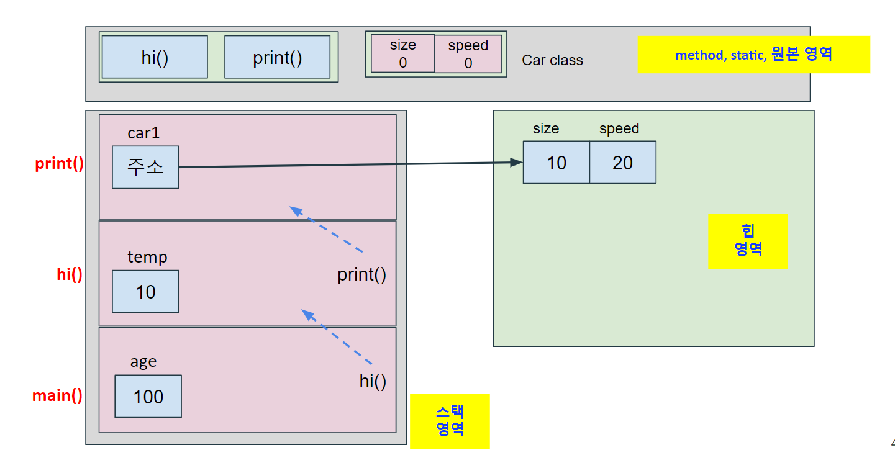
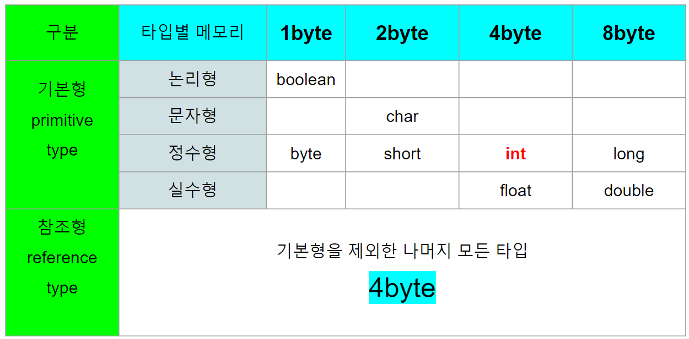
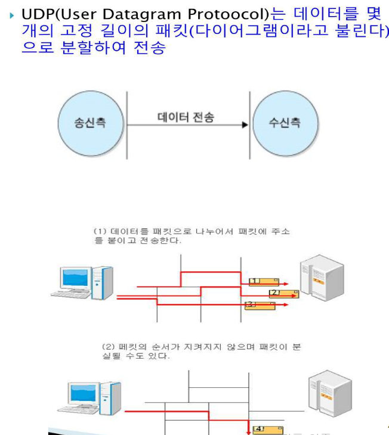
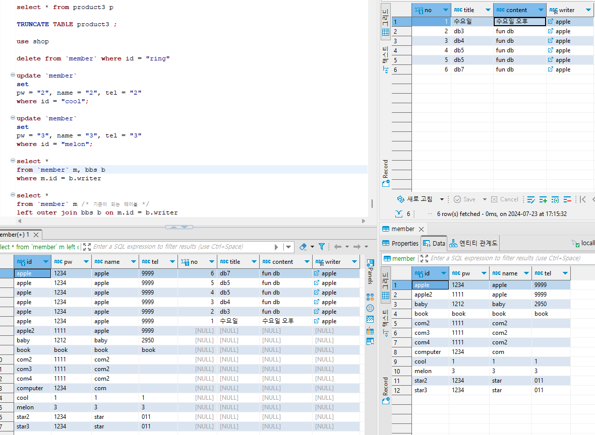
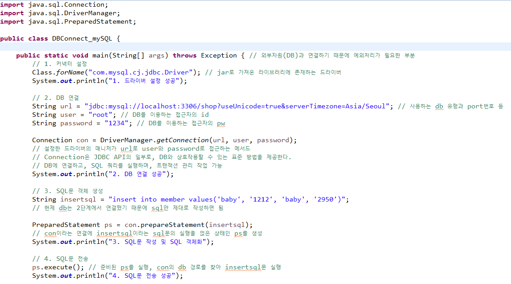

<details>
<summary>키워드로 찾아가기</summary>

[CPU, RAM, HDD(SSD)/USB](#cpu-ram-hddssdusb)   
[웹 페이지 동작 방식](#웹-페이지가-동작하는-방식)  
[타입 결정 및 타입 추론](#타입-결정)  
[HTML](#html)
[CSS](#css)  
[JS](#js)  
[jQuery](#jquery)   
[JAVA](#java)   
[HTTP](#http)  
[HTTPS](#https)  
[URL](#url)  
[URI](#uri)    
[WebServer](#webserver)  
[WAS](#was)  
[Bootstrap](#bootstrap)  
[SERVLET](#servlet)  
[JSP](#jsp)  
[SNIPPET](#snippet)  
[DOM TREE](#dom-tree)   
[OOP](#oop)  
[Cookie](#cookie)<br>
[Session](#session)<br>
[클라우드 컴퓨팅](#클라우드-컴퓨팅)<br>
[Compile](#compile)<br>
[Run](#run)<br>
[Interpreter Language](#interpreter-language)<br>
[AJAX](#ajax)<br>
[JSON](#json)<br>
[XML](#xml)<br>
[CDN](#cdn)<br>
[Proxy server](#proxy-server)<br>
[CORS policy](#cors-policy)<br>
[구현 스펙](#구현-스펙)<br>
[비즈니스 로직](#비즈니스-로직)<br>
[API](#api)<br>
[STS 단축키](#sts-단축키)<br>
[IDE](#ide)<br>
[GUI](#gui)<br>
[라이브러리와 프레임워크](#라이브러리와-프레임워크)<br>
[Overloading / Overriding](#overloading--overriding)<br>
[Regular Expression](#regular-expression)<br>
[UML](#uml)<br>
[Thread](#thread)<br>
[Network](#Network)<br>
[DBMS](#dbms)<br>
[RDBMS](#rdbms)<br>
[SQL](#sql)<br>  
[Socket](#socket)<br>
[CSV](#csv)<br>
[JDBC](#jdbc)<br>
[ORM](#orm)<br>
[DBCP](#dbcp)<br>
[spring framework](#spring-framework)<br>
[myBatis](#mybatis)<br>
[spring mvc2 이용과정 순차적 서술](#spring-mvc2-이용과정-순차적-서술)<br>
[get방식과 post방식](#get-방식과-post-방식)<br>
[Linux](#linux-리눅스)<br>
[알고리즘과 자료구조](#알고리즘과-자료구조)<br>   
[반복문+조건문 vs 재귀함수](#반복문--조건문-vs-재귀함수)<br>  
[스택 오버플로우](#스택-오버플로우)<br>    


[코딩의 볍칙](#코딩의-법칙java-웹)<br>   
[오류의 법칙](#오류의-법칙)<br>   


[각종 개발환경 및 프로그램 초기 환경 셋팅 ](#각종-개발환경-및-프로그램-초기-환경-셋팅)    
[알아두면 무조건 좋은 기타 꿀팁들](#알아두면-무조건-좋은-기타-꿀팁들)  

[정보처리기사 실기](#정보처리기사-실기)  


[](#)

</details>

<hr>

# 용어 정리

## CPU, RAM, HDD(SSD)/USB
* **Central Processing Unit** == <u>중앙 처리 장치, 모든 명령어를 해석하고 실행한다.</u><br>
**Random Access Memory** == <u>컴퓨터의 주 기억장치, 데이터를 일시적으로 저장하는 고속 메모리</u><br>
**Hard Disk Drive, Sokid State Drive, Universal Serial Bus** == <u>대용량의 데이터를 영구적으로 저장하는 장치</u><br>
<u></u>
<br>  
1. CPU는 프로그램의 모든 처리를 담당한다.
2. RAM은 프로그램 실행 도중 일시적으로 저장할 필요가 있는 데이터의 저장을 담당한다. 
3. HDD등은 프로그램 종료 후 영구적으로 저장되는 데이터의 저장을 담당한다.  
4. SSD와 USB는 HDD와 같은 역할을 담당한다.   
SSD는 HDD에 비해 비싸고 빠르며, 드라이브 내부에 움직이는 장치가 없다는 점에서 다르다.  
USB 플래시 드라이브는 데이터를 휴대할 수 있다.

5. 위 사진은 JAVA 프로그램이 실행될 때 RAM의 T자형 메모리 구조이다.  
실행 클래스(main메서드 포함)에서 프로그램이 처음 실행되면 원본영역(method, static 영역)에 class를 가져온다.  
변수의 위치는 다음과 같다.   
static 변수 ==> 원본 영역    
참조형 변수(주소) ==> stack 영역   
인스턴스 변수 ==> heap 영역  
static 변수를 불러온 클래스에 1개만 원본 영역에 존재하며, 나머지 변수는 객체가 생성될 때마다 생긴다.    
원본 영역이 차지하는 메모리는 프로그램이 종료될 때까지 사라지지 않으며, 인스턴스 변수의 경우 해당 변수를 참조하는 메서드나 변수가 존재하는 한 유지된다. 참조하는 모든 변수가 범위를 벗어나거나 null이 되면 사라지게 된다.  

6. 스택 영역에 main 메서드부터 시작해 스택 인터페이스의 작동과 같이 push & pop의 형식(FILO-First In Last Out)으로 메서드가 실행 및 삭제가 이루어지며,  
프로그램이 순서대로 구동되면서 메서드가 실행되고, 마지막으로 실행된 메서드부터 종료되면서 main메서드까지 종료된다.

## 웹 페이지가 동작하는 방식
1. 클라이언트에서 브라우저 실행  
2. 브라우저에서 HTTP방식으로 요청  
3. 웹서버(컴퓨터)에서 요청 내용 판단 ==> 웹서버에서 찾을 수 있는 요청사항(HTML)인 경우 7번 / DB등의 데이터를 추가로 요청하는(HTML이 아닌) 경우 4번  
4. WAS에서 요청을 JAVA로 처리하고(DAO, VO, DTO사용) 원하는 데이터를 요청하거나 수정하는 SQL문을 DB에 전송, 결과 처리  
5. DB에서 SQL문으로 처리 후 받아올 데이터가 있는 경우 resultset클래스를 이용해서 데이터를 받아옴.  
6. WAS에서 DAO, VO등을 이용해서 웹 서버에 요청 데이터 전달.  
7. 웹 서버에서 브라우저의 요청에 대해 응답  
8. 응답시 jsp등에서 요청한 데이터를 프론트엔드 언어로 변환하는 프로그램으로 응답. - 브라우저가 프론트엔드 3총사를 해석해서 표시
<br><br>

### 웹 개발 3단계(3tier)의 이해


클라이언트 측(UI 측) / 웹서버측(웹서버 + WAS = JAVA 측) / DB 측<br>
웹 개발은 위 사진처럼 3부분으로 나뉘어서 이루어지게 된다.  
웹서버의 경우 단순 html 요청인지, DB가 필요한 요청인지 판단해서 WAS로 넘기는 역할도 있기 때문에 웹서버측이라는 WAS를 포함하는 말로 부르는 것이 좋다고 배웠다.  

### 클라이언트가 서버에 주소로 요청하는 방법
1. 브라우저에 주소 입력 + 엔터 == get 방식 
2. form을 이용해 action이 '요청주소'로 가게 하는 방식 == method로 get/post 선택 가능
3. a태그를 이용해서 href="주소" 로 요청 == get 방식
4. js로 location.href="주소" == get 방식

### 클라이언트의 요청(웹서버까지)
클라이언트가 데이터를 전달하는 등 HTTP 방식을 통해 URI(주소)를 요청하면 웹서버가 요청을 판단한다.  
이 때 요청이 html, css, js, img, text 등에 관한 것이라면 대부분 웹서버 단계에서 요청에 응답하게 된다.  
웹서버 밑에는 웹페이지에 필요한 데이터가 미리 들어있어야 한다. 이 데이터로 클라이언트 요청에 따라 페이지에 데이터를 표시하거나 다른 페이지로 연결하게 된다.

### 클라이언트의 요청(DB까지)
클라이언트의 요청 중 DB가 필요한 일부 요청은 웹서버 단계에서 반환할 수 없다.<br>
이런 요청은 웹서버에서 요청을 판단 후 JSP문법으로 JAVA를 통한 WAS처리로 DB에 SQL문을 전달한다.<br>
DB는 SQL문대로 데이터를 Resultset이라는 방법으로 반환하고, WAS는 이 데이터를 JSP 등을 통해 웹서버로 전달한다. <br>
이후 웹서버는 클라이언트의 요청을 반환한다.   
기존 요청이 복잡했기에 좀 더 단순화 해서 요청하는 방법이 생겼다.(Restful api)  

### 정적 웹 vs 동적 웹   
<h>html, css, js로 이루어진 웹이 클라이언트에 대해 어떻게 반응하는가?</h>
정적 웹 ==> 외부 환경에 관계 없이 클라이언트에게 동일한 페이지를 보여줌  
동적 웹 ==> 외부환경이 달라짐에 따라(클라이언트의 로그인 등) 달라지는 페이지를 보여줌  
DB를 이용한다고 전부 동적 웹이 되는 것은 아니다.    
또한 동기통신 vs 비동기통신의 구분과 헷갈리지 않아야 한다.  

### 웹개발에서 프론트엔드와 백엔드의 구분
웹개발을 프론트엔드와 백엔드로 나누려 하면,     
프론트엔드 - 클라이언트(사용자가 보는 화면), 웹서버 일부   
백엔드 - 서버의 데이터처리와 비즈니스로직 으로 나눌 수 있다.     
  
하지만 어느 한쪽을 모르고 웹 개발을 안다고 말할 수 없다고 배웠기 때문에 웹 개발을 목표로 한다면 어쩔 수 없이 풀스택적인 면모를 가지게 될 것이라고 생각한다.  

## 타입 결정
1. 정적 타이핑은 compile시에 결정되고, 동적 타이핑은 run할 때 결정된다.  
즉 타입 오류가 발생한다면 정적 타이핑 언어는 compile, 동적 타이핑은 run시에 발생한다.  

### 정적 타입 결정(정적 타이핑)
1. C++, JAVA 등, static language
2. 변수에 들어갈 '데이터의 타입'을 선언 시(compile)결정한다.    
또한 컴파일 시간에 데이터 타입 결정, 검사와 오류 확인을 실시한다.   


### 동적 타입 결정(동적 타이핑)
1. JavaScript, python 등, dynamic language
2. 변수에 들어갈 데이터 타입을 실행 시(run)에 결정한다.  
3. 컴파일과 실행을 동시에 진행하며, 실행 도중 데이터 타입 결정과 검사가 이루어진다. 

## 타입 추론
1. 타입 추론과 타입 결정은 구분할 수 있어야 한다.  
타입 추론 ==> 초기 타입 추론 vs 변경된 타입 추론     
타입 결정 ==> compile vs run
2. inx x; ==> 변수에 들어갈 데이터 타입이 결정된다. (데이터 타입이 변수와 동시에 선언됨)
3. 이 순간부터 x는 무조건 int타입에 해당하는 변수만 들어갈 수 있다. 다른 데이터 타입은 오류가 생기게 된다.
4. 변수 선언은 기본적으로 js의 let과 동일하게 변수에 데이터 재할당은 가능하지만 변수 재선언은 불가능하다.  
즉 int x = 100; 은 js에선 let x = 100; 과 같다(?)
5. 변수에 어떤 값이 들어갔느냐에 따라 데이터 타입이 다르게 결정된다.
6. var y; ==> 데이터 할당 없이 변수 선언만 한 경우. (var - 변수 재선언, 업데이트 가능 / let - 변수 재선언 불가능)
7. y = 100; ==> 데이터 타입 int로 자동 설정(타입 추론)
8. y = "100", y = "감사합니다" ==> 데이터 타입 string으로 선언 혹은 변경

### 초기 타입 추론 
예를 들어 JS의 경우  
**x = 100 ==> 초기 타입 추론(정수)**

### 변경된 타입 추론
JS에서 이미 변수 x = 100이 할당 된 경우  
**x = "string" ==> 변경된 타입 추론(문자열)**

## 이항연산자와 삼항연산자 
1. 이항연산자  
두 개의 피연산자를 가지고 작동하는 연산자로, 연산을 수행하기 위해 두 개의 값이 필요한 연산자.  
산술, 비교, 논리, 대입 전부 여기에 해당하다.  
2. 삼항연산자  
연산을 수행하기 위해 세 개의 값이 필요한 연산자.  
일반식으로 조건식을 평가하고, 결과에 따라 표현식을 결정한다.  
```condtion ? x : y``` 의 형태를 취한다.  
condtion이 참이면 표현식 x, 거짓이면 표현식 y를 반환한다.  

## JAVA SE8이 가지는 구성


## git에 이미 추가된 파일을 추적 제거하는 방법 
1. .gitignore에 해당 파일의 디렉토리 혹은 파일 명 추가
2. git rm --cached path/to/target/directory
3. git commit -m "~~모시깽저시꺵"
4. git push origin main  # 또는 해당하는 브랜치 이름

## TDD 방법론


## HTML
* **Hyper Text Markup Language**   
<u>Text(문자)와 Markup(<>) 문법을 통해 웹 페이지의 내용을 구조화하는 언어</u>    
<br>
1. Hyper - 초월하는(다른 페이지 이동) / Text - 문자로 / Markup - <>안에 넣는 문법 / Language - 언어  
2. 웹 페이지에 보이는 뼈대의 역할을 담당한다. 현재 주로 사용되는 버전은 HTML5  
3. 웹 브라우저는 HTML, CSS, JS만 읽을 수 있기 때문에 반드시 이 언어들로만 웹 페이지를 만들어야 한다.  
4. <>태그와 문자로 다른 페이지와 연결할 수 있다.  
5. <>속 태그는 대소문자 구분을 하지 않는다. 하지만 <>태그에 속성을 작성한다면 소문자로 작성해야 인식할 수 있다.  
html의 어떤 태그들은 그 태그만 가지는 속성들이 따로 있다. (form의 action, method 등)   
style, script같은 공통으로 가지는 속성들도 있다.
6. HTML5로 웹페이지를 만들면 굳이 애플리케이션용 페이지를 따로 만들지 않아도 일반 애플리케이션 수준으로 충분히 작동하는 것을 볼 수 있다.
7. HTML5을 이용해 개발하기 위해 Visual Studio Code를 설치하는 것이 도움이 된다.

### HTML <>태그 
1. ```<a href = "http://naver.com">네이버 링크</a>```  
a ==> anchor / href ==> hyper reference, html에서 링크를 만드는 방법  
2. ```<ul>``` ,unordered list  
무의미한 순서 목록(숫자 등 순서 x)
3. ```<ol>```, ordered list
의미 있는 순서 목록(순서 표시 o)
4. ```<li>```
ul과 ol의 목록 ==> ```<ul><li>목록내용</li></ui>```
5. ``````, image  
이미지를 표시할 때 사용, src로 이미지 링크, alt로 이미지가 없을 경우 default 글자 표시 등
6. ```<table>```
테이블, 구획으로 나누어진 표를 만들 때 사용
7. ```<tr>```, table row
테이블로 만든 표의 왼쪽부터 오른쪽으로 이어지는 한 행을 의미
8. ```<td>```, table definition
테이블 한 칸
9. ```<th>```, table header
반드시 tr안에 작성, 테이블 내부에 제목의 지정하기 위한 태그로, td위치에 대신 사용한다.
10. ```<td row, colspan:3>```
th나 td의 칸을 확장하여 넓힌다는 의미. row - 세로 / col - 가로, column  
row나 col대로 테이블을 만들었는데 다른 행이나 열에 칸이 부족해서 확장하지 못하는 경우 부족한 칸을 임의로 만들어서 확장한다. 만약 1번칸이 확장되어 있다면, 다음 row의 첫번쨰 td는 2번쨰 칸부터 작성되게 된다.  
11. ```<iframe>``` 
웹 페이지에 다른 웹사이트의 콘텐츠를 담기 위해 사용된다. 유튜브 동영상, 구글 지도, 각종 앱, 광고 배너 등 삽입 가능.  
유튜브의 경우 원하는 동영상 ==> 공유 ==> 퍼가기로 iframe 태그를 포함하는 html태그 한줄 생성 가능
12. ```<form>```
form 태그로 만든 구역 안에 input, select, fieldset 태그를 이용하는 다양한 입력폼을 만들 수 있다.   
==> text, radio, checkbox, submit, option, legend등  
입력폼에 입력하는 정보는 form의 속성 중 action으로 url을 지정하고, method속성으로 get과 post중 선택하는 방식으로 데이터 전송을 할 수 있다. 
13. ```<input 속성(value, placholder)>```
input에서 지정한 입력폼의 초기 상태를 설정할 수 있다. submit는 기본값이 "제출"이지만, input의 value 속성을 이용해 "완료" 등으로 바꿀 수 있다.    
placeholder는 value와 같은 위치에 흐릿한 글씨로 입력폼 설명용으로 사용 가능하다.  
14. ```<audio>```  
src, autoplay, loop, controls(음악 재생도구) 등의 속성을 이용하는 태그
15. ```<video>```  
src, autoplay, loop, conrols, width, height 등의 속성을 이용하는 태그   
audio, video모두 control을 기본으로 설정하면 html5의 기본 재생도구가 나오는 듯 하다.   
기본적으로 로컬이나 웹서버, 데이터베이스 등에 저장된 데이터를 src로 url을 지정해서 사용할 수 있다.  
16. ```<div>```
html에서 공간을 구분하기 위한 가장 기본적인 태그


### HTML문법에서 CSS, JS를 적용하는 3가지 방법  
1. External 방식  
별도의 css, js파일 생성 ==> html의 head부분에 link, scirpt 태그로 경로를 지정해서 적용하는 방식  
2. Internal 방식  
html의 head 부분에 style, script 태그로 css와 js의 내용을 작성해서 적용하는 방식  
3. Inline 방식  
html의 <>태그 중 css나 js를 적용하고 싶은 태그의 속성을 style, script 로 지정해서 적용하는 방식   
<br>
다른 방식으로 작성된 css와 js가 한 태그를 동시에 지정하고 있는 경우 태그를 가장 가까이에서 지정하고 있는 css나 js부터 우선 적용된다. (inline > internal > external)


## CSS
* **Cascading Style Sheet**  
<u>계단식으로 적용되는 스타일 시트로,   
html이라는 언어가 웹페이지에 표시될 떄 어떤 특성과 모양을 가지고 될 지 결정하는 역할을 한다. </u>  
<br>
1. 현재 주 사용 버전은 CSS3로, 애니메이션도 적용할 수 있게 되었다.  
2. 이미지를 사용해도 CSS와 같은 효과를 낼 수 있다. 하지만 이미지나 동영상을 사용하게 되면 파일의 크기 때문에 웹 페이지를 불러올 때마다 웹서버에 부담이 가해지게 된다.   
CSS를 쓰면 이미지보다도 다양하게 html을 다룰 수 있고 서버에 부담을 주지 않으며 쓸수 있다.  
3. externanl 방식을 쓰먄 css와 js 모두 파일로 따로 저장해서 쓸 수 있다. 데이터와 스타일을 분리함으로써 유지보수성을 높였다고 할 수 있다.

### CSS 속성(property)
1. padding : html의 content를 감싸는 안쪽 테두리 설정, 동서남북 px로 설정한다. 
2. border : 중간 테두리 설정
3. margin : 바깥쪽 테두리 설정
4. static ==> 문서의 흐름에 따라 배치(default 값)  
5. absolute ==> 웹페이지의 고정된 위치에 지정하는 속성. top: 0px, left: 0px 의 형태를 취한다. 이 떄 다른 요소에 영향을 미치지 않고 지정된 위치에 고정되게 된다.  
6. fixed ==> absolute와 같은 방식으로 content를 고정하되, 클라이언트가 웹페이지를 보는 화면에 고정시킨다. 스크롤을 내려도 content가 따라오는 방식이다.  


### CSS 선택자  
html 문서 내부의 특정 요소를 선택할 수 있는 선텍자  
1. 기본 선택자  
태그 ==> 태그 이름, id ==> #id이름, class ==> .class이름
a {} ==> a 태그 선택  
#ttt {} ==> id ttt 선택   
.ttt {} ==> class ttt 선택  
2. 가상 선택자  
특정 상황을 가정하여 선택한다. 마우스를 올려 둔 상태, 체크된 상태의 input 태그 등  
a:hover {} ==> a태그의 내용에 마우스를 올려 놓은 상태를 선택  
a:nth-child(2n) ==> 짝수 번째의 상태를 가지는 a태그를 선택
a:nth-child(2n+1) ==> 홀수 번째의 상태를 가지는 a태그를 선택
3. 속성 선택자   
특정한 값과 일치하거나, 포함하거나, 시작하거나 끝나는 태그를 선택한다.  
선택자[속성 = 값] ==> 일치  
선택자[속성 ^= 값] ==> 시작  
선택자[속성 $=값] ==> 끝  
선택자[속성 *= 값] ==> 포험
4. 자손 선택자  
#d1 > p {}  
==> id가 d1인 태그의 바로 아래 p 태그만 선택  
#d1 p {}  
==> id가 d1인 태그 아래에 존재하는 모든 p 태그 선택 


## JS
* **JavaScript**  
<u>HTML의 구조를 CSS의 특성대로 구성한 페이지의 데이터 전달이나 각종 기능을 맡는다.</u>    
<br>
1. JAVA와 흡사한 부분이 많고 JAVA에 비해 더 나중에 만들어진 언어이다. 그래서 욕을 좀 먹었다고 들었다.  
2. JAVA에 비해 허술한 부분이 있지만, jQuery와 es6등의 문법으로 많이 발전했다.  
3. 또한 크롬 브라우저에서 가장 빠른 속도를 가진 언어이자, 가장 오래 쓰인 언어이기 때문에 점유율도 높다. 웹 개발에서 4. 빼놓고 말할 수 없는 언어인 것이다.  
5. JS를 위한 framework는 reac, vue, angular, bootstrap 등이 있다.
6. Interpreter Language(인터프리터 언어)에 해당한다.
7. 위에서 아래로 순서대로 실행된다. 
8. 주석은 //을 사용한다.
9. ajax를 이용한 비동기 통신이 가능하다.
10. 동적 타입 결정(동적 타이핑)  

12. 브라우저 등에서 prompt나 sc.next 등으로 받는 입력은 전부 '문자'로 취급된다.   
'1234' 이렇게 입력해도 숫자 1234가 아니라 문자 '1234'가 입력된 것으로 판단하기 때문에, 만약 입력값을 숫자로써 다루기위해선 입력받은 이후 숫자로 변환하는 과정이 필요하다.   
다만 js의 경우 대부분 알아서 형변환이 되기 때문에 숫자로 변환하는 과정이 필요없는 경우가 많다.  
13. js에서 코드에 ""가 들어가는 문제 때문에 string과 변수(variable) 할당의 문제가 발생하면 ``으로 감싸면 해결된다.
14. 기존 html에 없는 태그를 사용자의 상호작용이나 필요에 의해 만들어내는 것을 동적 태그 쌩성 이라고 한다.    
js는 jquery를 통해 간편한 동적 태그 생성을 할 수 있다. 

### JS가 프론트엔드 3총사에 들어가지만(HTML, CSS, JS) 백엔드 개발자에게도 중요한 이유  
1. JS는 브라우저의 기능을 담당한다.  
2. 그래서 웹서버에 데이터를 보내거나 받아오기(로그인, 게시글 불러오기 등)는 JS가 담당하게 된다.  
3. 이떄 백엔드(db등)의 정보나 웹서버의 연결을 JSTL(JavaServer Pages Standard Tag Library ==> 태그로 js쓰기), AJAX(Asychronous JavaScript And XML)등을 이용하여 웹서버의 부하를 줄일수도 있다.  
4. REST (Representational State Transfer)라는 웹 서비스 디자인 아키텍처 스타일로, 웹서버측(WAS)에서 RESTful API는 HTTP 프로토콜을 이용해서 네트워크상에서 리소스를 CRUD(Create, Reda, Update, Delete)방식으로 조작한다.  
5. 이때 RESTful API는 JSON을 데이터 교환 형식으로 많이 이용한다. JSON을 RESTful API와 함께 잘 사용하면 WAS에서 효율적인 데이터 교환과 리소스 관리를 가능하게 만들어준다.  

### JavaScript의 주요 객체(object)
1. window : 브라우저 전체에 영향, 기본값  
alert(), prompt(), confirm() 등  
window 객체는 기본적으로 상속되어 있기때문에 생략하고 사용할 수 있다.
2. history : 사이트의 기록
3. location : 클라이언트가 요청한 주소  
if문 등에서 .href와 함께 사용하면 조건이 만족되었을 때 바로 이동하게 설정할 수 있다.
4. document : body 태그 안의 내용  
write() ==> 덮어씌워짐,getElementById().value ==> id의 값을 가져옴

### JavaScript의 주요 메서드
1. ```.slice(x, y) / .substr(substring)(x, y)```  
문자열의 x번째 요소부터 y번째 요소 바로 전까지의 요소를 반환  
substr 메서드는 MDN 웹 문서에 따르면 더 이상 사용하지 않는 것을 권장한다.  
slice는 x값이 y보다 클 때 빈 문자열을 반환하는 반면, substr은 x와 y값을 바꿔서 문자열을 반환한다. 프로그래밍의 일관성을 유지하고 오류를 줄이기 위해 slice를 사용하는 것이 권장된다.
2. 

### 데이터 
<u>RAM에 저장되고, 저장공간(변수)에 생긴 이름(변수명)</u>  
char name; ==> char로 변수 선언, RAM에 변수(공간) 생성  
name = "김" ==> 생성된 변수(공간)에 1글자짜리 데이터를 집어넣음  
1. 기본데이터  
정수 -  / 실수 / 문자 / 논리
2. 기타데이터
object(객체), String(문자열)

### 변수 선언
변수 선언은 아무것이나 남용하는 것보다 쓰임새에 맞게 쓰는 것이 좋다.   
코드가 길어질 수록 let으로 하는 편이 더 안정성 있는 편이다.  
기존 var로 쓰인 변수는 어쩔 수 없지만 새로 쓸 일이 있을 때는 let을 사용할 수 있으면 좋다.
1. var  
재선언 O, 재할당 O
2. let  
재선언 X, 재할당 O
3. const(상수)  
재선언 X, 재할당 X

### 연산자
<u>데이터를 비교하기 위한 문법, cpu가 ram에 저장된 데이터를 꺼내서 처리하기 위함</u>  
1. 기본데이터 연산자
산술 : +, -, *, /, %, ++, --, =, +=, -=, *=, /=, %=  
비교 : ==, !=, ===, <, >, <=, >=  
대입    
연결    
논리 : &&(and), ||(or), !(not)  

### 제어문 
<u>가장 중요한 것은</u>  
**입력 ==> 처리 ==> 출력**    
<u>순서를 이해하고 있는 것</u>    
대부분의 경우 이 3과정이 각각 어떻게 이루어지는 이해하고 있는 것이 중요하다.  
이 과정은 웹페이지의 요청 ==> 웹서버의 처리 ==> 웹서버의 응답 과정과 일맥상통하는 부분이 있다.
1. 순차문
2. 조건문
3. 반복문

### JavaScript의 함수
1. 함수가 어떤 기능만 담당한다면 return이 붙지 않는다.   
만약 함수로 어떤 값을 얻어내야한다면 return을 붙여야 한다.
2. 버튼 하나당 함수 하나


## JAVA
* <u>한국에서 가장 많이 쓰이는 프로그래밍 언어</u>
<br>  
1. 제임스 아서 고슬링
2. 처음에는 진행하던 프로젝트 이름을 따서 그린 ==> 자바로 변경, 프로젝트 이름을 생각하던 중 책상의 자바산 커피가 눈에 들어와서 자바로 변경
3. 자바의 사용처  
pc애플리케이션, web 애플리케이션, 안드로이드 애플리케이션, 빅 데이터, 게임(마인크래프트), 과학, 소형기기 등
4. JS와 유사점이 많다. 연산자, 데이터 타입, 기본 문법 등
5. JAVA는 다른 언어에 비해 문법을 지키는 것에 비교적 엄격한 문법이다. (; 사용 , 데이터 타입 선언 등)
6. JAVA 프로그래밍에서 클래스 이름과 camelCase의 경우만 대문자로 표기한다. 나머지는 소문자로 시작
7. JAVA를 포함한 프로그래밍을 할 때 항상 psuedo 코드를 작성하는 습관을 들여야 한다.
8. JAVA 프로그램은 실행하기 위해 'main' 메서드를 포함해야 하는데, 이것을 포함하는 클래스를 '실행 클래스'라고 부른다.
11. 지역변수는 클래스 메서드 같은 {}안에 변수를 설정했을 때를 말한다. 지역변수는 쓰레기값 방지를 위한 초기화 
지역변수는 {}-(블록)안에만 영향을 미친다.    
반대 개념으로 전역변수가 있는데, 전역변수는 클래스 밖 필드에서 선언되어 클래스 전체 영역에서 사용된다.    
또한 전역변수는 지역변수와 다르게 자동 초기화가 되기 때문에, 쓰레기값 문제를 걱정할 필요가 없다.  


### JAVA의 장점
1. JAVA의 플랫폼 독립성 - 자바는 플랫폼을 가리지 않는 호환성을 지닌다.
이는 다양한 운영 체제나 하드웨어 플랫폼에서 실행될 수 있는 능력을 말한다.  
JAVA프로그램이 .class파일로 변환되고 JVM에서 실행되는 일련의 과정이 JAVA의 플랫폼 독립성을 만들어 내었다.
2. 컴파일 언어로서 구문 오류에 강점을 지닌다. 
3. OOP언어로서 보다 간편하고 많은 기능을 가진 개발을 진행할 수 있다.  
4. 엄격한 문법을 가지기 때문에 프로그램의 오류 발생 가능성이 비교적 낮다.


### JAVA 프로그램의 실행 과정
* JAVA 프로그램의 경우
    1. 소스 코드 작성  
        * JAVA로 소스 코드를 작성한다. 소스코드는 .java 확장자를 가진다. 이 파일은 클래스, 메서드, 변수 등을 포함한다.
    2. 컴파일   
        * JAVA의 컴파일러인 'javac'를 가지고 소스코드를 컴파일한다.  
        * 소스코드에 구문 오류가 없다면 바이트 코드로 컴파일이 이루어지고,   
        * 컴파일 된 바이트코드는 .class 확장자를 가지는 파일로 저장된다.   
        * 바이트코드는 기계어와 달리 JVM에서 실행 가능한 언어이다.  
    3. 실행  
        * 바이트코드로 컴파일된 .class 파일은 JVM(Java Virtual Machine)에서 실행된다.  
        * JVM은 바이트코드를 설치된 플랫폼에 맞는 기계어로 번역한다. 
        * JVM이 직접 바이트 코드를 해석하거나, JIT(Just In Time) 컴파일러를 사용하여 네이티브 코드로 컴파일 가능 
    4. 실행 결과를 출력한다.

* spring 같은 프레임 워크로 만드는 경우
    * 기본적인 JAVA 프로그램의 경우는 위의 과정을 거치지만, 웹 애플리케이션이나 다른 프레임워크를 통해 프로그램을 만드는 경우 실행 과정이 달라지게 된다.  
    * spring mvc 프레임워크의 경우 [spring framework](#spring-framework)탭에서 확인  


### 기본 데이터 타입(Primitive type, 원시형)
JAVA는 JS와 달리 변수 선언 시 데이터 타입도 함께 선언해야 한다.  
**String은 '문자열'로 기본 데이터 타입에 해당하지 않는다.**    
<br>
기본형 데이터가 들어있는 변수는 복사할 때 변수의 값을 복사한다. 참조형의 경우 변수의 주소를 복사한다.  
마찬가지로 기본형 데이터 변수의 비교는(==) 값을 비교하지만 참조형 변수는 주소를 비교한다.  
각 데이터 타입은 byte 단위로 RAM의 메모리를 사용한다.   
1. 정수 : byte-1(+-128),  
short-2(+-32768, 3만),  
**int**-4(+-21억),  
long-8(+-9백경, L붙이기) ==> L을 붙이지 않으면 long으로 선언했음에도 int 취급을 하게 됨
2. 실수 : float-4(7자리, f붙이기) ==> f를 붙이지 않으면 애초에 인식 x,  
**double**-8(15자리\)
3. 문자 : char-2(''작은따옴표, String과 구분 위함),   
String-각단어 2바이트, 객체 헤더와 메타데이터에 따라 추가로 메모리 사용  
4. 논리 : boolean-1  +
  
참조형은 당연히 데이터 크기가 아닌 데이터를 가리키는 주소의 크기가 4byte

### 참조형 데이터 타입(Reference type)
기본형을 제외한 나머지 데이터 타입  
1. String : 기본형 데이터처럼 보이지만 참조형 데이터 타입. char는 '', String은 "" 사용  

2. 참조형 데이터의 비교는 값 대신 주소의 비교를 실시한다. 이는 변수의 복사에도 해당한다.   
변수의 복사가 일어날 때 기본형데이터 변수는 변수의 값을 복사하는 반면 참조형 변수는 얕은 복사와 깊은 복사로 나뉜다.   

3. 얕은 복사 - 주소를 복사한다. 주로 변수를 변수에 할당하는 경우.   

4. 깊은 복사 - 주소가 가리키는 값을 복사한다. 특정 메서드를 이용해 복사하는 경우(.clone())

5. 그럼 원본의 주소를 바꾸게 되면 어떻게 될까?  
얕은 복사 - 변수가 달라도 주소가 같은 한 결국 같은 값을 가리키기 때문에 변수의 값이 따라 변하게 됨    
깊은 복사 - 변수가 가리키는 주소가 다르기 때문에 복사한 변수의 값은 변하지 않음.  

6. 참조형 데이터 변수의 비교는(==) 변수의 주소를 비교하게 된다.  
String처럼 기본데이터 타입과 함께 자주 쓰는 참조형 변수의 비교는 특정 메서드를 통한다. (.equals(비교값))  

### 데이터 타입의 형변환(casting)
casting ==> 던져졌다는 의미로, 값을 다른 데이터 타입으로 변환 하는 것  
1. 자동 형변환(묵시적 형변환), 업캐스팅 ==> 작은 데이터 타입의 변수가 큰 데이터 타입에 들어갈 때 사용 (promotion)      
강제 형변환(명시적 형변환), 다운캐스팅 ==> 큰 데이터 타입이 작은 데이터 타입에 들어갈 때 사용     

2. Car가 부모클래스이고 Truck이 자식 클래스인 경우 업캐스팅과 다운캐스팅의 예     
업캐스팅 ==> ```Car = Truck;``` 이렇게 변수에 할당하는 방식으로 형변환이 가능, 자동으로 형변환 됨  
다운 캐스팅 ==> ```Truck = (Truck)Car;``` ()를 통한 더 작은(하위) 공간(클래스) 강제 형변환 가능, 개념적인 판단  
기본데이터 타입 변수와 참조형 데이터 타입 변수 모두 같은 방식으로 사용    
**기본형의 다운캐스팅이 오히려 공간이 적어짐에 비해 참조형의 다운캐스팅은 상속을 받은 하위 클래스에 들어감으로써 오히려 참조할 수 있는 메서드와 변수가 많아질 수 있음.**

3. 기본형 데이터 타입과 참조형 데이터 타입   
기본 데이터 타입 ==> int나 double 처럼 값의 범위도 지켜야 함, 데이터 타입이 차지하는 크기로 형변환 결정  
참조형 데이터 타입 ==> 반드시 상속 관계의 객체들만 형변환 가능, 크기는 상속 관계로 구분  


### 조건문, 반복문
1. if else를 이용한 조건문 - 일반적으로 많이 사용  
2. Switch를 이용한 조건문 - 많은 조건 중 특정 조건을 만족하는 경우 사용    
break 만나면 탈출, default로 기본값 설정 가능   
switch문의 value는 변수가 들어갈 수 있지만, case에는 항상 상수만 들어갈 수 있다.  
3. While을 이용한 조건문 - 매개변수 값이 true일 때 반복, 어떤 값을 유도하거나 도출할 때   
continue 만나면 즉시 반복문 다시 시작
4. break의 매커니즘 - break를 포함하는 가장 가까운 괄호를 벗어남.
5. System.exit(0); - 프로그램을 아예 종료시키는 것. break와 구분하기

### for문  
Switch처럼 break 존재, 추가로 만나면 다시 반복문을 반복하는 continue 존재  
1. c타입 for문(읽기,쓰기)  
```for (int i = 0; i < arr.length; i++) {}``` 의 형태를 가지는 for문으로, c언어에서 유래한 방식이기에 c타입 for문이라고 부른다고 알고 있다. 변수의 값을 수정 가능하다.  
2. for each문(읽기 전용)  
```for (String string : arr) {{}```   
배열을 한 차례 순회하면서 왼쪽 항의 변수에 오른쪽 배열의 요소를 순서대로 할당하하는 for문    
배열의 요소의 값을 읽어와서 새로운 변수에 할당해 처리하는 방식이기 떄문에 읽기 전용이다.  


### 연산자
<u>데이터를 비교하기 위한 문법, cpu가 ram에 저장된 데이터를 꺼내서 처리하기 위함</u><br>  
기본데이터 연산자  
산술 : +, -, *, /, %, ++, --, =, +=, -=, *=, /=, %=  
비교 : ==, !=, ===, <, >, <=, >=  
대입    
연결    
논리 : &&(and), ||(or), !(not)  
1. String ==> 기본 데이터는 아닌데 기본데이터처럼 연산에 사용할 수 있음.
2. 하나라도 실수이면 결과는 무조건 실수  
3. 정수 / 정수 일때도 실제 결과는 실수지만 결과는 정수도 자동 변환  
4. ```+``` 가 결합 연산일 때 하나라도 문자열이면, 결과는 무조건 문자열
5. 기본연산자의 경우 (기본데이터타입)x 의 형태로 일시적으로 강제 형변환이 가능하다.
6. 비교연산자는 값을 비교할 때는 기본형만 가능
7. &&의 경우 왼쪽 항이 false인 경우 계산 불필요,  
||의 경우 왼쪽 항이 true인 경우 계산 불필요
8. String을 비롯한 참조형 데이터의 비교는 데이터 값의 비교가 아니라 주소의 비교를 실시한다.

### JAVA의 변수와 RAM
1. JAVA는 변수 선언을 할 때 RAM에 변수의 저장공간이 만들어진다. 저장공간의 크기는 데이터 타입에 따라 다르다.
2. JAVA의 변수 선언 시 "쓰레기 값"이 들어있다. 이 쓰레기 값은 예상치 못한 결과를 초래할 수 있기 떄문에 JAVA 프로그래밍에선 변수 선언시 반드시 초기화를 해주는 습관을 들여야 한다.
3. JAVA는 타입 추론 언어들과는 다르게 변수 선언 시 데이터 타입을 지정해주어야 한다. 
4. 변수 선언 이후 일반적인 방법으로는 데이터 타입의 변환이 불가능하다.  
JAVA의 변수 재할당은 같은 데이터 타입으로만 가능하다.


### 주요 라이브러리
1. java.util - 주요 유틸리티 모음 / Random, Date(안씀 이제 java.time) 등
2. java.sql - jdbc관련 / PrepareStatement, Connection
3. java.io - 입출력 관련 / File, FileWriter, OutputStream
4. java.net - 네트워크 관련 / InetAddress(ip), Socket

### JAVA 기본 문법
모든 문법은 CPU가 RAM의 데이터를 어떻게 꺼내서 어떻게 사용하는지에 대한 방법을 만들어 놓은 것   
클레스의 내부 함수인 메서드는 파괴함수와 비파괴함수로 나뉜다.   
비파괴함수는 객체의 상태를 바꾸지 않고 파괴 함수는 객체의 상태를 바꾸게 된다.  
1. ```Integer``` ==> 정수 값을 다루기 위한 클래스  
.parseInt - 문자열을 정수로 바꾸기 위한 메서드  
Integer.compare(int x, int y) - 두 정수를 비교해 같을 때는 0, 다른 경우 왼쪽이 크면 1, 오른쪽이 크면 -1  

2. ```Double``` ==> 실수 값을 다루기 위한 클래스  
.parseDouble - 문자열을 실수로 바꾸기 위한 메서드

3. ```(기본데이터 타입)변수``` ==> 기본데이터 타입을 가진 변수에 한해 일시적인 강제 형변환  

4. ```System.out``` ==> 시스템에서 정한 기본 출력장치 (보통 모니터)  
System.out.print - 콘솔에 자바 프로그램의 출력 결과를 표시하게 됨

5. ```System.in``` ==> 시스템에서 정한 기본 입력장치 (보통 키보드)    
System.out의 출력이 콘솔에 이루어지는 것처럼 System.in의 입력도 콘솔에서 이루어 짐

6. ```Scanner sc = new Scanner(System.in)``` ==> Scanner 클래스의 입력장치를 System.in으로 정하는 것   
java.util.Scanner  
Scanner 클래스는 반드시 입력장치를 넣어주어야 함. 실무x, 코딩테스트o  
Scaneer 클래스로 만든 인스턴스 sc의 메서드, .nextInt();를 활용하면 입력값을 int값으로 받을 수 있다.  
.next(); - sc의 메서드로 입력값을 String으로 받기, 공백으로 구분되는 단어에 주로 사용  
.nextline(); - next()와 같지만, 여러 단어나 문장으로 구성된 입력에 주로 사용  
.nextInt(); - 입력값을 int로 받기  
.nextDouble(); - 입력값을 double로 받기   
.close(); - scanner는 사용하면 열린상태가 된다. scanner를 닫아주는 메서드  
Scanner의 입력장치가 결정되고, 입력값이 들어올 때 버퍼는 입력 스트림을(System.in의 키보드 입력) 읽어 들여 데이터를 임시 저장하는 곳이다. 사용자가 '엔터'를 누를때까지의 데이터가 버퍼에 임시 저장된다.    
Scanner의 메서드는 이 임시 저장된 데이터를 읽어 들인다. 이 메서드들은 데이터를 읽어 들일 때 공백(스페이스, 줄바꿈-"\n" 등)을 구분자로 두어서 데이터를 구분한다. nextline()을 제외한 메서드들은 데이터를 읽어들일 때 이 구분자를 처리하지 않고 버퍼에 남겨두게 된다.   
.nextline()메서드는 엔터키를 누르는 순간, 즉 "\n"을 만날때까지의 데이터를 읽기 때문에, 다른 메서드들을 사용할 때 엔터를 통해 데이터 입력을 구분했다면 이후 nextline()을 사용하게 되었을 때 버퍼에 남아있는 "\n"을 만나게 되면서 데이터를 입력할 새도 없이 즉시 종료된다.    
만약 다른 메서드들을 사용한 이후 nextline()메서드를 사용해야 할 상황이 발생한다면 nextline()메서드를 미리 하나 입력해서 버퍼에 남겨진 "\n"을 지우고 데이터를 입력할 수 있다.  

7. ```Math``` ==> 정수나 실수 계산에 관련된 여러 메소드를 제공하는 자바 기본라이브러리 클래스  
.abs(x) - 정수 혹은 실수 x의 절댓값만 반환하는 메서드  
.pow(x, y) - x를 y제곱한 실수(dobuble)를 반환하는 메서드    
.round(x) - 실수 x를 반올림 한 정수를 반환하는 메서드  
.floor(x) - 실수 x를 내림 한 정수를 반환하는 메서드  
.ceil(x) - 실수 x를 올림 한 실수(표기상 정수, 5.0 같은)를 반환하는 메서드  
.max(x, y) - 실수 x, y 혹은 정수 x, y를 비교해 더 큰 정수를 반환하는 메서드  
.mim(x, y) - 실수 x, y 혹은 정수 x, y를 비교해 더 작은  정수를 반환하는 메서드   
.sqrt(x) - 실수 x의 제곱근을 실수로 반환하는 메서드     

8. ```java.time.LocalDate``` ==> JAVA 8 버전 이후 시간을 가져오는 클래스  
```LocalDate today = LocalDate.now();``` - 현재 날짜를 가져오는 메서드  
```LocalDate someday = LocalDate.of(year, month, dayofmonth);``` - 특정 날짜를 지정해서 LocalDate 생성  
다른 클래스들 처럼 인스턴스를 만들기 위해선 LocalDate라는 형태의 참조형 변수로 선언해야 함  
```today.plusDays(int); / today.minusDays(int);``` - 날짜 계산을 위한 메서드  
```today.getYear(), .getMonth(), .getDay()``` - 날짜를 분리해서 얻기 위한 메서드  
이 getYear시리즈의 경우 LocalDate가 아닌 int를 통해 기본 데이터 타입 변수 선언을 해서 얻을 수 있다.  
```today.getDayOfWeek();``` - 지정 날짜가 무슨 요일인지 구하는 메서드, DayOfWeek 으로 변수 선언을 해야 함  
```today.getDayOfWeek().getValue();``` - 요일을 값으로 가져오는 메서드. 월요일부터 일요일까지 1~7  
```today.getDayOfYear();``` - 지정 날짜가 1년중 몇번째 날인지 구하는 메서드

9. ```java.time.LocalTime``` ==> 시간을 가져오는 클래스  
```LocalDate time = LocalDate.now();``` - 현재 시, 분, 초 전부 가져오는 메서드  
```LocalDate hour = LocalDate.now().getHour();``` - 현재 시간을 가져오는 메서드, 분, 초 전부 같은 형식  
Thread와 함께 사용하여 동시에 여러 스레드를 진행시키거나, 1초에 한번 프로그램이 진행되도록 설정할 수 있다.   
Thread를 이용할 때 보통 1초를 1000 이라는 숫자로 표현한다. 

10. ```java.util.Random``` ==> 랜덤한 정수, 실수, 숫자, 논리 값을 발생시킬 수 있다.  
```Random r = new Random()``` - 매개변수를 통해 시드값을 부여할 수 있다.   
```r.nextInt()``` - 매개변수를 통해 랜덤값의 범위를 조절할 수 있다.  

11. ```String 다루기 관련 메서드```  
```Character.toString(char변수)``` ==> char 변수를 String으로 변환하는 메서드       
```Character.isLowerCase(str.charAt(i));``` ==> char 변수의 대소문자 여부를 판단 할 수 있는 메서드  
```Character.toLowerCase(str.charAt(i));``` ==> char 변수의 대소문자 변경을 할 수 있는 메서드   
```String변수.toCharArray()``` ==> String 변수를 char[] 배열로 변환하는 메서드, 향상된 for문에 사용    
String은 기본 데이터 타입이 아니기 때문에 이런 방식의 형변환을 사용한다.  
String은 char[] 배열을 내부적으로 가지고 문자열을 만들기 때문에 char[] 배열을 이용함. 
s1.concat(s2); ==> s1 + s2;와 같은 문자열 결합 메서드  
s1.charAt(1); // 1글자 추출(비파괴)  
s1.startswitch(String, int(생략가능)); // string을 접두사로 가지는지 확인, int로 시작지점 지정  
s1.endsWith("야"); // 특정 글자로 끝나는지 확인  
s1.substring(3); // index 2 이후 전부 출력  
s1.substring(3, 8); // index 3~7 출력  
s1.contains(s2); // 문자열 포함 확인  
s1.lastIndexOf("프"); // 특정 글자의 위치(겹치면 마지막)  
s1.toUpperCase(); // 대문자로  
s1.toLowerCase(); // 소문자로  
s1.length(); // 글자수 체크  
s1.replace("나", "너"); // 왼쪽항을 오른쪽항으로 교체    
s1.replaceAll("[^l-z]", "l"); // 정규표현식의 범위를 다음 매개변수로 바꾸기, 이를 통해 문자열 삭제 가능  
s1.indexOf("나"); // 특정 글자의 인덱스를 찾아주는 메서드  
s1.split(String, int(생략가능)); // 문자열을 특정 단어 기준으로 해서 배열로 분리하는 방법,   
int에 -1 을 적어넣으면 빈 문자열도 분리할 수 있게 된다.  
s1.trim(); // String의 앞 뒤 공백을 자르는 메서드   
s1.equals(비교값); // String의 값을 비교하기 위한 메서드     
String.valueOf(char[]); // char 배열을 string으로 변환하기 위한 메서드  

12. **접근 제어자**   
```public``` ==> 아무 패키지에서나 접근 가능    
부모 클래스에서 public을 봤을 때 인지부조화가 왔는데, 그 이유는 main 클래스의 main의 변수가 지역변수임을 잠깐 잊고 있었기 때문. 상속받은 클래스에서 메소드를 만들기 전까지 선언한 변수는 모두 전역변수임을 잊고 있었다.  
```protected``` ==> 같은 패키지 내의 클래스, 혹은 상속 관계의 클래스만 접근 가능     
```private``` ==> 선언된 클래스 내에서만 접근 가능   
```표시 x``` ==> 같은 패키지 내에서만 접근 가능  


13. **기타 제어자**  
```static``` ==> 객체 생성과 관계 없이 static 변수를 불러온 클래스에 1개만 가지면서 클래스의 여러 객체가 동시에 공유할 수 있음을 뜻하는 제약조건    
변수건 메서드건 객체 생성 없이 호출 가능. 호출 범위는 접근 제어자에 따른다.  
속도가 빨라지고 공유(반복적인 사용)에 효율적이다.   
다만 객체 지향에서 멀어지고, 메모리 사용이 커질 수 있다. 메서드가 종료되어도 사라지지 않기 때문
```final``` ==> 해당 변수나 메서드가 재정의(오버라이딩 등) 할 수 없음을 뜻함  
```synchronized``` ==> 한번에 하나의 스레드만 접근할 수 있음    
```abstract``` ==> 메서드, 혹은 클래스에 붙이는 제어자로, 서브 클래스에서 반드시 구현해야 함을 뜻함  
```native:``` ==> 해당 메서드가 JAVA가 아닌 c나 C++등 다른 언어로 이루어져 있음을 뜻함.  

14. **반환 타입**   
```void``` ==> 반환값이 없음을 의미한다(주로 함수 등)

15. ```java.util.Timer``` ==> 시간을 계산하는 클래스  
```Timer.chedule(Timertask, 시간초설정)``` ==> 시간이 지난 후 Timertask 수행   
```java.util.TimerTask``` ==> 이 클래스를 상속받은 클래스에서 TimerTask를 설정해서 Timer와 함께 사용

16. ```Thread``` ==> lang을 상속받는 클래스로, 스레드에 상속으로 사용가능, 스레드를 만들어주는 클래스   
반드시 ```run()``` 메서드를 오버라이드 해서 레드 내용을 담아야 스레드 실행 가능.    
main 메서드에서는 run() 대신 start() 메서드를 사용해야 run 메서드의 내용이 실행 됨.

### JAVA의 배열   
배열을 사용하는 이유? ==> 많은 양의 데이터를 처리하기 위함.  
배열도 기본데이터 타입이 아닌 참조형 변수로, 배열을 가지는 변수에는 배열의 위치가 있는 '주소'가 저장됨.  
이 주소를 참조하여 접근할 수 있고, 데이터를 처리하게 됨.   
크기 조절 X, 고정된 크기  
단일 데이터 타입

1. 기본데이터 배열 선언 방법  
정수 - ```int[] arr1 = {1, 2, 3, 4};```   
이 상태애서 arr1을 출력하면? - 참조형 변수기 때문에 당연 주소값만 출력됨.    
2차원 배열의 선언 방법  
```int[][] arr2 = { {1, 2, 3, 4}, {5, 6, 7, 8}, {9, 10, 11, 12}};```    
위와 같은 방식으로 "[]"를 늘려가며 다차원 배열을 선언해 사용할 수 있다.  
2. 배열은 기본적으로 같은 데이터 타입의 값만 집어넣을 수 있다. 다양한 데이터 타입을 집어넣으려면 나중에 후술할 컬렉션과 제너릭을 이용해야 한다. 컬렉션은 배열에 없는 다양한 클래스들을 사용할 수 있다.
3. 배열의 구조는 위 그림과 같다.   
배열의 주소를 담당하는 변수, 배열의 인덱스와 그 값, 인덱스를 가지지 않으면서 배열의 길이를 표현하는 length    
배열의 주소인 s는 스택영역에 저장되고, 배열의 값과 메타데이터 length는 힙 영역에 저장된다.   
이때 64비트 JVM기준으로 s가 int타입의 배열임을 가정하면,  
s주소는 8바이트의 크기를 차지하고, 배열의 요소는 4+4+4+4 + 4(메타데이터 length) = 20 바이트의 크기를 차지한다.  
4. 배열은 초기화 할 필요가 없다. JAVA의 변수는 선언하고 초기화하지 않으면 쓰레기값이 생겨 CPU의 연산에 방해를 주게 되는데, 배열은 선언한 데이터 타입의 기본값으로 초기화 되어 있다.  
정수 - 0 / 실수 - 0.0 / 문자 - "" / String(을 비롯한 참조형) - null / Boolean - false
5. ```Arrays.toString(arr)``` ==> 배열의 내용을 String으로 변환하는 메서드. 배열값 확인용으로 많이 씀.    
컬렉션(ArraysList, HashSet)는 그냥 출력하면 이 메서드를 적용한 효과가 나옴
6. ```Arrays.sort(배열)``` ==> 배열을 오름차순으로 정렬해주는 메서드, 파괴함수  
7. ```Arrays.binarySearch(배열, 특정 값)``` ==> 이진 검색, 배열에서 특정 값의 index 탐색, 배열이 반드시 정렬되어 있어야 함
8. ```Arrays.equals(배열1, 배열2)``` ==> 배열이 같은 요소를 가지고 있는지 판단하는 메서드
9. ```Arrays.fill(배열, 특정 값)``` ==> 배열을 특정 값으로 초기화
10. ```Arrays.copyOf(배열, 길이)``` ==> 배열 복사  
```Arrays.copyOfRange(배열, 시작 indxe, 마지막 index);``` ==> 특정 index부터 배열을 복사하는 방법  
11. ```System.arraycopy(원본배열, 원본시작index, 만들배열이름, 원본 마지막 index, 만들배열길이(원본 길이 이하만 가능))``` - 배열 복사
12. ```Arrays.stream()``` ==> 배열을 스트림으로 변환, 이후 .sum, .mapToInt 등 다양한 메서드 사둉 가능, JAVA8 이후
13. ```배열.toArray(data type(wrapper));``` ==> list를 배열로 전환, data type을 작성하지 않으면 object로 선언  
14. ```Arrays.asList{1, 2, 3, 4, 5(or 배열)}``` ==> 배열을 list로 바꾸는 메서드  

* ```StringBuilder sb = new StringBuilder(str);``` ==> 가변 문자열을 효과적으로 다루기 위한 특수한 타입의 변수  
이 친구는 배열은 아니지만 배열처럼 문자열을 다룰 수 있는 친구로,   
**보안성**이 배열보다 떨어지는 대신 가변적인 크기를 가지며 문자열 다루기에 더 유리함.   
```sb.reverse()``` ==> 문자열을 뒤집는 메서드로, 다른 것보다 이 친구가 유용했음.  

### JAVA 8이후의 문법
* .repeat(); ==> 파라메터의 값 만큼 변수나 배열 등을 반복
* 배열.stream().mapToInt(i -> i).toArray(); ==> for문 대신 반복하기 위한 메서드로 추정     
다만 Stream 메서드는 가독성이 좋은 것에 비해 단순 처리 속도가 느리다는 평가를 받는 것으로 확인됨.
 

### JAVA의 컬렉션
배열처럼 많은 양의 데이터를 처리하기 위함. 배열과 다르게 타입이 다른 다양한 데이터 타입을 처리할 수 있다.   
다양한 데이터 타입,    
크기 조절 O  

콜렉션이라는 클래스를 상속받는 여러 클래스들이 존재  
1. List - 순서 O, 중복 O    
add(object), remove(index)
2. Set - List + FIFO  
add(object), remove(FIFO)  
3. Stack - FILO 
push(integer item), pop(integer)
4. Queue - 순서 X, 중복 X   
add(object), remove(index)  
5. (Hash)Map - key : value   
**put(key(object) : value(object)), remove(key)**      
.keySet() == .values() ==> 주로 반복문에서 비교를 위해 key 나 value만 컬렉션으로 반환 
  
붉은색으로 표시된 클래스를 가장 많이 인스턴스화 하게 됨

### JAVA의 제너릭 프로그래밍
클래스나 객체를 생성할 때, 데이터 타입을 지정하는 법   

1. ```class <데이터 타입>, class<데이터 타입> 객체 = new class<>(); ``` 의 형태로 사용할 수 있다.  
2. 기본형 데이터는 래퍼 클래스로 이용할 수 있다.
3. HashMap 처럼 key : value 가 모두 object인 경우 데이터 타입을 2번 지정하게 된다.
4. 한번 지정하면 해당 컬렉션은 지정한 타입의 데이터 타입만 담을 수 있다.   
5. 제너릭으로 미리 타입 지정을 하면 잘못된 데이터 타입을 추가하는 오류를 방지할 수 있다.(컴파일 시, 구문오류 방지)  
또한 기존에 각 요소가 object로 사용되기 때문에 데이터 타입을 넣을 때마다 object로 캐스팅이 발생하게 된다.    
한 데이터 타입만 사용하는 경우 제너릭으로 미리 타입 지정을 하면 구문 오류와 불필요한 캐스팅을 방지할 수 있다.

### JAVA의 GUI, javax.swing 라이브러리 클래스 문법
코드의 가독성을 위해 컴포넌트 생성 - 컴포넌트 설정 - 컴포넌트 추가 의 단계로 나눌 수 있다.      
스프링 프로젝트의 인터페이스 - GUI의이벤트처리를 참고해 인터페이스를 통한 이벤트처리 분리가 가능  
1.  ```JFrame``` ==> javax.swing(GUI 라이브러리)을 이용해서 GUI를 구성하는 윈도우 창을 만드는 클래스    
java.awt.jframe 으로, awt를 상속받아서 awt의 각종 클래스 상속 가능(Color, Font, FlowLayout 등)
```JPanel contentPane = (JPanel) JFrame.getContentPane();```  
JFrame에는 ContentPane이라는 컴포넌트를 다루기 위한 영역이 있다. 그걸 위한 메서드이다.  
JFrame의 메서드인 .getContentPane()는 JPanel 클래스의 객체로 만들 수 있기도 하다.  
즉 ```JPanel == .getContentPane()``` 라고 볼 수 있다.   
JPanel은 swing의 컴포넌트(GUI를 만드는 클래스들)로, 다른 컴포넌트들을 배치할 수 있는 컨테이너 역할을 한다.  
```JFrame.getContentPane().setBackground(Color.white);``` - 이렇게 JFrame의 배경색을 바꾸는 방법에 이용하거나,  
```JFrame.getContentPane().setLayout(flow);``` - 이렇게 요소를 물흐르듯 배치하기 위한 메서드에도 사용할 수 있다.
JFrame의 설정이 들어가는 경우 코드의 가독성을 위해 .getcontentpane을 JPanel 객체로 만들지 않는 선택지도 있다  
```JFrame.getContentPane().add();``` == ```JFrame.add();``` (JAVA 5 이후)       

2. ```JOptionPane``` ==> JAVA의 알림창을 띄우는 클래스, 추가로 j시리즈는 java에서 입력화면을 만드는 시리즈  
.showMessageDialog(위치설정(null 혹은 JFrame등), 표시문구) - 그냥 알림창만 띄우는 메서드  
.showInputDialog(표시문구) - 알림창으로 입력받기     

3. ```JButton``` ==> jframe에 올라가는 버튼을 만들어주는 클래스        

4. ```FlowLayout``` ==> .setLayout()의 매개변수에서 정하는 요소의 배치 유형을 정하는 레이아웃 매니저        
jfame.getContentPane().setLayout(FlowLayout변수); 의 형태로 만들 수 있다.       
Flow를 비롯해 Border, Grid, Box, GridBag 등의 Layout 매니저들이 있다.  
FlowLayout같은 레이아웃 매니저를 사용하면 .setsize(); 메서드 등은 잘 적용되지 않는다.  
그렇기 떄문에 awt의 클래스를 이용해 설정 객체를 따로 만들어서(Font, Color 등) 설정을 적용할 수 있다. 

5. ```JTextField``` ==> 한 줄 입력창을 만드는 클래스. js에선 ```<input type = text>``` 와 같다.    
```JTextArea``` ==> 여러 줄 입력창을 만드는 클래스.   

6. ```f.setDefaultCloseOperation(JFrame.EXIT_ON_CLOSE);``` ==> JFrame 창이 닫힐 때를 설정하는 컴포넌트  
매개변수에 해당하는 위치에 들어가는 메서드는 어떤 숫자를 상수 값을 담당한다. 메서드 혹은 상수 값으로 설정 가능  
JFrame.EXIT_ON_CLOSE == 3 - 창을 닫을 때 프로그램이 종료된다.  
JFrame.DISPOSE_ON_CLOSE == 2 - 창을 메모리에서 제외하고, 프로램은 계속 실행한다.  
JFrame.HIDE_ON_CLOSE == 1 - 창을 닫을 때 창이 숨겨진다. 창은 메모리에서 해제되지 않는다.   
JFrame.DO_NOTHING_ON_CLOSE == 0 - 창을 닫아도 아무 이벤트도 생기지 않는다. 개발자가 창 닫기 이벤트를 만들어야 함

7. ```Font(글꼴, 굵기, 글자크기)``` ==> awt(Abstract Window Toolkit)의 클래스로, GUI의 설정 조정 가능  
```Color.색상``` ==> awt를 상속받는 클래스(swing 등)에서 색상을 객체에 담아 사용하기 위함  
FlowtLayout을 적용하면 컴포넌트의 크기 조정이 어려워진다.  
Font를 비롯한 awt의 클래스들로 미리 설정값을 담은 객체를 만들어 설정에 적용 가능  

8. ```public void actionPerformed(ActionEvent e) {String s = e.getActionCommand();}```  
swing에서 e라는 액션이벤트를 집어넣을 때 쓰는 메서드로, 외부 전역변수가 안쪽에서 사용할 수 없기 때문에 e를 발생시키는 변수의 text를 가져오는 메서드.  

9. ```ImageIcon img1 = new ImageIcon();``` ==> swing에서 img를 가져오기 위한 인스턴스    
```JLabel l1 = new JLabel(); ==> l1.setIcon(img1);``` imageicon은 이렇게 JLabel의 인스턴스에 얹어서 사용한다. 

10. ```JTable table1 = new JTable(배열, 2차원 배열);``` ==> 배열과 2차원 배열을 이용하는 swing 테이블    
```JScrollPane scroll = new JScrollPane(table1);``` ==> 스크롤 가능 영역을 만들어주는 컴포넌트  
위 코드처럼 table같은 컴포넌트를 사용하는 경우 scroll에 얹어서 사용할 수 있다.  
JTable은 최대한 다양한 데이터 타입을 지원하기 위해 object 타입의 이차원 배열을 사용한다.  
그렇기 떄문에 JTable에 데이터를 넣을 땐 String을 포함해 다양한 object의 서브클래스로 집어넣어야 한다.   
String - String / int - Integer / double - Double / char - Character 의 형태로 래퍼 클래스를 선언해야 한다. 

### JDK
Java Development kit  
1. 자바를 개발하기 위해 필요한 프로그램
2. 프로그래밍 언어를 컴퓨터가 실행할 수 있도록 변환해주는 프로그램 포함(javac, JVM등)
3. 라이브러리 포함(jdk8 버전으로 약 4500개)
4. java로 만든 프로그램을 실행하기만 할것이라면 JRE로 충분하지만, 자바 프로그램을 개발하기 위한 목적이라면 JDK까지 깔아야 할 필요성이 있다.
<li>jdk2 : jvm(java virtual machine) 탑재</li>
<li>jdk8 : 간단한 입출력 스트림, 람다식 제공 (주로 이용하는 버전)</li>
<li>jdk11 : oracle jdk 유료전환, open jdk 오픈소스 제공 </li>


### JVM
Java Virtual Machine  
1. 자바 프로그램이 실행되는 가상 환경
2. 자바의 컴파일러가 만든 .class 파일을 JVM이 설치된 환경에서 작동시킬 수 있다.  

3. 이렇게 여러 플랫폼에 맞춰 JVM을 깔기만 하면 자바 프로그램을 실행시킬 수 있다. 
4. jdk의 사진을 참고하면, JVM에는 라이브러리 까지 들어가지는 않는다.  
자바 프로그램은 라이브러리를 사용할 일이 많기 때문에 JRE정도는 깔아야 자바 프로그램을 원활히 실행시킬 수 있다.

### 자바 플랫폼 종류
1. JAVA SE(Standard Edition)  
기본적인 자바 개발환경, pc, 응용프로그램, 웹 개발, 안드로이드 개발
2. JAVA EE(Enterprise Edition)  
SE + web server 개발환경 (JSP, Servlet, EJB, JMS 등)
3. JAVA ME(Micro Edition)  
SE의 축소버전, 소형디바이스, 임베디드 장비를 위함
4. JAVA FX   
자바 표준 GUI 라이브러리 플랫폼

### JAVA의 Class  
객체가 가지는 속성(멤버변수-클래스의변수)와 기능(멤버메서드-클래스의메서드)를 정의하는 틀(template)을 의미한다.  
이런 클래스들은 JDK의 4500개중 고르거나, mvnrepository에서 다운받거나, 직접 만들어서 사용할 수 있다.    

'붕어빵' 이라는 객체로 예를들어 설명할 수 있다.  
1. '붕어빵'(객체)들의 공통된 속성과 기능(변수, 메서드)을 어떤 틀(클래스)이 가지고 있다.   
즉 클래스는 객체의 설계도라고 볼 수 있다.  
2. 이 붕어빵이라는 객체를 정의하는 변수와 메서드를 가진 클래스로 새 붕어빵(객체 = 인스턴스)를 만들어낼 수 있다.   
클래스라는 틀로 객체를 만들어낼 때는 new를 이용해서 찍어내게 된다. 이때 멤버변수가 따로 복사되게 된다. 
3. 팥붕어빵, 슈크림붕어빵이라는 이름의 자식클래스가 존재한다면 붕어빵이라는 부모 클래스를 상속받아 부모 클래스의 변수와 메서드를 사용할 수 있다.    
이 과정에서 메서드 오버라이딩을 통해 메서드에 다른 기능을 만들 수 있다 (ex, 팥 대신 슈크림 넣기)
4. 클래스가 없다면 OOP를 이루기 어렵다. 결국 더 나은 코드와 좋은 프로그램을 만들기 위해 필요하다.    
5. 모든 클래스는 Object의 하위 클래스이다.  

### JAVA의 Constructor
* **생성자 메서드**<br>
<u>JAVA에서 객체 생성 시 해당 객체의 클래스의 내부에 클래스와 동일한 이름을 가진 메서드가 자동으로 호출됨.(반환값x)</u>
<br>  
생성자를 왜 사용하는가? ==> 객체를 생성할 때마다 하고 싶은 일이 있어서. - 보통 멤버변수 초기화    

1. ```public 클래스이름()``` 의 형태로 메서드를 만들 수 있다. 클래스와 메서드의 이름이 동일하다.   
생성자 메서드는 무조건 반환값이 없기 때문에 데이터 타입 대신 void지만, 위 문법처럼 void를 붙이지는 않는다.
2. 매개변수의 위치, 갯수, 데이터타입에 따른 다양한 메서드 - 다형성
3. new를 이용해 새 참조형 변수를 만들게 되면 해당 클래스의 생성자 메서드가 자동으로 호출되도록 되어있다.
4. 메서드의 파라메터에 아무 값도 담지 않은 생성자를 '기본생성자'라고 한다.
5. 명시적 생성자 : 개발자가 클래스에 대해 직접 정의한 생성자.    
묵시적 생성자 : 개발자가 클래스에 생성자를 지정하지 않았을 때 컴파일러가 자동을 제공하는 기본 생성자(비어있음).    
만약 명시적 생성자가 존재해도 파라메터가 존재하지 않는 기본 생성자가 없으면 묵시적 생성자가 자동 생성된다. 
6. 기본생성자를 제외하고, 파라메터를 통해 맴버변수의 초기화가 가능하다.   
멤버변수여도 전역변수는 초기화할 필요가 없기 때문에, 지역변수인 경우 생성자를 통한 초기화를 사용할 수 있다.  
7. 생성자 ==> new로 클래스를 인스턴스화 할때 자동으로 호출 됨, 반환값 X    
.toString ==> 참조형 변수(클래스로 만든 객체 포함)를 출력할 때 어떤 내용이 표시될 지 정의, 반환값 O  
기본적으로 참조형 변수를 그냥 출력하면 주소값이 나오는데, .toString을 이용하면 주소대신 다른 내용 출력 가능  
8. 생성자와 함께 ```static```변수(==클래스변수)를 사용하면, 인스턴스가 아니라 클래스에 속하는 변수를 지정해 어떤 특정값을 누적시킨다던지 할 수 있다. 

### JAVA의 Inheritance
* **상속**<br>
<u>클레스를 정의하여(만들어서) 사용할 때 기존의 클래스가 모든 것을 새로운 클래스에 물려줬다는 의미에서 상속</u>
<br>  
1```public class Child extends Parent {}``` ==> 의 형태로 사용한다, extends가 상속의 키워드라 말할 수 있다.  
2. OOP인 JAVA 프로그래밍을 위해 필요한 class를 만들어야 하는데, 이미 존재하는 것을 재사용해서 만드는 것    
3. 예를 들면,     
스레드 프로그래밍(동시 실행 프로그램) - 이 클래스를 상속받으면 하위 클래스들은 스레드가 된다.    
servlet - 이 클래스를 상속 받으면 java 프로그램을 웹에 띄울 수 있다.    
Activity - 이 클래스르 상속 받으면 앱 화면 하나가 만들어진다.     
4. 부모 클래스 == 수퍼 클래스 / 자식 클래스 == 서브 클래스  
5. 반드시 단일 상속으로 받는다. ==>  extends Parent1, Parent2 불가    
6. final 이 제약 조건인 클래스는 상속 불가  
7. 클래스의 상속 관계는 형변환(Casting)에 영향을 미친다.    
8. 모든 JAVA 클래스는 Object를 상속받는다.   
9. java.swing으론 만드는 GUI의 요소들은 컴포넌트라고 부르는 이유도 Component라는 클래스를 상속받았기 때문   
10. 상속와 import는 뭐가 다른거지??     
상속과 import 모두 클래스를 사용하기 위해 가져온다는 점에서 같지만, 목적이 다르다.      
import는 단순히 그 클래스를 사용하는 것에서 그치지만, 상속은 부모 클래스의 변수와 메서드를 재정의해서 새로운 목적의 클래스를 만들어 사용하는 것에 목적이 있다. 

### JAVA의 Boxing, UnBoxing
1. 제너릭(Generic) 문법을 사용하는 컬렉션에선 기본형 데이터를 사용할 수 없다.  
기본형 데이터를 사용하기 위해 각각의 데이터 타입에 대응되는 래퍼(Wrapper) 클래스로 참조형 변수로 만들어야 한다.  
2. 박싱(Boxing) ==> 기본형 데이터 타입을 래퍼 클래스로 감싸 참조형 데이터로 만드는 과정    
```Integer x = Integer.valueOf(a);```    
3. 언박싱(UnBoxing) ==> 래퍼클래스로 만든 래퍼 객체를 다시 기본형 데이터 타입으로 만드는 과정  
```int y = x.intValue();```   
4. JAVA 5 이후부터는 오토박싱과 오토언박싱을 지원하기 떄문에, .valueOf, .intValue 등의 메서드를 생략 가능  
즉 래퍼 클래스가 필요한 컬렉션에 기본 데이터를 넣을 때도 메서드 없이 그냥 넣을 수 있다.  

### JAVA의 예외처리
try/catch, throws ==> 예외처리 방법으로, 이걸 해주어야 하는 상황    

왜 예외 처리를 해주어야 하는가?  
==> JAVA는 Compile 언어기 때문에 compile 단계의 오류는 잡을 수 있지만, 구문에 오류가 없는데 run 단계에서 오류가 생기면 프로그램 전체가 중단되어 버림.     
오류가 생기는 일부분을 제외하고 비정상적인 프로그램 종료를 방지하고 마저 실행시키기 위해 예외처리를 하게 됨  

JAVA에서 외부 자원을 연결할 때 사용
1. File
2. db
3. 네트워크
4. CPU(컴퓨터 지원 device)

```java
try {
	'에러가 발생할 것 같은 코드'
} catch (Exception e) {
	// TODO: handle exception
    '에러가 발생한 경우 처리 내용'
}
```
### 결과물을 외부 파일로 저장하는 법(간단)
```java
import java.io.FileWriter;
import java.io.IOException;

public class 특정파일형태로저장하기 {
	
	public static void main(String[] args) {
		// txt 형태로 저장하기, String만 가능
			try {
				FileWriter f = new FileWriter("C:\\eclipseworkspace\\java_practice\\src\\main\\java\\결과물저장기능\\임의저장.txt");
				f.write("1번 저장내용\n");
				f.write("2번 저장내용\n");
				f.write("3번 저장내용\n");
				f.write("4번 저장내용\n");
				f.close();
			} catch (IOException e) {
				// TODO Auto-generated catch block
				e.printStackTrace();
			}
	}
}
``` 

### JAVA의 Interface
일반적인 인터페이스의 의미는 '서로 다른 두 시스템이나 소프트웨어 등을 서로 이어주는 부분 또는 접속 장치'  
자바에서 인터페이스는 클래스가 구현해야 하는 메서드의 집합을 정의하는 일종의 '계약'         
인터페이스 자체는 메서드의 선언부만 포함하고, 구현부는 포함하지 않는 추상 메서드만 가진다.    

C타입 충전기(인터페이스를 상속하는 클래스)가 다양한 기기에 연결(어떤 매커니즘 실행)되는 것처럼,    
어떤 규격을 정하고 따르기 위함. ==> 여러 클래스가 동일한 방식(인터페이스)으로 작동됨   

java.swing에서 기능을 담당해주는 addactionListener도 이런 방식임  
```java
// 인터페이스 정의
interface Animal {
    void eat();  // 메서드의 내용이 보이지 않는 추상 메서드
    void sleep(); // 인터페이스 Animal을 받는 클래스가 정의해서 사용
}
``` 

상속의 ```extends```위치에 ```implements```로 인터페이스를 받아서 사용 가능하다.  
List, Set, Queue, Map 등의 클래스들은 ```Collection```이라는 인터페이스를 상속받는 것이다.  
```java
// 인터페이스 구현
class Dog implements Animal { // extends 처럼 상속
    @Override
    public void eat() {
        System.out.println("Dog is eating");
    }

    @Override
    public void sleep() {
        System.out.println("Dog is sleeping");
    }
}
```
* 인터페이스 사용법
1. 위 코드처럼 상속과 같은 형태로 인터페이스를 구현한 클래스를 객체로 만들어 사용하기
2. 인터페이스를 구현하는 클래스와 해당 클래스를 사용하는 클래스를 한 파일에 만들어 사용하기
3. 이벤트처리할 때마다 인터페이스가 익명클래스가 되게 만들어 메서드 재정의하기(addActionListener)
    
<br>

* 인터페이스의 특징을 정리하면
1. 클래스의 상속과 다르게 다중 상속이 가능하다. - implements a, b, c    
클래스가 다중 상속을 사용하려면  다중 상속을 받은 인터페이스를 상속 받아서 다중 상속을 받을 수 있다.
2. 추상 메서드만 가질 수 있다.
3. 변수는 기본적으로 ```public static final``` 로 간주된다.      
인터페이스의 메서드와 변수는 ```public```으로 취급된다.  
4. 클래스 간의 계약을 정의하고, 다형성, 유지보수성, 유연성을 높인다.     
5. 인터페이스는 클래스와 다르게 객체 생성 불가능  
<br>

* 굳이 클래스 대신 인터페이스를 쓰는 이유?  
1. 유연한 설계 ==> 단일 상속 대신 다중 상속, 다형성
2. 계약(Contract) ==> 정의된 메서드를 반드시 구현해야 함.

### JAVA의 Abstracy class(추상클래스)
Interface와 연계해서 생각할 수 있는 개념   
클래스가 추상 메서드를 하나라도 가지고 있으면 무조건 추상 클래스이다.  
추상 메서드, 추상 클래스 모두 다른 클래스가 이를 받아서 무조건 정의하도로 하는 것에 의미가 있다.  

### JAVA의 @ - annotation (어노테이션)  
* **어노테이션(annotation)** 은 메타데이터를 코드에 추가하는 데 사용되는 특별한 형태의 문법     
어노테이션은 코드에 설명을 추가하거나 컴파일러 및 런타임 환경에 특정 동작을 알려주는 데 사용  
@ 기호로 시작하며, 클래스, 메서드, 변수, 매개변수 등에 적용   

* **어노테이션은 클래스나 코드의 목적을 명확히 알리고, 제약을 설정하거나 편의 기능을 제공하기 위해 사용하는 도구**

* 어노테이션의 종류는 굉장히 많지만, 제공 주체에 따라 분류하면  
    1. 빌트인 어노테이션 == JAVA 표준 제공    
        * @Override: 메서드가 부모 클래스의 메서드를 재정의했음을 알림.
        * @Deprecated: 해당 요소가 더 이상 사용되지 않음을 표시.
        * @SuppressWarnings: 컴파일러 경고를 억제.
        * @FunctionalInterface: 함수형 인터페이스임을 명시.
    2. 라이브러리 및 프레임워크 제공 어노테이션   
        * Spring  
            * @Controller - 클라이언트 요청과 응답에만 집중   
            * @Service - 비즈니스 로직만 메서드 형태로 모아두었으며, 재사용성과 유지보수성 향상  
            * @Repository 
                스프링 컨테이너에 빈(Bean)으로 등록
                예외 변환(AOP 기반)
                DAO 역할 수행
            * @Autowired: 의존성 주입을 자동화, 스프링 컨테이너가 객체 관리하며 필요한 곳에 의존성 자동 주입  
            * @RequestMapping: sql문이 작성된 xml 문서에 연결  
            * @Transactional: 트랜잭션 관리.


## HTTP
* **Hyper Text Transfer Protocol**  
<u>웹 서버와 브라우저가 정보를 주고받기 위한 프로토콜(규약), HTML과 같은 Text로 이루어지기에 붙은 이름</u>  
<br>
1. https://dgony.github.io//daily-record-1/  <== 이 URI를 예로들어 설명하면,    
https: ==> 웹 브라우저의 정보 전송 규약  
dgony.github.io ==> 네트워크 연결 주소 + port  
daily-record-1 ==> 요청하는 문서(페이지, 데이터)의 위치와 이름    
2. 80번 포트 사용  
3. 클라이언트와 웹서버 간의 전송은 HTTP 규약을 따르도록 정해져 있다.  
4. HTTPS에 비해 보안성이 떨어지고 데이터가 해킹될 수 있음  

### HTTTP의 특성
1. 무연결성(Connectionless) : 통신시 연결을 유지 않는다. 한 번 연결하고, 주고받고, 바로 끊는다.  
2. 무상태성(Stataless) : 무연결성으로 인해 이전에 저장한 상태유지 x, 그렇기 때문에 요청할 때마다 다른 작업을 실시한다.   
연결했던 클라이언트임을 인식하기 위해 쿠키와 세션을 사용해 ID를 저장해두었다가 인식하는 방식이다.  
3. 요청정보(Request) == 클라이언트정보 를 저장해두었다가
4. 조건에 맞는 응답정보(Response)를 반환한다. - 이 요청과 응답의 구분에 대해선 cookie에 서술


### HTTP 주요 응답 코드  
1. 200 ==> ok  
2. 400 ==> bad request, 요청이 잘못됨
    * 401 == Unauthorized
    * 403 == Forbidden
3. 404 ==> not found, 요청에 따라 웹서버 밑의 리소스를 찾아봤는데 해당 위치에 요청한 리소스가 없음
    * 405 == Method Not Allowed
4. 500 ==> interanl error, 얘기치 못한 에러(클라이언트가 아닌 서버 측 문제) 발생 == spring의 경우 문법 오류, 연결 오류

## HTTPS
* **Hyper Text Transfer Protocol Secure**  
<u>HTTP와 동일하지만 보안이 강화된 형태.</u>   
<br>
1. 443번 포트 사용  
2. SSL(Secure Sockets Layer) 또는 TLS(Transport Layer Security) 인증서를 통해 데이터를 암호화하여 전송, 은행같은 민감한 사이트는 대부분 이 방식을 채택.  
3. HTTP에 비해 상대적으로 느리지만 하드웨어의 현대화에 따라 큰 차이는 없어짐

## Bootstrap
* <u>HTML, CSS, JavaScript등의 프로그래밍 언어로 만들 수 있는 오픈소스 프레임워크</u>
<br>  
1. HTML, CSS, JS같은 프론트엔드를 주로 삼는 프레임워크로, 일부 다른 언어들도 존재한다.
2. 주로 CSS를 중심으로 하는 기본 프레임워크라고 생각할 수 있다.


## WebServer
* **클라이언트가 요청하면 응답을 해주는 서버**<br>
<br>
현재 사용 중인 개발 과정에선 tomcat으로 웹서버를 대신함     

* 웹서버의 종류
    * Tomcat - 기본 port번호 8080, 현재 8888로 커스텀해서 사용중
    * nginx(엔진엑스)
    * IIS

### 웹문서
클라이언트가 서버에 요청하면 응답하는 정적 혹은 동적 문서

### 웹 애플리케이션
웹에서 수행되는 애플리케이션, WAS=웹애플리케이션 서버 밑에서 작동

### 웹서비스
네트워크 상에 분산된 자원을 사용하기 위한 서비스

## WAS
* **Web Application Server**  
<u>브라우저, 클라이언트 등을 통해 접근할 수 있고, 서버에서 실행되며 클라이언트의 요청을 처리해 동적인 콘텐츠 제공</u>
<br>  
* 브라우저 → http://127.0.0.1:8080/web02/ajax1.html  
이런 방식의 url을 통해 웹서버 아래의 웹 애플리케이션에 접근할 수 있다.    

* WAS 종류
    * Tomcat - 현재 Tomcat이 웹서버, 웹 애플리케이션 서버 모두 담당해주는 버전으로 사용 중
    * WebLogic
    * WebSpere
    * Jeus
    * JBoss

## SERVLET
<u>자바를 기반으로 한 서버측 프로그램으로, 웹 애플리케이션에서 클라이언트의 요청을 처리하고 동적인 콘텐츠 생성</u>
<br>  
* servlet engine(== container)이 서블렛의 생명주기, 스레드, 요청 처리, 서블릿 로딩 및 초기화 등을 담당한다   
이번 과정에선 서블렛 엔진이 java spring에서 제공하는 mvc 프레임워크의 서블릿을 관리하는 것을 확인했다.  

* servlet은 mvc2 프레임워크를 사용한다면 web.xml 파일에 자동적으로 구성되어 있다.    
web.xml은 spring mvc2가 어떻게 요청을 받고 view로 응답하는지 연결을 설정할 수 있다. 


## JSP
* **JAVA Server Page**  
<u>JSP는 서버에서 동적 웹 페이지 생성을 위해 HTML문서 내에 JAVA 코드를 생성할 수 있게 만들어주는 기술</u>   
== 사용자 요청에 따라 실시간으로 변화하는 컨텐츠 생성 가능 

* JSP는 servlet으로 변환되어 처리되는 자바의 서버 동적 처리 기술     
최초 요청 시 servlet으로 변환되어 serviec() 가 호출되고, 두번째 요청부터는 servie()만 호출

* 브라우저는 **반드시 html만 읽을 수 있다.** .jsp 파일을 이용해 java 코드를 html에 섞어 다양한 기능 이용가능

1. 동적 컨텐츠 생성 - 웹서버뿐만 아니라 DB나 다른 외부 서비스와 연계가 필요한 컨텐츠 생성
2. JAVA 기반 - java 작성이 가능하기 떄문에 java의 기능과 라이브러리 사용 가능
3. 서버 측 처리 - jSp는 서버에서 처리 후 클라이언트가 해석할 수 있는 html, json 형태의 응답만 보내 줄 수 있음

* new_neo_jsp 프로젝트에서 webapp 아래의 jsp 파일에서 java 프로그래밍을 사용한 함수 페이지 생성 가능을 확인

### 내장 객체   
jsp페이지에 일시적인 파라미터에 데이터를 저장하거나 세션에 저장할 때 사용하게 될 것
1. request
2. response
3. session
4. out 

### servlet이랑 jsp 비슷한 것 같은데?

* 공통점 - 서버 측의 동적 웹 콘텐츠 처리를 위함   
spring framework가 제공하는 mvc 패턴은 servlet과 jsp를 비롯한 다양한 기술을 사용하여 서버 측의 동적 처리를 진행함

* 차이점
    * servlet
        * .java 에서 작성, 그냥 java의 클래스임
        * 웹 페이지 디자인과 서버 로직이 혼합되어 유지보수가 어려움
        * 동적 컨텐츠 응답을 위해 HTML 작성을 JAVA 코드로 처리하게 되는데, 코드 작성이 너무 복잡함
        * 대신 복잡한 서버 로직 처리가 가능함
    * jsp
        * .jsp 로 작성
        * 웹 페이지 디자인과 서버 로직이 분리되어 있기 떄문에 유지보수가 용이함
        * HTML 내부에 JAVA 코드 삽입이 가능해 웹 페이지 디자인이 쉬움
        * 비즈니스 로직, 복잡한 서버 로직은 여전히 서블릿이나 다른 비즈니스 계층에서 처리해야 함
        * **핵심은 서버에서 자바로 처리하기 위해 자바의 클래스인 servlet을 사용했는데, servlet이 너무 어렵고 불편하기 때문에 더 쉽게 쓰기 위해 개발한 새로운 확장자가 JSP라는 것**

### JSP 파일의 Path 기준 경로 설정
웹페이지를 열기위해 웹 애플리케이션이 WAR 파일로 패키징되고 웹서버에 배포된다.  
이때 웹서버는 웹 애플리케이션마다 각각의 고유한 컨텍스트 경로를 배정한다.  
예를 들어, 웹 애플리케이션이 다음과 같은 URL에 배치되었다고 가정한다.
<li>웹 애플리케이션 이름: myapp</li>
<li>웹 애플리케이션 컨텍스트 경로: /myapp</li>
<li>이 경우, 웹 애플리케이션은 다음과 같은 URL에서 접근할 수 있다. ==> http://localhost:8080/myapp/</li><br>
이 URL에서 /myapp/가 웹 애플리케이션의 컨텍스트 경로이다.<br>
이 경로는 웹 서버가 요청을 해당 웹 애플리케이션으로 라우팅하는 데 사용된다.<br>
jsp에서 이 컨텍스트 경로를 쉽게 사용하기위해 아래의 JSTL을 이용할 수 있다. CDN과 변수를 이용한다.

1. ```<%@ taglib prefix="c" uri="http://java.sun.com/jsp/jstl/core"%>```   
JSTL 코어 태그를 사용하기 위함(c타입 반복문 등)
2. ```<c:set var="path" value="${pageContext.request.contextPath}"/>```  
Path 기준경로 설정 방법이다. JSTL 코어 태그를 사용할 수 있어야 설정할 수 있는 방식이다.  


## SNIPPET
* **코드조각모음**   
<u>개발 언어에서 특정 접두어를 입력하면 지정한 템플릿이 작성되게 하는 기능</u> 
<br>  
1. 코드를 작성하기 위한 반복 작업을 줄여준다.  
2. Snippet의 예로 이 md 파일을 작성 중인 VSCODE에서 html파일을 만든 후, html:5 라는 접두어를 입력하게 되면 html파일 작성을 위한 기본 템플릿이 자동 작성되게 된다.  

## URL
* **Uniform Resource Locator**   
<u>인터넷 상에 존재하는 자원의 위치를 나타내는 주소.</u> 
<br>    
1. 처음 웹에대해 배울 때 로컬 파일로 웹 페이지를 만들었기 때문에 살짝 헷갈렸던 개념.  

## URI  
* **Uniform Resource Identifier**  
------------추후서술--------------

## UI
* **User Interface**  
<u>쉽게 말해서 사용자에게 보여지는 화면</u>
<br>  
1.

## UX
* **User Experience**  
<u>사용자 경험. 사용자가 사이트를 이용하는 흐름</u>
<br>  
1. 

## jQuery 
* <u>JS를 더 짧은 길이로 이용할 수 있도록 간략화한 방법  
JS를 더 잘 이용하기 위한 방법으로, 모두가 이해할 수 있는 준말 정도로 말할 수 있다.</u>
<br>
1. http://jquery.com/download 여기서 받을 수 있다.  
jQuery는 미리 저장하지 않아도 https://code.jquery.com/jquery-3.6.0.min.js 이 링크만 연결하면 사용할 수 있다.  
(CDN)
2. external로 js를 사용하는 상황에서 jQuery를 쓰려면, js를 불러오는 html이나 jsp 파일에서 jQuery를 로드하면 된다.  
out.js에서 jQuery를 로드하는 방법도 있지만, 추천되지 않는다.
3. js의 동적인 처리 부분을 미리 짜놓았다.
4. jQuery를 이해하고 있어야 공공 API나 구글 API가 제공하는 JSON을 원활하게 다룰 수 있다.
5. jQuery는 $(달러 표기법)으로 사용할 수 있다. jQuery에서 $는 jQuery의 줄임말로, 대신 jQuery를 쓸 수도 있다.  
즉 ```$(document).ready();``` == ```jQuery(document).ready();``` == ```$();```
6. 동적 태그 생성을 더 쉽게 할 수 있다.  


### jQuery 주요 문법(주로 메서드)
1. ```$(document).ready();```  
Document ready event (문서준비 이벤트) 를 준비하는 DOM ready Function (DOM 준비 함수)  
```$(function () {// 코드});```  
DOM ready 함수와 완전히 같은 함수로, 더 짧게 쓸 수 있는 단축문법이다.    
HTML의 프로그래밍 인터페이스인 DOM이 준비되면 ready()의 내용을 실행, 함수와 함께 사용할 수 있다.  
DOM의 준비와 JS의 실행 순서는 JS의 interpreter 언어적 특성과 관련이 있다.  
JS는 HTML의 DOM을 준비하는 도중 실행된다. body에서 class나 id를 찾는 함수의 경우 DOM이 준비된 상태가 아니면 해당 태그에 접근할 수 없기 떄문에 이 메서드와 함께 사용하는 것이 필수적일 수 있다.
2. ```$(#id이름).html(변수);```    
변수 내용을 html 스크립트로 body의 id를 찾아 할당한다. 클래스는 css와 같이 .을 통해 사용할 수 있다.  
html을 생성하는 방식으로 innerHTML을 사용하는 방식도 있는데, 이 방식에 비하면 코드가 간결한 반면 성능이 떨어지는 방법이다. 
3. ```$("#d1").append(변수)```
d1이라는 id를 가진 태그에 append 객체의 파라미터를 html코드로 '추가'한다.  
바로 위쪽 2번의 html 객체는 지정한 태그의 내용을 덮어씌우는 것에 반해, append는 지정한 태그의 내용을 덮어씌우지 않고 뒤에 추가하는 방식이다.  
4. ```$('선택자').text(결과);```  
선택자 태그의 texy를 가져오는 코드. (결과)를 입력하면 값 수정 가능
5. ```$('input').val();```    
input 태그의 val값을 수정하는 코드. 마찬가지로 val을 입력하면 값 수정 가능
6. ```$('input이외').attr();```  
input을 제외한 나머지 태그의 속성을 가져오는 코드 
7. ```$("#b1").click();```  
b1이라는 id를 가진 태그를 클릭하면 clcik의 파라미터 내용을 실행
8. ```$("#b1").keyup();```  
b1이라는 id를 가진 태그에 값이 들어가 있을때 keyup의 파라미터 내용을 실행
9. ``` $(list).each(function(index, value))```   
each는 배열의 모든 요소를 반복하는 메서드로, each가 실행될 때 함수 첫 값으로 index와 둘째 값으로 value가 제공된다.  
이 때 index는 현재 반복중인 요소의 index, value는 현재 반복중인 요소를 매개한다.  
예시로 index와 value가 들어가있지만, 다른 이름으로 매개변수를 사용할 수 있다.  
10. ```success: function (doc) {}```  
ajax로 API 호출을 성공했을 때 쓸 수 있는 함수. API호출로 받아온 문서를 매개변수에 할당한다.  
doc말고 다른 변수 이름으로도 할당할 수 있다.
11. ```$(doc).find("item")```  
받아온 doc 문서에서 모든 ```<item>``` 요소를 찾는다. 다른 요소를 찾을 때도 마찬가지이다.

### jQuery 이벤트 처리 방식
1. jQuery를 쓰지 않는 순정 js방식으로 버튼 함수를 활용하려면, 버튼 태그에서 inline방식으로 onlcick 속성으로 설정해야 한다. 즉 함수는 js scirpt부분에 작성하고, 함수를 사용하는 처리는 button태그에 inline으로 해야한다.
  
<br>
반면 jQuery는 button태그를 script에서 지정하여 처리 부분을 inline에서 script로 옮겨 더 간단하게 처리할 수 있다. 
  


## DOM Tree
* **Document Object Model Tree**  
<u>HTML과 XML문서의 대상을 tree 구조로 인식하는 방법</u>

<br>  
1. 문서 구조가 뻗어나가는 모양을 나무에 비유해서 설명한 방법이다.  
2. html과 xml문서가 아닌 경우 DOM tree가 아닌 그냥 tree 구조로 말할 수 있다.  
3. html 문서의 경우 태그와 자손태그를 설명하는 방법으로 dom tree를 들 수 있다.   
STS를 예로 들면 src 부분 JAVA 패키지가 나눠져서 클래스를 담고 있는 모양을 들 수 있다. 다만 이것은 DOM tree가 아니라 그냥 tree 구조라고 표현한다.
4. DOM tree라는 표현은 주로 HTML이나 XML 구조를 표현하는데 사용된다.   
5. DOM은 HTML, XML 문서의 프로그래밍 인터페이스이다. 문서의 구조화된 표현을 제공하여 프로그래밍 언어가 접근하고 변경할 수 있도록 한다.  
프로그래밍 인터페이스를 동해 프로그래머가 웹 페이지의 구조와 내용을 동적으로 조작할 수 있게 한다.
6. 'DOM을 사용한다'는 JS만 가능하지만, python이나 java도 JS와는 다른방법으로 DOM에 접근하여 조작할 수 있다.  
그렇기 때문에 다른 언어도 DOM에 접근하여 사용할 수 있지만, JS가 조작하는 방식과는 구별된다.
```htm
<!DOCTYPE html>
<html>
<head>
    <title>Example</title>
</head>
<body>
    <p id="example">Hello, world!</p>
</body>
</html>
```
위 html문서의 DOM이 아래와 같다고 말할 수 있다.

```
// 'example'이라는 id를 가진 요소를 선택
var paragraph = document.getElementById('example');

// 해당 요소의 텍스트를 변경
paragraph.innerHTML = 'Hello, DOM!';
```
javascript의 경우는 위와 같은 프로그래밍 인터페이스로 html문서의 특정 요소에 접근해서 사용할 수 있다.

## OOP
* **Object-Oriented Programming**   
<u>객체지향적 언어  
프로그래밍은 명령어의 목록으로 보는 것이 아니라 여러 독립된 객체들의 상호작용으로 프로그램을 구성하는 것을 의미한다.  
</u>  
부품 조립식 언어  
객체지향적 언어 <----> 절차지향적 언어  
JAVA, c++, JavaScript 등 <-----> c, python, R 등

하드웨어의 발전 방식에서 유래되었다.  
하드웨어의 발전속도 vs 소프트웨어의 발전 속도  
하드웨어든 소프트웨어든 처음 시작은? ==> 한땀한땀 만드는 것   
하드웨어를 통해 소프트웨어가 이루어지기 대문에 하드웨어가 어느정도 발전된 상태에서 소프트웨어가 처음 시작됨  
소프트웨어가 한줄한줄 써내려갈 때, 하드웨어는 여러 부품 따로 개선하고 조립하는 방식으로 발전     
하드웨어가 발전하게 된 방식을 벤치마킹해 소프트웨어도 이런 방식으로 발전하기 시작함  
1. 부품을 조립하듯이 코딩하는 방식, 건축, pc 조립과 유사하다.
2. 부품? 프로그램을 만들 때 여러 클래스들의 인스턴스를 가지고 만들게 됨. 이것이 부품  
3. 조립? 조립(처리)은 CPU가 해줌. CPU는 조립할 부품의 주소(참조형 변수기 떄문)만 가지고 있으면 부품으로 조립 가능.
4. import나 상속을 통해 가지는 변수들은 heap(무더기)영역에 저장. 대부분의 인스턴스는 다양한 데이터(변수)들을 가짐

### OOP의 대표적 특징
1. 추상화(Abstraction) - 구체적인 부품들을 클래스로 감싸 추상적으로 표현    
2. 캡슐화(Encapsulation) - 부품의 세부 동작이 은닉되어 있음.
3. 상속(Inheritance) - 부품을 재사용해서 새로운 부품을 만듦
4. 다형성(Polymorphism) - 하나의 이름으로 다양한 형태 사용 가능(메서드 오버로딩과 오버라이딩)     
메서드 오버라이딩과 같은 하나의 이름을 다양한 형태로 사용할 수 있는 특징을 의미한다.  
메서드 오버라이딩이 핵심 예로, 부모 클래스가 만든 메서드를 자식 클래스가 재정의해서 사용하게 되면 같은 이름의 메서드라도 다른 결과를 출력하게 된다.  
```java
class Animal {
    void sound() {
        System.out.println("Animal makes a sound");
    }
}

class Dog extends Animal {
    @Override
    void sound() {
        System.out.println("Dog barks");
    }
}

class Cat extends Animal {
    @Override
    void sound() {
        System.out.println("Cat meows");
    }
}

public class Main {
    public static void main(String[] args) {
        Animal myAnimal = new Animal();
        Animal myDog = new Dog();
        Animal myCat = new Cat();

        myAnimal.sound(); // Animal makes a sound
        myDog.sound();    // Dog barks
        myCat.sound();    // Cat meows
    }
}
```  
위 사진처럼 부모클래스인 'Animal'을 'Dog'와 'Cat'이 상속박고,   
Animal 클래스 타입의 참조 변수가 각각 Dog와 Cat 객체를 참조할 수 있다.   
이처럼 다형성의 핵심은 상속과 인터페이스를 통해 하나의 참조 변수가 여러 다른 타입의 객체를 다룰 수 있게 하는 것잇다.    
굳이 ```sound()```라는 메서드가 아니더라도 강아지와 고양이 소리를 넣을 순 있지만, 공통된 특징을 지닌 클래스들을 묶고 코드의 재사용성, 유지보수성을 높이기 위함이다.  

### OOP의 2대 원칙
좋은 OOP 설계는 높은 응집도와 낮은 결합도를 가진다. ==> 유지보수 ↑, 재사용 ↑
1. **응집도 ↑**   
모듈 내부 요소들이 얼마나 밀접하게 관련되어 있는지를 나타내며, 높은 응집도가 좋은 설계이다.  
하나의 클래스는 하나의 역할에 충실하도록 하는 정도      
==> 차 바퀴 클래스 - 고무, 철제 휠, 브레이크 디스크 등 전부 차 바퀴를 위함
2. **결합도 ↓**   
모듈이 다른 모듈과 얼마나 밀접하게 관련되어 있는지를 나타내며, 낮은 결합도가 좋은 설계이다. 
부품 조립할 때 특정 클래스에 종속되지 않아야 한다   
==> 처 바퀴 클래스 - 서스펜스, 엔진, 범퍼 등과 묶여있으면 안됨, 차 바퀴만 만들고 싶은데? 다른게 딸려와버림

## Cookie
* <u>웹 브라우저에 데이터 조각을 저장하는 상태정보기술</u>
* **클라이언트 측 컴퓨터(브라우저)에 저장된다.**   
<br>   
* 쿠키와 세션의 초간단 예제는 sts에서 프로젝트로 서술 
 
* 특징
    * 클라이언트에 텍스트(String만 사용 가능)로 저장  
    Key : value 형태로 저장되며, value에 사용자를 구분하기 위한 모든 데이터가 저장된다. 
    * 사용자 개인 설정, 식별 정보, 사이트 방문 기록, 트래킹 및 분석 등
    * 보안 취약
    
* 쿠키 확인 방법
    * 브라우저 전체 쿠키(크롬의 경우)
        * 설정
        * 개인 정보 보호 및 보안
        * 서드 파티 쿠키
        * 모든 사이트 데이터 및 권한 보기 
    * 내가 설정한 페이지의 쿠키
        * 개발자도구
        * 애플리케이션
        * 저장 용량
        * 쿠키

* 쿠키 심는 법
    ```java
    // 쿠키 심기
    <% //쿠키는 자바 클래스와 메서드를 통해 심을 수 있다.
    // 스크립트릿 applet : application + let(작은) 프로그램
    // 쿠키는 브라우저에 텍스트로 저장되어야 하기 때문에 문자열만 허용 가능
    Cookie c1 = new Cookie("name", "honggildong"); // name, value
    Cookie c2 = new Cookie("age", "100");
    response.addCookie(c1); // 클라이언트에 쿠키를 심게 명령하는 메서드 
    response.addCookie(c2); 
    %>
    
    // 쿠키 출력하기
    <% 
    Cookie[] cookies = request.getCookies();
    for(Cookie c : cookies) {
	out.print(c.getName() + ", " + c.getValue() + "<br>");
    }
    %>
    쿠키의 갯수 : <%= cookies.length %> <!-- 프린트용으로 사용하는 자바스크립트릿 표현식 -->

    // 쿠키 출력 결과
    JSESSIONID, 15B3FD2C17FE84E8412A8D0A8C6C8534
    name, honggildong
    age, 100
    쿠키의 갯수 : 3
    ```
    * cookie 생성 == new Cookie(name, value) / name=value형식, name은 ascii문자만 가능, 쿠키이름
    * setMaxAge(0)은 쿠키삭제 == setMaxAge(expire) / expire=날짜, 쿠키 유지 시간
	* 쿠키 유효 폴더 지정 == setPath(uri) / path=경로 
    * 쿠키 유효 서버 지정 == setDomain(domain) / domain=서버정보
    * 쿠키 전송 == addCookie(cookie)
    * 쿠키 목록 추출 == Cookie[]  list = request.getCookies()
    * 쿠키 검색 == String name = list.get(0).getName()
    * 쿠키 값 추출 == String value = list.get(0).getValue()


## Session
* <u>서버측에서 사용자별로 상태 정보를 유지하기 위한 상태정보기술</u>
* **데이터는 서버 측 컴퓨터 RAM에 저장된다.**   
<br>

* 특징  
    * 클라이언트 구별 id만 브라우저에 저장, 데이터(모든 데이터 타입 사용 가능)는 서버에 저장   
    마찬가지로 key : value 형태로 브라우저에 저장되는데, id만 저장하고 나머지 세세한 상태정보는 서버에 저장된다.   
    * 인증 정보, 사용자 상태, 대량의 데이터, 보안이 중요한 정보 등
    * 비교적 안전

* 세션 설정하는 법
    ``` java
    // session.setAttribute(name(String), value(Object))
    session.setAttribute("view", 0); // String, Object만 지켜서 넣으면 됨
    %>
    세션값 확인 : <%= session.getAttribute("view") %>
    ```
    * 세션 객체 획득 == HttpSession session = request.getSession() - jsp에는 내장 객체로 자동 제공
    * 세션 설정 == session.setAttribute(String name, Object value)
    * 세션 추출 == session.getAttribute(String name)
    * 세션을 끊음 == session.invalidate()
    * 세션 삭제 == session.removeAttribute(String name, Object value);
    * 세션 전체 이름 목록 == session.getAttributeNames()


### Session 이라는 용어의 중복
현재 내가 배우는 것은 웹프로그램으로써의 세션의 의미
1. 웹프로그램의 세션
    * 웹 애플리케이션과 사용자의 상호작용 기간
    * 비연결 지향적 - HTTP의 특성
    * 세션 ID - 상태 정보 유지
    * 사용자 상태와 데이터 유지, 인증 관리 등을 목적으로 사용
    * 세션 만료 - 설정된 세션 타임 아웃 / 사용자 활동 부재

2. 네트워크의 세션 
    * 두 개의 장치가 통신을 시작하고 끝내는 동안의 지속적인 연결
    * 연결 지향적 프로토콜(TCP)
    * 프로토콜 자체에서 상태 관리(TCP 상태 머신)
    * 데이터 전송과 통신 연결을 목적으로 사용
    * 세션 만료 - 설정된 세션 타임 아웃 / 네트워크 연결 종료
    

## 클라우드 컴퓨팅
* <u>인터넷을 통해 컴퓨팅 자원을 제공하는 서비스</u>
<br>

1. 비용 절감: 초기 하드웨어 및 소프트웨어 투자 비용이 필요 없습니다. 사용한 만큼만 비용을 지불하는 모델로, 운영 비용을 절감할 수 있습니다.
2. 유연성 및 확장성: 비즈니스의 요구에 따라 컴퓨팅 자원을 신속하게 확장하거나 축소할 수 있습니다.
3. 운영 효율성: 클라우드 서비스 제공자가 인프라를 관리하기 때문에, 기업은 핵심 비즈니스에 집중할 수 있습니다.
4. 신속한 배포: 애플리케이션을 빠르게 개발하고 배포할 수 있어, 시장 출시 시간을 단축할 수 있습니다.
5. 데이터 백업 및 복구: 클라우드 서비스 제공자는 고가용성 및 데이터 복구 솔루션을 제공하여 데이터 손실 위험을 최소화합니다.
6. 클라우드 컴퓨팅 서비스 모델  
IaaS, PaaS, SaaS

### 컴퓨팅 자원
1. 서버
2. 스토리지
3. 데이터베이스
4. 네트워킹 
5. 소프트웨어 등

### IaaS
* **Infrastructure as a Service**  
<u>가상의 하드웨어(컴퓨팅 자원)만 빌려서 사용하는 것으로, 운영체제와 서버, 소프트웨어 전부 직접 구축하고 사용해야 한다.</u>
<br> 
1. 유연성: 필요에 따라 컴퓨팅 자원을 추가하거나 제거할 수 있다.
2. 관리: 사용자는 운영 체제, 애플리케이션, 데이터 등을 직접 관리한다.
3. 비용 절감: 물리적 하드웨어를 구매하지 않아 비용을 절감할 수 있다.
4. 예시: Amazon Web Services (AWS) EC2, Microsoft Azure, Google Compute Engine (GCE).
<br><br>
즉, 사용자가 가상의 인프라를 운영체제부터 서버, 소프트웨어까지 전부 직접 관리해서 사용해야 한다.

### PaaS
* **Platform as a Service**  
<u>플랫폼을 제공하는 서비스로, IaaS + 운영체제, 미들웨어, 런타임 환경까지 관리해주고,  
개발자는 개발만 집중 가능</u>
<br>  
1. 개발 생산성 : 개발, 테스트, 배포 환경이 미리 준비되어 있어 개발 속도가 빠르다
2. 자동화: 인프라 관리, 스케일링, 업데이트 등이 자동화되어있다.
3. 통합 서비스: 데이터베이스, 개발 도구, 분석 툴 등 다양한 서비스와 통합이 쉽다.
4. 예시: Google App Engine, Microsoft Azure App Service, Heroku.
<br><br>
즉 사용자가 애플리케이션 개발에만 집중할 수 있도록 인프라와 운영체제 관리를 전부 해준다.

### SaaS
* **Software as a Service**  
<u>소프트웨어를 서비스로 제공하는 모델로, 완전한 소프트웨어를 제공하면 사용자는 이를 구독해서 사용한다.</u>
<br>  
1. 접근성: 인터넷 연결만 있으면 언제 어디서나 소프트웨어를 사용할 수 있습니다.
2. 관리 부담 감소: 소프트웨어의 설치, 업데이트, 유지 보수를 서비스 제공자가 처리합니다.
3. 비용 효율성: 구독 모델을 통해 초기 비용을 낮출 수 있고, 필요에 따라 사용량을 조절할 수 있습니다.
4. 예시: Google Workspace (Gmail, Google Docs), Microsoft Office 365, Salesforce, Slack.

## Compile 
* <u>프로그래밍 언어로 작성한 코드, 프로그램을 컴퓨터가 알아들을 수 있는 언어로 번역해주는 과정.</u>
<br>
**타입 오류가 있다면 컴파일이 실패한다**
1. Interpreter와 더불어 프로그래밍 언어를 실행하는 두가지 방법 중 하나이다.
2. 컴파일러라는 프로그램에 의해 실행된다. c언어는 gcc, java는 javac등의 컴파일러를 사용한다.   
3. 컴파일을 하면 문법적 오류를 발견할 수 있기 떄문에, 실행 전 오류를 수정할 수 있다.
4. 컴파일 오류는 개발자가 프로그램을 만드는 과정에서 구문이나 논리 오류를 찾아 방지 가능
5. 컴파일된 파일은 .exe나 .out 같은 실행 가능한 파일이 된다.
<ul>STS에서 컴파일러를 사용하는 과정은 다음과 같다.
<li>java 소스 파일을 작성</li>
<li>내부의 eclipse 컴파일러를 호출하여 바이트 코드로 변환 후 .class 파일 생상</li>
<li>자동 프로젝트 빌드(수동 빌드 가능)</li>
<li>런타임 환경 설정 후 애플리케이션 실행</li>
</ul>

## Run
* <u>컴파일 된 코드를 컴퓨터가 실행할 때 생기는 오류</u>
<br>
1. 런타임 오류가 이 과정에서 생기는 오류다.
2. 이 과정에서 프로그램은 실제로 메모리에 로드되고 cpu에 의해 명령어가 차례로 실행되게 된다.
3. 명령어는 컴파일된 실행 파일을 실행하여 동작하게 된다.
4. 런타임 오류는 java의 경우 try-catch문 등으로 방지할 수 있다.
5. 컴파일과는 달리 실행하게 되면 프로그램의 결과물을 만들어내게 된다.

## w3c
* **World Wide Web Consortium**  
<u>웹과 관련된 표준을 정하는 국제 컨소시엄, html, css, js등을 정한 것</u>
<br>  

## Interpreter Language
* <u>프로그래밍 언어로 만든 코드를 바로 실행하는 언어 또는 프로그램 환경. 번역과 실행이 동시에 이루어진다. </u>
<br>
**타입 오류가 있다면 실행 중에 발생한다**
1. 해석기라는 의미로, 소스 코드를 한줄 읽고, 즉시 실행한다.
2. Interpreter와 반대로 컴파일러는 프로그래밍 언어로 만든 코드를 번역해서 기계어로 된 실행파일을 만든다.   
그래서 compile을 진행하는 언어는 compile - run으로 실행과정이 분리되어 있다. 
3. 인터프리터는 스크립트 언어와 같이 빠른 개발이 필요한 곳에 유리, 컴파일러는 고성능이 요구되는 애플리케이션에 유리.
4. 브라우저는 HTMl문서를 해석하면서 JS를 만날 떄마다 즉시 실행한다.   
즉 JS가 HTML의 어떤 태그를 지정했고, 그 소스 코드가 실행되었는데 정작 지정한 HTMl의 태그는 준비되지 않은 상태라 아무런 결과도 발생하지 않는 경우가 생길 수 있다.  
그렇기 때문에 JS의 어떤 소스 코드들은 DOM문서가 준비된 이후 실행할 수 있게 jQuery의 ```$(document).ready()``` 객체와 함께 사용하는 경우가 있다. 


## AJAX
* **Asynchronous JavaScript and XML**<br>
<u>JavaSCript와 XML을 이용한 비동기적 정보 교환을 이르는 말이다.</u>
<br>  
1. 기본적으로 웹페이지는 동기 통신이다. 하지만 ajax를 이용해 비동기 통신이 가능하다.
2. 한 페이지에서 여러 서버와 동시 통신할 수 있는 기술로, 쇼핑몰 장바구니, api등 사용 가능하다.
3. ajax를 사용하기 위한 문법으로 jQuery가 사용된다. (js도 가능하지만 너무 어려움)
4. ajax를 기본적으로 http 통신이다.

* **ajax가 웹서버로 보내는 요청 url은 기본적으로 상대 경로이며, 이 url이 spring mvc controller에 매핑되어 있다면 해당 controller의 메서드가 이 요청을 처리한다.  
하지만 매핑되어 있지 않다면 ajax의 요청 url은 정적 자원 콘텐츠 폴더(== webapp) 에서 탐색하게 된다.** 

### 동기 통신과 비동기 통신
* 요청과 응답 간의 흐름 제어 방식에 관한 개념

1. 동기 통신
    * 요청을 보낸 뒤 응답을 기다리는 방식, 응답을 받을 때까지 다음 작업이 이루어지지 않음.
    * 전통적인 HTTP 요청 방식
    * 인터페이스 멈춤, 긴 응답 시간 문제

2. 비동기 통신
    * 요청을 보낸 뒤 응답을 기다리지 않고 다음 작업을 계속 진행하다, 응답이 오면 이벤트나 콜백으로 처리
    * HTTP 요청 방식을 이용하는 AJAX 통신
    * 연속적인 사용자 인터페이스, 빠른 반응성
    * **웹 페이지를 계속 표시하고 있는 것도 하나의 작업이기 떄문에, 계속 페이지를 표시하면서 통신하기 위해선 비동기 통신 방식이 활용될 수 있다.**


## JSON
* **JavaScript Object Notation**<br>
<u>자바스크립트의 객체 문법으로 구조화된 데이터를 표기하는 방법.  
```{key : value}```의 형태로 저장한다.</u>
<br>  
1. 주로 데이터를 전달하는 목적으로 사용된다.

## XML
* **eXtensible Markup Language == 확장 가능한 마크업 언어**<br>
<u>W3c에서 개발되어 다른 특수한 목적을 갖는 마크업 언어를 만드는데 사용하도록 권장하는 다목적 마크업 언어  
```<key>value</key>```의 형태로 저장한다.</u>
<br>  
1. JSON과 마찬가지로 주로 데이터를 전달하는 목적으로 사용된다.
2. 웹 브라우저 간 호환이 되지 않는 문제 해결
3. SGML(Standard Generalized Markup Language)의 복잡함을 해결

## CDN
* **Content Delivery Network**<br>
<u>콘텐츠 전송 네트워크  
지리적으로 분산된 여러개의 서버로, 서버와 사용자의 물리적인 거리를 줄여 콘텐츠 로딩 속도를 최적화한다.</u>
<br>  
1. 웹사이트 로딩 속도 개선, 인터넷 회선 비용 절감, 트래픽 절약의 효과가 있다.
2. 웹서버와 클라이언트 사이에 중간 서버를 두어 효율성을 높인다.   
중간서버를 지리적으로 분산시켜, 클라이언트의 요청이 들어오면 가장 가까운 위치의 중간서버가 응답하도록 한다.
이를 통해 웹 트래픽과 대역폭 소비를 줄인다.  
3. 웹사이트의 정적콘텐츠(이미지, css, js 등)를 여러 위치에 저장한다. 이 위치를 PoP(Point of Presence)라고 한다.
4. CDN은 DDoS 공격 방지, SSL/TLS 암호화, 웹 애플리케이션 방화벽(WAF) 등의 보안 기능도 제공한다.
5. Cloudflare, Akamai, Amazon CloudFront ==> 대표적인 CDN 제공 업체들
6. html문서의 script나 js파일에서   
```https://code.jquery.com/jquery-3.6.0.min.js```  
이런 형식으로 jQuery를 로드할때도 CDN 주소를 이용한다고 할 수 있다.
7. 반면 이것은 CDN이 아니다.     
```<%@ taglib prefix="c" uri="http://java.sun.com/jsp/jstl/core"%>```    
CDN은 웹 컨텐츠 중 정적 콘텐츠를 전송하기 위함이 목적이다. 이미지, css, js등  
이 URI는 JSTL 코어 태그의 라이브러리 위치를 나타내는데, 이는 웹서버측을 위한 라이브러리이다.  
즉 웹서버측의 java코드를 지원하기 위한 라이브러리이기 떄문에 클라이언트에게 정적 파일을 효율적으로 전송하기 위한 CDN과는 다르다고 말할 수 있다.


## Proxy server
* <u>서버보다 앞단에 위치에 로깅, 캐싱, 데이터 분석을 서버보다 먼저 하는 서버</u>
<br>  ㄹ
1. 클라이언트가 프록시 서버를 거쳐 다른 네트워크에 접속할 수 있도록 대리해주는 서버이다.
2. 프록시 서버는 포트번호를 바꾸기 떄문에 접속하는 사람의 IP를 숨길 수 있다.

## CORS policy
* **Cross-Origin-Resource Sharing 정책**<br>
<u>웹브라우저에서 다른 출처의 리소스를 공유하는 방법</u>
<br>  
1. CORS는 SOP정책을 특정조건 하에서 우회하여 다른 출처의 리소스를 접근할 수 있도록 한다. 
2. API를 이용할 때, 웹서버나 콘솔에서는 잘 호출되다가 브라우저를 이용하게 되면 CORS오류가 생기는 경우가 있다.  
브라우저는 SOP를 지키고 있기 때문에 CORS는 브라우저의 구현 스펙에 포함되는 정책이다.  
그렇기 때문에 브라우저에서 API를 이용할 때 CORS 정책을 지키지 않는 순간 오류가 발생하게 된다.

### Same-Origin-Policy
동일 출처 정책
1. 웹 브라우저는 보안상의 이유로, 기본적으로 스크립트가 다른 출처(도메인, 프로토콜 또는 포트가 다른 경우)의 리소스에 접근하는 것을 금지한다.
2. 

### CORS 정책을 우회하는 방법
1. 프록시 서버를 사용한다.
2. 외부 서버가 JSONP를 제공하는 경우 JSONP를 사용한다. GET 방식에만 사용 가능하다.
3. rss to json 페이지를 이용한다. 깃허브 로그인으로 사용 가능.
4. 서버 단계에서 API 호출을 처리한다. <== 가장 일반적으로 이용되는 방법.

## 구현 스펙
* <u>소프트웨어나 웹 애플리케이션의 특정 기능이나 모듈을 어떻게 구현할 것인지를 상세히 기술한 문서</u>
<br>  
구현 스펙은 다음과 같은 요소를 포함해야 한다.  
1. 기능 설명
2. 요구 사항
3. 기술 스택
4. API 명세
5. 데이터 모델
6. UI/UX 디자인
7. 비즈니스 로직
8. 에러 처리
9. 테스트 케이스

## 비즈니스 로직
* **실세계의 규칙에 따라 컴퓨터 프로그램의 데이터 생성, 저장, 표시를 변경하는 부분** 
<br>
1. 어떤 사이트를 유저가 이용할 때, 회원가입, 사이트의 기능 이용 방법, 정책 등의 요소가 있다.  
2. 회원가입을 예로 들 때, 다음과 같은 과정이 비즈니스 로직에 해당한다.  
회원이 작성한 아이디 값 저장하기 -> 회원정보가 있는 데이터베이스 연결 -> 데이터베이스에 회원이 작성한 아이디 값이 있는지 Select -> 회원의 아이디가 이미 있는지 없는지 여부를 데이터화 하여 저장 -> 데이터베이스 연결 끊기 -> View영역에게 가공된 데이터 전달
출처: https://mommoo.tistory.com/67 [개발자로 홀로 서기:티스토리]
3. 유저의 요구에 따라 비즈니스 로직을 통해 도출한 결과물을 유저에게 다양한 방법으로 표현한다.   
4. 즉, 간단하게 말하면 **클라이언트의 요구사항을 해결하기 위한 실질적인 코드**라고 말할 수도 있을 것 같다.  


## API
* **Application Programming Interface**<br>
<u>응용 프로그램 간의 상호작용을 도와주는 인터페이스</u>
<br>  
1. 

### Kakao API
1. 각종 API 이용 가능, 사용되는 언어별로 발급되는 API key가 다름
2. 지도를 나타내는 브라우저에서 위도와 경도를 얻는 방법  
위도 : 3d 뒷줄 / 경도 : 4d 뒷줄
3. 지도엔 마커, 거리뷰, 거리구하기, 글자넣기 등 가능

## STS 단축키
* **Spring Tool Suite**<br>
<u>스프링에서 사용하는 단축키</u>
<br>  
1. 저장 : ctrl + s
2. 자동 줄맞춤 : ctrl + shift + f
3. 자동 완성 기능 : ctrl + space
4. import java util(임포트) : ctrl + shift + o
5. 블록 주석 :  ctrl + shift + /
6. 블록 주석 풀기 : ctrl + shift + \
7. 한 줄 주석 : ctrl + / 또는 ctrl + shift + c
8. 한 줄 주석 풀기(한 줄 주석 상태에서 다시) : ctrl + / 또는 ctrl + shift + c
9. 동일 변수명 한번에 바꾸기 단축키 : alt + shift + r
10. 커서위치부터 맨 앞까지 드래그 : shit + Home
11. 커서위치부터 맨 뒤까지 드래그 : shift + End
12. 커서위치부터 윗줄 드래그 : shift + ↑
13. 커서위치부터 아래줄 드래그 : shift + ↓
14. 커서위치에 있는 코드 한 줄 위로 옮기기 : alt + ↑ (드래그 후 해당 명령어 사용시 드래그 라인 옮기기 가능)
15. 커서위치에 있는 코드 한 줄 아래로 옮기기 : alt + ↓ (드래그 후 해당 명령어 사용시 드래그 라인 옮기기 가능)
16. 소스로 선언된 다른 메소드 및 service단 등으로 이동 : 선언된 코드부분에 마우스 올리고 ctrl + click
17. 이동 후 이전에 있었던 곳으로 돌아가기 : alt + ←
18. 다시 앞으로 이동하기 : alt + →
19. 이전 히스토리로 한 단계 이동 : ctrl+ z
20. 이후 히스토리로 한 단계 이동 : ctrl + y
21. getter, setter 만들기 (필드선언 후) : alt + shift + s 누르고 r => Select All 클릭 => Generate
22. 생성자 만들기 (필드선언 후) : alt + shift + s 누르고 o => Generate
23. ToString 만들기 : alt + shift + s 누르고 s => Generate
24. .java 및 .class 등 파일 검색 : ctrl + shift + r
25. 해당 키워드 전체 파일에서 검색 : ctrl + h => File Search 탭에서  키워드 검색
26. 소스단에서 원하는 line으로 이동 : ctrl + l
27. 커서가 위치한 라인 지우기 : ctrl + d
28. 소스 잘라내기 : ctrl + x 또는 shift + delete
29. 소스 복사하기 : ctrl + c
30. 소스 붙여넣기 : ctrl + v
31. 새 프로젝트 만들기 단축키 : alt + shift + n
32. 줄에서 맨 앞으로 이동 : Home
33. 줄에서 맨 뒤으로 이동 : End
34. 맨 위으로 이동 : ctrl + Home
35. 맨 아래으로 이동 : ctrl + End
36. 글자 확대(넘버패드 사용 X) : ctrl + +
37. 글자 축소(넘버패드 사용 X) : ctrl + -
38. 출처: https://jju-code.tistory.com/9 [무한삽질 개발자:티스토리]
39. STS 명령어들 확인하기 : ctrl + shift + l

## IDE
* **Intergrated Development Environmnet**<br>
<u>통합 개발환경을 의미하는 말로, 다양한 언어의 개발환경을 동시에 제공한다. </u>
<br>  
IDE의 예시로 eclipse, intelij, vscode, sts, visual studio 등이 있다.    
다만 eclipse와 intelij, sts 등은 java, visual studio는 c#, .NET 등의 개발의 기능을 주로 담당한다.    
STS는 eclipse 기반의 IDE로, JAVA와 spring을 이용하여 웹 애플리케이션 개발을 하는데 특화되어 있다.   
IDE는 다음과 같은 기능을 가진다.  
1. 코드 편집기: 문법 강조, 자동 완성, 코드 포매팅 등을 지원하는 텍스트 편집기.
2. 디버거: 코드의 오류를 추적하고 수정할 수 있는 도구.
3. 컴파일러/인터프리터 통합: 소스 코드를 실행 가능한 파일로 변환하는 도구와의 통합.
4. 빌드 자동화 도구: 빌드 스크립트 작성 및 실행을 돕는 도구.
5. 버전 관리 시스템 통합: Git, SVN 등과 같은 버전 관리 시스템과의 통합.
6. 프로젝트 관리 도구: 파일 및 디렉토리 구조 관리, 프로젝트 설정 등을 도와주는 도구.

## GUI
* **Graphical User Interface**<br>
<u>사용자가 컴퓨터와 상호작용할 수 있도록 도와주는 시각적 인터페이스</u>
<br>  
1. 텍스트 기반의 인터페이스보다 직관적이고 사용하기 쉽다.  
2. 다만 그래픽을 사용하기 떄문에 시스템 리소스를 소모한다는 점이 있다. 
3. JAVA는 javax.swing 라이브러리로 GUI를 만들 수 있다.  
주로 사용하는 클래스로 JFrame, JButton, JLabel, JTextField, JPanel 등이 있다.  

## 라이브러리와 프레임워크
* ****<br>
<u></u>
<br>  
1. 

## Overloading / Overriding
* <u>오버로딩 : 한 이름에 여러개의 함수를 담을 수 있다. 매개변수의 타입, 개수, 순서 등으로 구분한다.  
오버라이딩 : 클래스를 상속받으면서 자식클래스가 부모클래스의 메서드를 재정의해서 사용할 수 있다.  </u>
<br>  
1. 오버라이딩은 OOP의 특징 중 상속(Inheritance)과 다형성(polymorphism)의 핵심이고, 오버로딩 또한 이와 연관이 있다. 
2. 오버로딩과 오버라이딩의 핵심은 '같은 이름'의 메서드와 변수가 사용 가능하다는 점.   
코드의 재사용성과 일관성 등을 위해 유용하게 사용할 수 있는 기능 

## Regular Expression
* **정규표현식**<br>
<u>특정한 규칙을 가진 문자열을 표현하여 주로 추출 / 검증 시 사용하는 식</u>
<br>  
* 웹 프로그램에서 입력 데이터의 유효성을 검증하기 위해 주로 사용 (전화번호, 이메일, 주민번호 등)    
* 유효성 검증 ==> 이메일이 형식을 갖춰서 입력되었는지, 비밀번호 확인이 일치하는지 등  
* ```^[a-zA-z]*$``` ==> 영문자로 시작하고 끝나는 0개 이상의 영문 단어인지 확인하는 패턴     
* myString.replaceAll("[^l-z]", "l"); ==> 문자열에서 'l'이전의 문자를 'l'로 바꾸기 위해 지정한 정규표현식 범위   
* ```\\s```, ```\\s+``` ==> 하나의 공백, 하나 이상의 공백을 지정하는 정규표현식  
* ```" +"```  ==> java에서 마찬가지로 하나 이상의 공백을 지정하는 정규표현식


## UML
* **Unifiled Modelling Language**<br>
<u>소프트웨어 시스테의 개발과 설계를 시각적으로 보여주기 위한 표준화된 모델링 언어</u>
<br>  
1. 

## Thread
* **스레드**<br>
<u>CPU가 독립적으로 처리하는 하나의 작업 단위</u>
<br>  
보통 CPU의 코어 개수와 스레드 개수는 동일하다. 즉 4개의 코어를 지닌 CPU는 4개의 스레드를 동시에 처리 가능    
CPU의 스레드 처리 방식을 JAVA로 가져온 것  

1. JAVA는 컴퓨터가 이 Thread를 처리하는 방식을 응용해 동시에 여러가지 일을 진행할 수 있도록 Thread라는 클래스를 상속받아 임의의 스레드를 여러개 만들어 동시에 진행하는 Thread 프로그램을 만들 수 있다.  
2. 스레드를 상속받고 ```run()``` 메서드를 오버라이드 해 스레드 내용을 작성.    
main에서 스레드 클래스를 사용할 때는 run 메서드가 아닌 ```start()``` 메서드를 사용해야 run의 내용이 스레드로실행.
3. 스레드를 진행시킬 때 시간 관련한 클래스가 필요할 떄 util.Timer, util.TimerTask 를 함께 사용할 수 있다.  
4. main이 스레드의 자리를 차지하기 떄문에 스레드를 사용할 때 항상 main이 스레드 + 1 을 해주고 있다고 생각해야 한다.


## Network 
**네트워크란?  
두 대 이상의 컴퓨터 혹은 장치들이 데이터를 주고받을 수 있도록 통신 기술을 이용하여 연결된 연결망을 이르는 말**  

### Router(라우터, 공유기)  
* **여러 네트워크(가정용 네트워크, 인터넷 등)를 연결해주는 장치로, 데이터를 올바른 목적지로 전달하는 역할**  
    * 네트워크 연결 - 서로 다른 네트워크 연결  
    * 패킷 전송 - 데이터를 목적지로 전달  
    * IP 주소 분석 - 목적지 주소를 읽고 경로 설정 
    * ex) 가정용 네트워크를 사용하는 컴퓨터가 데이터를 요청할 때(유튜브, 게임 등) 해당 데이터를 인터넷에서 랜선을 통해 컴퓨터까지 오도록 안내하는 역할  

### 네트워크 연결 방식 
1. TCP
* **Transmisson Control Protocol**<br>
<u>네트워크 연결 방식, 신뢰성 있는 통신을 위해 '연결을 먼저 설정'하고 그 통로로 데이터를 주고 받는 방식</u>  
<br> 
한 경로로만 패킷에 주소를 붙여 전송되며 수신측에서 패킷을 받으면 송신측에 같은 경로로 잘 받았음을 회신한다.


2. UDP
* **User Datagram Protocol**<br>
<u>네트워크 연결 방식, 전송할 데이터를 다이어그램 이라고 불리는 고정 길이의 패킷으로 분할해서 전송하는 방식</u>  
<br>  
패킷에 주소를 붙여 전송되며 여러 경로를 거치게 된다. 패킷이 분실될 수 있다.


### 네트워크 관련 CMD 명령어  
* ipconfig  
내 ip 주소 확인  

ping과 후술할 tracert는 네트워크 프로토콜 스택(protocol layers)이 정상적으로 작동하는지 확인을 위함  
* ping   
상대와 연결 확인을 위한 명령어        
    * tracert와의 차이점  
        * ICMP(에코 요청) 활용   
        * 응답시간  
        * 성공 / 실패 여부  
        * 목적지까지 도달하는지만 확인  
        * 도메인 주소 대신 DNS 주소 권장 - 일부 서버가 ping 차단을 해놓은 경우도 있기 때문  
    * ping 8.8.8.8   
        * 구글 DNS 주소(8.8.8.8)와 통신 테스트를 위한 명령어
        * cloudflare의 경우 1.1.1.1    
    * ping 192.168.0.1(내 공유기 주소)    
        * 대부분 가정용 공유기에서 사용하는 내부 네트워크 IP(사설 IP)  
        * 내 컴퓨터와 공유기 사이의 연결이 정상인지 테스트  
    * **ping 127.0.0.1(Loopback Address, 루프백 주소)**  
        * 로컬호스트라고 불리는 내 컴퓨터 자기 자신에게 보내는 신호  
        * 네트워크 이상진단  
        * 서버 프로그램에서 내 PC 동작 확인 
        * 보안 설정 확인 (외부 접근 x, 로컬 호스트만 접근 같은 경우)

* tracert  
패킷의 경로 추적을 위한 명령어   
    * ping과의 차이점  
        * ICMP + TTL 활용  
        * 각 경유지의 IP, 응답 시간  
        * 목적지까지 거치는 모든 네트워크 장비 확인   
        * 도메인 주소, DNS 주소 전부 사용 가능   
        도메인 주소를 사용하는 경우 내부적으로 IP 주소로 변환해 추적
    * tracert 8.8.8.8(=www.google.com)   
    * tracert 192.168.0.1(내 공유기 주소)
    * tracert 127.0.0.1  
        * 의미 거의 x, 경유지 없이 바로 도달하거나 1단계에서 종료  
        
      

### 기타 네트워크 용어  
1. Client - 서버에게 서비를 요청해서 사용하는 컴퓨터
2. Server - 사용자들에게 서비스를 제공하는 컴퓨터
3. IP(Internet Protocol) 주소 - 인터넷 상에서 컴퓨터의 주소
4. Protocol - 통신을 하기 위한 약속
5. port - 가상적인 통신 선로 / 컴퓨터 내부의 서비스를 구분하기 위한 별도의 번호
6. Domain - 컴퓨터가 사용하는 주소(IP) 대신 사람이 읽고 기억하기 위해 설계된 문자 주소   
7. DNS(Domain Name System) 서버 - 도메인 문자 주소를 숫자 주소로 변환해주는 서버     
이 서버는 구글, 네이버 등 회사 스스로 운영하거나 ISP(인터넷 제공자)가 제공하거나 공공기관이 제공함   
8. URL(Uniform Resource  Locator) - 인터넷 상의 자원을 나타내는 약속    
데이터베이스 같은 곳에 자원의 주소를 지정하는 방법 
9. TCP(Transmisson Control Protocol) - 네트워크 연결 방식 중 하나, 후술  
10. UDP(User Diagram Protocol) - 네트워크 연결 방식 중 하나, 후술
11. ICMP(Internet Control Message Protocol)   
IP 프로토콜과 함께 작동하며, IP 패킷이 제대로 전달되지 못할 때 정보 제공   
네트워크에서 오류를 알려주고 상태를 보고하는 용도로 쓰이는 보조 프로토콜   


20. QueryString(질의 문자열) - 쿼리(요청) 하는 내용을 가지는 String 이라는 의미, 서버 등으로 이 문자열을 전달하면 문자열이 포함하고 있는 정보를 통해 서버의 어떤 서비스나 모델 등이 문자열의 리소스로 안내하게 된다.  
"http://ip:port/site/호출하는파일명?파라메터이름=값&파라메터이름2=값2"  의 형태로 전달한다.   
"https://search.naver.com/search.naver?where=nexearch&sm=top_hty&fbm=0&ie=utf8&query=%EC%84%A0%EB%AC%BC"    
네이버에서 '선물'을 검색했을 때 해당 검색 페이지를 요청하는 쿼리스트링   
    * 파라메터이름=값 형식으로 전달
    * 여러 개의 전달값은 name=value를 여러 개 보냄, &로 연결
    * 영문자,숫자,특수문자 일부 그대로 전달됨.
    * 한글 등은 %기호와 같이 16진수로 전달
    * 공백은 +기호로 변환되어 전달


## DBMS
* **DataBase Management System**<br>
<u>db와 관련된 일련적인 작업을 할 수 있도록 하는 프로그램.(하드웨어적인 개념 포함)</u>
<br>  
DBMS의 대표적인 특징
1. 실시간 접근성
2. 계속적인 변환 - 최근 데이터 갱신
3. 여러 사용자가 동시에 공유
4. 내용에 의한 참조 - 주소 같은 위치가 아닌 내용으로 참조

db는 기본적으로 DBMS지만, 요즘은 RDBMS를 많이 사용하는 추세  
고로 더 중요하게 봐야 할 것은 RDBMS

## RDBMS
* **Relational DataBase Management System**<br>
<u>관계형 DB에 관련된 작업을 할 수 있는 프로그램. RDB - 여러 테이블이 서로 관련되어 있음</u>
<br>  
* 수업에 배운 db는 mySQL,  db 클라이언트 프로그램은 자바로 만들어진 DBeaver        
* DB는 MySQL로 설치하고, DBeaver를 통해 가시성 있게 DB를 쉽게 다룰 수 있다.    
DBeaver 같은 클라이언트 프로그램을 사용하지 않는다면 터미널 프로그램 혹은 명령 프롬프트로 sql 명령어를 입력해서 DB를 다루어야 한다.      
DBeaver를 통해 DML이나 DDL를 시행하고 저장할 때 sql 명령어를 포함하는 명령 프롬프트 화면을 볼 수 있다.   
* DBeaver를 이용할 땐 항상 저장하는 버릇을 들이기. 오류 체크에도 좋고 변경사항을 db에 반영시키면서 진행해야 함    
* DBMS는 다양한 데이터 모델을 사용하고, RDBMS는 관계형 데이터 모델을 사용하기 때문에 테이블 형태로 데이터 저장   
1. entity - db에 저장할 데이터의 종류 혹은 카테고리(로그인에 필요한 개인정보, 한 사람의 시험 점수 등)  
2. table - entity를 저장하는 곳
3. table의 행 - column (로그인이라 치면, id, 비밀번호, 이메일 등의 데이터 구분 용)
4. table의 열 - row, item, field, attribute, property, tuple
5. schema - db에서 데이터를 저장하기 위한 틀 + Constraints(제약조건, Unique, pk, fk 등)
6. instance - 실제로 table에 저장하는 구체적인 데이터 (row로 구분, java의 instance와 구분)
7. insert를 실시하면? - 행단위로 처리(추가)됨
8. Primary key, 기본키   
테이블 중 유일하고 중요한 값을 가지는 어떤 후보를 정하여 기본키를 만들게 됨.    
검색 or 다른 테이블과의 join을 하기 위해 만들어짐.    
값이 유일하며(unique), 비어 있으면 안됨(not null) ==> **개체 무결성**
9. Foreign key, 왜래키  
다른 테이블에서 PK를 포함하는 유일한 key를 참조하여 사용         
값의 범위를 체크 ==> FK에 존재하지 않는 데이터를 넣으면 오류 ==> 결점이 없는 데이터만 넣을 수 있음 ==> **참조 무결성**  
10. ERD - Entity Relationship Diagram, 엔티티관계도, 다음과 같은 형식으로 표시된다.
11. mySQL, Oracle - RDBMS의 일종으로, 각각 기본 port 번호 3306, 1521을 가진다.


### DBeaver를 통해 DB 다루기   
* 마우스틀 통해 명령어 없이 다루는 방식 vs script를 통해 SQL 명령어를 입력해 다루는 방식     

* SQL 명령어에 익숙해진 상태가 아니라면 script를 이용하는 것이 권장된다.   
결국 웹프로그램에서 java를 통해 웹서버와 DB를 연결할 때, SQL이 필요하기 때문에 script를 통해 연습해야 함   

* 후술할 SQL에서 DDL, DML, DCL 명령어 연습  


## SQL
* **Structured Query Language**<br>
<u>데이터베이스를 관리 및 조작하기 위해 설계된 특수 목적의 프로그래밍 언어, RDBMS를 다루기 위함</u>
<br>  

* **MySQL기준**  

1. SQL은 ISO 및 ANSI 표준에 의해 정의되어 있어 대부분의 RDBMS에서 유사한 형태로 사용된다.
2. 비교적 읽고 쓰기 쉬운 구문을 가져서 접근성이 높다.  
3. 복잡한 쿼리를 통해 다양한 데이터를 관리할 수 있다. 
4. 정형 데이터베이스의 일종인 mySQL, Oracle 같은 RDBMS를 이용해 연습, 웹 애플리케이션에는 mySQl   
5. JDBC, DBCP등으로 웹서버에서 db의 url을 지정해놓은 이후 ORM인 mapper를 통해 sql문을 db에 보내 ORM을 이룰 수 있다. 

### SQL의 분류
### DDL
**Data Definition Language** - 데이터 정의, Schema Design   
**use db_name ==> 해당 db를 선택하기**  
**다음 DDL, DML, DCL 등의 명령어는 db를 지정한 상태에서 이루어진다는 것을 가정한다**    
**만약 지정하지 않았다면, db_name.table_name 이런식으로 따로 지정해야 한다.**   

1. CREATE - 새로운 DB 객체(테이블, 인덱스) 생성
```sql
create database db_name;

create table table_name ( /* table을 coumn과 함께 만들 수 있다*/
column_name data_type default null, /* 제약조건도 함께 만들 수 있는 모습 */
column_name data_type default null, 
column_name data_type default null) 
```
2. ALTER - DB 객체 수정
```sql
alter table table_name /* table이 만들어진 이후 column을 추가하는 방법 */ 
add column_name data_type default String not null;

alter table table_name  /* pk를 설정하는 등 제약 조건을 추가하는 것도 가능 */
add constraint pk_name(새로 써야함) 
primary key(column_name);

alter table table_name  /* 이미 생성된 table의 이름을 바꾸는 명령어 */
rename to new_table_name;

rename table table_name to new_table_name; /* 위와 같은 명령어 */

alter table table_name 
add constraint pk_name  
foreign key(column_name)  /* fk를 설정하는 방법, 여기 잘 보기 */ 
references table_name(column_name); /* 참조할 다른 테이블의 key를 가져오는 모습 */

alter table table_name /* colum_name을 지정해 기타 속성 설정   */  
modify column_name data_type /* data_type 설정 */   
modify column_name data_type NOT NULL || NULL /* NULL 설정, 기타 속성 설정은 데이터 타입을 포함해야 함 */  
modify column_name data_type default x /* default 설정 */    
modify column_name data_type first /* column 위치를 바꾸는 명령어 1 */  
modify column_name data_type after colum_name /* column 위치를 바꾸는 명령어 2 */  

alter table table_name 
change existing_column_name altered_column_name data_type
/* change는 꼭 이전 column 이름, 바뀔 column 이름(같은 이름이더라도), 데이터 타입을 포함해야 작성 가능 */  
change existing_column_name altered_column_name data_type not null || null  
/* 마찬가지로 change를 통해 기타 속성을 변경하려면 전 후 column이름, 데이터 타입을 포함해야 함 */
```

3. DROP - DB 객체 삭제
```sql
drop database db_name; /* db 삭제 */

drop table table_name; /* table 삭젝 */

alter table table_name
drop column column_name; /* table 내부의 column 삭제 */
```

### DML (CRUD 중요)
**Data Manipulation Language** - 데이터 조작, CRUD
1. INSERT - DB에 새 데이터 삽입 (CREATE)      
```sql
insert into table_name (column_name) /*모든 column의 데이터를 집어넣는다면 column_name 생략 가능*/
values (column_row);  /*테이블에 값을 집어넣는 방법, 각 column의 제약조건에 따라 다른 데이터 삽입*/
```
2. SELECT - DB에서 데이터 검색 (READ)
```sql
select column_name 
from table_name 
where colum_name = column_row /*조건을 붙여 해당 column의 row 가져오기*/

select column_name  
from table_name
order by column_name desc 
/* 해당 column을 기준으로 내림차순 정릴하는 법, 오름차순 정렬을 위해선 desc만 지워주면 됨  */
```


3. UPDATE - DB의 데이터 수정 (UPDATE)
```sql
update table_name 
set column_name = column_row;; /* 전체 수정 */

update table_name
set column_name = column_row;
where column_name = column_row;; /* 조건에 맞는 일부 row만 수정 */
```
4. DELETE - DB의 데이터 삭제 (DELETE)
```sql
delete from table_name
where column_name = column_row; /* 조건에 해당하는 row를 제거하는 delete문 */
```
* **delete와 truncate의 차이**  
1. delete ==> table의 데이터를 row 단위로 **한줄 씩 삭제**, 한줄 씩이라 비교적 느림        
각 행의 삭제가 트랜잭션 로그에 기록되므로 로그가 많이 발생
2. truncate ==> table의 모든 row를 한번에 **모두 삭제**, 한번에 삭제해서 비교적 빠름   
트랜잭션 로그에 각 행의 삭제를 기록하지 않기 때문에 로그 공간을 절약  
fk 제약이 있다면 실행되지 않을 수 있음  

### DCL
**Data Control Language** - DBMS 제어
1. GRANT - 사용자에게 DB의 권한 부여
2. REVOKE - DB 권한 회수

### TCL
**Transaction Control Language** - 트랜잭션 제어
1. COMMIT: 모든 변경 사항을 저장하고 트랜잭션을 종료   
부분 COMMIT - failed로 이어지면 aborted(ROLLBACK)을 해야 될 수도 있음
2. ROLLBACK: 트랜잭션을 취소하고 변경 사항을 되돌림
3. SAVEPOINT: 트랜잭션 내에서 중간 저장점을 설정

### JOIN
**특정 column을 기준으로 테이블의 column들을 합한 결과**   
* Join이 왜 필요할까?   
==> 검색을 통해 데이터를 가져오고 싶은데 그 데이터가 여러 테이블에 걸쳐 있을 때 사용하기 위한 방법  

  

1. Inner Join - 양쪽 테이블에서 공통된 조건을 만족하는 선택된 column의 row 만 검색  
```sql
select column_name  
from table_name1, table_name2   
where table_name1.column = table_name2.column    
```

2. Left Outer Join - 왼쪽 테이블 row 전체 + 어떤 조건을 만족하는 오른쪽 테이블의 row 
```sql
select column_name
from left_table_name left /* 기준이 되는 왼쪽 테이블 */ 
left outer join right_table_name right on left.column_name = right.column_name 
```
   

위 left join의 결과로 보았을 때, 조건을 만족하는 왼쪽 테이블의 row + 오른쪽 테이블의 row를 표시한 후   
왼쪽 테이블 row 전체를 표시하는 순서를 가지고 있다.  

3. Right Outer Join - 오른쪽 테이블 row 전체 + 어떤 조건을 만족하는 왼쪽 테이블의 row   
Left Outer Join의 반대로 실행된다고 볼 수 있다.

4. Full Outer Join - 테이블을 모두 합쳐 출력

## Socket
* **네트워크 상의 응용 프로그램끼리 통신을 위한 연결 끝점(end poinrt)**<br>
<u></u>
<br>  


프로그램의 실행(통신 시작) - port - tcp/udp - ip - network - ip - tcp/udp - port - 프로그램 탐색  

## CSV
* **Comma Seperated Values**<br>
<u>',' 쉼표로 각 데이터 항목을 구분하여 텍스트로 테이블 형태의 데이터를 저장하는 파일 형식</u>
<br>  
데이터 교환과 저장을 목적으로 사용된다. 현재 사용하는 예시는 DBeaver로 관리하는 mySQL의 데이터 저장 및 교환 용 

## JDBC
* **Java DataBase Connectivity**<br>
<u> JAVA 애플리케이션과 DB를 연결하기 위한 프로그래밍 방식</u>
<br> 
JAVA SE 에서 제공하는 java.sql 패키지를 사용하는 DB 기능 처리 객체   
**1~2 단계를 간소화하면 DBCP, 3, 4단계는 MyBatis가 담당하며 SQL 실행과 결과 매핑을 처리한다.**

* JDBC 프로그래밍 4단계   
기본적으로 1 ~ 4번을 프로그래머가 직접 할 수 있지만,    
DBCP 라이브러리와 MyBatis 등의 라이브러리를 이용해 처리를 더욱 간단하게 만들 수 있다.   
    1. 드라이버(Driver) 로딩 - (mysql-connector-j-8.0.31.jar, 라이브러리 참조 해야 함)
    2. DB 연결 (DBCP 라이브러리 - 1, 2단계 간소화)
    3. SQL 객체화, 실행 요청(SQL문 객체로 db처리)  (MyBatis로 간소화 가능)
    4. 연결 종료

* JDBC 4단계를 더 드럽게 풀어 쓰면
    1. 연결할 드라이버를 설정한 다음(jdbc.driver)
    2. Connection의 인스턴스인 con에 DriverManager.getConnection(url, user, password) 라는 방법으로 db를 연결하고,
    3. PreparedStatement의 인스턴스인 ps에 con.prepareStatement(sql)의 형태로 db 연결과 sql문이 준비된 상태를 가지는 SQL 부품을 만들고 ps.execute(); 로 db에 전송한다    
    ps라는 쿼리는 저장된 url을 토대로 db를 찾아 sql문을 전달한다.
    4. .close(); 메서드를 사용해 연결을 종료한다.


   

JDBC를 Driver, Connection, PreparedStatement, SQL문을 이용해 프로그래머가 직접 연결하는 방식       
DB 연결 이후 DB의 데이터를 다루는 3단계를 조작해 CRUD가 가능하다.    
그 CRUD를 위해 DAO, DTO가 필요하다.  
JDBC 연결을 끝마친 후 위의 메서드를 활용하여 연결을 끊어주어야 한다.

### DB와 웹서버를 연결하기 위해 JAVA 애플리케이션에 필요한 클래스
* **DAO - Data Access Object**    
    * 자바 애플리케이션이 DB에 접근해 데이터를 처리하기 위한 클래스    
    * CRUD 기능별로 메서드 구현     


* **DTO(Data Transfer Object, only 데이터 전달 뿐) == VO(Value Object, 비즈니스 로직이 있는 경우)**     
    * 데이터를 DB와 주고받기 위해 데이터를 묶는 가방 역할을 하는 클래스 - get(), set() 메서드를 통함
    * DB 테이블 하나당 DTO 하나릉 만들게 된다.
    * 비즈니스 로직이 있는 경우 VO로 부르며, 코드의 가독성 향상과 처리의 일원화를 위해 비즈니스 로직을 DAO 등으로 분산하고 오직 데이터 전달만을 위해 DTO를 사용하는 경우도 있다.

* connection con

* PreparedStatement ps = con.prepareStatement(sql);

* resulset rs = ps.executeQuery();   
DB의 데이터를 받아오기 위해 사용하는 인터페이스로, ps.executeQuery(); 를 통해 쿼리 실행과 결과 수신을 동시에 한다.

### DB 처리가 끝나면 반드시 연결을 끊어야 한다.
```java
con.close();
ps.close();
rs.close();
```
* 연결을 끊어야 하는 이유?
    1. 자원 관리 - DB 연결은 제한된 자원이기 때문에, 커넥션 pool을 최대한 넓게 유지하기 위해 단아야 한다.
    2. 메모리 누수 방지
    3. 데드락(deadlock) 방지    
    여러 트랜잭션이 동시에 연결되어 있으면 서로의 자원을 기다리는 현상이 발생하며, 시스템이 진행되지 않는다.
    4. 보안 - 연결이 유지되면 DB에 접근할 수 있는 연결이 남아있을 수도 있음

## ORM  
* **Object-Relational Mapping**<br>
<u>OOP를 사용해 호환되지 않는 유형의 시스템 간 데이터를 변환하는 프로그래밍 기술</u>
<br>  

* 한마디로 JDBC 3~4단계를 부르는말, sql문을 써서 ORM 정의 가능
1. 객체와 테이블 간 mapping  
2. 데이터 쿼리 및 조작
3. 트랜잭션 관리

## DBCP
* **DataBase Connection Pooling**<br>
<u>자바 애플리케이션과 DB의 연결을 담당하는 한정된 연걸 자원의 집합인 Connection Pool을 관리하는 방법</u>
<br>  

* JDBC 1~2단계를 묶어서 처리할 수 있는 싱글톤 방식을 활용한다.   
싱글톤 : GOF 디자인 생성 패턴의 일종으로, 한 클래스당 하나의 객체만 생성 가능하며, 그 객체는 어디서든 참조할 수 있지만 한번에 하나의 프로세스만 참조할 수 있음.     

* Connection pool은 한정되어 있기 떄문에, 연결이 너무 과부하되지 않도록 관리해주는 것이 필요하다.  
JDBC 실행 이후 사용했던 모든 객체를 메모리에서 해제해야 함   
    1. Connection con - con.close();
    2. PreparedStatement ps - ps.close();
    3. Resultset rs - rs.close();

    

여기서 java.util 패키지의 vector 클래스는 크기가 자동으로 조절되는 동적 배열을 여러개 제공하는데,   
여러 스레드가 동시에 접근해도 안전하게 사용 가능하다.     
==> 즉 데이터베이스 연결을 안전하게 관리하기 위한 방법으로 적합하다.        

* spring framework에서 DBCP는 아래의 경로에 해당하는 root-context.xml 파일과  
C:\eclipseworkspace\spring02\src\main\webapp\WEB-INF\spring\root-context.xml  
또한 아래의 경로에 해당하는 dp.properties를 통해 db와 연결할 수 있다.  
C:\eclipseworkspace\spring02\src\main\resources\db.properties    
여기까기자 JDBC 2단계 까지 담당이다.  

* 이후 @Autowired SqlSessionTemplate 객체이름;   
Spring과 MyBatis를 통합하여 사용하는 환경에서 MyBatis의 SQL 실행, 매핑, 트랜잭션 관리를 편리하게 하기 위한 클래스
Sqlsessiontemplate은 MyBatis를 통해 JDBC 3,4단계를 간접적으로 처리한다.  
insert, update, delete, selectList, selectOne 등의 String과 Object를 매개변수로 가지는 메서드들을 지녔으며,  
String은 Sql문을 전달하는 xml 파일의 id를 지정하기 위함, Object는 DTO를 paramytertype으로 지정하기 위함이다.  

## Spring Framework
* **JAVA 플랫폼을 위한 포괄적인 애플리케이션 프레임워크**<br>
<u>어떤 정해진 흐름을 가진 개발의 기본이 되는 틀을 제공해 개발자의 능률을 향상시켜주는 방법 의 JAVA 버전</u>
<br>  
스프링을 사용하려면 이클립스 ee버전에 스프링 플러그인을 설치하거나 직접 STS를 설치해서 사용해야 한다.     

* **Spring framework를 이용하는 웹 프로그램 생성 과정 간단하게 나의 언어로 설명**  
spring mvc2를 프레임워크로 하는 앱 프로그램을 만들기 위해선 sts - new projecy - spring legacy project - mvc project 이후 project facets를 통한 웹서버 프로그램 선택과 java 버전 선택,
이후 pom.xml의 의존성 주입과 mvc 흐륾에 따르는 Controller나 DAO 클래스 위치 지정 및 mapper 파일 생성 후 연결  
기본 설정 완료 후 클라이언트 요구에 따른 비즈니스 로직 설정 및 웹 페이지 설계

* 현재 사용하는 버전 - 5.0.1
 
* spring과 유사한 타 언어의 프레임워크 
    * DJango - Python
    * .NET - C#, F#, VB, NET 등

* 프레임워크의 장점
    * 빠른 구현 시간 - 개발자는 비즈니스 로직에만 집중하면 되기 때문
    * 쉬운 관리 
    * 개발자들의 역량 획일화 - 초급 개발자도 프레임워크를 통해 효율적인 코드 생성 가능
    * 재사용성, 일관성 유지
    * IOC와 AOP를 제공
        * IOC(Inversion of Control) - 제어의 역행 == 낮은 결합도와 높은 응집도 만족   
            객체의 구성, 생성, 생명주기 관리 등의 책음을 개발자가 아닌 프레임워크가 담당하는 디자인 원칙      
            프로그램의 제어는 원래 개발자가 맡는 것이 원칙이지만 이를 프레임워크가 대신했을 때 IOC가 되는 것  
        * AOP(Aspect Oriented Programming) - 관점 지향 프로그래밍

* 소프트웨어 아키텍처 패턴  
효율적인 시스템 구성 방식을 제안하며, 전체적인 구조와 상호작용 방식을 정의.  
Spring 프레임워크는 대표적인 소프트웨어 아키텍처 패턴인 **MVC(Model-View-Controller)**를 내장하여 제공.

* 디자인 패턴  
특정 문제를 해결하기 위해 검증된 객체지향 설계 방식을 제공.  
Spring MVC에는 효율성을 높이기 위해 여러 디자인 패턴(예: 싱글턴, 프록시, 템플릿 메서드)이 적용되어 있음.  
싱글턴 패턴은 Spring 컨테이너에서 기본적으로 지원되며, 이를 쉽게 사용할 수 있도록 @Component, @Service와 같은 어노테이션 기능을 제공.
  
### tomcat이 spring 프로젝트의 xml을 읽는 순서
* web.xml   
    * Listener 실행 - 어노테이션 스캔, root-context.xml의 bean 설정
    * Frontcontroller 설정 - Dispatcher Servlet 설정

* ContextLoaderListener(root-context)
    * 싱글톤 객체(bean) 생성 - dbcp+myBatis / transaction

* DispatcherServlet(servlet-context.xml)
    * Frotncontroller 설정 - resource의 위치 / viewResolver의 설정

* pom.xml은 뭐야?  
pom.xml은 maven에 의해 처리된다.  
war 파일을 통해 프로젝트를 배포하기 전, Maven이 pom.xml을 통해 프로젝트를 빌드하게 된다.  
즉 tomcat은 war를 읽는데, 이 war를 빌드해 만들어주기 위한 과정이 그 전에 일어나는 것.  


### spring framework mvc2
* <u>spring이 제공하는 프레임워크 중 소프트웨어 아키텍쳐 패턴 mvc2를 사용하는 프레임워크  
mvc란 소프트웨어 아키텍쳐 패턴의 일종으로, 애플리케이션을 세 가지 주요 구성요소로 나누어 설계하는 방식</u>  
<br>  

* **소프트웨어 아키텍쳐가 큰 그림을 정의한다면, GOF 같은 디자인 패턴은 그 내부의 세부적인 설계를 담당함** 

* 소프트웨어 아키텍쳐(거시적 설계) - 디자인 패턴(미시적 설계)

* **아키텍쳐 패턴과 디자인 패턴은 효율적인 작동 방식의 프로그램 구성을 나타낸 것으로, spring과 같은 프레임워크로 예를 들면 mvc 등의 소프트웨어 아키텍쳐가 내장되어 있고, 이 spring mvc엔 싱글톤 디자인 패턴을 쉽게 이용하기 위한 어노테이션 기능이 포함되어 있다.**

* MVC 패턴 - 소프트웨어의 구성 요소의 구조를 표현하는 소프트웨어 아키텍쳐 패턴의 일종   
    장기적으로 걸쳐 안정적이라고 검증된 패턴이다.
    * 모델 - 서브 시스템의 핵심 기능과 데이터 보관 - 정의하는 범위가 넓기 때문에 더 세분화한 정의가 필요   
    **Model 이라 함은 특정 상황에 따라 의미가 다를 수 있지만 spring에서는 컨트롤러와 뷰 사이의 데이터 전달을 위한 컴포넌트를 의미하기 때문에, 서블릿 컨트롤러와 연결된 DAO, DTO, 비즈니스 로직 등은 Model의 일부로 볼 수 있다.**
        * Model - controller와 view 사이의 데이터 전달을 위한 컴포넌트(요소)
        * DAO - 데이터베이스와 상호작용 담당
        * DTO - 데이터 전송을 위한 객체
        * 비즈니스 로직 - 데이터 처리 및 비즈니스 규칙을 적용하는 서비스 계층
    * 뷰 - 사용자에게 정보 표시
    * 컨트롤러 - 사용자의 입력 처리

* mvc1(Model 1 Architecture)과 mvc2(Model 2 Architecture)의 차이점  
    * mvc1 
        * model, view, controller 가 명확이 분리되어 있지 않고, jsp에서 모든 것을 처리함 - 아키텍쳐 분리 x    
        jsp 페이지가 비즈니스 로직과 프레젠테이션 로직을 모두 포함 - 코드 복잡, 유지보수 어려움
        * 클라이언트 요청 - jsp 페이지가 모델과 상호작용 후 결과 생성 - 클라이언트에 응답
        * 빠른 개발에 유리 - 작은 애플리케이션 개발에 적합
    * mvc2
        * model, view, controller 가 명확하기 분리되어 있고, 서블릿과 jsp를 함께 결합하여 사용한다.
        * 클라이언트 요청 - 컨트롤러 서블릿 - 모델 상호작용 - view의 jsp 페이지에 데이터 전달 - 클라이언트에 응답
        * 세세한 구조적인 조정 유리 - 대규모 애플리케이션 개발에 적합  
    * **mvc1과 mvc2의 가장 큰 차이점**  
    ==> mvc1은 m, v, c가 혼재되어 있고, mvc2는 m, v, c가 완벽히 분리되어 설계되어있다는 점.  


* Spring MVC 프로젝트에서 웹 서버와 애플리케이션 서버를 분리하여 사용하는 경우,   
별도의 연결 설정 없이도 정적 리소스와 동적 콘텐츠를 효율적으로 제공할 수 있다.    
웹 서버는 정적 콘텐츠를 직접 제공하고, 동적 요청은 애플리케이션 서버로 전달하는 방식으로 설정하면 된다.  

* 웹 애플리케이션의 실행 과정
    1. 소스 코드 작성
        * spring mvc 프레임워크나 spring boot, 다른 프레임워크 등을 사용하여 웹 애플리케이션 개발
        * 소스코드는 .java 파일로 작성되고, XML, YAML, JSON 파일을 통해 설정
    2. 컴파일
        * 소스 코드가 자바이므로 동일하게 javac 를 통해 컴파일
        * .java 파일을 바이트코드인 .class 파일로 컴파일 한다.
    3. 빌드 및 패키징
        * STS에는 Maven, Gradle 이라는 빌드 도구가 포함되어 있는데, pom.xml을 사용하는 mvc는 Maven 사용  
        * 빌드 도구는 종속성 라이브러리, 각종 설정 파일, 정적 리소스(HTML, CSS, JS 등)를 포함하는 최종 패키지 생성
        * 결과물은 .jar(Java ARchive) 혹은 .war(Web Application Archive) 파일 형식으로 패키징 됨
    4. 서버 배포
        * 만들어진 웹 애플리케이션을 웹 서버 혹은 애플리케이션 서버에 배포
        * spring boot나 tomcat을 사용하는 STS 같은 경우 내장된 서버를 통해 배포 없이 직접 실행 가능
    5. 서버 초기화 및 애플리케이션 실행
        * 웹서버나 애플리케이션 서버가 웹 애플리케이션을 로드하고 초기화 함
        * 의존성 주입, 핸들러 매핑, 필터 설정 등 다양한 설정 진행
    6. 클라이언트의 요청 처리
        * 클라이언트의 요청은 HTTP로 이루어지고, 웹 서버가 HTTP 요청을 받아 웹 애플리케이션으로 전달
        * 애플리케이션의 컨트롤러(mvc의 경우 servlet)가 요청을 처리하고, 비즈니스 로직이 존재한다면 처리하고, 결과를 View의 리소스로 반환하거나 JSON, XML등의 형식으로 응답을 생성
    7. 결과 반환

* Spring 애플리케이션의 실행 과정
    spring 같은 프레임워크를 사용하는 경우, 다음과 같은 추가 과정이 필요하다. 
    * Spring IoC 컨테이너: 
        * 애플리케이션 시작 시 Spring IoC(Inversion of Control) 컨테이너가 초기화됩니다.     
        * 이 컨테이너는 애플리케이션의 빈(Bean)들을 생성하고 관리하며, 의존성 주입을 수행합니다.
    * Application Context:   
        * Spring 애플리케이션의 컨텍스트가 설정되며, 이 컨텍스트는 애플리케이션의 설정 정보를 읽고 필요한 빈들을 초기화합니다.
    * DispatcherServlet:
        * Spring MVC의 경우, DispatcherServlet이 클라이언트의 HTTP 요청을 처리하고, 적절한 컨트롤러를 호출하여 요청을 처리합니다.

View Resolver: 컨트롤러가 반환한 모델과 뷰 정보는 View Resolver에 의해 실제 뷰(HTML, JSP 등)로 변환되어 클라이언트에 반환됩니다.
        


* mvc2가 제공하는 주요 클래스
    * DispatcherServlet: 모든 요청을 중앙에서 처리합니다.
    * Handler Mapping: 요청 URL을 적절한 컨트롤러와 매핑합니다.
    * View Resolver: 뷰 이름을 실제 뷰로 변환합니다.
    * View: 모델 데이터를 기반으로 최종 HTML을 생성합니다.
    * Exception Resolver: 예외 처리를 담당합니다.
    * Data Binding and Validation: 요청 데이터를 바인딩하고 검증합니다.

* mvc2가 제공하는 컴포넌트 
    * DispatcherServlet:  
        역할: 모든 HTTP 요청을 중앙에서 받아서 처리합니다.   
        제공: Spring MVC가 자동으로 설정해주며, 개발자가 직접 구현할 필요가 없습니다.  
    * Handler Mapping:  
        역할: 어떤 컨트롤러가 요청을 처리할지 결정합니다.  
        제공: Spring MVC에서 다양한 HandlerMapping 구현체를 제공하여 URL 패턴에 따라 적절한 컨트롤러를 매핑합니다.
    * Controller:   
        역할: 비즈니스 로직을 수행하고 모델 데이터를 준비하여 뷰에 전달합니다.  
        구현: 개발자는 @Controller 어노테이션을 사용하여 컨트롤러 클래스를 작성합니다.
    * ModelAndView:  
        역할: 컨트롤러가 반환하는 데이터와 뷰 이름을 포함합니다.  
        제공: Spring MVC가 자동으로 처리합니다.
    * View Resolver:  
        역할: 컨트롤러가 반환한 뷰 이름을 실제 뷰로 변환합니다.  
        제공: Spring MVC는 다양한 ViewResolver 구현체를 제공하여 JSP, Thymeleaf 등의 뷰 기술을 사용할 수 있도록 합니다.
    * View:  
        역할: 모델 데이터를 기반으로 최종 HTML 응답을 생성합니다.  
        제공: JSP, Thymeleaf 등의 템플릿 엔진을 통해 제공됩니다.

* Spring MVC의 동작 흐름
    * 요청 수신:
        * webapp 폴더 아래의 클라이언트 페이지에서 요청    
        요청이 들어오는 웹 페이지와 정적컨텐츠, 프론트엔드 컨텐츠의 위치는 다음과 같다.    **project_name\src\main\webapp\index.jsp**

        * 사용자의 HTTP 요청이 서블릿 컨테이너(예: Tomcat)에 도착합니다.    
        get, post 혹은 ajax의 url 방식을 통해 요청 가능  

        * 요청은 DispatcherServlet으로 전달됩니다.   
        DispatcherServlet은 Spring MVC의 프론트 컨트롤러 역할을 합니다.  
        웹페이지의 경우 활용성을 높이기 위해 jsp 파일로 작성한다.  

    * 요청 처리:
        * DispatcherServlet은 요청을 처리할 적절한 컨트롤러를 찾습니다.

        * 컨트롤러는 요청을 처리하고, 필요한 데이터를 model에 담아 view 이름을 반환합니다.  
        
        * 이 떄 model은 애플리케이션의 비즈니스 로직에 의해 db나 기타 처리 등을 하게 된다.   
        model은 DAO, DTO등을 포함한 비즈니스 로직을 처리할 수 있는데,   
        DAO의 경우 요청 하나당 함수 하나 == 관리가 용이하도록 다른 요청과 분리    

        * 컨트롤러를 포함하는 백엔드 리소스의 위치는 다음과 같다.   **project_name\src\main\java\com\multi\mvc02\HomeController.java**

    * 뷰 선택:
        * DispatcherServlet은 View Resolver를 사용하여 반환된 뷰(controller를 통해 지정 가능)   
         이름에 해당하는 실제 뷰(JSP 페이지)를 찾습니다.    
         Controller와 DAO 같은 클래스들은 MVC 방법론에 맞게 프로그램을 구현하기 위해 만들어 사용.  

        * view를 찾아가는 방식   
	        1. @RequestMapping은 요청 URL일 뿐만 아니라 반환될 view 이름이기도 함, 
	           이 경우 view resolver가 자동으로 찾아줌  
	        2. String 반환형으로 클래스를 직접 명시하는 경우 

        * 실제 뷰 가 존재하는 위치는 다음과 같다.  
        **project_name\src\main\webapp\WEB-INF\views\home.jsp**

    * 응답 생성:
        * 찾은 뷰(JSP 페이지)가 모델 데이터를 사용하여 HTML을 생성합니다.

        * 최종적으로 HTML 응답이 클라이언트에게 전송됩니다.

* Spring MVC의 동작 흐름(조작해야하는 매개 변수, form 등 기록)  
   
   

### spring의 팩토리(factory) 기법  
* 팩토리 기법 - GOF 디자인 패턴 중 생성 패턴의 일종
    * spring IOC 컨테이너가 객체를 생성하고 관리할 때 사용   
    * 디자인상위 클래스에서 인터페이스만 정의, 객체 생성은 서브 클래스가 담당  
        * 인터페이스에선 객체 생성만 정의, 반드시 서브클래스가 메서드를 구현해야 함(contract)  
        * 객체 생성의 구체적인 로직은 서브 클래스에서 구현    
        * 즉 팩토리 기법 == 인터페이스의 특성 contract + 객체 생성 로직의 캡슐화

* 팩토리 기법은 mvc 패턴의 응답 과정 중 DAO 혹은 서비스 객체를 생성하는 데 사용된다.  
```java
@Controller
public class BookController {
	
	@Autowired
	BookDAO dao;
	
	//요청하나당 함수하나!!!
	@RequestMapping("insert")
	public String insert(BookDTO dto) {
		int result = dao.insert(dto);
		if(result == 1) {
			return "insert";
		}else {
			return "redirect:index.jsp";
		}
	}
}
```
**BookDAO와 BookController 클래스 자체는 팩토리 기법을 구현한 것이 아니다**   
**그러나 Spring 프레임워크는 내부적으로 팩토리 기법을 사용하여 빈 객체를 생성하고 주입한다.**  
**따라서, 개발자가 DAO와 Controller 클래스를 만드는 것이 팩토리 기법을 활용하는 것이 아니라, Spring의 IoC 컨테이너가 팩토리 기법을 활용하고 있다고 말할 수 있다.**    
그러나 해당 클래스들을 직접 팩토리 기법의 구현이라고 부르기보다는, Spring이 제공하는 의존성 주입과 빈 관리 기능을 사용한 예제라고 하는 것이 정확합니다.

## myBatis
* **MyBatis는 SQL 쿼리와 Java 객체 간의 매핑을 간편하게 해주는 프레임워크**<br>
<u>XML 또는 어노테이션을 통해 SQL을 직접 작성하고, 결과를 Java 객체로 매핑 가능  
== 복잡한 SQL 쿼리 작업을 쉽게 수행 가능</u>
<br>

* JDBC의 1, 2단계를 DBCP가 간소화해주었다면, 3, 4단계는 myBatis가 간소화해줄 수 있다.  

* resultset이 안보여요! == 주요 목표가 SQL과 JAVA 객체 간의 매핑을 간편하게 만들기 위한 것   
==> SQL문이 실행되면 myBatis를 JDBC에서 반환된 resultset을 자동을 받아옴. 이후 결과를 JAVA 객체로 매핑

### myBatis를 포함하는 Spring 설정 
1. spring mvc 프로젝트 생성
        * eclipse spring 플러그인이나 STS에서 spring legacy 프로젝트 생성 - spring mvc 프로젝트로 설정  
        * 프로젝트를 처음 만들 때 com.multi.spring의 형태로 패키지 분류를 정하고 시작
2. project facet 설정(프로젝트의 특정 기능이나 설정 조정) 
    * project - properties - project facets 
    * JAVA 버전은 1.8
    * Runtime - 미리 설치한 Apache Tomcat 8.5로 설정, 서블릿 컨테이너로써 웹 애플리케이션 서버 설정을 위함   
    현재 tomcat이 웹서버와 애플리케이션 서버를 모두 담당하고 있기 때문에, 둘 중 어떤 것을 설정하는지 구분하자
3. pom.xml 파일 설정  
    * pom == Projecet Object Model
    * pom.xml 파일은 프로젝트 바로 아래에 위치한다. 
    * 주로 dependency 설정(프로젝트 종속성 주입)  
        * 프로젝트 전체에서 필요한 라이브러리와 프레임워크를 적용하는 방법, 모든 클래스와 모듈 사용 가능 
        * 자동 다운로드 및 관리
        * dependency 설정 시 버전 명시를 통해 쉬운 버전 관리 가능  
        * driver, dbcp, myBatis, myBats-spring, myBatis-jdbc 설정 등
    * 다음은 pom.xml에 집어넣어야 할 의존성으로, 필요한 버전에 맞는 라이브러리나 프레임워크를 test 위에 작성  
    test 위에 작성하는 것은 새로 주입한 의존성을 구분하기 위함
    ``` xml
    <!-- https://mvnrepository.com/artifact/com.mysql/mysql-connector-j -->
	<dependency> <!-- java 애플리케이션이 mySQL 데이터베이스와 통신할 수 있게 하는 JDBC 드라이버 -->
		<groupId>com.mysql</groupId>
		<artifactId>mysql-connector-j</artifactId>
		<version>8.0.31</version>
	</dependency>

	<!-- https://mvnrepository.com/artifact/org.mybatis/mybatis -->
	<dependency> <!-- JAVA의 퍼시스턴스 프레임워크로, SQL과 자바 객체 간의 매핑을 간편하게 만들어주는 lib -->
		<groupId>org.mybatis</groupId>
		<artifactId>mybatis</artifactId>
		<version>3.4.0</version>
	</dependency>

	<!-- https://mvnrepository.com/artifact/commons-dbcp/commons-dbcp -->
	<dependency> <!-- 데이터베이스 연결을 풀링하여 애플리케이션 성능향상, 미리 연결을 만들어높고 애플리케이션이 이를 필요로 할 때마다 재사용 하는 방식 -->
		<groupId>commons-dbcp</groupId>
		<artifactId>commons-dbcp</artifactId>
		<version>1.4</version>
	</dependency>

	<!-- https://mvnrepository.com/artifact/org.springframework/spring-jdbc -->
	<!-- spring jdbc기능 확장 -->
	<dependency> <!-- spring에서 JDBC를 더 간단하게 사용할 수 있게 해주는 라이브러리 -->
		<groupId>org.springframework</groupId>
		<artifactId>spring-jdbc</artifactId>
		<version>5.0.1.RELEASE</version>
	</dependency>

	<!-- https://mvnrepository.com/artifact/org.mybatis/mybatis-spring -->
	<!-- mybatis + spring -->
	<dependency> <!-- MyBatis와 Spring 프레임워크를 통합하는 라이브러리로, myBatis의 매핑 기능과 Spring의 트랜잭션 관리 기능을 함께 사용 가능 -->
		<groupId>org.mybatis</groupId>
		<artifactId>mybatis-spring</artifactId>
		<version>1.3.2</version>
	</dependency>
    ```
4. src\main\webapp\WEB-INF\spring\root-context.xml 파일에 bean 설정  
    * dbcp 설정 - driver, url, user, pw 설정  
    * myBatis factory - dbcp 설정, myBatis 설정 파일 지정이후 myBatis를 설정하기 위한 설정 객체 생성
        ```xml
        	<!-- myBatis의 싱글톤 객체 생성 -->
        <bean id="my" class="org.mybatis.spring.SqlSessionTemplate">
            <constructor-arg ref="config"></constructor-arg>
        </bean>

        <!-- myBatis의 설정 객체 생성 -->
        <bean id="config" class="org.mybatis.spring.SqlSessionFactoryBean">
            <property name="dataSource" ref="dbcp"></property>
            <property name="configLocation" value="classpath:mybatis-config.xml"></property>
        </bean>
        <!-- classpath: src/main/resources아래를 말함. -->

        <!-- dbcp의 싱글톤 객체 생성 -->
        <!-- db프로그램의 2단계까지 담당. driver설정, db연결 -->
        <!--  BasicDataSource dbcp = new BasicDataSource -->
        <bean id="dbcp" class="org.apache.commons.dbcp.BasicDataSource">
            <property name="driverClassName" value="${jdbc.driver}"></property>
            <property name="url" value="${jdbc.url}"></property>
            <property name="username" value="${jdbc.username}"></property>
            <property name="password" value="${jdbc.password}"></property>
        </bean>	
        ```
        classpath란 src/main/resources 아래를 말함   
        src/main/resources 는 spring의 리소스 파일을 보관한다.    
        * org.apache.commons.dbcp.BasicDataSource 클래스는 classpath 아래의 설정 파일을 읽어오게 된다.     
        데이터 베이스 연결 풀을 설정하기 위해 사용되는데, .properties 혹은 application.yml 파일을 참조한다.  
        
5. myBatis 설정 파일 생성 및 수정
    * mapper 파일 - 한 테이블 당 하나의 mapper 파일 생성.  
    아래와 같은 형식의 mapper 파일이 "project\src\main\resources\mapper" 의 경로에 여럿 존재하는 것
    ```xml
    <?xml version="1.0" encoding="UTF-8"?>
    <!DOCTYPE mapper PUBLIC "-//mybatis.org//DTD Mapper 3.0//EN" "http://mybatis.org/dtd/mybatis-3-mapper.dtd">
    <mapper namespace="book">
    <!-- ORM, Mapper파일! -->
    <!-- dto(Object) Relational(RDB, row) Mapping  ORM파일, mapper파일-->

	<insert id="create" parameterType="bookVO" >
		insert into book values (#{id},#{name},#{url},#{img})
	</insert>
	
	<update id="update" parameterType="bookVO" >
		update book
		set name = #{name} 
		where id = #{id}
	</update>
	
	<delete id="delete" parameterType= "String">
		delete from book
		where id = #{id}
	</delete>
	
	<!-- insert, delete, update의 resultType = "int"라서 생략함.1 -->
	<!-- select는 어떤 dto에 넣는지 모르기 떄문에 resultType = "bookVO"를 지정해주어야 한다. 반드시! -->
	<select id="list" resultType="bookVO">
		select * from book
	</select>
	
	<select id="one" parameterType="String" resultType="bookVO">
		select * from book
		where id = #{id}
	</select>
    </mapper>
    ```
    * config 파일 - mapper 파일 관리와 관리를 위한 별명 설정      
    "project\src\main\resources\mybatis-config.xml" 위치에 존재하며, 아래와 같은 형식으로 myBatis 설정    
    ```xml
    <?xml version="1.0" encoding="UTF-8" ?>
    <!DOCTYPE configuration
    PUBLIC "-//mybatis.org//DTD Config 3.0//EN"
    "http://mybatis.org/dtd/mybatis-3-config.dtd">
    <configuration>
	<typeAliases>
	<typeAlias type="com.multi.werin.trip.TripVO" alias="tripVO"></typeAlias>
    <typeAlias type="com.multi.werin.trip.TripVO" alias="tripVO"></typeAlias>
	<typeAlias type="com.multi.werin.trip.TripcmtVO" alias="tripcmtVO"></typeAlias>
	<typeAlias type="com.multi.werin.landmark.LandmarkVO" alias="landmarkVO"></typeAlias>
	<typeAlias type="com.multi.werin.landmark.LandmarkInfoVO" alias="landmarkinfoVO"></typeAlias>
	<typeAlias type="com.multi.werin.chat.ChatVO" alias="chatVO"></typeAlias>
	<typeAlias type="com.multi.werin.gowith.GowithcmtVO" alias="gowithcmt"></typeAlias>
	<typeAlias type="com.multi.werin.gowith.GowithVO" alias="gowithVO"></typeAlias>
	<typeAlias type="com.multi.werin.introducestore.IntroducestorecmtVO" alias="introducestorecmtVO"></typeAlias>
	</typeAliases>

	<mappers>
	<mapper resource="mapper/trip.xml" />
    <mapper resource="mapper/trip.xml" />
	<mapper resource="mapper/tripcmt.xml" />
	<mapper resource="mapper/schedule.xml"/>
	<mapper resource="mapper/plan.xml"/>
	<mapper resource="mapper/member.xml"/>
	<mapper resource="mapper/map.xml"/>
	<mapper resource="mapper/landmarkinfo.xml"/>
	<mapper resource="mapper/landmark.xml"/>
	</mappers>
    </configuration>
    ```
        
6. mvc 구현
    * 입력화면 (웹페이지, 프론트엔드 부분)
    * 컨트롤러 (서블릿을 포함하는 백엔드)
    * myBatis를 주입한 DAO 객체 사용
    * views 화면으로 연결

### myBatis 설정 이후(mvc2와 겹침)   
* Spring MVC의 동작 흐름
    * 요청 수신:
        * webapp 폴더 아래의 클라이언트 페이지에서 요청    
        요청이 들어오는 웹 페이지와 정적컨텐츠, 프론트엔드 컨텐츠의 위치는 다음과 같다.    **project_name\src\main\webapp\index.jsp**

        * 사용자의 HTTP 요청이 서블릿 컨테이너(예: Tomcat)에 도착합니다.    
        get, post 혹은 ajax의 url 방식을 통해 요청 가능  

        * 요청은 DispatcherServlet으로 전달됩니다.   
        DispatcherServlet은 Spring MVC의 프론트 컨트롤러 역할을 합니다.  
        웹페이지의 경우 활용성을 높이기 위해 jsp 파일로 작성한다.  

    * 요청 처리:
        * DispatcherServlet은 요청을 처리할 적절한 컨트롤러를 찾습니다.

        * 컨트롤러는 요청을 처리하고, 필요한 데이터를 model에 담아 view 이름을 반환합니다.  
        
        * 이 떄 model은 애플리케이션의 비즈니스 로직에 의해 db나 기타 처리 등을 하게 된다.   
        model은 DAO, DTO등을 포함한 비즈니스 로직을 처리할 수 있는데,   
        DAO의 경우 요청 하나당 함수 하나 == 관리가 용이하도록 다른 요청과 분리    

        * 컨트롤러를 포함하는 백엔드 리소스의 위치는 다음과 같다.   **project_name\src\main\java\com\multi\mvc02\HomeController.java**

    * 뷰 선택:
        * DispatcherServlet은 View Resolver를 사용하여 반환된 뷰(controller를 통해 지정 가능)   
         이름에 해당하는 실제 뷰(JSP 페이지)를 찾습니다.    
         Controller와 DAO 같은 클래스들은 MVC 방법론에 맞게 프로그램을 구현하기 위해 만들어 사용.  

        * 실제 뷰 가 존재하는 위치는 다음과 같다.  
        **project_name\src\main\webapp\WEB-INF\views\home.jsp**

    * 응답 생성:
        * 찾은 뷰(JSP 페이지)가 모델 데이터를 사용하여 HTML을 생성합니다.

        * 최종적으로 HTML 응답이 클라이언트에게 전송됩니다.

* Spring MVC의 동작 흐름(조작해야하는 매개 변수, form 등 기록)  
   
      

## spring mvc2 이용과정 순차적 서술   

### 기본 설정 단계  
* tomcat 설치 및 기본 설정  
* mySQL 설치 및 DBeaver 설치를 통해 DB 활용  
* JDK 설치 및 개발환경 설정 후 STS(Spring Tool Suite)를 통해 spring legacy project - mvc2 생성  
* projcet의 properties - projcet facets - java 1.8버전(필요에 따라) - Runtimes(웹서버 프로그램) tomcat 설정  
* 프로젝트 바로 및 pom.xml 에 dependecy 주입   
==> java와 sql간 ORM, JDBC, myBatis, DBCP 설정을 위한 의존성 주입  

* db.properties 파일 작성 - DBCP에 사용되는 db로의 드라이버 주소 작성    
* mapper 패키지 밑에 원하는 SQL.xml 작성      
* mybatis-config.xml을 통해 ORM으로 연결하는 별명 구분 및 SQL문 목록 연결     
* root-context.xml을 통해 db.properties 확보 및 mybatis-config.xml의 sql문 연결 목록 확보      
* 이후 Controller 혹은 service나 DAO 파일에서 @Autowired SqlSessionTemplate my; 등을 통해 db에 전달     
* **기본 설정 파일 ==> pom.xml, db.properties, mybatis-config.xml, SQL.xml, root-context.xml**       
* 웹 페이지 응답 오류 500은 대부분 위 파일 구문 오류에서 비롯된다.     
* 이후에 SQL.xml이나 mybatis-config 파일은 필요한 기능에 따라 바뀔 수 있고, pom.xml의 의존성 또한 같다.      

### view 작성 방법  
* C:\eclipseworkspace\spring02\src\main\webapp 아래의 파일을 의미    

* 클라이언트에게 보여주는 기본 페이지 ==> webapp 바로 아래     
* 클라이언트의 UX에 따른 결과를 보여주는 페이지 ==> webapp\WEB-INF\views 아래 페이지    
* 웹 페이지의 동적 컨텐츠 생성, JAVA 기반 프로그래밍 작성, 서버 측 처리 등을 위해 jsp 파일로 작성한다.    
* 버튼, 입력 form의 submit 혹은 ajax를 통한 url 지정 등으로 웹서버의 controller로 전달 가능    
지정된 url을 통해 DB 삽입, 삭제, 갱신, 조회 등 가능     
* 웹서버에 전달할 필요가 있는 데이터는 id 혹은 class 등으로 지정해 전송 가능    

### Controller 부터 시작하는 model, control 작성 방법 등 
* 미리 필요한 DB와 연결하기 위한 DTO, DAO 생성   

* DTO의 경우 DB와 데이터 타입을 맞춰 getter setter 설정
* DAO의 경우 @Repository로 설정해야 스프링 컨테이너가 관리하며 AOP의 기능을 수행하는 DAO 역할 가능  
또한 @Autowired SqlSessionTemplate my; 를 통해 CRUD에 필요한 SQL문에 연결 가능   
* Sqlsessiontemplate은 MyBatis를 통해 JDBC 3,4단계를 간접적으로 처리한다.  
insert, update, delete, selectList, selectOne 등의 String과 Object를 매개변수로 가지는 메서드들을 지녔으며,  
String은 Sql문을 전달하는 xml 파일의 id를 지정하기 위함, Object는 DTO를 paramytertype으로 지정하기 위함이다.  
* xml에선 paramytertype과 resulttype, id나 sql문 작성을 조심, 컴파일 오류가 가장 많이 생기는 부분  
* mybatis_config.xml에서 별명 지정 및 xml 파일 지정   
* 필요한 sql문 작성 및 namespace(DAO에서 xml파일 지정 위함), id, ParameterType 및 ResultType 지정      
ParameterType == config 파일에서 지정한 별명을 통해 VO 전달   
ResultType == DB SQL문 처리 후 결과물을 반환하는 클래스, 보통 한 종류의 DTO를 주고 받음  
* Service - DAO는 비즈니스 로직의 일종이기 때문에 Service에 포함시키게 됨, @Service를 통해 지정   
* Controller - 클라이언트의 요청 응답만을 처리하기 위한 클래스. @Controller 를 통해 지정    
@RequestMapping을 사용한다면 기본적으로 응답할 jsp의 이름은 그와 같기 떄문에 별도의 조정 x, 대신 sql문에서 select 등을 이용한다면 model.addAttribute 메서드등을 통해 데이터 전달 가능  


## GET 방식과 POST 방식
* **네트워크의 요청 방식 차이**<br>
<br>

### GET 방식
    * 요청정보 헤더의 URI 뒤에 추가되어 전달됨.
    * 쿼리 스트링 내용이 외부에 노출되어 보임.
    * 쿼리 스트링 길이가 제한적
    * 인코딩/디코딩 설정이 별도로 불필요
    * http의 header부분에 URI와 함께 서버로 전달됨. 


### POST 방식
    * 요청정보가 http body에 넣어져서 서버로 전달
    * 전달되는 문자열의 내용이 주소에 노출되지 않음.
    * 인코딩/디코딩의 작업이 별도로 필요
    * 보안이 유지되어야 하는 데이터 전송
    * 데이터의 길이가 긴 경우
    * 바이너리 파일 전송(이미지, 파일첨부 등)


## Linux (리눅스)
* ****<br>
<u></u>

### 리눅스 명령어 정리
1. ls (List segments) : 현재 위치의 파일 목록 조회  
ls -l : 파일의 상세정보  
ls -a : 숨김 파일 표시  
ls -t : 파일들을 생성시간순(제일 최신 것부터)으로 표시  
ls -rt : 파일들을 생성시간순(제일 오래된 것부터)으로 표시  
ls -f : 파일 표시 시 마지막 유형에 나타내는 파일명을 끝에 표시  
('/' : 디렉터리, '*' : 실행파일, '@' : 링크 등등,,,)  
 

2. cd (Change directory) :디렉터리 이동  
cd [디렉터리 경로] : 이동하려는 디렉터리로 이동 (경로 입력 시 '[', ']'부분은 빼고 입력!)  
cd ~ : 홈 디렉터리로 이동  
cd / : 최상위 디렉터리로 이동  
cd . : 현재 디렉터리   
cd .. : 상위 디렉터리로 이동   
cd - : 이전 경로로 이동  
   

3. touch : 0바이트 파일 생성, 파일의 날짜와 시간을 수정  
touch filename : filename의 파일을 생성  
touch -c filename : filename의 시간을 현재시간으로 갱신  
touch -t 202110291608 filename : filename의 시간을 날짜 정보(YYYYMMDDhhmm)로 갱신   
(20211029160 => 2021.10.29.16:08)   
touch -r oldfile newfile  : newfile의 날짜 정보를 oldfile의 날짜 정보와 동일하게 변경   
 

4. mkdir (Make dirctory) : 디렉터리 생성   
mkdir dirname : dirname이라는 디렉터리 생성    
mkdir dir1 dir2: 한 번에 여러 개의 디렉터리 생성   
mkdir -p dirname/sub_dirname : dirname이라는 디렉터리 생성, sub_dirname이라는 하위 디렉터리도 생성   
mkdir -m 700 dirname : 특정 퍼미션(권한)을 갖는 디렉터리 생성    
<파일의 퍼미션>    

8진수	2진수	권한	의미  
0	000	---	아무 권한 없음  
1	001	--x	실행 권한만 있음  
2	010	-w-	쓰기 권한만 있음  
3	011	-wx	쓰기,실행 권한 있음   
4	100	r--	읽기 권한만 있음  
5	101	r-x	쓰기,실행 권한 있음  
6	110	rw-	읽기,쓰기 권한 있음   
7	111	rwx	모든 권한 있음  
예를 들어 '777'의 경우 이진수로 111111111이고 rwxrwxrwx라는 의미를 가지므로 파일 소유자, 소유 그룹, 일반   사용자에게 읽기, 쓰기, 실행의 모든 권한을 주는 설정이다.    
  
 

5. cp (Copy) : 파일 복사     
cp file1 file2 : file1을 file2라는 이름으로 복사     
cp -f file1 file2 : 강제 복사(file2라는 파일이 이미 있을 경우 강제로 기존 file2를 지우고 복사 진행)      
cp -r dir1 dir2 : 디렉터리 복사. 폴더 안의 모든 하위 경로와 파일들을 복사    
 

6. mv (Move) : 파일 이동  
mv file1 file2 : file1 파일을 file2 파일로 변경  
mv file1 /dir : file1 파일을 dir 디렉터리로 이동  
mv file1 file2 /dir : 여러 개의 파일을 dir 디렉터리로 이동  
mv /dir1 /dir2 : dir1 디렉터리를 dir2 디렉터리로 이름 변경  
   

7. rm (Remove) : 파일 삭제  
rm file1 : file1을 삭제  
rm -f file1 : file1을 강제 삭제  
rm -r dir : dir 디렉터리 삭제 (디렉터리는 -r 옵션 없이 삭제 불가)  
   

8. cat (Catenate) : 파일의 내용을 화면에 출력, 리다이렉션 기호('>')를 사용하여 새로운 파일 생성  
cat file1 : file1의 내용을 출력  
cat file1 file2 : file1과 file2의 내용을 출력  
cat file1 file2 | more : file1과 file2의 내용을 페이지별로 출력  
cat file1 file2 | head : file1과 file2의 내용을 처음부터 10번째 줄까지만 출력  
cat file1 file2 | tail : file1과 file2의 내용을 끝에서부터 10번째 줄까지만 출력   
 

9. redirection ('>', '>>') : 화면의 출력 결과를 파일로 저장  
'>' 기호 : 기존에 있는 파일 내용을 지우고 저장  
'>>' 기호 : 기존 파일 내용 뒤에 덧붙여서 저장  
'<' 기호 : 파일의 데이터를 명령에 입력  
 
cat file1 firle2 > file3 : file1, file2의 명령 결과를 합쳐서 file3라는 파일에 저장  
car file4 >> file3 : file3에 file4의 내용 추가  
cat < file1 : file1의 결과 출력  
cat < file1 > file2 : file1의 출력 결과를 file2에 저장   
 

10. alias : 자주 사용하는 명령어들을 별명으로 정의하여 쉽게 사용할 수 있도록 설정  
alias 별명 = '명령어 정의'  
ex) alias lsa = 'ls -a' : lsa를 실행하면 -a 옵션을 갖는 ls를 실행합니다.  

unalias lsa  
unalias lsa : lsa라는 alias를 해제   
<br>  


## 알고리즘과 자료구조
* **램에 저장된 데이터를 처리하는 방식(문제해결방식, 알고리즘)과 램에 데이터를 저장하는 방법(자료구조)**
<br>
  
* 어떤 문제를 해결하는 방식은 다양하다. 
* 어떤 방법이 제일 좋은 방법일까? 
* 어떤 기준으로 판단할까? 

### 알고리즘 == CPU가 처리하는 방법 == 문제를 해결하는 방식의 정해진 형태 like 방정식
* **시간복잡도 ==> CPU가 처리하는데 걸리는 시간**  

* 순서도   
알고리즘은 순서도로 나타내는 경우가 많다. 
    * 다이아몬드 - 조건
    * 직사강형 - 처리
    * 찢어진 직사각형 - 출력

* 빅오 표기법 - 알고리즘의 시간복잡도와 공간복잡도를 분석하는 수학적 표기    
입력크기(n) 에 따라 얼마나 많은 시간이 걸리는지 나타낸다.  
faster (O(1) - O(log n) - O(n) - O(n log n) - O(n의 제곱) - O(2의 n제곱) = O(n!)) slower
    * O(1) : 스택에서 Push, Pop 
    * O(log n) : 이진트리 
    * O(n) : for 문 
    * O(n log n) : **퀵 정렬(quick sort)**, **병합정렬(merge sort)**, 힙 정렬(heap Sort)
    * O(n의 제곱): 이중 for 문, **삽입정렬(insertion sort), 거품정렬(bubble sort), 선택정렬(selection sort)**
    * O(2의 n제곱) : 피보나치 수열
    * O(n!) : 팩토리얼

* 정렬 알고리즘
    * 퀵 정령(Quick sort) - 가장 빠름
    * 거품 정렬(Bubble sort) - 가장 느림

> 코딩테스트의 경우 시간복잡도가 공간복잡도보다 중요하다.

### 자료구조 == RAM에 저장하는 방법 == RAM에 데이터를 효율적으로 저장하는 방법
* **공간복잡도 ==> RAM에 저장된 데이터의 형태**  

* 선형구조 (저장되는 데이터가 직선형태)
    * 스택
    * 큐
    * 배열 / 리스트
        * 단순 연결 리스트
        * 이중 연결 리스트
        * 원형 연결 리스트

* 비선형구조 (저장되는 데이터가 직선형태 X)
    * 그래프
    * 트리
        * 일반 트리
        * 이진 트린

## 반복문 + 조건문 vs 재귀함수   
* **프로그래밍의 어떤 문제에 있어 두 방식은 해결 과정이 비슷하다고 느낄 수 있음**  

* 반복문 + 조건문 
    * 장점
        * 코드가 직관적이고 이해하기 쉬움 
        * 재귀함수보다 성능면에서 효율적임 (스택 오버플로우 x) 
    * 단점 
        * 복잡한 로직에서 코드가 장황해질 수 있음  
        * 일부 재귀적 사고가 필요할 때 구현이 어려움 

* 재귀함수
    * 장점
        * 문제가 자기 반복적일 때 코드가 간결하고 아름다워짐 
        * 재사용성과 추상화 면에서 유리함  
    * 단점 
        * 직관적이지 않음 
        * 스택 메모리를 사용하기 때문에 깊은 호출인 경우 **스택 오버플로우(Stack overfllw Error)** 위험성 높음         
        * 반복문 보다 성능이 안좋을 수 있음  


## 스택 오버플로우  
* **Exception in thread "main" java.lang.StackOverflowError**   

* **JVM에서 제한이 있는 호출 스택(call stack)에 너무 많은 정보가 쌓여 오류가 생기는 현상**   

* 재귀 함수의 경우   
    * **깊은 호출 - 재귀 함수가 반복적으로 아주 많이 자기 자신을 호출하는 상태** 
    * 호출 1000번 ==> 호출 깊이가 1000이다. 
    * 너무 깊게 재귀함수를 호출해서 JVM이 감당할 수 없을 때 발생하는 에러  


## 코딩의 법칙(java, 웹)
### 삼항연산자와 if문을 선택하는 기준
* 삼항연산자는 if문에 비해 코드가 간결한 장점이 있다.     
비교 대상이 두개일 때 if문과 삼항연산자는 성능차이가 거의 나지 않기 때문에 삼항연산자를 사용하도록 해야겠다.  

### 홀짝구분법    
* 연산과정에서 홀짝을 구분해야 될 때 % 를 사용한 2로 나눈 나머지 몫이 0혹은 1로 판단해 홀짝을 구분하는 방법이 있다.
* 배열의 idx와 홀짝을 함께 사용하는 경우   
idx는 0부터 시작하기 때문에 홀짝 여부와 어긋나는 경우가 있다.   
이 경우 idx = arr.length % 2 * - 1 + 1; 와 같이 idx의 결과를 연산하는 방식으로 홀짝과의 어긋남을 맞출 수 있다.  

### 문자(char) '5'를 숫자(int) 5와 같이 다루는 방법  
* char와 int는 원시 데이터 타입으로, 아스키코드에 문자와 숫자 모두 존재하기 때문에 이를 통한 연산이 가능하다.  
문자 '5' 에서 문자 '0' 혹은 48을 빼게 되면 숫자 5가 된다.    
즉 ```5 = '5' - '0'```;

### x를 y값으로 나누려 할 때 Math.ceil 없이 올림하는 법   
* int answer = (x + y - 1) / y;      
x에 y를 추가하고 나누면 정수 / 정수 == 정수 결과이기 떄문에 이런 방식으로 적용 가능.   
내림 같은 경우도 같은 방식으로 적용할 수 있을 듯   

### 배열을 반복할 때 x값을 기준으로 반복하는 방법   
* answer[i] = num_list[(n + i) % num_list.length];    
이러면 나머지에 해당하는 값의 인덱스부터 배열을 반복할 수 있다.  

### 약수를 구하는 방법 
* 반복문을 통해 num / 2 번 반복.  
num/2 이후 num의 약수가 될 수 있는 수는 num 밖에 없기 때문에, 절반 반복 후 num을 추가하면 됨.  

### 형변환 없이 정수의 자릿수를 더하는 방법  
* 반복문, 정수 % 10, 정수 /= 10 을 반복해 일의자리수 부터 누적시킬 수 있다.     

### 문자열이 아닌 정수나 실수 등을 문자열로 바꾸는 방법   
* ""를 정수에 더하면 문자열로 바뀐다.   
* 래퍼클래스를 활용해 문자열로 바꾼다.  

### 여러 제곱값의 계산을 위한 재귀함수 
```java 
class Solution { // 재귀함수를 통해 제곱값을 계산하는 방식 
    public int solution(int a, int b, int c) {
        int answer = 1;

        int count = 1;
        if(a == b || a == c || b == c) {
            count++;
        }

        if(a == b && b == c) {
            count++;
        }

        for(int i = 1; i <= count; i++) {
            answer *= (pow(a,i)+pow(b,i)+pow(c,i));
        }

        return answer;
    }

    private int pow(int a, int b) {
        if(b == 0) return 1;
        return a * pow(a, b-1);
    }
}
```

### 등차수열을 구하기 위한 공식   
```java
public long solution(int a, int b) { // 대소 관계 구분
		return sumAtoB(Math.min(a, b), Math.max(b, a));
    }  

private long sumAtoB(long a, long b) { // 등차수열 구하기 공식  
	    return (b - a + 1) * (a + b) / 2;
    }
```

### 정수나 실수의 대소관계를 구하기 위한 공식(메서드)
* Math..max(x, y)와 Math..mim(x, y) 을 함께 사용하면 대소관계를 구하기 편하다.

### 정수나 실수의 자릿수를 구하기 위한 공식  
* 123456789 라는 숫자가 있다고 가정했을 때, 자릿수를 구하려면 % 10 을 통해 나머지 값을 구하면 된다.  


## 오류의 법칙  


## 
* ****<br>
<u></u>
<br>  

용어정리


<hr>

# 기타 웹, 백엔드, CS 지식 정리

## 각종 개발환경 및 프로그램 초기 환경 셋팅 

### 공통적으로 체크해야 하는 부분
1. 프로그램을 설치할 때 특정 사용자만 vs 모든 사용자 고르는 부분 모든 사용자 고르기(보편적으로)
2. 한글을 써야 할 일이 있는 프로그램을 사용중이라면 UTF-8 인코딩 설정을 확인하기
3. 

### VSCode  
1. 인터넷에 Visual Studio Code검색해서 설치하면 됨.
2. 각종기능을 플러그인을 통해 설치 가능 (자바 개발 환경, live server, open default browser 등)
3. snippet 플러그인 설치 추천 (html을 검색하면 바로 확인 가능)
4. 웹서버 역할을 해주는 live server 설치 추천
5. 백엔드 개발이 필요하기 때문에 java 패키지 설치 추천.
6. 그냥 작업 폴더를 열어서 개발하면 되기 때문에 접근성이 좋음.
7. 파일을 만들 떄는 원하는 파일 유형을 파일이름 마지막에 붙여주면 생성 완료 (.html, .css, .js)

### JAVA 환경설정(window 기준)
1. 필요한 버전의 JDK 설치
2. 파일탐색기 - 내 pc 우클릭 - 속성 - 고급 시스템 설정 - 고급 탭 - 환경변수 
3. 시스템변수 - 새로 만들기 - 변수이름 JAVA_HOME / 값 - C:\Program Files\Java\jdk1.8.0_361\bin (일반적인 경로)
4. eclipse, STS 등 설치 후 JAVA 개발
5. 가끔 IDE로 만든 JAVA 프로젝트와 JDK 버전이 맞지 않는 경우,   
project 탭 혹은 프로젝트 우클릭 - properties - proeject facets - java 버전 맞추기  
혼자 공부용으로 JDK 버전은 1.8버전을 사용함.
6. window - preferences - general - show heap status 체크 (IDE 최하단에 heap 영역 사용량 표시)
7. window - preferences - general - workspace - other : UTF-8 선택 (한글 인코딩용)
8. help - eclipse marketplace에서 각종 편의성을 위한 플러그인 인스톨 가능, snippet, 시력 보호 프로그램 등

### mySQL 설치
1. https://dev.mysql.com/downloads/mysql/
2. 8.0.34 - go to download page - Windows (x86, 32-bit), MSI Installer	8.0.34 다운로드(아래꺼)
3. No thanks, just start my download.클릭
4. 인스톨러 실행 
5. server only
6. execute
7. 전부 next
8. 비밀번호만 1234 비밀번호 확인도 1234

### DBeaver 설치
1. https://dbeaver.io/download/
2. windows(installer) 다운
3. For anyone who use this computer 만 체크후 쭈욱 완료
4. 자동으로 켜지는 창에서 mySQL 선택 후 id root 와 함께 mySQL 비밀번호 입력 후 필요한 거 다운로드 
5. 오류 발생하면 Driver properties 탭에 allowPublicKeyRetrieval의 Value를 true로 바꾸기 
6. Test connection 클릭 
7. 그럼 다운로드 드라이버가 오류 안발생함 
8. 이게 데이터베이스를 연결하는 방식, 새 데이터베이스를 열려면 탭에 코드+ 모양 누르면 됨.
9. 비밀 번호 등이 바뀌면 localhost 등을 우클릭 - Edit connection을 통해 연결 정보를 바꿔줄 수 있다.

### StarUML 설치
1. https://staruml.io/download/ ==> 여기서 윈도우 다운, 실행시키면 거의 바로 켜지는 작고 귀여운 프로그램. 
2. 들어가면 evaluate를 클릭해서 창 끄고 진행.
3. tools 탭 - extension manger - java 검색 - reload - StarUML 재부팅
4. 이제 Spring이나 eclipse에서 원하는 자바 class에 접근해서 우클릭 - refactor - extract interface - interface 이름 자유생성 - select all - 하면 해당 이름으로 interface이름, 메서드, 메서드 파라미터만 가진 불완전한 메서드(추상 메서드 생성)
5. 다시 StarUML에서 tools - java - reversecode - UML을 그리고 싶은 파일이 잇는 위치 지정 - interface로 지정된걸 가져오면서 다른 파일을 가져오면 자동으로 그림을 그려주는걸 볼 수 있음  
interface가 보통 dao를 쓰는 듯. dao를 interface로 만들고도 uml그릴 때 dao interface와 dao 전부 가져와서 써야 함

### Tomcat 설치
1. Tomcat검색해서 Apache Tomcat에서 Tomcat 8.5.95 Released 다운로드 폴더로 가기. 페이지가 수시로 바뀜(현재 7월)
2. winodw는 32-bit/64-bit Windows Service Installer 다운 받기, mac은 brew 버전으로 받음
3. 다 next 하다가 configuration 화면에서 server shutdown port = 7777, HTTP/1,1 Connetor port = 8888로 설정하고 넘어감
4. 작업표시줄 오른쪽에 초록색화살표를 가진 동영상 재생버튼이 생기면 WAS가 잘 설치되었다는 뜻
5. 윈도우 검색 - 서비스(작업표시줄 고정 권장) - Apche Tomcat 서비스 더블클릭하면 실행 중지 자동설정 가능
6. eclipse 실행 - window 탭 - preferences - server - Runtime Envrionment - add - 서버 종류 폴더 나열(Apache) - 8.5버전 선택 - Browse - c드라이브 program files 밑에 Apache foundation - Tomcat 8.5 폴더 클릭해서 선택 - JRE 버전 맞추고 finish
7. eclipse 오른쪽 위 java EE = java Enterprise Edition , 이제 화면 하단에 Servers가 보이는데, 얘만 왼쪽으로 따로 떼서 쓰기, 여기서 서버 실행 종료 가능
8. 실행한 서버 더블클릭으로 port확인 가능, Server option에서 체크리스트 1,2,3번 체크 후 저장
9. 웹 프로그램을 만드려면 프로젝트를 만들 때 dynamic java project를 만들어서 만들기, web content를 src처럼 생각하고 그 밑에 프로그램 제작
10. 만약 기본설정 UTF-8이 아니면 windows - prefenrences - web에서 css, html, jsp 전부 UTF-8로 바꿔주기
11. 필요한 library는 lib 폴더에 집어넣기

### Spring Tool Suite(STS)설치
1. https://github.com/spring-attic/toolsuite-distribution/wiki/Spring-Tool-Suite-3
2. Spring Tool Suite 3.9.14 (New and Noteworthy) - full distribution on Eclipse 4.17 -window는 1번, mac는 2번, 사진 참조 - 받음 파일 압축풀기, 반디집 권장(경로 문제), Spring의 버전은 JDK와 호환해서 결정
3. 압축 해제 이후 - spring-tool-suite-3.9.14.RELEASE-e4.17.0-win32-x86_64\sts-bundle\sts-3.9.14.RELEASE - STS.ini를 vscode로 열고 - -Dosgi.requiredJavaVersion=1.8 를 현재 자바 버전에 맞추기. 내 경우는 1.8 - STS.exe 실행 - 기존 eclipse workspace 지정 - Spring Legacy project 생성
4. 환경변수 설정 - eclipse 실행 - help 탭 - Eclipse marketplace - Spring tools 3 add-on 뭐시기 설치
5. eclipse 오른쪽 위에서 spring 개발 화면으로 전환 - 없으면 open perspective 살펴보기 - Spring leagcy project - mvc project 이후 com.multi.mongo 등으로 package까지 지정 - 만든 프로젝트 선택하고 alt + enter - 이 과정을 spring 프로젝트 만들 때마다 해야 함
6. project facets - java 버전 1.8로 설정 - runtimes - Apache tomcat 체크 - 기존에 tomcat 미리 깔아서 사용하고 있었으면 tomcat 재시작해서 새로 만든 spring project 속의 파일도 돌아갈 수 있도록 시작. tomcat 서버 더블 클릭 이후 port 번호 바꾸기
7. Spring도 eclipse 처럼 workpspace를 따로 지정해야 하는데, eclipse가 사용중인 workspace를 spring도 동시에 키는 것은 불가능 하다. 따로 키기는 가능 

### MongoDB 설치
1. MongoDB community server - selelct package - 5.0.23버전 다운로드
2. msi로 받아서 실행 - 중간에 complete 클릭 - Install MongoDB compass 체크굄(MongoDB 다루는 프로그램) - 쭉 진행 후 install
3. 이후 설치가 완료되면 mySQL과 DBeaver가 같이 설치된 것처럼 생각하면 됨
4. 이후 기본 port가 27017로 되어있고, connect - 오른쪽 아래 화살표 열면 터미널이 열려서 명령어 입력 가능

### weka 설치
1. https://sourceforge.net/projects/weka/files/weka-3-9/3.9.3/ - weka-3-9-3-x64.exe - 윈도우 / weka-3-9-3-corretto-jvm.dmg - 맥 다운로드, 3.9안되면 3.8로 받기
2. 맥은 압축풀고 실행 윈도우는 실행파일 실행시키면 설치 됨. 바로 끝. explorer 기능만 사용할 예정

##
##
##
##
##

맨밑


# 알아두면 무조건 좋은 기타 꿀팁들 
* https://www.w3schools.com/html/html_colors.asp 여기서 HTML,CSS등 참고   
w3schools는 주로 웹 개발에 필요한 프로그래밍 언어로 만든 오브젝트를 가져다 쓸 수 있도록 만든 사이트
* camelCase란 띄어쓰기를 표현하기 위한 방법으로, 클래스 이름은 대문자로 시작하고, 나머지는 소문자로 시작한다. 
* 이 과정에서 가장 집중해야 할 곳은 웹서버와 데이터베이스 부분
* 백엔드를 주로 공부했어도 프론트엔드어세도 JS와 jQuery까지 알아두면 좋다.   
여러 클라이언트가 동시에 이용해야 될 수도 있는 웹서버가 많은 부하를 받게 되면 결국 속도가 느려질 수 밖에 없다. 이 때 브라우저의 JS가 부담을 줄여줄 수 있는데, jQuery뿐만아니라 jstl, ajax등까지 이용하면 더 좋은 결과를 낼 수도 있다.
* 내 저장소의 경로를 확인하는 방법  
저장된 파일이나 폴더 등의 위치를 브라우저에 찍어본다. 제대로 표시되거나 경로가 잡히면 올바른 경로, 파일에 엑세스할 수 없음이나 기타 등등이면 올바르지 못한 경로
* 아주 간단한 코드가 아니라면 만들어진 기능에 주석을 쓰는 버릇을 들여야 한다. 일을 하게 되면 여러 사람들과 협업해야 할 일이 생길텐데, 복잡한 프로그램을 만들게 되면 같이 협업하는 사람들도 쉽게 이해하고 일을 진행할 수 있게 주석을 달아두어야 한다. 
* 브라우저는 html문서와 css, js 프론트엔드 3총사만 인식할 수 있기 때문에 이 언어들로만 웹 페이지를 구성할 수 있게 만들어야 한다.    
JS를 이용한 간단한 
* 웹 페이지를 만드는 프로젝트를 할 때, 레포지토리를 이용하게 된다. 웹 사이트 1개를 만드는 프로젝트는 레포지토리 1개를 통으로 사용하게 된다.  
* 깃허브 커밋은 하루를 마무리하는 용도로 진행한게 된다. 프로젝트를 진행하는 경우 브랜치와 함께 이용할 수 있다.
* 레포지토리의 브랜치를 만들 때 기능 단위로 만들어서 진행할 수 있다.  
* ```<!DOCTYPE html>``` ==> 이 문서가 html문서임을 알려주는 html문서 시작문구
* 컴퓨터의 전신은 앨런 튜링 머신 
* 서버 ==> 서브해주는 컴퓨터, 클라이언트에 보내주는 역할. 클라이언트는 서버로 받아서 표현하는 컴퓨터를 의미한다.
* jdk를 컴퓨터에 처음 설치하고 java가 제대로 깔렸는지 확인하는 방법으로 cmd창에 javac를 입력하는 방법이 있다. 자바 컴파일러가 제대로 설치되어있는지 확인하는 것.
* 브라우저의 개발자 도구는 디버깅을 위해 가장 많이 이용한다. 오류 말고도 어떤 파일로 사이트가 구성이 되어있는지, 네트워크 연결을 어떻게 이루어지고 있는지 등도 확인할 수 있다.
* www는 word wide web
* 인터넷이 생기던 초기엔 운영체제의 힘으로 인터넷 익스플로러가 많은 이용자를 확보했었는데, 시간이 지날수록 성능차이로 인해 크롬이 득세하게 되어 현재 가장 많은 이용자를 확보한 브라우저는 크롬이 되게 되었다.
* mvc웹프로젝트로 만든 spring 프로젝트는 경로에 띄어쓰기가 들어가면 안된다. 앵간하면 모든 프로그래밍에선 띄어쓰기 대신 _ 나 다른 방식 등으로 표시하는 것이 좋을 것 같다.
* 어떤 언어이든 "버튼 하나당 함수 하나", 이렇게 작성해야 헷갈리지 않는다.
* 구글차트라고해서 부트스트랩처럼 구글이 제공하는 각종 형태의 그래프를 가져다 쓸 수 있다.  
https://developers.google.com/chart?hl=ko
* 유효성 검증 ==> 이메일이 형식을 갖춰서 입력되었는지, 비밀번호 확인이 일치하는지 등
* JS와 JAVA모두 입력장치를 통해 들어온 입력 값은 문자열 취급을 받는다.
* 윈도우에는 리눅스가 비활성화 된 상태로 들어있다.
* JAVA니까 '변수 값 할당' ==> '변수 초기화' 로 쓰도록 하자.
* eclipse 메모리 늘리기 - 원래 메모리 제한이 걸려 있는데, 임의로 제한을 푸는 방법   


* java의 프로젝트에서 사용할 일이 많은 classpath란 src/main/resources아래를 말함  
* 종속적으로 자동생성되는 빌드 환경에 따른 결과물 target의 파일은 커밋 x, 제외설정   
* 방법론  
어떤 목적을 달성하기 위해 체계적으로 정리된 방법이나 절차의 체계를 설명하는 이론  
* IT 인프라 운영서비스   
기업이나 조직이 사용하는 IT 시스템(서버, 네트워크, OS 등)의 안정적인 운영 관리를 책임지는 서비스  
즉 기업이 IT 환경을 안정적으로 유지하고 문제 없이 사용할 수 있도록 돕는 서비스  
* SI 기업 - System Integration(시스템 통합)    
고객의 요구에 따라 하드웨어 + 소프트웨어 + 네트워크 + 보안 시스템 을 통째로 설계하고 구축해 통합된 정보시스템 제공  


----- 여기부턴 정보처리기사 필기 -----
# 1과목 소프트웨어 설계
## 요구사항 확인
### 소프트웨어 생명 주기
* 폭포수 모형 - 여러 폭포가 계단식으로 배치된 것을 상상, 각 단계를 확실히 매듭짓고 진행, 되돌리기 x
* 프로토타입 - 실제 개발될 소프트웨어의 견본품을 만들어 최종 결과물 예측
* 나선형(점진적 모형) - 폭포수 + 프로토타입 + 위험 분석 기능
* 애자일 - 바퀴모양 무한굴레, 일정 주기를 반복하며 개발, 고객의 요구사항에 유연하게 대응 
    * 개인과 소통 > 절차와 도구
    * **스크럼, XP, DAD, FDD**, 칸반, Lean, 크리스탈, ASD, DSDM등이 있음
* DFD (Data Flow Diagram), 자료흐름도  
    * Process(처리) - 원
    * Data Flow (자료 흐름) - 화살표
    * Data Store (자료 저장소) - 평행선
    * Terminator (단말) - 사각형

### 스크럼 기법
* 백로그 - 요구사항 우선순위
* 제품 책임자 - 개발될 제품 이해 높은 의사결정자, 백로그 작성, 갱신
* 스크럼 마스터 - 보조 뇌(객관적인 시각 조언, 팀원 통제 x), 일일 스크럼 회의 주관
* 개발팀 - 나머지 모두 7~8명
* 스프린트 - 백로그 기준 수행할 작업을 단기일정으로 수립, 개발자가 원하는 taks 선별하여 담당
* 스크럼 회의 - 스프린트 진행 중 일일 진행상황 공유, 15분 정도
* 스프린트 검토 회의 - 부분 또는 전체 완성 후 사용자를 포함하는 참석자 앞에서 테스트,   
제품 책임자는 피드백 한 후 백로그를 갱신, 다음 스프린트를 위한 백로그 갱신
* 스프린트 회고 - 스프린트의 규칙을 준수했는지, 개선할 점은 없는지 회고
          
즉 제품 책임자가 백로그를 세우고 스프린트 ~ 스크럼 회의 ~ 검토 ~ 회고 ~ 스프린트 순으로 진행    
따지고 보면 수업 과정에서 notion과 slack으로 진행한 개발 과정에 대한 검토와 회의 과정을 정리한 것

### XP (eXtreme Progragmming)
* xp의 5가지 핵심 가치 - 의사소통, 단순성, 용기, 존중, 피드백
* 사용자 스토리 - 릴리즈(부분적 완성품) 계획 수립 - 스파이크(에어백) - 이터레이션(릴리즈의 세분화 단위) - 승인 검사(이터레이션 테스트) - 소규모 릴리즈(최종 결과물 고객에게 전달)

### 요구사항 정의
* 기능 요구사항 - 입출력, 연산, 시스템이 무엇을 하는지, 사용자가 원하는 기능
* 비기능 요구사항 - 나머지 대부분
* 사용자 요구 사항 - 사용자 입장에서 시스템이 제공해야 할 요구사항, **이해하기 쉬워야 함**
* 시스템 요구사항 - 개발자 관점에서 시스템이 사용자와 다른 시스템에 제공해야 할 사항, **전문적인 용어 사용**
* 요구사항 개발 프로세스 - 도출 ==> 분석 ==> 명세 ==> 확인(명세서 확인)

### UML (Unified Modeling Language
* 사물 - 다이어그램에서 관계가 형성될 수 있는 대상
    * 구조 사물 - 시스템의 개념적, 물리적 요소(클래스, usecase, 컴포넌트)
    * 행동 사물 - 요소의 행위
    * 그룹 사물 - 요소들의 그룹으로 표현(패키지)
    * 주해 사물 - 부가 설명, 제약 조건
* 관계 - 사물 간의 연관성을 표현한 것
    * 연관 관계 - 2개 이상의 사물이 서로 관계있음, 일방향 (->), 양방향(-)
    * 집합 관계 - 사물이 다른 사물에 포함되는 관계, 포함되는 쪽에서 포함하는 쪽으로 속이 빈 마름모를 연결  
    (컴퓨터 ◇ㅡ 프린터)하여 표현
    서로 **독립적인 관계**
    * 포함 관계 - 속이 채워진 마름모, 포함하는 사물의 변화가 포함되는 사물에 영향을 미침, **생명주기를 함께함**  
    (문 ◆ㅡ 키)
    * 일반화 관계 - 더 구체적일 수록 하위 관계, 하위 사물에서 상위 사물로 속인 빈 화살표 연결,    
    (사람 ◁ ㅡ 남자와 여자)
    * 의존 관계 - 서로 영향을 주는 짧은 시간만 연관관계가 됨,   
    (등급 ------------> 할인율)
    * 실체화 관계 - 사물이 가능한 기능 쪽으로 빈 점선 화살표    
    (비행기, 새 -----------▷ 날수있는)
* 다이어그램 - 사물과 관계를 도형으로 표현(도형이 다양한 형태를 이룸), 시스템을 가시화한 뷰를 제공
    * 정적 모델링 - 구조적 다이어그램 / 동적 모델링 - 행위 다이어그램
    * 정적 모델링(구조적 다이어그램)
        * 클래스 다이어그램 - 속성, 관계를 표현, 클래스를 표시
        * 객체 다이어그램 - 인스턴스를 표시
        * 컴포넌트 다이어그램 - 실제 구현 모듈인 소프트웨어 컴포넌트 사이의 의존 관계 표시, 구현 단계, 높은 정보 은닉
        * 배치(deployment) 다이어그램 - 결과물, 프로세스, 컴포넌트, 노드와 통신경로의 물리적 위치 표현
        * 복합체 구조 다이어그램 - 내부 구조 표현
        * 패키지 다이어그램 - 패키지들의 관계 표현
    * 동적 모델링(행위 다이어그램)
        * 유즈케이스 다이어그램 - 사용자의 요구 분석, 사용자의 사용 사례롤 구성
        * 시퀀스 다이어그램 - 상호작용하는 시스템 + 객체의 메세지
        * 커뮤니케이션 다이어그램 - 시퀀스 + 객체의 연관
        * 상태(state) 다이어그램 - 한 객체가 상호작용에 따라 어떻게 변화하는 나타내는 다이어그램
        * 활동(activity) 다이어그램 - 순서에 따른 표시

## 화면 설계
### 사용자 인터페이스 (User Interface)
* UI - 사용자와 시스템 간의 상호작용이 원활하게 이루어지도록 도와주는 소프트웨어, 하드웨어
    * 기본원칙 - 직관성, 유효성, 학습성, 유연성
    * 설계지침 - 사용자 중심, 일관성, 단순성, 결과 예측 가능, 가시성, 표준화, 접근성, 명확성, 오류 발생 해결
    * 특징
        * 변경이 가장 많이 발생
        * 편리성과 가독성을 높임으로써 작업 시간을 단축시키고 업무에 대한 이해도를 높여줌
        * 정보 제공자와 공급자 간의 매개 역할을 수행한다
    * 구분
        * CLI(Command Line Interface) - cmd처럼 명령, 출력이 텍스트로 이루어지는 인터페이스
        * GUI(Graphical User Interface) - 아이콘 등을 메뉴로 직접 선택해 작업을 수행하는 그래픽 환경
        * NUI(Natural User Interface) - 사용자의 말이나 행동으로 조작
* UI 표준 및 지침
    * KWCAG (한국형 웹 콘텐츠 접근성 지침)
        * 장애인 접근성 == 비장애인 접근성인 제작 방법 제시
        * 웹 콘텐츠 저작자, 설계자 등이 접근성이 보장된 웹 콘텐츠를 쉽게 제작할 수 있도록 도와주는 것
        * 지침 준수를 위한 고려 사항(특수한 것만)
            * 이미지에 대체 텍스트 제공
            * 키보드만으로 접근 가능
    * 전자 정부 웹 표준 준수 지침
        * 정부기관 홈페이지의 최소한의 규약
            * 문서타입 명시, 타입에 맞는 문법 준수
            * 인코딩 방식 표기
            * 논리적인 마크업 언어 사용
            * 운영체제에 종속적이지 않아야 함
* UI 설계 도구
    * 와이어프레임 - 기획 초기에 뼈대를 설계하는 느낌
    * 목업(mock-up) - 실제 화면을 정적인 모형으로 만들어놓은 느낌
    * 스토리보드 - 와이어프레임 + 콘텐츠 설명, 페이지 간이동 흐름, 최종적으로 참고하는 작업 지침서
    * 프로토타입 - 와이어프레임이나 스토리보드로 만든 테스트 가능한 동적인 형태의 모형
    * 유스케이스 - 사용자의 요구사항
* UI 요구사항 확인
    * 목표 정의 - 사용자들을 대상으로 인터뷰 후 사용자들의 의견이 수렴된 비즈니스 요구사항 정의
    * 활동 사항 정의 - 조사한 요구사항을 토대로 앞으로 해야할 일 정의
    * UI 요구사항 작성 - 사용자의 요구사항을 UI 개발에 맞게 작성
    * 요구사항 요소 확인
    * 정황 시나리오 작성
    * 요구사항 작성
* 품질 요구사항 
    * ISO, IEC 기준
    * 기능성, 신뢰성 사용성, 효율성, 유지 보수성, 이식성
* UI 프로토타입 제작, 검토
    * 사용자의 요구사항에 개발자가 맞게 해석했는지 검증해야 하므로 최대한 간단하게 만듦
    * 장점 - 사용자 설득, 개발 시간 줄임, 오류 발견
    * 단점 - 작업 시간 증가, 중요한 작업 누락 가능
    * 페이퍼 프로토타입 - 스케치, 그림, 글 등을 이용해 직접 작성
    * 디지털 프로토타입 - 화면으로 보여주는 프로그램을 사용하여 작성하는 방법
    * 사용자 요구분석 - 페이퍼, 디지털 프로토타입 작성 - 프로토타입 검수 - 프로토타입 수정과 합의, 3~4 반복
* UI 설계서 작성
    * 설계서 표지
    * 설계서 개정 이력(초안 작성(버전 1.0) ~ 1.1 ~ 1.2 ~ 1.3)
    * 요구사항 정의서 
    * 시스템 구조 - 요구사항과 프로토타입에 기초한 전체 시스템의 구조
    * 사이트 맵 - 시스템 구조를 바탕으로 사이트에 표시할 컨텐츠를 메뉴별로 한눈에 볼 수 있게 작성
    * 프로세스 정의서 - 사용자 관정에서 작업 진행 순서 정리
    * 화면 설계 - 페이지별 화면 설계
* 상세 설계
    * UI 설계서를 바탕으로 모든 화면에 대한 자세한 설계 진행
    * 시나리오 작성

## 애플리케이션 설계
### 소프트웨어 아키텍쳐
* 소프트웨어 아키텍쳐 - 소프트웨어의 골격이 되는 구조, 구성하는 요소들 간의 관계를 표현하는 시스템의 구조
    * 소프트웨어 개발시의 원칙과 지침이며, 이해 관계자들의 의사소통 도구
    * 모듈화 - 시스템의 기능을 모듈 단위로 나눠 수정 및 재사용, 유지관리의 용이성 확보
    * 추상화 - 문제의 전체적, 포괄적 개념을 설계한 후 차례로 세분화하여 구체화 시켜나감(큰목표 - 작은목표)
        * 과정 추상화 - 전반적 흐름만 파악, 자세한 수행과정 x
        * 데이터 추상화 - 데이터의 세부 속성이나 용도 정의 x
        * 제어 추상화 - 정확한 정차나 방법 x
    * 단계적 분해 - Niklaus Witrth 가 제안한 하향식 설계 전략, 추상화의 반복
    * 정보 은닉 - '모듈' 내부에 절차와 정보가 감추어져 다른 모듈이 접근, 변경 x
    * 품질 속성
        * 시스템 측면 - 성능, 보안, 가용성(장애x), 사용성(명확, 편리)
        * 비즈니스 측면 - 시장 적시성, 비용과 혜택
        * 아키텍쳐 측면 - 개념적 무결성, 정확성, 완결성, 구축 가능성

* 아키텍쳐 패턴
    * 아키텍쳐 설계를 위해 참조할 수 있는 해결 방식, 예제
    * 레이어 패턴 - 시스템을 계층으로 구분, 상위 - 서비스제공자, 하위 - 클라이언트
    * 클라이언트-서버 패턴 - 하나의 서버, 다수의 클라이언트 컴포넌트, 대기 상태 유지
    * 파이프-필터 패턴 - 데이터 스트림(양방향) 절차의 각 단계를 필터 컴포넌트로 캡슐화하여 파이프를 통해 전송
        * 필터 이동시 오버헤드 발생 가능
        * 서브시스템이 입력데이터를 받아 처리하고 다음 서브시스템으로 넘겨주는 과정 반복
    * MVC 패턴
        * 모델 - 서브 시스템의 핵심 기능과 데이터 보관
        * 뷰 - 사용자에게 정보 표시
        * 컨트롤러 - 사용자의 입력 처리
    * 마스터-슬레이브 패넡 - 마스터가 일감을 주고 슬레이브 컴포넌트가 처리해서 돌려주는 방식
    * 브로커 패턴 - 브로커가 사용자가 원하는 컴포넌트를 연결해줌
    * 피어-투-피어 패턴 - 수시로 주객전도되는 패턴
    * 이벤트-버스 패턴 - 소스가 특정 채널에 이벤트를 주면 그 채널을 구독한 리스터들이 메시지를 받아 이벤트 처리
    * 블래보드 패턴 - 해결책이 명확하지 않은 문제를 검색을 통해 해결
    * 인터프리터 패턴 - 한줄 번역, 바로 실행 무한 반복 패턴

* 객체지향
    * 객체 - 데이터와 함수를 묶어 놓은 소프트웨어 모듈
        * 데이터 == 속성, 상태, 변수, 상수, 자료구조
        * 함수
    * 클래스 - 공통된 속성과 연산을 갖는 객체의 집합
    * 캡슐화 - 데이터와 그 데이터를 처리하는 함수를 하나로 묶는 것, 은폐, 재사용이 용이, 결합도 낮아짐
    * 상속
    * 다형성 - ovveride, overloading

* 모듈
    * 서브루틴, 서브시스템, 소프트웨어의 내의 프로그램, 작업 단위 등의 의미로 사용
    * 결합도
        * 자료(data) < 스탬프 < 제어 < 외부 < 공통 < 내용(content), **내공외제스자**
        * 자료 - 인터페이스가 자료로만 구성, 바람직한 결합도
        * 스탬프 - 동일한 자료구조
        * 제어 - 제어 신호
        * 외부 - 외부의 다른 모듈에서 참조할 때
        * 공통 - 공유 데이터를 여러 모듈이 사용할 때
        * 내용 - 한 모듈이 다른 모듈의 내부 기능이나 자료를 직접 참조할 때
    * 응집도
        * 기능 > 순차 > 교환 > 절차 > 시간 > 논리 > 우연, **우논시절교순기**
    * 팬 인 - 어떤 모듈을 제어하는 모듈의 수
    * 팬 아웃 - 어떤 모듈에 의해 제어되는 모듈의 수

* 코드
    * 컴퓨터를 이용해 자료를 처리하는 과정을 용이하게 만드느 것
    * 기능
        * 식별 기능 - 데이터 성격에 따라 구분 가능
        * 분류 기능 - 특정 기준에 따른 데이터 그룹화 가능
        * 배열 기능 - 의미 부여하여 나열 가능
    * 코드의 종류
        * 순차 코드 - 순차적으로 **일련번호 부여**
        * 블록 코드 - 공통성 있는 것끼리 블록으로 구분, **블록 내에서 일련번호 부여** 
        * 10진 코드 - 도서 분류식 코드
        * 그룹 분류 코드 - 하향식 분류
        * 연상 코드 - 기호나 약호, 숫자나 문자로 부여
        * 표의(유효) 숫자 코드 - 물리적 숫자를 그대로 코드에 적용시키는 방법
        * 합성 코드 - 2개 이상의 코드 조합
    * 코드 부여 체계 - 이름만으로 용도와 적용 범위를 알 수 있게 코드를 부여

* GOF(Gang Of Four) 디자인 패턴
    * 더 세부적인 구현 설계, 아키텍쳐 패턴 > 디자인 패턴
    * 생성 패턴
        * **추상 팩토리** - 클래스 x, 인터페이스를 통해 연관, 의존하는 객체들의 그룹으로 생성하여 추상적으로 표현
        * **빌더** - 인스턴스를 조합하여 건축하듯 객체 생성
        * 팩토리 메서드 - 상위 클래스에서 인터페이스만 정의, 객체 생성은 서브 클래스가 담당  
        == 객체 생성 로직을 중앙 집중화 하고 캡슐화하는 디자인 패턴
        * 프로토타입 - 원본 객체를 복제 (java의 경우 필요할 때마다 new 로 생성)
        * 싱글톤 - 클래스당 객체 한개만 생성 가능하고, 생성된 한 객체를 어디서든 참조할 수 있지만, 여러 프로세스가 동시에 참조할 순 없음   
            @(annotation)으로 지정 가능
            * 단일 인스턴스
            * 글로벌 접근
            * 지연 초기화(필요한 시점에 최초로 생성(초기화))
            * 멀티스레드 안정성
    * 구조 패턴
        * **어댑터** - 호환성 없는 클래스 변환 기능
        * **브리지** - 구현부의 추상층 분리, 서로 독립적으로 확장, 기능과 구현
        * **컴포지트** - 복합 개체와 단일 개체를 구분 없이 다루기, 복합 개체를 tree 구조처럼 구현 가능
        * 데코레이터 - 임의의 객체에 기능을 더하기 위해 다른 객체를 덧댐
        * 퍼싸드 - 더 상위 인터페이스를 구성
        * 플라이웨이트 - 인스턴스를 가능하면 공유해서 메모리 절약
        * **프록시** - 접근이 어려운 객체에 연결해주는 인터페이스 역할 수행
    * 행위 패턴
        * 책임 연쇄
        * 커맨드
        * 인터프리터
        * 반복자
        * 중재자
        * 메멘토
        * **옵서버(일름보)**
        * **상태**
        * 전략
        * 템플릿 메서드
        * 방문자

## 인터페이스 설계
* 시스템 인터페이스
    * 요구사항 구성
    * 요구사항 분석
        * 소프트웨어 요구사항 목록에서 시스템 인터페이스 요구사항만 따로 선별
        * 관련 자료 준비
        * 기능적, 비기능적 요구사항 분류
        * 내용 추가 및 수정
        * 이해 관계자에 전달

* 인터페이스 요구사항 검증
    * 요구사항 검토 계획 수립
    * 요구사항 검토 및 오류 수정 - 이거이거 함정이네요
    * 요구사항 베이스라인 설정
    * 검증 방법 
        * 동료 검토 - 요구사항 명세서 작성자가 동료들에게 프레젠테이션, 결함 발견
        * 워크쓰루 - 마라 요구사항 명세서 배포, 짧은 검토 회의, 간단한 테스트 케이스 수작업 수행
        * 인스펙션 - 작성자를 제외한 전문가들이 결함 발견

* 인터페이스 방법 명세화
    * 시스템 연계 기술 - 갤발 시스템과 내,외부 시스템을 연계할 때 사용
        * DB link
        * API / Open API
        * 연계 솔루션
        * Socket
        * Web Service
    * 인터페이스 통신 유형
        * 단방향
        * 동기 - 요청 후 응답이 올 때까지 대기
        * 비동기 - 요청, 다른 작업 수행하다 응답 오면 철
    * 인터페이스 처리 유형
        * 실시간
        * 지연 처리 - 매 건 처리하게 되면 비용일 많이 발생할 경우 사용
        * 배치 방식 - 대량의 데이터에 사용
    * 송수신 방법 명세화
    * 송수신 데이터 명세화
    * 오류 식별 및 처리 방안 명세화

* 미들웨어 솔루션 명세
    * 미들 + 소프트웨어, OS와 OS에서 실행되는 프로그램 사이에 OS가 제공하는 서비스 이외의 추가 서비스 제공
    * DB
    * RPC(Remote Procedure Call) - 원격 프로시저를 별도의 원격제어 코딩 없이 로컬 프로시저처럼 호출
    * MOM(Message Oriented Middware) - 메시지 기반 비동기형
    * TP-Monitor(Transaction Processing Monitor) - 사용자 수가 증가해도 빠른 응답이 필요한 서비스
    * ORB(Object Request Broker) - 객체 지향 미들웨어
    * WAS(Web Application Server) - 동적 컨텐츠를 처리하기 위해 사용되는 미들웨어
    * 미들웨어 솔루션 식별
    * 미들웨어 솔루션 명세서 작성

# 2과목 소프트웨어 개발
## 데이터 입출력 구현
### 데이터베이스 개요
* DBMS - 데이터베이스 관리 시스템, 사용자에 요구에 따라 정보를 생성해주고, 데이터베이스를 관리해주는 소프트웨어
    * 정의 기능 (DDL, DCL?)
    * 조작 기능 (DML?)
    * 제어 기능

* 데이터의 독립성 <==> 종속성
    * 논리적 독립성 - 응용 프로그램과 db를 독립시킴으로써 db가 바뀌어도 응요 프로그램 영향 x
    * 물리적 독립성 - 응용 프로그램과 보조기억장치 등의 물리적 장치를 독립시킴으로써, 응용 프로그램에 영향 x

* 스키마 - 데이터베이스의 구조와 제약 조건에 관한 전반적인 명세를 기술한 것
    * 외부 스키마 - 각각의 user나 응용 프로그래머가 필요하는 db의 논리적인 구조
    * 개념 스키마 - 모든 use나 응용 프로그래머가 필요로 하는 db의 전체적인 논리 구조
    * 내부 스키마 - 물리적 저장장치의 입장에서 본 db의 구조

### 데이터베이스 설계
* 고려 사항
    * 무결성 - 연산 후에도 데이터가 정해진 제약 조건을 항상 만족해야 한다(pk, fk의 무결성을 생각하면 될듯)
    * 일관성
    * 회복
    * 보안
    * 효율성
    * 데이터베이스 확장 - 지속적인 데이터 추가 가능

* 설계 순서(기출)
    * 요구 조건 분석
    * 개념적 설계(E-R 모델) - 트랜잭션 모델링
    * ## 기출인데 정리에 없는 것
* Data Dictionary(지료 사전)
    * '=' - 정의(자료는 = 이거다)
    * '+' - 구성, 연결(자료의 연결)
    * '()' - 생략
    * '{}' - 반복
    * '[]' - 선택
    * '**' - 주석

* 객체지향 설계 원칙
    * SRP (Single Responsibility Principle) - 단일 책임 원칙, 객체는 하나의 책임만 가진다.
    * OCP (Open Closed Principle) - 개방-폐쇄, 기존 코드 변경 없이 기능 추가가 가능해야 한다.
    * LSP (Liskov Substitution Principle) - 리스코프 치환 원칙, 일반화 관계, 자식은 부모 수행 가능  
    * ISP (Interface Segregation Principle) - 인터페이스 분리 원칙, 클라이언트 특화가 되도록 분리
    * DIP (Dependency Inversion Principle) - 의존 역전 원칙, 자신보다 변화하기 쉬운 것을 의존해서는 안 되고, 거의 변화가 없는 개념에 의존해야 한다
    (https://velog.io/@harinnnnn/OOP-%EA%B0%9D%EC%B2%B4%EC%A7%80%ED%96%A5-5%EB%8C%80-%EC%9B%90%EC%B9%99SOLID-%EC%9D%98%EC%A1%B4%EC%84%B1-%EC%97%AD%EC%A0%84-%EC%9B%90%EC%B9%99-DIP)

* 객체지향 분석 기법    
    * Rumbaugh - 객(객체 다이어그램) - 동(상태 다이어그램) - 기(DFD, 자료흐름도)
    * Coad - Yourdon ==> E - R 다이어그램
    * Jacobson - UseCase
    * Booch - 미시적, 거시적 개발 프로세스 사용
    * Wirfs-Brock - 명세서~설계~작업 까지 연속 수행

* FEP (Front End Process) - 입력되는 데이터를 컴퓨터가 처리하기 전 미리 처리하여 프로세서가 차지하는 시간을 줄임

* 소프트웨어 개발 단계에서 비용이 가장 많이 소요되는 단계는 '유지보수' 단계

* 빅오 표기법 - faster (O(1) - O(log n) - O(n) - O(n log n) - O(n의 제곱) - O(2의 n제곱)) slower
    * O(1) : 스택에서 Push, Pop 
    * O(log n) : 이진트리 
    * O(n) : for 문 
    * O(n log n) : **퀵 정렬(quick sort)**, **병합정렬(merge sort)**, 힙 정렬(heap Sort)
    * O(n의 제곱): 이중 for 문, **삽입정렬(insertion sort), 거품정렬(bubble sort), 선택정렬(selection sort)**
    * O(2의 n제곱) : 피보나치 수열

* 선택 정렬 - 가장 작은 값을 '선택'해서 첫째값과 교환, Queue(큐)를 이용해서 정렬
* 버블 정렬 - 12번 비교, 큰 값 밀기 23번 비교, 큰값 밀기 해서 큰 값이 오른쪽 끝 갈 때까지 pass 1
* 삽입 정렬 - 2번쨰 값부터 내 앞자리 값 비교하기 반복, 여러 앞자리 숫자들의 크고 작음을 구분해서 그 사이에 삽입
* 

* Tree와 순회 - 1개 이상의 유한한 노드의 집합을 트리 형태로 나타낸 것
    * **차수(degree)** - 특정 노드가 가진 가지의 수, 노드 언급이 없으면 가장 큰 차수
    * **단말 노드(terminal node, leaf)** - 자식이 없는 노드
    * 루트 노드(root node) - 부모 x 노드, 한 단말을 한 개의 루트 노드만을 가짐
    * 이진(binary) 나무 vs 완전 이진 나무(마지막 level 제외) vs 포화 이진 나무
    * 순회 방법
        * 전위(preorder) 순회 - 뿌리 먼저 방문 (위에서 왼쪽으로 물채우기, 뿌리 - 왼 - 오)
        * 중위(inorder) 순회 - 왼쪽 하위 트리 방문 후 뿌리 방문 (왼 - 뿌 - 오)
        * 후위(postorder) 순위 - 하위 트리 모두 방문 후 뿌리 방문 (왼 - 오 - 뿌)
        * 층별(level order) 순회 - 위쪽 노드부터 아래방향으로 차례로 방문 (글 읽듯 방문)

* 경계값 기법 - 경계가 되는 곳 테스트, 100이 최대 제한인 경우 101 테스트도 경계값임

* 이상(Anomaly) - 테이블의 속성들의 종속으로 인한 데이터 중복에서 발생하는 문제
    * 삽입 이상 - 원하지 않는 값 때문에 삽입 x
    * 삭제 이상 - 연쇄 삭제 발생
    * 갱신 이상 - 일부만 갱신되어서 정보의 불일치

* 반정규화 중복 테이블 추가 - 집진특

* DRM(Digital rights management) - 디지털 저작권 관리에는 의외로 방화벽이 없다.

* 파레토 법칙 - 오류의 80%는 전체의 20%내에서만 발견된다.
* 브룩스 법칙 - 지연되는 프로젝트에 인력을 더 투입하면 오히려 더 늦어진다.

* 하향식 통합 - stub
* 상향식 통합 - driver

* 블랙박스 테스팅 - 소프트웨어의 내부 구조나 작동 원리를 모르는 상태에서 소프트웨어의 동작을 검사하는 방법
* 화이트박스 테스트 - 기초 경로 검사, 제어 구조 검사(조건, 루프, 데이터 흐름, 화이트 조루제어데이트 기초)

* EAI(Enterprise Application Intergration) - 기업 내 각종 애플리케이션 및 플랫폼 간의 정보 전달 연계 통합등 상호연동이 가능하게 해주는 솔루션
    * point-to-point - 1:1 가장 기본적
    * hub & spoke - 중앙 집중형인 단일 접점 허브를 통해 전달
    * Message Bus - 앱 사이에 현실 Bus 느낌의 미들웨어를 두는 방식
    * Hybrid - 허브 + 메세지

* SMTP는 인터페이스 보안이 아닌 이메일 송수신에 사용되는 프로토콜이다.

* valMeter - 전압계, 정적분석 도구 아님

* 동치 분할 검사 - 입력 자료에 초점을 맞춰 케이스를 만들고 검사
* 형상 검사 - 구성 검사, 잘 구성되어있는지
* 형상 관리 - 갱신 관련

* Procedure - 절차형 SQL을 통한 특정 기능을 수행하는 트랜잭션 언어

* ISO/IEC 12119 - 25001 - 27001

* MCcabe의 cyclomatic = Edge(화살표) - Node + 2

* 물리데이터 저장소 하티션 설계 - 범해조  (Range, Hash, Composite)

* 인수(Accpetance test) - 사람이 어떻게 받아들이는지 테스트
    * 알파 테스트 - 개발자의 장소에서 사용자가 테스트 하는 것
    * 베타 테스트 - 개발자 X, 유저 장소에서 선정된 최종 사용자가 여러 사용자 앞에서 테스트

* 전위식 진행 방향 --> 하면서 만나는 연산자마다 계산
* 후위식 진행 방향 <-- 하면서 만나는 연산자마다 계산

* chief programmer team - 효율성 O, 형상관리 x

* sql에서 무결성
    * 개체 무결성(pk)
    * 참조 무결성(fk) - relation은 참조할 수 없는 외래키 값을 가질 수 없다.
    * 도메인 무결성 - 주어진 attribute 값이 정의된 도메인에 속한 값이어야 한다.
        * 도메인(row의 한 칸) - 하나의 attribute가 가질 수 있는 원자값들의 집합
    
* sql문 DISTINCT - 중복 제거

* 튜플 - row, cardinatlity(카디널리티, relation의 tuple 수)
* Relation - 테이블 수

* DB의 트랜잭션 - DB의 상태를 변화시키는 하나의 논리적 작업 단위, 쪼갤 수 없는 업무 처리의 최소 단위
    * 원자성(Atomicity) - 모든 작업이 수행되거나 수행되지 않거나
        * commit + rollback ==> 원자성 국룰
    * 일관성(Consitency) - 작업이 성공해도 DB의 상태는 일관적이어야 함(contraint를 만족해야 함)
    * 격리성(Isolation) - 트랜잭선이 서로 영향 x
    * 지속성(Durability) - 트랜잭션이 성공하면 결과는 영구 반영

* 로킹단위(Locking)가 커질수록, 로크수/병행성/오버헤드/공유도 는 **감소**
* 로킹단위(Locking)가 작아질수록, 로크수/병행성/오버헤드/공유도 는 **증가**
* 로킹기법 - 같은 자원에 엑세스하는 다중 트랜잭션 환경의 DB의 일관성과 무결성 유지를 위해 트랜잭션의 순차적 진행을 보장하는 직렬화 기법
* 타임스탬프 기법 - 트랜잭션 간의 처리 순서를 미리 정하는 기법

* 후보키 - 유일성 O, 최소성 O
* 슈퍼키 - 유일성 X, 최소성 x

* 관계대수 연산
    * JOIN ▷◁ 나비넥타이 - 두 릴레이션이 가지고 있는 속성을 이용하여 두 개의 릴레이션을 하나로 합쳐서(조인)
    * PROJECT π파이 - 세로 한 줄
    * SELECT σ시그마 - 가로 한줄
    * DIVISION ÷나누기 
    * ∃: 존재한다(There exist)
    * ∈: t가 r에 속함( t ∈ r )
    * ∀: 모든 것에 대하여(for all)
    * ∪: 합집합

* 정규화 1NF(Normal Form) ~ 5NF, 중복데이터 방지 위함, 두부이걸다줘?(도부이결다종)   
    정규화되지 않은 날것의 중복데이터? ==> 이상현상(Anomaly, 삽입, 삭제, 수정) 발생 가능성  
    * 1NF - 도메인(row의 칸)이 원자값만 존재
    * 2NF - 부분 함수 종속 제거 == 완전함수 종속 관계 만족
    * 3NF - 이행적 함수 종속 제거
    * BCNF - 모든 **결정자가 후보 키**, 후보 키 아닌 것 제거, 보이스/코드 정규형
    * 4NF - 다차 종속 A->B 성립 + A에 함수적 종속 관계 만족
    * 5NF - 모든 **종속이 후보 키**로만 성립

* DCL
    * GRANT - 사용 권한 부여
    * REVOKE - 사용 권한 취소
    * COMMIT - DB 조작 완료
    * ROLLBACK - DB에 비정상적인 조작으로 인한 원상복구

* 시스템 카탈로그 - 시스템 그 자체의 데이터베이스, 자동갱신, DBMS의 모든 정의나 명세를 유지 관리

* IPv4 - unicast / multicast / brodadcast
    * 0.0.0.0/0 == 모든 IPv4 주소
    * 헤더 가변적
    * 32비트 주소
* IPv6 - unicast / multicast / anycast  + 큰 크기의 패킷 주고 받기 가능
    * ::/0 == 모든 IPv6 주소
    * 헤더 40비트 고정
    * 128비트 주소 - 2의 128승 개의 주소를 표현 가능
    * 16진수
    * 등급별, 서비스별로 패킷을 구분할 수 있어 품질 보장이 용이하다
    * 확장 기능을 통해 보안 기능을 제공

* 교착상태(Deadlock)의 해결법 
    * Prevention(예방) - 아래의 교착 상태의 원인 중 하나 제거
        1. 상호 배재 (Mutual exclusion)
        2. 점유와 대기 (Hold and wait)
        3. 비선점 (Non - preemption)
        4. **환형대기 (Circular wait)**
    * Avoidance(회피) - 은행가(Banker) 알고리즘
    * Detection(탐지) - 자원 할당 그래프
    * Recovery(복구) - 자원 선점 / 프로세스 종료

* Shell
    * 사용자 인터페이스
    * 명령어 해석기
    * 반복적인 명령 프로그램을 만드느 프로그래밍 기능
    * 초기화 파일을 이용한 사용자 환경 설정 기능

* Kernel
    * 프로세스(cpu 스케줄링) 관리
    * 프로세스간 통신
    * 기억장치 관리
    * 파일 관리
    * 입출력 관리
    * 데이터 전송 및 변환

* OSI-7 계층
    * 응용계층 - 사용자가 OSI에 접근할 수 있계 응용프로그램 제공   
    * 표현계층 - 데이터로 작동, 응용계층과 세션계층 사이의 데이터 변환 담당
    * 세선계층 - 송수신측의 관련성, 대화 제어
    * 전송계층 - 종단 시스템간 투명한 데이터 전송
    * 물리계층 - **물리적** 장치 간의 실제 접속과 절단, 기계적, 전기전 기능 절차
    * 네트워크
    * 데이터링크 - **물리적** 연결을 통해 동기화/오류제어/순서제어

* TCP/IP 네트워크
    * ARP - IP 주소를 물리주소(MAC 주소 등)로 변환하는 프로토콜
    * RARP - ARP의 반대
    * UDP - 비연결형 서비스 제공, 실시간 전송 네트워크에서 사용, 정해진 경로 x
    * TCP - 양방향 연결 서비스 제공, 데이터 전송 후 응답 받음, 경로 설정 O
    * IP - 데이터 주소를 지정하고 경로 설정

* 스크립트 언어 - 컴파일 과정이 없기 떄문에 인터프리터에 의해 실행되는 프로그래밍 언어

* 페이지 부재 - 참조열에서 찾는 숫자가 페이지프레임에 없을 때 발생, 즉 교체되는 횟수? 정도로 이해

* 응집도 강함 순서
    * Functional cohesion (기능적, 제일 강한 응집도)
    * Sequential (순차적)
    * Communication (교환적)
    * Procedural (절차적)
    * Temporal (시간적)
    * Logical (논리적)
    * Coincidental (우연적)

* HRN 작업 순서 - (대기시간+서비스시간)/서비스시간, 높은 숫자일수록 높은 우선순위

* 파이썬 슬라이스 'x:y' = x부터 y까지 가져오기, 한쪽 값을 입력하지 않으면 끝까지 탐색
* 파이썬 배열 출력 >>> [시작점 : 끝점 : 넘어가는 수]

* configenv - 파이썬 JSON다루기 위함
* printenv - unix 환경변수 값 출력
* env - unix 환경변수 보기 및 변경
* setenv - unix 환경변수 추가 및 업데이트

* IEEE 802.3/4/5/8/9/11 순서대로
    * CD/CSMA
    * Token BUS
    * Token Ring
    * Fiber optic LANS
    * 통합 LAN
    * 무선 LAN

* CMM - 초기, 반복, 정의, 관리, 최적 - 정량적 프로세스 관리가 keyword

* Tripwire - 크래커가 침입하여 백도어를 만들어 놓거나 설정 파일을 변경햇을 때 분석하는 도구
* Cron - 작업 예약 스케쥴러, (초) / 분 / 일 / 시간 / 월 / 요일 / (년도)

* SW 비용 추정 모형
    * COCOMO 외우기
        * 5르가닉 (5만이하)
        * 30만 이하 - SEMI-detached
        * 30만 E상 - enbeded
    * Putnam(훈남) 이 노력해서(노력분포도) SlIM 해졌다.
    * Function-Point(기능점수모델) - 기능 점수 산출해서 비용 산정

* PICONET - 여러개의 독립된 통신장치가 UWB 기술 또는 블루투스 기술을 사용하여 통신망을 형성하는 무선 네트워크 기술

* Hadoop - 오픈 소스 기반 분산 컴퓨팅 플랫폼
    * sqoop - hadoop과 RDBMS 간 데이터 전송 및 수집
    * Tajo - hadoop 기반 DataWarehouse 시스템

* LOC 기법 - 개발소요기간 = (라인수 / 월 평균생산성) / 프로그래머 수


* DFD(Data Flow Diagram, 버블 차트) - 자료흐름도, Data Store == 평행선

* 집단화 is part of (part == 집단화)

* 일반화 is a class

* 유즈케이스에서 엑터란 시스템과 상호작용하는 모든 것이기 때문에 사람, 외부 시스템 모두 해당된다. 

* CASE (Computer Aided Sofrware Engineering) - 시스템 개발 방법론들의 자동화를 지원하는 소프트웨어 도구 제공
    * S/W 모든 생명주기 단계의 연결
    * 모델 사이 모순 검사
    * 오류 검증
    * 소프트웨어 개발 모형 지원
    * 그래픽 지원
    * 다이어그램 작성

* 리눅스 명령어 
    * cat - 파일 출력
    * pwd - 현재 디렉토리 출력
    * ls  - 디렉토리 목록 출력
    * unmae - 시스템 정보 출력

* HIPO (Hierarchy Input Process Output) - 하향식 소프트웨어 개발

* RCS (Revisoin Control System) - 동시 소스 수정 방지, 다른 방향으로 진행된 개발 결과 합치거나 추적 등 관리  

* 선형 검색 - 처음부터 끝까지 하나씩 순서대로 비교, 정렬 필요 x
* 이진 검색 방법 - 임의의 중위값을 고르고, 목표 값으 오른쪾인지 왼쪽인지 탐색, 다시 중위값 탐색 - 반복  
반드시 정렬이 되어있어야 함

* 해싱함수
    * 폴딩법 - 레코드 키 나누기
    * 제산법 - 레코드 키를 래시표로 나눈 나머지 홈 주소
    * 기수변환법 - 키 숫자의 진수를 다른 진수로 변환
    * 숫자분석법 - 키 값을 이루는 숫자의 분포를 분석

* 단위 테스트 (거의 독립 모듈 테스트) <==> 반댓말은 통합 테스트

* 인터페이스 구현 검증 도구 - xUnit, STAF, FitNesse, NFAF, Selenium, Watir

* 데이터의 무결성(Data Intergrity) - 데이터가 변경 ,삽입, 삭제, 재연 등으로부터 보호됨, 개체 참조 무결성과 구분

* 테이블 R1 과 R2 의 cartesian product(카티션 프로덕트) - 곱집합

* 192.168.1.0/24 네트워크 FLSM 방식을 이용한 계산    
    192.168.1.0 == ip 주소 / 24 == 서브넷 주소
    * 4개의 subnet, ip Subnet-zero, 이 떄 subnetting 네트워크 중 4번째 네트워크의 4번째 사용 가능한 ip는?
        1. ipv4 32비트 중 '/' 앞 24비트 == 네트워크 ip, 뒤 8비트 == 호스트 ip
        2. 4개의 subnet == 호스트 앞쪽 네트워크 마지막 비트를 가능한 한 적게 4개까지 나눠야 함   
            2진수에서 4개로 나누려면 2비트를 사용해야 하므로  
            192.168.1.(00)000000 (0) == 192.168.1.0     
            192.168.1.(01)000000 (64)  
            192.168.1.(10)000000 (128)  
            192.168.1.(11)000000 (192) == 192.168.1.192  
        3. ip subnet-zero == 호스트 ip 전부 0인 192.168.1.0 도 사용한다는 의미,   
            즉 subnetting 네트워크 중 4번쨰는 192.168.1.192   
            하지만 서브넷의 호스트 ip가 전부 0이나 1인 주소(192.168.1.(11)**000000**)는 다른 용도로 예약이 되어 있음  
        4. 즉 subnet 네트워크 4번째 중 첫번째 == 192.168.1.192 == 사용불가,   
            1번 == 192.168.1.193     
            2번 == 192.168.1.194  
            3번 == 192.168.1.195  
            4번 == 192.168.1.196   
            subnet 4번 네트워크의 4번째로 사용 가능한 ip는 192.168.1.196
    * 서브넷 마스크 계산
        * 203.241.132.82/27
            1. 서브넷 주소 27 == 11111111.11111111.11111111.11100000 == 255.255.255.224
            2. 1   1    1   1   1  1  1  1   
            128 64   32  16  8  4  2  1
            3. 255.255.255.0: 이 서브넷 마스크는 "/24"에 해당합니다.   
            255.255.255.224: 이 서브넷 마스크는 "/27"에 해당하며, 문제에서 요구하는 서브넷 마스크입니다.  
            255.255.255.240: 이 서브넷 마스크는 "/28"에 해당합니다.  
            255.255.255.248: 이 서브넷 마스크는 "/29"에 해당합니다.  

* 개발 환경 구성을 위한 빌드 도구
    * Ant - 아파치 재단이 만든 자바의 공식적인 빌드 도구
    * Maven - 아파치가 만든 Ant 대안 도구
    * Gradle - Ant, Maven의 보완으로 개발

* 파이썬에서 p1(배열주소) + 2 == p1 에서 2칸 이동한 주소 == str[2]

* 파이썬 시퀀스 데이터 타입 저장
    * list(리스트) 타입 - 가변형, 순서 O
    * tuple(튜플) 타입 - 불변형, 순서 O

* 파이썬 세트 데이터 타입 저장
    * 세트 - 중복 X, 순서 X

* 파이썬 맵 데이터 타입 저장
    * dict(사전) - key-value 쌍, 순서 X

* 자바스크립트는 클래스 상속이 없어서 프로토타입으로 흉내내도록 구현했지만, ES6 부턴 클래스 문법을 지원함  
다만 내부는 프로토타입으로 구현되기 때문에 '클래스 기반' 이라는 표현은 쓸 수 없다.

* '>>' == c언어 2진수 시프트 연산자       
5 == 0000 0101, 5 << 1(1비트만큼 왼쪾 이동) ==> 0000 1010 ==> 10 

* 네트워크 공격 방식 
    * Parsing - 하나의 프로그램을 런타임 환경이 실제로 실행 가능한 내부 포맷으로 분석하고 변환
    * Switch Jamming - 스위치의 기능을 방해해 정상 동작을 모해 스위치가 더미 허브처럼 작동
    * FTP flooding - TCP의 취약점을 이용한 DDOS, 다량의 SYN 패킷을 보내 백로그 큐를 가득 채움
    * Roque ware - 가짜 백신 소프트웨어
    * Adware - 특정 소프트웨어를 실행할 때 실행 또는 자동 활성화
    * Relflection Attack - 송신자의 메시지를 재전송해 접근 권한을 얻는 공격 방법
    * TearDrop - Offset 값을 변경시켜 수신측이 패킷을 재조립할 때 오류로 과부하 발생
    * Pino of Death - 허용범위 이상의 ICMP 패킷을 전송하여 대상 시스템의 네트워크를 마비시킨다
    * XSS(Cross Site Scripting) - 웹사이트에 악성 스크립트를 주입해서 피싱 공격을 한다.

* Smurf 공격은 멀티캐스트(Multicast)로 특정 사이트에 데이터를 왕창 보내 시스템 상태를 불능으로 만듦

* 세선 하이재킹 탐지 방법
    * 비동기화 탐지
    * Ack Storm 탐지
    * 패킷 유실 및 재전송 증가 탐지
    * 리셋 탐지

* 블루투스 공격
    * 블루 버그 - 장치 사이 취약한 연결점 공격
    * 블루 스나프(snarf) - 취약점으로 장비의 파일에 접근해 OPP를 사용하여 정보 열람
    * 블루 재킹(jacking) - 블루투스를 이용한 스팸
    * 블루 프린팅 - 공격 장치의 검색 활동

* 복호화 - 암호화의 반대

* 임계 경로 - 작업 시작 및 종료 구간 사이 가장 오래 걸리는 구간

* 양방향 암호 알고리즘
    * 비대칭 암호화
        * RSA - 암호화 - 공개키 / 복호화 - 개인키, 소수 사용
        * ECC - 암호화 - 공개키
    * 대칭 암호화
        * AES - 암호화키 == 복호화키(개인키)
        * DES - 64비트 대칭 암호화 키 (7비트마다 오류검출 정보 1비트)
        * IDEA

* 단방향(Hash) 암호 알고리즘
    * Sha 시리즈
    * n nash
    * md4, 5


* CLASP - 이미 운영중인 시스템에 정욕
* Seven Touchpoints - sw보안의 모법 사례를 SDLC에 통합

* NTFS 와 FAT(windows 파일 시스템)
    * NTFS - 대용량 적합, 안정성(<-> 호환성), 저용량에서 속도 저하
    * FAT - 저용량 적합, 호환성

* Rooting - 안드로이드 운영체제 상에서 최상위 권한(루트 권한)을 얻음으로서 생산자 측에서 걸어 놓은 제약 해제  

* Omisson Error - 입력 생략 오류
* Transcription Error - 필사 오류
* Addction Error - 한 자리 추가로 입력
* Transpostion Eroor - 좌우 바꾸어 입력논리적 설계(목표 DBMS에 맞게) - 트랜잭션의 인터페이스 설계
    * 물리적 설계
    * 구현
    
* 데이터 모델의 개념(기출) - 정보를 컴퓨터에 표현하기 위해 단순화, 추상화를 거친 모형
    * 데이터 모델에 표시할 요소
        * 구조
        * 연산(sql문 등으로 데이터를 처리하는 과정)
        * 재약 조건 (constraint)
    * 개념적 데이터 모델 - 인간의 이해를 돕기 위한 추상적 개념, E-R 모델
    * 논리적 데이터 모델 - 개념적 구조를 컴퓨터가 이해할 수 있게 바꾸는 과정, DBMS를 위함


정보처리기사 실기는 총 20문제 중 12문제 합격 커트라인,  
2~3회 정도 기존 족보 문제 출제,  
논술형 x, 전부 단답형 용어 문제, 혹은 코드 풀이 문제  
20문제 중 코드와 SQL문제 10, 용어 문제 10   
==> 즉 족보를 기준으로 코드를 완벽하게 외우면, 거의 합격 가능   

# 정보처리기사 실기
## 족보 
### 살충제 패러독스 
**동일한 테스트 케스트에 의한 반복적 테스트는 새로운 버그를 찾지 못한다는 테스트의 원리**   
약을 많이 쓰게 되면? ==> 대부분의 생물체는 그에 대해 내성을 가지게 된다.    
그러므로 '버그'를 발견하기 위해 테스트 케이스 반복 테스트를 실행하게 되면, 새로운 버그를 찾지 못하게 된다.  

### 데이터 마이닝
**대규모로 저장된 데이터 안에서 체계적이고 자동적으로 통계적 규칙이나 패턴을 찾아내는 기술**  
(광석에서 광석을 캐내는 것에 비유한 것으로, 광석에 극히 소량으로 포함된 금을 여러 단계를 거쳐 추출하듯이
 '수 많은 데이터에서 가치있는 유용한 정보를 찾아 내는 것' 이라고 이해하시면 됩니다.)

### 프로토콜의 3요소 
**복수의 컴퓨터 사이에서 데이터 통신을 원활하게 하기 위해 필요한 통신규약**    
대표적으론 ==> IP/TCP 등
 
1. 구문(Syntax) - 시스템 간의 정보 전송을 위한 데이터 형식, 코딩, 신호 레벨 등을 규정
2. 의미(Semantic) - 시스템 간의 정보 전송을 위한 제어 정보로 조정과 에러 처리를 위한 규정
3. 타이밍(Timing) - 시스템 간의 정보 전송을 위한 속도 조절과 순서 관리 규정

### XML 
**송.수신 시스템 간 데이터 연계의 편의성을 위해서 전송되는 데이터 구조를 동일한 형태로 정의**  

### JSON
**비동기 브라우저 . 서버 통신(AJAX)을 위해 '속성-값 쌍', '키-값-쌍'으로 이루어진 데이터 오브젝트를 전달하기 위해 인간이 읽을 수 있는 텍스트를 사용하는 개방형 표준 포맷**   

속성-값(Attribute-value Pair)으로 이루어진 데이터 오프젝트를 전달하기 위해 사용하는 개방형 표준 포멧이다. Ajax(Asynchronous JavaScript and XML)에서 많이 사용되고 XML(eXtensible Markup Language)을 대체하는 주요 데이터 포맷이다. 언어 독립형 데이터 포맷으로 다양한 데이터 프로그래밍 언어에서 사용하고 있는 기술은 무엇인가?

### 비선점형 스케줄링 알고리즘 유형 
**비선점형이란 하나의 프로세스가 끝나지 않으면 다른 프로세스는 CPU를 사용할 수 없다 란 뜻**  
우선순위(Priority) - 프로세스별로 우선순위가 주어지고, 우선순위에 따라 CPU를 할당
기한부(Deadine) - 작업들이 명시된 시간이나 기한 내에 완료되도록 계획
FCFS(First Come First Service) - 프로세스가 대기 큐에 도착한 순서에 따라 CPU를 할당
SJF(Shortest Job First) - 프로세스가 도착하는 시점에 따라 그 당시 가장 작은 서비스 기간을 갖는 프로세스가 종료까지 원 점유
HRN(Highest Response Ratio Next) - 대기 중인 프로세스 중 현재 응답률이 가장 높은 것을 선택
                                                 (대기 시간 + 서비스 시간) / 서비스 시간


선점형 스케줄링 알고리즘 유형 :

 

RR(Round Robin) - 시분할 시스템에서 사용 / FCFS와 비슷하지만 제한시간이 지난 후, 다음 프로세스에게 자원을 할당

 

SRT(Shortest Remaining Time) - SJF기법을 선점형으로 바꾼 스케줄링

 

선점 우선순위 - 비선점 우선순위를 선점형으로 바꾼 것

 

다단계 큐 - 프로세스의 우선순위에 따라 시스템 프로세스, 대화형 프로세스, 일괄처리 프로세스 등으로 나누어 준비상태 큐를 상위 중위 하위단계로 배치

 

다단계 피드백 큐 - 다단계 큐의 단점을 보완함 / 큐마다 timeout을 설정하여 timeout초과시 우선순위가 낮은 다음단계 큐로 이동                      

(선점형이란 하나의 프로세스가 다른 프로세스 대신에 프로세서(CPU)를 차지할 수 있다 란 뜻입니다. )


### 트랜잭션 특성 
**트랜잭션이란 데이터베이스의 상태를 변화시키는 하나의 논리적 기능을 수행하기 위한 작업의 단위 또는 한꺼번에 모두 수행되어야 할 일련의 연산**   
* 원자성(Atomicity) - 분해가 불가능한 작업의 최소단위
* 일관성(Consistency) - 트랜잭션이 실행 성공 후 항상 일관된 데이터베이스 상태를 보존해야하는 특성
* 격리성/독립성(Isolation) - 트랜잭션 실행 중 생성하는 연산의 중간 결과를 다른 트랜잭션이 접근 불가한 특성
* 영속성/지속성(Durability)-  성공이 완료된 트랜잭션의 결과는 영속적으로 데이터베이스에 저장하는 특성
 

### TCL(Transaction Control Language)의 명령어 :
* 커밋 - 트랜잭션 확정 트랜잭션을 메모리에 영구적으로 저장하는 명령어
* 롤백 - 트랜잭션 취소 트랜잭션 내역을 저장 무효화시키는 명령어
* 체크 포인트 - 저장 시기 설정 롤백을 위한 시점을 지정하는 명령어

### 랜드 어택 
**출발지(Source) IP와 목적지(Destination) IP를 같은 패킷 주소로 만들어 보냄으로써 수신자가 자기 자신에게 응답을 보내게 하여 시스템의 가용성을 침해하는 공격 기법**

### 해시 암호화 알고리즘 종류  
* MD5 (Message-Digest algorithm 5) - 각각의 512bit짜리 입력 메세지 블록에 대해 차례로 동작하여 128bit의 해시값을 생성하는 해시 알고리즘
* SHA-1 (Secure Hash Algorithm) - 160bit의 해시값을 생성하는 해시 알고리즘
* SHA-256/384/512 (Secure Hash Algorithm) - SHA알고리즘의 한 종류로써 256bit의 해시값을 생성하는 해시 함수
* HAS-160 - 국내 표준 서명 알고리즘 KCDSA(Korean Certificate-based Digital Signature Algorithm)를 위하여 개발된 해시 함수

### 결합도의 유형
**결합도란 다른 모듈과의 의존성이 정도**  
* 내용 결합도(Content Coupling) - 다른 모듈 내부에 있는 변수나 기능을 다른 모듈에서 사용하는 경우의 결합도
* 공통 결합도(Common Coupling) - 파라미터가 아닌 모듈 밖에 선언되어 있는 전역 변수를 참조하고, 전역 변수를 갱신하는 식으로 상호작용하는 경우의 결합도
* 외부 결합도(External Coupling) - 두 개의 모듈이 외부에서 도입된 데이터 포맷, 통신 프로토콜, 또는 디바이스 인터페이스를 공유할 경우의 결합도
* 제어 결합도(Control Coupling) - 단순 처리할 대상인 값만 전달되는 게 아니라 어떻게 처리를 해야 한다는 제어 요소가 전달되는 경우의 결합도
* 스탬프 결합도(Stamp Coupling) - 모듈 간의 인터페이스로 배열이나 객체, 구조 등이 전달되는 경우의 결합도
* 자료 결합도(Data Coupling) - 모듈 간의 인터페이스로 전달되는 파라미터를 통해서만 모듈간의 상호작용이 일어나는 경우의 결합도

결합도 높음(낮은 품질)에서 결합도 낮음(좋음 품질)의 순서

내용 결합도 - 공통 결합도 - 외부 결합도 - 제어 결합도 - 스탬프 결합도 - 자료 결합도

결합도 높음 **내공외제스자** 결합도 낮음 - 오른쪽으로 갈 수 록 좋은 품질   
응집도 낮음 **우논시절교순기** 응집도 높음 - 오른쪽으로 갈 수록 좋은 품질   

### 응집도의 유형 
* 우연적 응집도(Coincidental Cohesion) - 모듈 내부의 각 구성요소가 연관이 없을 경우의 응집도
* 논리적 응집도(Logical Cohesion) - 유사한 성격을 갖거나 특정 형태로 분류되는 처리 요소들이 한 모듈에서 처리되는 경우의 응집도
* 시간적 응집도(Temporal Cohesion) - 연관된 기능이라기보다는 특정 시간에 처리되어야 하는 활동들을 한 모듈에서 처리할 경우의 응집도
* 절차적 응집도(Procedural Cohesion) - 모듈 다수의 관련 기능을 가질 때 모듈 안의 구성요소들이 그 기능을 순차적으로 수행할 경우의 응집도
* 교환적 응집도(Communication Cohesion) - 동일한 입력과 출력을 사용하여 다른 기능을 수행하는 활동들이 모여 있을 경우의 응집도
* 순차적 응집도(Sequential Cohesion) - 모듈 내에서 한 활동으로부터 나온 출력값을 다른 활동이 사용할 경우의 응집도
* 기능적 응집도(Functional Cohesion) - 모듈 내부의 모든 기능이 단일한 목적을 위해 수행되는 경우의 응집도

응집도 나즘(나쁜 품질)에서 응집도 높음(좋은 품질)의 순서

우연적 응집도 - 논리적 응집도 - 시간적 응집도 - 절차적 응집도 - 통신적 응집도 - 순차적 응집도 - 기능적 응집도

(응집도는 모듈에 포함된 내부 요소들이 하나의 책임 / 목적을 위해 연결되어 있는 연관된 정도입니다.)

### 릴리즈 노트의 주요 작성 항목
**릴리스 노트는 소프트웨어 제품과 함께 배포되는 문서**  
* 해더 - 문서이름, 제품이름 , 버전 번호, 릴리즈 날짜, 참고 날짜, 노트 버전 등의 정보
* 개요 - 제품 및 변경에 대한 간략한 전반적 개요
* 목적 - 릴리스 버전의 새로운 기능목록과 릴리스 노트의 목적에 대한 개요, 버그 수정 및 새로운 기능 기술
* 이슈 요약 - 버그의 간단한 설명 또는 릴리즈 추가 항목 요약
* 재현 항목 -  버그 발견에 따른 재현 단계 기술
* 수정 . 개선 내용 - 수정 . 개선의 간단한 설명 기술
* 사용자 영향도 - 버전 변경에 따른 최종 사용자 기준의 기능 및 응용 프로그램상의 영향도 기술
* 소프트웨어 지원 영향도 - 버전 변경에 따른 소프트웨어의 지원 프로세스 및 영향도 기술
* 노트 - 소프트웨어 및 하드웨어 설치 항목, 제품 문서를 포함한 업그레이드 항목 메모
* 면책 조항 - 회사 및 표준 제품과 관련된 메세지, 프리웨어 및 불법 복제 방지, 중복 등 참조에 대한 고지 사항
* 연락 정보 - 사용자 지원 및 문의에 관련한 연락처 정보

### 반정규화의 주요 기법 
**반정규화란 시스템의 성능 향상, 개발 및 운영의 편의성 등을 위해 정규화된 데이터 모델을 통합, 중복, 분리하는 과정으로 의도적으로 정규화 원칙을 위배하는 행위**   
* 테이블 병합 - 1:1관계, 1:M 관계를 통합하여 조인 횟수를 줄여 성능을 향상
* 테이블 분할 - 테이블을 수직 또는 수평으로 분할하는 것으로 파티셔닝이라고 함
* 중복 테이블 추가 - 대량의 데이터들에 대한 집계 함수(group by, sum 등)를 사용하여 실시간 통계 정보를 계산하는 경우에 효과적인 수행을 위해 별도의 통계 테이블을 두거나 중복 테이블을 추가
* 컬럼 중복화 - 조인 성능 향상을 위해 중복 허용
* 중복 관계 추가 - 데이터를 처리하기 위한 여러 경로를 거쳐 조인이 가능하지만, 이때 발생할 수 있는 성능 저하를 예방하기 위해 추가적 관계를 맺는 방법ㅍ

### OSI 7계층의 특징
**OSI 7계층이란 국제 표준화 기구인 ISO(Internatioal Standardization Organization)에서 개발한 컴퓨터 네트워크 프로토콜 디자인과 통신을 계층으로 나누어 설명한 개방형 시스템 상호 연결 모델**
* 응용 계층(Application Layer) - 사용자와 네트워크 간 응용서비스 연결, 데이터 생성
* 표현 계층(Presentation Layer) - 데이터 형식 설정, 부호교환, 암.복호화
* 세션 계층(Session Layer) - 송수신 간의 논리적 연결 / 연결 접속, 동기제어
* 전송 계층(Transport Layer) - 송수신 프로세스 간의 연결 / 신뢰성 있는 통신 보장 / 데이터 분할, 제조립, 흐름제어, 오류 제어, 혼잡 제어
* 네트워크 계층(Network Layer) - 단말기 간 데이터를 전송하기 위한 최적화된 경로 제공
* 데이터링크 계층(DataLink Layer) - 인접 시스템 간 데이터 전송, 전송 오류 제어 / 동기화, 오류 제어, 흐름 제어, 회선 제어
* 물리 계층(Physical Layer) - 0과 1의 비트 정보를 회선에 보내기 위한 전기적 신호 변환

### 애플리케이션 성능 측정 지표 
**사용자가 요구한 애플리케이션의 기능을 최소한의 자원을 사용해서 최대한 많은 기능을 어느 정도 처리하는지**
* 처리량(Throughput) - 애플리케이션이 주어진 시간에 처리할 수 있는 트랜잭션의 수
* 응답시간(Response Time) - 사용자 입력이 끝난 후, 애플리케이션의 응답 출력이 개시될때까지의 시간
* 경과 시간(Turnaround Time) - 애플리케이션에 사용자가 요구를 입력한 시점부터 트랜잭션을 처리 후 그 결과의 출력이 완료할 때까지 걸리는 시간
* 자원 사용률(Resource Usage) - 애플리케이션이 트랜잭션을 처리하는 동안 사용하는 CPU 사용량, 메모리 사용량, 네트워크 사용량

### 비즈니스 연속성 계획(BCP)의 주요 용어 
**비즈니스 연속성 계획(BCP)이란 각종 재해나 재난발생에 대비하여 핵심 업무 기능수행의 연속성을 유지하여 고객 서비스의 지속성 보장과 고객에 대한 신뢰도를 높이는 신속한 절차와 체계를 구축해 기업의 가치를 최대화 해주는 방법론**  
* BIA(Business Impact Analysis) - 장애나 재해로 인해 운영상의 주요 손실을 볼 것을 가정하여 시간 흐름에 따른 영향도 및 손실평가를 조사하는 BCP를 구축하기 위한 비즈니스 영향 분석
* RTO(Recovery Time Objective) - 업무중단 시점부터 업무가 복구되어 다시 가동될 때까지의 시간
* RPO(Recovery Point Objective) - 업무중단 시점부터 데이터가 복구되어 다시 정상가동될 때 데이터의 손실 허용 시점
* DRP(Disaster Recovery Plan) - 재난으로 장기간에 걸쳐 시설의 운영이 불가능한 경우를 대비한 재난 복구 계획
* DRS(Disaster Recovery System) - 재해복구계획의 원활한 수행을 지원하기 위하여 평상시에 확보하여 두는 인적,물적 자원 및 이들에 대한 지속적인 관리체계가 통합된 재해복구센터

### AJAX(Asynchronous JavaScript and XML) 비동기 통신 기법
**브라우저가 가지고 있는 XMLHttpRequest 객체를 이용해서 전체 페이지를 새로 고치지 않고도 페이지 일부만을 위한 데이터를 로드하는 기법**  

**하이퍼텍스트 표기 언어(HTML)만으로 어려운 다양한 작업을 웹 페이지에서 구현해 이용자가 웹 페이지와 자유롭게 상호작용할 수 있도록 하는 기술**   

 

 

 

 

 

 

 

 
<details>
<summary >소프트웨어 개발방법론 종류</summary>
<p>
구조적 방법론(Structured Development) - 전체 시스템을 기능에 따라 나누어 개발하고, 이를 통합하는 분할과 정복 접근 방식의 방법론

 

정보공학 방법론(Information Engineering Development) - 정보시스템 개발에 필요한 관리 절차와 작업 기반을 체계화한 방법론

 

개체지향 방법론(Object-Oriented Development) - '객체'라는 기본 단위로 시스템을 분석 및 설계하는 방법론

 

컴포넌트 기반 방법론(CBD : Component Based Development) - 소프트웨어를 구성하는 컴포넌트를 조립해서 하나의 새로운 응용 프로그램을 작성하는 방법론

 

애자일 방법론(Agile Development) - 절차보다는 사람이 중심이 되어 변화에 유연하고 신속하게 적용하면서 효율적으로 시스템을 개발할 수 있는 신속 적응적 경량 개발방법론

 

제품 계열 방법론(Product Line Development) - 특정 제품에 적용하고 싶은 공통된 기능을 정의하여 개발하는 방법론</p>
</details>
 

 

<details>
<summary >IPSec의 주요 프로토콜</summary>
<p>인증(AH) 프로토콜 - 메세지 인증 코드(MAC)를 이용하여 인증과 송신처 인증을 제공해주는 프로토콜로 기밀성(암호화)은 제공하지 않는 프로토콜

 

암호화(ESP) 프로토콜 - 메세지 인증 코드(MAC)와 암호화를 이용하여 인증과 송신처 인증과 기밀성을 제공하는 프로토콜

 

키 관리(IKE) 프로토콜 - Key를 주고 받는 알고리즘 / 공개된 네트워크를 통하여 Key를 어떻게 할 것인가를 정의

(IPSec는 IP계층(3계층)에서 무결성과 인증을 보장하는 인증 헤더(AH)와 기밀성을 보장하는 암호화(ESP)를 이용한 IP 보안 프로토콜입니다.)
</p>
</details>
 


 
<details>
<summary >디자인 패턴 중 행위 패턴</summary>
<p>
Mediator - 객체지향 설계에서 객체 수가 많아지면 서로 간 통신을 위해 복잡해져서 객체지향에서 가장 중요한 느슨한 결합의 특성을 해칠 수 있기에 중간에서 이를 통제하고 지시할 수 있는 역할의 중재자를 두고, 중재자에게 모든 것을 요구하여 통신의 빈도를 줄여 객체지향의 목표를 달성하게 해줌

 

Interpreter - 언어의 다양한 해석, 구체적으로 구문을 나누고, 그 분리된 구문의 해석을 맡는 클래스를 각각 작성하여 여러 형태의 언어 구문을 해석할 수 있게 만듬

 

Iterator - 컬렉션 구현 방법을 노출시키지 않으면서도 그 집합체 안에 들어가있는 모든 항목에 접근할 방법을 제공

 

Template Method - 어떤 작업을 처리하는 일부분을 서브 클래스로 캡슐화해 전체 일을 수행하는 구조는 바꾸지 않으면서 특정 단계에서 수행하는 내역을 바꿈

 

Observer - 한 객체의 상태가 바뀌면 그 객체에 의존하는 다른 객체들에 연락이 가고 자동으로 내용이 갱신되는 방법

 

State - 객체 상태를 캡슐화하여 클래스화함으로써 그것을 참조하게 하는 방식

 

Visitor - 각 클래스 데이터 구조로부터 처리 기능을 분리하여 별도의 클래스를 만들어 놓고 해당 클래스의 메서드가 각 클래스를 돌아다니며 특정 작업을 수행하도록 만듬

 

Command - 실행될 기능을 캡슐화함으로써 주어진 여러 기능을 실행할 수 있는 재사용이 높은 클래스를 설계

 

Strategy - 알고리즘 군을 정의하고(추상 클래스) 같은 알고리즘을 각각 하나의 클래스로 캡슐화한 다음, 필요할 때 서로 교환해서 사용할 수 있게 하는 패턴

 

Memento - 클래스 설계 관점에서 객체의 정보를 저장할 필요가 있을 때 적용하는 디자인 패턴

 

Chain of Responsibility - 정적으로 어떤 기능에 대한 처리의 연결이 하드 코딩되어 있을 때 기능처리의 연결 변경이 불가능한데, 이를 동적으로 연결된 경우에 따라 다르게 처리될 수 있도록 연결한 디자인 패턴

 

(디자인 패턴이란 소프트웨어를 설계할 때 특정 맥락에서 자주 발생하는 고질적인 문제들이 또 발생했을 때 재사용할 수 있는 훌륭한 해결책을 말합니다. 디자인패턴에는 생성패턴 / 구조패턴 / 행위패턴이 있습니다.

생성패턴 - 객체 생성에 관련된 패턴

구조패턴 - 클래스나 객체를 조합해 더 큰 구조를 만드는 패턴

행위패턴 - 객체나 클래스 사이의 알고리즘이나 책임 분배에 관련된 패턴)</p>
</details>
 


 

 

 
<details>
<summary >안드로이드의 특징</summary>
<p>리눅스 기반 - 안드로이드는 리눅스 커널 위에서 동작

 

자바와 코틀린 언어 - 고수준 언어를 사용해 응용 프로그램을 작성

 

런타임 라이브러리 - 컴파일된 바이트 코드 구동 기능

 

안드로이드 소프트웨어 개발 - 응용 프로그램을 개발하는데 필요한 각종 도구와 API를 제공

 

(안드로이드는 구글에서 개발한 운영체제로 리눅스 위에서 구동하며, 휴대폰 전화를 비롯한 휴대용 장치를 위한 운영체제와 미들웨어, 사용자 인터페이스 그리고 표준 응용 프로그램(웹 브라우저 등) 등을 포함하고 있는 소프트웨어 스택이자 리눅스 모바일 운영체제입니다.)</p>
</details>
 


<details>
<summary >SOAP(Simple Object Access Protocol)</summary>
<p>SOAP는 HTTP, HTTPS, SMTP 등을 사용하여 XML 기반의 메세지를 네트워크 상태에서 교환하는 프로토콜</p>
</details> 


 

<details>
<summary >입력 데이터 검증 및 표현에 대한 취약점</summary>
<p>XSS (Cross Site Script) - 검증되지 않은 외부 입력 데이터가 포함된 웹 페이지가 전송되는 경우, 사용자가 해당 웹 페이지를 열람함으로써 웹 페이지에 포함된 부적절한 스크립트가 실행되는 공격

 

사이트 간 요청 위조 (CSRF) - 사용자가 자신의 의지와는 무관하게 공격자가 의도한 행위를 특정 웹 사이트에 요청하게 하는 공격

 

SQL 삽입 (Injection) - 응용 프로그램의 보안 취약점을 이용해서 악의적인 sql 구문을 삽입, 실행시켜서 데이터베이스의 접근을 통해 정보를 탕취하거나 조작 등을 행위하는 공격 기법
</p>
</details> 

 


 
<details>
<summary >UI 설계 원칙</summary>
<p>
직관성(Intuitiveness) - 누구나 쉽게 이해하고, 쉽게 사용할 수 있어야 함

 

유효성(Effciency) - 정확하고 완벽하게 사용자의 목표가 달성될 수 있도록 제작

 

학습성(Learnability) - 초보와 숙련자 모두가 쉽게 배우고 사용할 수 있게 제작

 

유연성(Flexibility) - 사용자의 인터랙션을 최대한 포용하고, 실수를 방지할 수 있도록 제작</p>
</details>
 

 
<details>
<summary >LOD(Linked Open Data)</summary>
<p>웹상에 존재하는 데이터를 개별 RUI(Uniform Resource Identifier)로 식별하고, 각 URI에 링크 정보를 부여함으로써 상호 연결된 웹을 지향하는 데이터</p>
</details>

 

 
<details>
<summary >데이터모델링의 절차</summary>
<p>개념적 데이터 모델(Conceptual Data Modeling) - 현실 세계에 대한 인식을 추상적, 개념적으로 표현하여 개념적 구조를 도출하는 데이터 모델

 

논리적 데이터 모델(Logical Data Modeling) - 업무의 모습을 모델링 표기법으로 형상화화여 사람이 이해하기 쉽게 표현한 데이터 모델

 

물리적 모델(Physical Data Modeling) - 논리 데이터 모델을 특정 DBMS의 특성 및 성능을 고려하여 물리적인 스키마를 만드는 일련의 모델

 

(데이터모델링의 구성요소는 개체(Entity) · 속성(Attribute) · 관계(Relation)입니다.)</p>
</details>


 

<details>
<summary >형상관리의 절차</summary>
<p>형상 식별 - 형상 관리 대상을 정의 및 식별하는 활동

 

형상 통제 - 형상 항목의 버전 관리를 위한 형상통제위원회 운영

 

형상 감사 - 소프트웨어 베이스라인의 무결성 평가

 

형상 기록 - 소프트웨어 형상 및 변경관리에 대한 각종 수행결과를 기록

(형상 관리는 소프트웨어 개발을 위한 전체 과정에서 발생하는 모든 항목의 변경 사항을 관리하기 위한 활동입니다.)
</p>
</details> 


 

 

 

 
<details>
<summary >리팩토링의 목적</summary>
<p>유지보수성 향상 - 복잡한 코드의 단순화, 소스의 가독성 향상

 

유연한 시스템 - 소프트웨어 요구사항 변경에 유연한 대응

 

생산성 향상 - 정제 및 최적화된 소스의 재사용

 

품질 향상 - 소프트웨어 오류발견이 용이하여 품질향상

(리팩토링은 소프트웨어 모듈의 외부적 기능은 수정하지 않고 내부적으로 구조, 관계 등을 단순화하여 소프트웨어의 유지보수성을 향상시키는 기법입니다.)</p>
</details>
 

 
 

 

<details>
<summary >OSPF의 특징</summary>
<p>다익스트라 알고리즘 사용 - 다익스트라 알고리즘을 사용하는 내부 라우팅 프로토콜

 

라우팅 메트릭 지정 - 최조, 지연 , 최대 처리량 등 관리자가 라우팅 메트릭 지정

 

AS분할 사용 - 자치 시스템을 지역으로 나누어 라우팅을 효과적으로 관리

 

홉 카운트 무제한 - 홉 카운트에 제한이 없음

(OSPF (Open Shortest Path First)는 대표적인 내부 라우팅 프로토콜로 다익스트라 알고리즘을 이용한 대규모 네트워크에 적합한 링크 상태 라우팅 프로토콜로도 불리는 라우팅 프로토콜 OSPF입니다.)</p>
</details> 


 

<details>
<summary >ICMP(Internet Control Message Protocol)</summary>
<p>IP 패킷을 처리할 때 발생하는 문제를 알려주는 프로토콜로, 메세지 형식은 8비트의 헤더와 가변 길이의 데이터 영역으로 분리되어 있음</p>
</details> 


<details>
<summary >식별자 표기법</summary>
<p>가멜 표기법 - 식별자 표기 시에 여러 단어가 이어지면 첫 단어 시작만 소문자로 표시하고, 각 단어의 첫 글자는 대문자로 지정하는 표기법 (ex : goodMan)

 

파스칼 표기법 - 식별자 표기 시에 여러 단어가 이어지면 각 단어의 첫 글자는 대문자로 지정하는 표기법

(ex : GoodMan)

 

스네이크 표기법 - 식별자 표기 시에 여러 단어가 이어지면 단어 사이에 언더 바를 넣는 표기법 (ex : good_man)

 

헝가리안 표기법 - 식별자 표기 시, 두어에 자료형을 붙이는 표기법 (ex : goodMan > 정수형)</p>
</details>


 <details>
<summary >블랙박스 테스트의 유형</summary>
<p>동등분할 테스트 - 입력 데이터의 영역을 유사한 도메인별로 유효 값/ 무효 값을 그룹핑하여 대푯값 테스트 케이스를 도출하여 테스트하는 기법

 

경곗값 분석 테스트 - 등가 분할 후 경곗값 부분에서 오류 발생 확률이 높기 때문에 경곗값을 포함하여 테스트 케이스를 설계하여 테스트하는 기법

 

결정 테이블 테스트 - 요구사항의 논리와 발생 조건을 테이블 형태로 나열하여 조건과 행위를 모두 조합하여 테스트하는 기법

 

상태 전이 테스트 - 테스트 대상, 시스템이나 객체의 상태를 구분하고 이벤트에 의해 어느 한 상태에서 다른 상태로 전이되는 경우의 수를 수행하는 테스트 기법

 

유스케이스 테스트 - 시스템이 실제 사용되는 유스케이스로 모델링 되어있을 때 프로세스 흐름을 기반으로 테스트 케이스를 명세화하여 수행하는 테스트 기법

 

분류 트리 테스트 - SW의 일부 또는 전체를 트리 구조로 분석 및 표현하여 테스트 케이스를 설계하여 테스트하는 기법

페어와이즈 테스트 - 테스트 데이터값 간에 최소한 한번씩 조합하는 방식

 

원인-결과 그래프 테스트 - 그래프를 활용하여 입력 데이터 간의 관계 및 출력에 미치는 영향을 분석하여 효용성이 높은 테스트 케이스를 선정하여 테스트하는 기법

 

비교 테스트 - 여러 버전의 프로그램에 같은 입력값을 넣어서 동일한 결과 데이터가 나오는지 비교해 보는 테스트 기법

(블랙박스 테스트는 소프트웨어 검사 방법 중 하나로 어떤 소프트웨어 를 내부 구조나 작동 원리르 모르는 상태에서 소프트웨어의 동작을 검사하는 방법입니다.)</p>
</details>

 
<details>
<summary >EAI의 구축 유형</summary>
<p>포인트 투 포인트 - 가장 기초적인 애플리케이션 통합방법으로 1:1 단순 통합방법

 

허브 앤 스포크 - 단일한 접점의 허브 시스템을 통하여 데이터를 전송하는 중앙 집중식 방식

 

메시지 버스 - 애플리케이션 사이 미들웨어(버스)를 두어 연계하는 미들웨어 통합 방식

 

하이브리드 - 그룹 내부는 허브 앤 스포크 방식을 사용하고, 그룹 간에는 메세지 버스 방식을 사용하는 통합 방식

(EAI(Enterprise Application Integration)란 기업 응용 프로그램의 구조적 통합 방안을 가리킵니다.)</p>
</details>
 

 
<details>
<summary >IPv4 주소</summary>
<p>- 주소체계는 10진수로 총 12자리이며, 네 부분으로 나뉜다.

 

- 각 부분은 0~255까지 3자리의 수로 표현된다.

 

- IPv4 주소는 32bit로 구성되어 있으며, 인터넷 사용자의 증가로 인해 주소 공간의 고갈로 128bit 주소체계를 갖는 IPv6가

등장하고 점점 확산되고 있다.
</p>
</details>
 


 
<details>
<summary >IPv6 주소</summary>
<p>- IPv4의 기존 32bit 주소 공간에서 벗어나, IPv6는 128bit 주소 공간을 제공하고, IPv6는 네트워크의 물리적 위치에 제한받지 않고 같은 주소를 유지한다.</p>
</details>
 

<details>
<summary >디자인 패턴의 유형</summary>
<p>목적 

 

1) 생성 - 객체 인스턴스 생성에 관여, 클래스 정의와 객체 생성 방식을 구조화, 캡슐화를 수행하는 패턴

 

2) 구조 - 더 큰 구조 형성 목적으로 클래스나 객체의 조합을 다루는 패턴

 

3) 행위 - 클래스나 객체들이 상호작용하는 방법과 역할 분담을 다루는 패턴

 

범위

 

1) 클래스 - 클래스 간 관련성 / 컴파일 타임에 정적으로 결정

 

2) 객체 - 객체 간 관련성을 다루는 패턴 / 런타임에 동적으로 결정</p>
</details>
 


 <details>
<summary >네트워크 공격 기법</summary>
<p>스니핑 - 공격 대상에게 직접 공격하지 않고 데이터만 몰래 들여다보는 수동적 공격 기법

 

네트워크 스캐너, 스피너 - 네트워크 하드웨어 및 소프트웨어 구성의 취약점 파악을 위해 공격자가 취약점을 탐색하는 공격 도구

 

패스워드 크래킹 - 사전 크래킹 공격, 무차별 크래킹 공격, 패스워드 하이브리드 공격, 레인보우 테이블 공격 활용

 

IP 스푸핑 - 침입자가 인증된 컴퓨팅 시스템인 것처럼 속여서 타깃 시스템의 정보를 빼내기 위해서 본인의 패킷 헤더를 인증된 호스트의 IP 어드레스로 위조하여 타깃에 전송하는 공격기법

 

ARP 스푸핑 - 공격자가 특정 호스트의 MAC 주소를 자신의 MAC 주소로 위조한 ARP Reply를 만들어 희생자에게 지속적으로 전송하여 희생자의 ARP Cache Table에 특정 호스트의 MAC 정보를 공격자의 MAC 정보로 변경, 희생자로부터 특정 호스트로 나가는 패킷을 공격자가 스니핑하는 공격 기법

 

ICMP Redirect 공격 - 3계층에서 스니핑 시스템을 네트워크에 존재하는 또 다른 라우터라고 알림으로써 패킷의 흐름을 바꾸는 공격 기법

 

트로이 목마 - 악성 루틴이 숨어 있는 프로그램으로 겉보기에는 정상적인 프로그램으로 보이지만 실행하면 악성 코드를 실행하는 프로그램</p>
</details>

 
<details>
<summary >NAT 유형</summary>
<p>Static NAT - 사설 IP주소와 공인 IP주소가 1:1로 연결되는 구성

 

Dynamic NAT - 사설 IP와 공인 IP주소가 N:1 또는 N:M으로 연결되는 구성

(NAT(Network Address Transformation) 는 보통 사설 네트워크에 속한 여러 개의 호스트가 하나의 공인 IP 주소를 사용하여 인터넷에 접속하기 위하여 사용합니다.)</p>
</details>
 


 <details>
<summary >블록체인 합의 알고리즘</summary>
<p>PoW (Proof of Work) - 확률적으로 해답이 어려운 문제를 가장 빨리 해결한 사람에게 블록을 만들 수 있도록 허가

 

PoS (Proof of Stake) - 이더러움이 채택한 알고리즘으로 화폐량을 더 많이 소유하고 있는 승인자가 우선하여 블록을 생성할 수 있는 알고리즘

(블록체인은 분산 컴퓨팅 기술 기반의 데이터 위변조 방지 기술로 P2P 방식을 기반으로하여 소규모 데이터들이 연결되어 형성된 '블록'이라는 분산 데이터 저장 환경에 관리 대상 데이터를 저장함으로써 누구도 임의로 수정할 수 없고 누구나 변경의 결과를 열람할 수 없게끔 만드는 기술입니다.)</p>
</details>

 
<details>
<summary >하둡(Hadoop)의 구성</summary>
<p>하둡 분산 파일 시스템 (HDFS) - 대용량 파일을 분산된 서버에 저장하고 그 저장된 데이터를 빠르게 처리할 수 있게 하는 시스템

 

맵리듀스 (Map Reduce) - 대용량 데이터 세트를 분산 병렬 컴퓨팅에서 처리하거나 생성하기 위한 목적으로 만들어진 소프트웨어 프레임워크

(하둡은 오픈 소스를 기반으로 한 분산 컴퓨팅 플랫폼으로, 일반 PC급 컴퓨터들로 가상화된 대형 스토리지를 형성하고 그 안에 보관된 거대한 데이터 세트를 병렬로 처리할 수 있도록 개발된 자바 소프트웨어 프레임워크로 구글, 야후 등에 적용한 기술입니다.)</p>
</details>
 

 

 <details>
<summary >데이터베이스 이상 현상</summary>
<p>삽입 이상 - 정보 저장 시 해당 정보의 불필요한 세부정보를 입력해야 하는 경우

 

삭제 이상 - 정보 삭제 시 원치 않는 다른 정보가 같이 삭제되는 경우

 

갱신 이상 - 중복 데이터 중에서 특정 부분만 수정되어 중복된 값이 모순을 일으키는 경우

(데이터베이스 이상 현상이란 갱신/삽입/삭제하였을때 그 속성의 다른 속성값들과의 불일치가 발생하는 현상입니다.)</p>
</details>


 
<details>
<summary >프로세스 상태 전이</summary>
<p>생성 상태 - 사용자에 의해 프로세스가 생성된 상태

 

준비 상태 - CPU를 할당받을 수 있는 상태

 

살행 상태 - 프로세스가 CPU를 할당받아 동작 중인 상태

 

대기 상태 - 프로세스 실행 중 입출력 처리 등으로 인해 CPU를 양도하고 입출력 처리가 완료까지 대기 리스트에서 기다리는 상태

 

완료 상태 - 프로세스가 CPU를 할당받아 주어진 시간 내에 완전히 수행을 종료한 상태

(프로세스 상태 전이는 다중 프로그래밍 환경을 바탕하기에 상태 전이가 이루어집니다.)</p>
</details>


 
<details>
<summary >테스트 오라클 유형</summary>
<p>참 오라클 - 모든 입력값에 대하여 기대하는 결과를 생성함으로써 발행된 오류를 모두 검출할 수 있는 오라클

 

샘플링 오라클 - 특정한 몇 개의 입력값에 대해서만 기대하는 결과를 제공해주는 오라클

 

휴리스틱 오라클 - 샘플링 오라클을 개선한 오라클로, 특정 입력값에 대해 올바른 결과를 제공하고, 나머지 값들에 대해서는 휴리스틱(추정)으로 처리하는 오라클

 

일관성 검사 오라클 - 애플리케이션 변경이 있을 때, 수행 전과 후의 결과값이 동일한지 확인하는 오라클

(테스트 오라클은 테스트의 결과가 참인지 거짓인지를 판단하기 위해서 사전에 정의된 참값을 입력하여 비교하는 기법입니다.)</p>
</details>
 


 
<details>
<summary >네트워크 계층(3계층) 프로토콜 종류</summary>
<p>IP (Internet Protocol) - 송수신 간의 패킷 단위로 데이터를 교환하는 네트워크에서 정보를 주고받는 데 사용하는 통신 프로토콜

 

ARP (Address Resolution Protocol) - IP 네트워크상에서 IP 주소를 MAC 주소(물리 주소)로 변환하는 프로토콜

 

RARP (Reverse Address Resolution Protocol) - IP 호스트가 자신의 물리 네트워크 주소(MAC)는 알지만 IP주소를 모르는 경우, 서버로부터 IP 주소를 요청하기 위해 사용하는 프로토콜

 

ICMP (Internet Control Message Protocol) - IP 패킷을 처리할 때 발생하는 문제를 알려주는 프로토콜 메세지 형식은 8bit 헤더와 가변 길이의 데이터 영역으로 분리

 

IGMP (Internet Group Management Protocol) - 인터넷 그룹 관리 프로토콜은 호스트 컴퓨터와 인접 라우터가 멀캐스트 그룹 멤버십을 구성하는데 사용하는 통신 프로토콜

 

라우팅 프로토콜 (Routing Protocol) - 데이터 전송을 위해 목적지까지 갈 수 있는 여러 경로 중 최적의 경로를 설정해 주는 라우터 간의 상호 통신 프로토콜</p>
</details>

 
<details>
<summary >DB설계 절차</summary>
<p>요구사항 분석 - 사용자에게서 데이터베이스를 사용하는 용도를 파악

 

개념적 설계 - 요구사항 명세서를 기반으로 개념적 데이터 모델을 표현하며 E-R다이어그램으로 표현할 수 있음

 

논리적 설계 - 목표 DBMS에 맞는 스키마 설계, 트랜잭션 인터페이스를 설계하는 정규화 과정을 수행함

 

물리적 설계 - 특정 DBMS의 특성 및 성능을 고려하여 데이터베이스 저장 구조로 변환하는 과정으로 결과로 나오는 명세서는 테이블 저의서 등이 있음

 

구현 - SQL문을 실행하여 데이터베이스를 실제로 생성함</p>
</details>


 
<details>
<summary >테스트 레벨 종류</summary>
<p>단위 테스트 - 사용자 요구사항에 대한 단위 모듈, 서브루틴 등을 테스트하는 단계 (개발)

 

통합 테스트 - 단위 테스트를 통과한 모듈 사이의 인터페이스, 통합된 컴포넌트 간의 상호작용을 검증하는 테스트 단계 (설계)

 

시스템 테스트 - 통합된 단위 시스템의 기능이 시스템에서 정상적으로 수행되는지를 검증하는 테스트 단계 (기계 명세 분석)

 

인수 테스트 - 계약상의 요구사항이 만족하였는지 확인하기 위한 테스트 단계 (요구사항 분석)

 

알파 테스트 - 선택된 사용자가 개발자 환경에서 통제된 상태로 개발자와 함께 수행하는 인수 테스트

 

베타 테스트 - 실제 환경에서 일정 수의 사용자에게 대상 소프트웨어를 사용하게 하고 피드백을 받는 인수 테스트

 

회귀 테스트 - 회귀 테스트는 오류를 제거하거나 수정한 시스템에서 오류 제거와 수정 때문에 새로이 유입된 오류가 없는

지 확인하는 일종의 반복 테스트 기법</p>
</details>

 

 <details>
<summary >IPC  기법</summary>
<p>메시지 큐 - 메시지 단위로 동작하여 프로세스 간 통신함

 

공유메모리 - 한 프로세스의 일부분을 다른 프로세스와 공유

 

소켓 - 클라이언트와 서버 프로세스 둘 사이에 통신을 가능하게 함

 

세마포어 - 프로세스 사이의 동기를 맞추는 기능을 제공함

(IPC(Inter-Process Communication)는 프로세스 간 통신 기술입니다.)</p>
</details>


<details>
<summary >데이터 모델 구성요소</summary>
<p>연산 - 데이터베이스에서 저장된 실제 데이터를 처리하는 작업에 대한 명세

 

구조 - 논리적으로 표현된 개체 타입 간의 관계

 

제약조건 - 데이터베이스에 저장될 수 있는 실제 데이터의 논리적인 제약조건</p>
</details> 
 


 <details>
<summary >서버 접근통제 유형</summary>
<p>임의적 접근통제(DAC:Discretionary Access Control) - 시스템에 대한 접근을 사용자/그룹의 신분 기반으로 제한하는 방법 

 

강제적 접근통제(MAC:Mandatory Access Control) - 시스템 정보의 허용등급을 기준으로 사용자가 갖는 접근 허가 권한에 근거하여 시스템에 대한 접근을 제한하는 방법

 

역할 기반 접근통제 (RBAC:Role Based Access Control) - 중앙 관리자가 사용자와 시스템의 상호관계를 통제하며 조직 내 맡은 역할에 기초하여 자원에 대한 접근을 제한하는 방법


프로토콜의 3요소 - 구문 / 의미 / 타이밍</p>
</details> 


 <details>
<summary >선점형 스케줄링 알고리즘 유형</summary>
<p>라운드 로빈 / SRT / 다단계 큐 / 다단계 피드백 큐</p>
</details> 


<details>
<summary >
비선점형 스케줄링 알고리즘의 유형</summary>
<p>우선순위 / 기한부 / FCFS / SJF / HRN</p>
</details>  

<details>
<summary >트랜잭션 특성</summary>
<p>원자성 / 일관성 / 격리성 / 영속성</p>
</details>  

 
<details>
<summary >해시 암호화 알고리즘의 종류</summary>
<p>MD5 / SHA-1 / SHA-256 / HAS-160</p>
</details> 

 

<details>
<summary >결합도 유형 순서(품질낮음에서 높음으로)</summary>
<p>내용 > 공통 > 외부 > 제어 > 스템프 > 자료</p>
</details>  
 
<details>
<summary >응집도 유형 순서(품질낮음에서 높음으로)</summary>
<p>우연적 > 논리적 > 시간적 > 절차적 > 통신적 > 순차적 > 기능적</p>
</details> 
 
<details>
<summary >반정규화의 주요 기법</summary>
<p>테이블 병합 / 테이블 분할 / 중복 테이블 추가 / 컬럼 중복화 /중복 관계 추가</p>
</details> 
 
<details>
<summary >OSI 7계층의 특징</summary>
<p>응용 계층 / 표현 계층 / 세션 계층 / 전송 계층 / 네트워크 계층 / 데이터링크 계층 / 물리 계층</p>
</details> 
 
<details>
<summary >애플리케이션 성능 측정 지표</summary>
<p>처리량 / 응답 시간 / 경과 시간 / 자원 사용률</p>
</details>  

 
<details>
<summary >비즈니스 연속성 계획(BCP)의 주요 용어</summary>
<p>BIA / RTO / RPO / DRP / DRS</p>
</details> 
 

 <details>
<summary >소프트웨어 개발방법론 종류</summary>
<p>구조적 방법론 / 정보공학 방법론 / 객체지향 방법론 / 컴포넌트 기반 방법론 / 애자일 방법론 / 제품 계열 방법론</p>
</details> 

<details>
<summary >TCL(트랜잭션 제어언어) 명령어</summary>
<p>커밋 / 롤백 / 체크 포인트</p>
</details> 
 

 
<details>
<summary >IPSec(IP 계층(3계층)에서 인증,기밀성 보장하는 IP보안 프로토콜) 의 주요 프로토콜</summary>
<p>인증(AH) 프로토콜 / 암호화(ESP) 프로토콜 / 키(KEY) 관리 프로토콜</p>
</details> 
 
<details>
<summary >디자인 패턴 중 행위 패턴</summary>
<p>Mediator / Interpreter / Iterator / Template Method / Observer / State / Visitor / Command / Strategy / Memento / Chain of Responsibility</p>
</details> 

 

<details>
<summary >디자인 패턴 중 구조 패턴</summary>
<p>Bridge / Decorator / Facade / Flyweight / Proxy / Composite / Adapter</p>
</details>  

 
<details>
<summary >안드로이드 특징</summary>
<p>리눅스 기반 / 자바와 코틀린 언어 / 런타임 라이브러리 / 안드로이드 소프트웨어 개발 키드 (SDK)</p>
</details> 

 
<details>
<summary >입력 데이터 검증 및 표현에 대한 취약점</summary>
<p>XSS / 사이트 간 요청 위조 / SQL 삽입(Injection)</p>
</details> 
 

 <details>
<summary >UI 설계 원칙</summary>
<p>직관성 / 유효성 / 학습성 / 유연성</p>
</details> 

 

<details>
<summary >UI 품질 요구 사항</summary>
<p>신뢰성 / 성숙성 / 고장 허용성 / 회복성</p>
</details>  

 

<details>
<summary >데이터 모델링의 절차</summary>
<p>개념적 데이터 모델 / 논리적 데이터 모델 / 물리적 데이터 모델</p>
</details>  

<details>
<summary >형상관리</summary>
<p>형상 식별 / 형상 통제 / 형상 감사 / 형상 기록</p>
</details> 


<details>
<summary >리팩토링의 목적</summary>
<p>유지보수성 향상 / 유연한 시스템  / 생산성 향상 / 품질 향상</p>
</details>  


<details>
<summary >OSPF의 특징</summary>
<p>다익스트라 알고리즘 사용 / 라우팅 메트릭 지정 / AS 분할 사용 / 홉 카운트 무제한 </p>
</details> 
 

 
<details>
<summary >순수 관계 연산자</summary>
<p>셀렉트(σ) / 프로젝트(π)  / 조인(⋈) / 디비전(÷)</p>
</details> 
 


 
<details>
<summary >식별자 표기법</summary>
<p>카멜 표기법 / 파스칼 표기법 / 스네이크 표기법 / 헝가리안 표기법</p>
</details> 
 

<details>
<summary >블랙박스 테스트 유형</summary>
<p>동등분할 테스트 / 경곗값 분석 테스트 / 결정 테이블 테스트 / 상태 전이 테스트 / 유스케이스 / 분류 트리 테스트 / 페어와이즈 테스트 / 원인-결과 그래프 테스트 / 비교 테스트</p>
</details> 
 

<details>
<summary >화이트박스 테스트 유형</summary>
<p>구문 커버리지 / 결정 커버리지 / 조건 커버리지 / 조건/결정 커버리지 / 변경 조건/결정 커버리지 / 다중 조건 커버리지 / 기본 경로 커버리지 / 제어 흐름 테스트 / 데이터 흐름 테스트</p>
</details>  


<details>
<summary >EAI의 구축 유형</summary>
<p>포인트 투 포인트 / 허브 앤 스포크 / 메시지 버스 / 하이브리드</p>
</details>  

 

<details>
<summary >EAI 구성요소</summary>
<p>EAI플랫폼 / 어댑터 /브로커 /메시지 큐 / 비즈니스 워크플로우 </p>
</details>  


 
<details>
<summary >디자인 패턴의 유형</summary>
<p>목적(생성,구조,행위) / 범위(클래스,객체)</p>
</details> 
 

 

<details>
<summary >회복 기법의 종류</summary>
<p>로그 기반 회복 기법(지연 갱신 회복 기법, 즉각 갱신 회복 기법) / 체크 포인트 회복 기법 / 그림자 페이징 회복 기법</p>
</details>  


 
<details>
<summary >네트워크 공격 기법</summary>
<p>스니핑 / 네트워크 스캐너, 스니퍼 / 패스워드 크래킹 / IP 스푸핑 / ARP 스푸핑 / ICMP Redirect 공격 / 트로이 목마</p>
</details> 
 


<details>
<summary >NAT 유형</summary>
<p>Static NAT / Dynamic NAT</p>
</details>  

 
<details>
<summary >블록체인 합의 알고리즘</summary>
<p>PoW (Proof of Work) / Pos (Proof of Stake)</p>
</details>  

 

<details>
<summary >하둡의 종류</summary>
<p>하둡 분산 파일 시스템 / 맵리듀스</p>
</details> 

 

<details>
<summary >데이터베이스 이상 현상</summary>
<p>삽입 이상/ 삭제 이상/ 갱신 이상</p>
</details>  


<details>
<summary >프로세스 상태 전이</summary>
<p>생성 상태 / 준비 상태 / 실행 상태 / 대기 상태 / 완료 상태</p>
</details> 
 

 
<details>
<summary >테스트 오라클의 유형</summary>
<p>참 오라클 / 샘플링 오라클 / 휴리스틱 오라클 / 일관성 검사 오라클</p>
</details> 
 

<details>
<summary >SW 개발 보안의 3대 요소</summary>
<p>기밀성 / 무결성 / 가용성</p>
</details>  

 

<details>
<summary >네트워크 계층(3계층) 프로토콜 유형</summary>
<p>IP / ARP / RARP / ICMP / IGMP / 라우팅 프로토콜</p>
</details>  

 

<details>
<summary >DB 설계 절차</summary>
<p>요구사항 분석 / 개념적 설계 / 논리적 설계 / 물리적 설계 / 구현</p>
</details>  

 
<details>
<summary >요구사항의 분류</summary>
<p>개념 / 도출 방법 / 특성 / 사례</p>
</details> 
 
<details>
<summary >인수 테스트 종류</summary>
<p>단위 테스트 / 통합 테스트 / 시스템 테스트 / 인수 테스트 / 알파 테스트 / 베타 테스트 / 회귀 테스트</p>
</details>  

 
<details>
<summary >IPC 기법</summary>
<p>메시지 큐 / 공유메모리 / 소켓 / 세마포어</p>
</details> 
 

 

<details>
<summary >데이터 모델 구성요소</summary>
<p>연산 / 구조 / 제약조건</p>
</details>  


 
<details>
<summary >서버 접근통제 유형</summary>
<p>임의적 접근통제 /  강제적 접근통제 / 역할 기반 접근통제</p>
</details> 

 
<details>
<summary >리뷰의 유형</summary>
<p>관리 리뷰 / 기술 리뷰 / 동료 검토 / 워크 스루 / 인스펙션</p>
</details> 
 


 
<details>
<summary >데이터베이스 정규화 단계</summary>
<p>1정규형(1NF) : 원잣값으로 구성

2정규형(2NF) : 부분 함수 종속 제거(완전 함수적 종속 관계)

3정규형(3NF) : 이행함수 종속 제거

보이스-코드 정규형(BCNF) : 결정자 함수이면서 후보 키가 아닌 것 제거

4정규형(4NF) : 다치(다중 값) 종속성 제거

5정규형(5NF) : 조인 종속성 제거</p>
</details> 
 

<details>
<summary >데이터 흐름도 구성요소</summary>
<p>처리기 / 데이터 흐름 / 데이터 저장소 / 단말
</p>
</details> 
 

<details>
<summary >모델링 절차</summary>
<p>요구사항 분석 > 개념 모델링 > 논리 모델링 > 물리 모델링</p>
</details>  

 
<details>
<summary >ISO/IEC9126 소프트웨어 품질 특성</summary>
<p>기능성 / 신뢰성 / 사용성 / 효율성 / 유지보수성 / 이식성</p>
</details>  
 
<details>
<summary >네트워크 접근 제어의 솔류션</summary>
<p>방화벽 / 웹 방화벽 / 침입 탐지 시스템 / 침입 방지 시스템 / 네트워크 접근 제어/ 무선 침입 방지 시스템 / 통합 보안 시스템 / 가상사설망</p>
</details> 
 
 
<details>
<summary >절차형 SQL</summary>
<p>프로시저 / 사용자 정의함수 / 트리거</p>
</details> 
 
<details>
<summary >라우팅 알고리즘 유형</summary>
<p>거리 백터 알고리즘 / 링크 상태 알고리즘</p>
</details>  

 
 
<details>
<summary >개체지향 설계 원칙</summary>
<p>단일 책임의 원칙 / 개방 폐쇄 원칙 / 라스코프 치환의 원칙 / 인터페이스 분리의 원칙 / 의존성 역전의 원칙</p>
</details> 
 

 
<details>
<summary >병행 제어 기법</summary>
<p>로킹 / 낙관적 검증 / 타임 스템프 순서 / 다중버전 동시성 제어</p>
</details> 
 

<details>
<summary >대칭 키 암호화 알고리즘 종류</summary>
<p>DES / SEED / AES / ARIA / IDEA / LFSR</p>
</details>  

 

<details>
<summary >집합 연산자</summary>
<p> UNION / UNION ALL / INTERSECT / MINUS</p>
</details>  

 

<details>
<summary >대표적인 라우팅 프로토콜</summary>
<p>RIP / OSPF /  BGP</p>
</details>  


<details>
<summary >해킹 공격용 도구</summary>
<p>루트킷 / 크라임웨어</p>
</details>  

 
<details>
<summary >리스트 종류</summary>
<p>선형 리스트(배열) / 연결 리스트(노드)</p>
</details> 
 
 
<details>
<summary >분석 자동화 도구 (CASE 도구) 유형</summary>
<p>상의 CASE / 하위 CASE</p>
</details>
 

<details>
<summary >HIPO차트의 종류</summary>
<p>가시적 도표 / 총체적 도표 / 세부적 도표</p>
</details>
 


<details>
<summary >데이터베이스 무결성의 종류</summary>
<p>개체 무결성 / 참조 무결성 / 속성 무결성 / 사용자 무결성 / 키 무결성</p>
</details>
 

 

<details>
<summary >커널 유형</summary>
<p>마이크로 커널 / 모놀리식 커널</p>
</details> 

 

<details>
<summary >병행 제어 미보장 시 문제점</summary>
<p>갱신 손실 / 현황 파악오류 / 모순성 / 연쇄복귀</p>
</details> 

 
<details>
<summary >패스워드 크래킹의 유형</summary>
<p>사전 대입 공격 / 무차별 대입 공격 / 패스워드 하이브리드 공격 / 레인보우 테이블</p>
</details>
 


<details>
<summary >공통 모듈 테스트의 종류</summary>
<p>화이트박스 테스트/ 메서드 기반 테스트 / 화면 기반 테스트 / 테스트 드라이버</p>
</details>
 

 
<details>
<summary >데이터베이스 암호화 기법</summary>
<p>API 방식 / Plug-in 방식 / TDE 방식 / Hybrid 방식</p>
</details>
 

 <details>
<summary >메모리 반입 기법</summary>
<p>예상 반입 기법 / 요구 반입 기법</p>
</details>

 
 
<details>
<summary >애플리케이션에 대한 DDos 공격</summary>
<p>Slowloris / RUDY / Slow HTTP rEAD DoS</p>
</details>
 
 
<details>
<summary >소프트웨어 아키텍처 뷰 종류</summary>
<p>유스케이스 뷰 / 논리 뷰 / 프로세스 뷰 / 구현 뷰 / 배포 뷰</p>
</details>
 

<details>
<summary >소프트웨어 아키텍처 비용 평가 모델 종류</summary>
<p>SAAM / ATAM / CBAM / ADR / ARID</p>
</details> 

 


<details>
<summary >소프트웨어 아키텍처 패턴 유형</summary>
<p>계층화 패턴 / 클라이언트-서버 패턴 / 파이프-필터 패턴 / 모델-뷰-컨트롤러 패턴 / 브로커 패턴</p>
</details> 

 
 
<details>
<summary >데이터 암호화 전송의 주요 기술</summary>
<p>IPSec / SSL / TLS / S-HTTP</p>
</details>
 


 
<details>
<summary >고립화 수준의 종류</summary>
<p>Read Uncommitted / Read Committed / Repeatable Read / Serialzable Read</p>
</details>
 


<details>
<summary >DBMS 특징</summary>
<p>데이터 무결성 / 데이터 일관성/ 데이터 회복성 / 데이터 보안성 / 데이터 효율성</p>
</details> 

 

<details>
<summary >UML 다이어그램에서 구조적 다이어그램의 종류</summary>
<p>클래스 / 객체 / 컴포넌트 / 배치 / 복합체 구조 / 패키지</p>
</details> 

 

 

<details>
<summary >보안 관련 용어</summary>
<p>해시 함수 / SET</p>
</details> 

 
 
<details>
<summary >SDDC의 구성요소</summary>
<p>SDC / SDN / SDS / 프로비저닝</p>
</details>
 

 
<details>
<summary >단위 모듈 핵심 원리</summary>
<p>정보 은닉 / 분할과 정복 / 데이터 추상화 / 모듈 독립성</p>
</details>


<details>
<summary >신기술 용어</summary>
<p>스마트 그리드 / Wi - SUN</p>
</details> 

 

<details>
<summary >재사용의 졸류</summary>
<p>재공학 / 역공학 / 재개발</p>
</details> 

 


<details>
<summary >형상 관리 도구의 기능</summary>
<p>체크인 / 체크아웃 / 커밋</p>
</details> 


<details>
<summary >TCP의 특징</summary>
<p>신뢰성 보장 / 연결 지향적 특징 / 흐름 제어 / 혼잡 제어</p>
</details> 

 
<details>
<summary >페이지 교체 기법 유형</summary>
<p>FIFO / LRU / LFU /OPT / NUR / SCR</p>
</details>
 
 
<details>
<summary >응용 계층 프로토콜</summary>
<p> HTTP / FTP / SMTP  / POP3 / IMAP / Telnet</p>
</details>
 

<details>
<summary >클라우드 관련 기술</summary>
<p>인터클라우드 컴퓨팅 / 메타클라우드 / 멀티클라우드</p>
</details> 

<details>
<summary >콘텐츠 보안 관련 기술</summary>
<p>DLP /DRM</p>
</details> 

 

<details>
<summary >비대칭 키 암호화 알고리즘</summary>
<p>RSA / EOC / ElGamal</p>
</details> 

 


<details>
<summary >패키징 도구 구성</summary>
<p></p>
</details> 

<details>
<summary >보안 관련 용어</summary>
<p>이블 트윈 공격 / 난독화 / 랜섬웨어 / 사이버 킬체인</p>
</details>  
 

<details>
<summary ></summary>
<p>암호화 : 공개키 구조기반 / 대칭 및 비대칭 암호화 / 전자서명

식별기술 : DOI / URI

저작권 표현 : XrML / MPEG-21

암호화 파일 생성 : Pre-packaging / On-the-fly Packaging

정책관리 : XML / CMS

크랙 방지 : 코드 난독화 / Secure DB

인증 : SSO</p>
</details> 

 
<details>
<summary >데이터베이스 장애 유형</summary>
<p>실행 장애 / 트랜잭션 장애 / 시스템 장애 / 미디어 장애</p>
</details> 

 

<details>
<summary >CMMI 단계적 표현</summary>
<p>초기화 단계 > 관리 단계 > 정의 단계 > 정량적 관리 단계 > 최적화 단계</p>
</details> 


 
<details>
<summary >소프트웨어 공학의 원칙과 관련된 법칙</summary>
<p>브록스의 법칙 / 파레토 법칙 / 롱테일 법칙</p>
</details>
 


<details>
<summary >암호화 알고리즘</summary>
<p>대칭 키 암호화 알고리즘 : AIA 128/192/256, SEED

비대칭 키 암호화 알고리즘 : RSA, ECC, ECDSA

해시 암호화 알고리즘 : SHA-256/384/512, HAS-160</p>
</details> 


 

<details>
<summary >배치 프로그램의 유형</summary>
<p>이벤트 배치 / 온디맨드 배치 / 정기 배치</p>
</details> 


<details>
<summary >주요 시스템 보안 공격</summary>
<p>포맷 스트링 공격 / 레이스 컨디션 공격 / 키로거 공격 / 루트킷</p>
</details> 


 
<details>
<summary >트랜잭션의 상태 변화</summary>
<p>활동 상태 / 부분 완료 상태 /완료 상태 / 실패 상태 / 철회 상태</p>
</details>
 

<details>
<summary >테이블 구성요소</summary>
<p>릴레이션 / 튜플 / 속성 / 카디널리티 / 차수</p>
</details>


<details>
<summary >파티션의 종류</summary>
<p>범위 분할 / 해시 분할 / 목록 분할 / 조합 분할</p>
</details> 

 
<details>
<summary >데이터베이스의 특징</summary>
<p>통합된 데이터 / 저장된 데이터 / 운영 데이터 / 공용 데이터</p>
</details> 


<details>
<summary >DROP TABLE 명령어 옵션</summary>
<p>CASCADE / RESTRICT</p>
</details>
 

 

 
<details>
<summary >다차원 베이터베이스 관련 용어</summary>
<p> MOLAP / HOLAP / OLAP / ROLAP</p>
</details>
 

 
<details>
<summary >배드코드의 사례</summary>
<p>외계인코드 / 스파게티 코드 / 알수없는 변수명 / 로직 중복</p>
</details>
 

 
<details>
<summary >사용자 요구사항 도출 세부 활동</summary>
<p>페르소나 정의 / 콘셉트 모델 정의 / 사용자 요구사항 정의 / UI 컨셉션</p>
</details>
 

<details>
<summary >프로세스의 교착상태</summary>
<p>교착상태 / 상호배제 / 점유와 대기</p>
</details> 

 
 

<details>
<summary >원거리 통신망 연결 기술</summary>
<p>전용 회선 방식 / 회선 교환 방식 / 패킷 교환 방식</p>
</details> 

 

<details>
<summary >소프트웨어 개발 보안의 주요 용어</summary>
<p>자산 / 위협 / 취약점 / 위험</p>
</details> 


 
<details>
<summary >성능 테스트의 유형</summary>
<p>부하 테스트 / 스트레스 테스트 / 스파이크 테스트 / 내구성 테스트</p>
</details>
 

 
 
<details>
<summary >UI 품질 요구사항</summary>
<p>이식성 / 적용성 / 설치성 / 대체성</p>
</details>
 

<details>
<summary >모듈화의 주요 기법</summary>
<p>루틴 / 메인 루틴 / 서브 루틴</p>
</details> 

 


<details>
<summary >전송 계층의 프로토콜</summary>
<p>TCP / UDP</p>
</details> 


<details>
<summary >키의 종류</summary>
<p>기본 키 / 대체 키 / 후보 키 / 슈퍼 키 / 외래 키</p>
</details>
 

 

<details>
<summary >무선보안의 주요 용어</summary>
<p>SSID / WPA</p>
</details> 

 

<details>
<summary >UI 개발을 위한 주요 기법</summary>
<p>3C 분석 / SWOT 분석 / 시나리오 플래닝 / 사용성 테스트 / 워크숍</p>
</details>
 


 
<details>
<summary >UML의 구성요소</summary>
<p>사물 / 관계 / 다이어그램</p>
</details>
 

 
<details>
<summary >피싱의 주요 용어</summary>
<p>파밍 / 스미싱 / 큐싱 / 시피어 피싱</p>
</details>
 

<details>
<summary >다중화방식의 종류</summary>
<p>시간 분할 다중화 /주파수 분할 다중화 / 코드 분할 다중화 - TDM, FDM, SDM</p>
</details> 

 

 

<details>
<summary >DSR 유형 </summary>
<p>Mirror site / Hot Site / Warm Site / Cold Site</p>
</details> 

 
 
<details>
<summary >소프트웨어 생명주기 모델</summary>
<p>폭포수 모델 / 프로토타이핑 모델 / 나선형 모델 / 반복적 모델</p>
</details>
 
 
<details>
<summary >논리적 데이터 모델링 종류</summary>
<p>관계 데이터 모델 / 계층 데이터 모델 / 네트워크 데이터 모델</p>
</details>

 
<details>
<summary >유스케이스 다이어그램 주요 구성 요소</summary>
<p>유스케이스 / 액터 / 시스템</p>
</details>
 
<details>
<summary >테스트 목적에 따른 분류</summary>
<p>회복 테스트 / 안전 테스트 / 성능 테스트 / 구조 테스트 / 회귀테스트 / 병행 테스트</p>
</details>
 

 
<details>
<summary >데이터 링크 계층 기법</summary>
<p>회선 제어 / 흐름 제어 / 오류 제어</p>
</details>